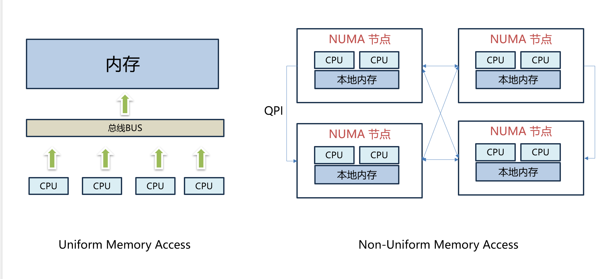

## NUMA

```json
node" {
    "label": "numa",
    "categories": ["arch"],
    "info": "arch numa",
    "depends": []
}
```

### 介绍

 `UMP`架构下我们认为所有`CPU`符合访存一致性原则，通俗点说就是不同`CPU`核心距离`RAM`的物理距离是相同的，使用的是同一套总线。

那为什么还需要另外一种架构呢？主要是在大型服务器和数据中心场景下,对`核心数`要求更高，核心数越多，如果是使用同一套访存模型，总线竞争会更激烈。并且对物理布局要求更高，因此提出了`NUMA`的模型，物理上把`CPU核心` `内存`做了分组，不同组之间如果要互相进行内存访问，和本地内存访问相比 代价相对会较高




### 设计实现


#### struct nodemask_t

`nodemask_t` 中的每个`bit`  代表表示 某个`node`状态，比如: `0b0000 0100` 代表 `node 2`的`bit` 被置位

```c
typedef struct { DECLARE_BITMAP(bits, MAX_NUMNODES);} nodemask_t;
  
//实际展开 假设 MAX_NUMNODES = 8
typedef struct {
   unsigned long bits[1];
} nodemaske_t;


```

和 `node mask` 配合使用的 是 `node_states` 

`node_states` 用于表示`node` 的状态

```c

  enum node_states {
          N_POSSIBLE,             /* The node could become online at some point */
          N_ONLINE,               /* The node is online */
          N_NORMAL_MEMORY,        /* The node has regular memory */
  #ifdef CONFIG_HIGHMEM
          N_HIGH_MEMORY,          /* The node has regular or high memory */
  #else
          N_HIGH_MEMORY = N_NORMAL_MEMORY,
  #endif
          N_MEMORY,               /* The node has memory(regular, high, movable) */
          N_CPU,          /* The node has one or more cpus */
          N_GENERIC_INITIATOR,    /* The node has one or more Generic Initiators */
          NR_NODE_STATES
  };

```


不同于状态机变化模型， 内核同时维护着相同的`node`的不同状态，也就是状态时可以共存的

```c
nodemask_t node_states[NR_NODE_STATES] __read_mostly = {
          [N_POSSIBLE] = NODE_MASK_ALL,
          [N_ONLINE] = { { [0] = 1UL } },
  #ifndef CONFIG_NUMA
          [N_NORMAL_MEMORY] = { { [0] = 1UL } },
  #ifdef CONFIG_HIGHMEM
          [N_HIGH_MEMORY] = { { [0] = 1UL } },
  #endif
          [N_MEMORY] = { { [0] = 1UL } },
          [N_CPU] = { { [0] = 1UL } },
  #endif  /* NUMA */
  };


```


#### state API

内核提供了 `node_state`一系列设置和查询接口 以及 状态遍历接口

```c
static __always_inline int node_state(int node, enum node_states state)
  {
          return node_isset(node, node_states[state]);
  }

  static __always_inline void node_set_state(int node, enum node_states state)
  {
          __node_set(node, &node_states[state]);
  }

  static __always_inline void node_clear_state(int node, enum node_states state)
  {
          __node_clear(node, &node_states[state]);
  }

  static __always_inline int num_node_state(enum node_states state)
  {
          return nodes_weight(node_states[state]);
  }

  #define for_each_node_state(__node, __state) \
          for_each_node_mask((__node), node_states[__state])

  #define first_online_node       first_node(node_states[N_ONLINE])
  #define first_memory_node       first_node(node_states[N_MEMORY])


```
