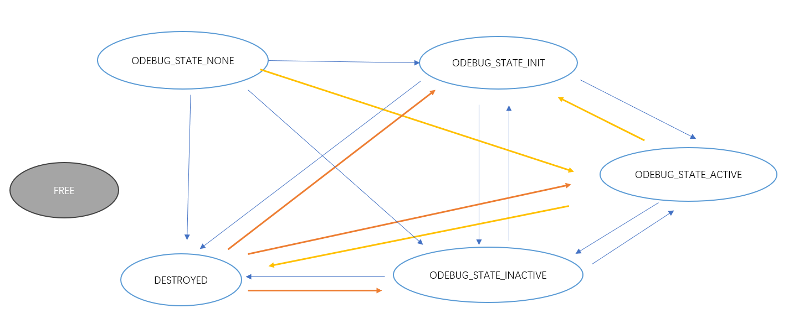
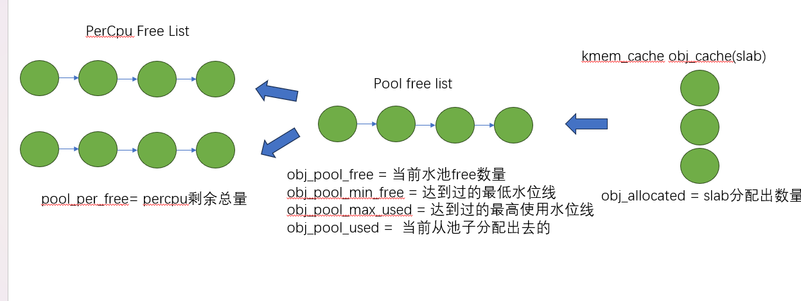

# debugobjects

debugobjects 是一个通用的基础结构，用于跟踪内核对象的生命周期并验证对这些对象的操作。

debugobjects 有助于检查以下错误模式：

- 激活未初始化的对象
- 活动对象的初始化
- 释放/销毁对象的使用

## 模块设计

源码位于: `lib/debugobjects.c`

### 生命周期

- 蓝色表示正常的状态变化，不算错误
- 黄色表示不正常的状态变化，触发告警，但是会尝试通过fixup 修复
- 红色状态变化如果发生 仅触发告警 无法修复



### 数据结构

#### debug_obj

数据的状态追踪，核心依赖 `debug_obj` 

```
 /**
   * struct debug_obj - representation of an tracked object
   * @node:       hlist node to link the object into the tracker list
   * @state:      tracked object state
   * @astate:     current active state
   * @object:     pointer to the real object
   * @descr:      pointer to an object type specific debug description structure
   */
  struct debug_obj {           
          struct hlist_node       node;    // 链表节点
          enum debug_obj_state    state;   // 追踪的object的状态机
          unsigned int            astate;  // 用于模块外部额外记录激活状态(active 状态细分)
          void                    *object;
          const struct debug_obj_descr *descr;                    
  };
```

### 内存分配

`debug_obj`的内存分配 采用了 `PERCPU LIST` + `pool` 的方式，这里有一些细节值得学习

核心数据结构：维护`debug obj`，    `trace obj` 统一从`slab`分配，每个`CPU`维护一个
`PERCPU`列表(不需要持有`pool lock`) ，`pool lock`负责维护`OBJ`的整体分配



#### PerCpu

使用了`PERCPU FREE LIST` 缓冲

- 结构体分配释放优先放到本地CPU
- 减少锁冲突域，同时提升cache的内存一致性，性能友好

## 如何使用

### 功能开启关闭

- 通过 `CONFIG_DEBUG_OBJECTS` 可以开启对象生命周期监控模块编译 
- kernel 通过 命令行参数: `debug_objects` 或者`no_debug_objects` 可以动态选择开启关闭

!!! note 

    动态关闭会有一些性能损失，编译关闭，可以通过编译器优化 把空函数直接删除，动态关闭，依然会有一次跳转和判断

### 状态查看

通过 `/sys/kernel/debug/debug_objects/stats` 可以查看对象统计状态, 

### 对外API

#### debug_object_init

在对象初始化函数调用，该函数会检查对象是否可以初始化

- 如果已经处于活动状态: 会被认为是错误初始化，额外提供了fixup机制，如果提供了fixup_init函数，调用者应该保证fixup_init 应该修正这个错误: 比如把活动对象停用，以防止破坏子系统

- 处于已经销毁状态: 会被认为是错误初始化, 不提供fixup 仅仅是打印

- 未被跟踪: 会新分配一个跟踪对象器，并设置状态: `ODEBUG_STATE_INIT`,同时检查该对象是否在堆栈上，如果在堆栈，会打印告警，堆栈上的对象，应该使用 `debug_object_init_on_stack`，见下一节

#### debug_object_init_on_stack

堆栈上的对象在初始化之前调用，该函数会见检查对象是否可以初始化

- 活动状态或者是已销毁: 会被认为是错误初始化，额外提供了fixup机制，如果提供了fixup_init函数，调用者应该保证fixup_init 应该修正这个错误: 比如把活动对象停用，以防止破坏子系统

堆栈上的对象，必须在该对象的生命周期(代码块) 退出之前， 调用`debug_object_free()` 从跟踪器删除堆栈上的对象，否则会导致跟踪错误

#### debug_object_activate

调用真实对象的激活函数时 需要调用此函数

当实际对象已被 debugobjects 跟踪时，将检查是否可以激活该对象。 

- 激活和销毁的对象不允许激活。 当 debugobjects 检测到错误时，它会调用对象类型描述结构的 fixup_activate 函数（如果调用者提供了该函数）。 

- fixup 函数可以在真正激活对象之前纠正问题。 例如，它可以停用激活对象，以防止子系统受损。

#### debug_object_deactivate

每当调用真实对象的停用函数时，都会调用该函数。 当真实对象被 debugobjects 跟踪时，会检查该对象是否可以停用。 

如果停用是合法的，那么相关跟踪器对象的状态将被设置为 ODEBUG_STATE_INACTIVE。

#### debug_object_destroy

调用该函数是为了标记已销毁的对象。 

这有助于防止使用内存中仍可用的无效对象：静态分配的对象或稍后释放的对象。 

- 当 debugobjects 跟踪真实对象时，会检查该对象是否可以销毁。 
- 活动和已销毁的对象不允许销毁。 当 debugobjects          检测到错误时，如果调用者提供了对象类型描述结构，它会调用该结构的 fixup_destroy 函数。
- fixup 函数可以在真正销毁对象之前纠正问题 例如，它可以停用活动对象，以防止子系统受损。 
- 当销毁合法时，相关跟踪器对象的状态将被设置为 ODEBUG_STATE_DESTROYED

#### debug_object_free

在释放对象之前会调用该函数，当 debugobjects 跟踪真实对象时，会检查该对象是否可以被释放。

 活动对象不允许释放。 当 debugobjects 检测到错误时，它会调用对象类型描述结构的 fixup_free 函数（如果调用者提供了该函数）。 

fixup 函数可以在真正释放对象之前纠正问题。 

请注意，debug_object_free 会将对象从跟踪器中删除。 之后对象的使用将由其他调试检查来检测。

#### debug_object_assert_init

调用该函数是为了断言对象已被初始化。 

当实际对象未被 debugobjects 跟踪时，它会调用调用者提供的对象类型描述结构的 fixup_assert_init，并硬编码对象状态 ODEBUG_NOT_AVAILABLE。 

当实际对象已被 debugobjects 跟踪时，它将被忽略。

### 使用示例

linux中的work queue 使用此系统 追踪 `work`工作状态
