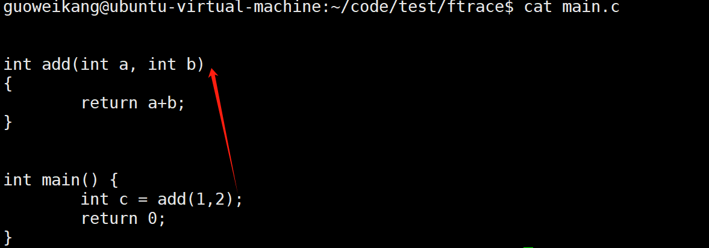

## Tracing机制之一： 插桩设计

### 插桩基础

[作者lecture](https://blog.linuxplumbersconf.org/2014/ocw/system/presentations/1773/original/ftrace-kernel-hooks-2014.pdf)

当进入函数某个函数时，支持插桩，从而实现 `函数trace`的能力，这个能力是大多数 `tracer`需要用到的能力；相比于`kprobe`，在支持`dynamic ftrace`的平台上，性能使用上更加高效 


#### pg 编译选项

函数插桩的实现原理还是非常简单的，这里以`arm架构`为例，就是在调用某个函数之前，先调用有关函数的`tracer func` ，如何实现？

先看一段最简单的代码, 主要是希望表达`main -> add` 这个调用关系



我们增加编译选项 `-pg`：

```
-pg Generate extra code to write profile information suitable for the analysis program prof (for -p) or gprof (for -pg). You must use this option when compiling
the source files you want data about, and you must also use it when linking.
You can use the function attribute no_instrument_function to suppress profiling of individual functions when compiling with these options. See Section 6.33.1 [Common Function Attributes], page 600.
```


再看一下反汇编，可以观察到在每次发生函数调用地方之前，都会调用一个`__mcount` 函数(架构不同 可能命名不一样)

在用户态，`mcount` 主要是glibc 提供的`[glibc/sysdeps/arm/arm-mcount.S at master · lattera/glibc · GitHub](https://github.com/lattera/glibc/blob/master/sysdeps/arm/arm-mcount.S)`

mcount 函数可以通过栈回溯知道 整个调用链；并且可以进一步根据不同函数需要trace的内容，记录trace 信息

#### patchable-function-entry

考虑到性能，一般不会在所有函数调用的地方都调用`__mcount`，只要对应体系架构支持，Linux 默认 `__mcount` 其实都是空实现

Linux `arm64` 架构下 在开启动态没有使用`-pg` ，而是会直接使用

`-fpatchable-function-entry`

```
-fpatchable-function-entry=N[,M]
Generate N NOPs right at the beginning of each function, with the function
entry point before the Mth NOP. If M is omitted, it defaults to 0 so the function entry points to the address just at the first NOP. The NOP instructions
reserve extra space which can be used to patch in any desired instrumentation at run time, provided that the code segment is writable. The amount of
space is controllable indirectly via the number of NOPs; the NOP instruction
used corresponds to the instruction emitted by the internal GCC back-end interface gen_nop. This behavior is target-specific and may also depend on the
architecture variant and/or other compilation options.
For run-time identification, the starting addresses of these areas, which correspond to their respective function entries minus M, are additionally collected
in the __patchable_function_entries section of the resulting binary.
Note that the value of __attribute__ ((patchable_function_entry
(N,M))) takes precedence over command-line option -fpatchable-functionentry=N,M. This can be used to increase the area size or to remove it
completely on a single function. If N=0, no pad location is recorded.
The NOP instructions are inserted at—and maybe before, depending on M—
the function entry address, even before the prologue. On PowerPC with the
ELFv2 ABI, for a function with dual entry points, the local entry point is this
function entry address.
The maximum value of N and M is 65535. On PowerPC with the ELFv2 ABI,
for a function with dual entry points, the supported values for M are 0, 2, 6
and 14.
```

`-fpatchable-function-entry=N[,M] `是一个 GCC 编译选项，用于在函数的开头预留空间以便在运行时进行插桩或修改。以下是这个选项的详细功能：

- 插入 NOP 指令： 这个选项指示编译器在每个函数的开头插入 N 条 NOP（No Operation）指令。NOP 是占位符指令，不影响程序执行，但会占用空间。这些空间可以在运行时插入自定义指令，前提是代码段可写。

- 函数入口点： 函数的入口点设置在第 M 个 NOP 之前。如果没有指定 M，则默认值为 0，这意味着入口点设置在 NOP 指令的最开始。这使得开发者可以精确控制函数开始执行的位置。

- 用途： 通过使用 NOP 预留空间，开发者可以在运行时对代码进行修改或插桩。这对于调试、性能分析或添加自定义插桩非常有用，而无需重新编译整个代码。

- __patchable_function_entries 段： 可修改区域的起始地址（函数入口减去 M）会被收集到生成的二进制文件中的一个特殊段，名为 __patchable_function_entries。这使得运行时系统或工具可以识别和利用这些可修改的位置。

- 属性优先级： 如果函数具有 **attribute**((patchable_function_entry(N,M))) 属性，它会优先于命令行选项 -fpatchable-function-entry=N,M。这允许对单个函数进行精细的控制，可以应用或禁用可修改的函数入口。

- PowerPC 上的双入口点： 在使用 ELFv2 ABI 的 PowerPC 架构上，对于具有双入口点的函数，入口点指的是本地入口点，并且 M 的支持值仅限于 0、2、6 和 14。

- 限制： N 和 M 的最大值为 65535。这限制了可以插入的 NOP 指令的数量以及函数入口点的位置。

这个选项特别适用于需要在编译后对函数进行修改或插桩的场景，使开发者可以在不重新编译源代码的情况下，在函数入口点插入自定义行为。

最后所有插桩的信息会存储在 段`__start_mcount_loc - __end_mcount_loc` 段中

```c
  #define MCOUNT_REC()    . = ALIGN(8);                           \
                          __start_mcount_loc = .;                 \
                          KEEP(*(__mcount_loc))                   \
                          KEEP_PATCHABLE                          \
                          __stop_mcount_loc = .;                  \
                          FTRACE_STUB_HACK                        \
                          ftrace_ops_list_func = arch_ftrace_ops_list_func;
  #else
  # ifdef CONFIG_FUNCTION_TRACER
  #  define MCOUNT_REC()  FTRACE_STUB_HACK                        \
                          ftrace_ops_list_func = arch_ftrace_ops_list_func;
  # else
  #  define MCOUNT_REC()
  # endif
  #endif
```

查看二进制插桩信息

```bash
$ aarch64-linux-gnu-objdump -h  ./build_qemu/kernel/groups.o    |grep __patchable_function_entries
4 __patchable_function_entries 00000060  0000000000000000  0000000000000000  000008a0  2**3
```

完成上述工作，我们可以得到以下内容：

- 代码已经预留了可以存放插桩代码的空间

- 代码保存了 可以插桩的代码位置信息

基于这些信息，则可以实现动态插桩，在运行过程中，提供希望插桩的位置和函数，内核找到对应位置，完成代码替换

### 内核软件设计

#### 插桩点管理

插桩点是`ftrace`功能实现的核心数据结构，几乎所有的操作都是围绕它展开的  

##### 数据结构： dyn_ftrace

内核插桩点的描述 软件抽象定义为 `dyn_ftrace`

```c
  struct dyn_ftrace {     
          unsigned long           ip; /* address of mcount call-site */
          unsigned long           flags;
          struct dyn_arch_ftrace  arch;
  };   
```

`ip`字段： 很明显，是插桩点的 `内存地址信息` 

`flags` 字段含义现在这里简单说明，后面功能涉及到具体`flag` 的使用在具体说明

- 0-19bit: 记录每个插桩点 注册的 `回调函数`的个数

- **ENABLED**：当该标志位被设置时，表示该函数正在被跟踪。

- **REGS**：当该标志被设置时，表明记录希望函数在调用时保存寄存器（即 `pt_regs`，保存处理器状态的寄存器）。

- **REGS_EN**：表示该函数已经设置为保存寄存器。也就是说，跟踪函数在调用时会自动保存寄存器。

- **IPMODIFY**：允许 IP 地址在跟踪中被修改，以便于函数调用的跳转或修改（例如，跟踪程序的动态跳转）。

- **DISABLED**：当此标志位被设置时，说明记录还未准备好被使用，可能处于初始化状态或不可用状态。

- **DIRECT**：表示有直接函数调用，这种情况常用于直接跟踪特定的回调。

- **CALL_OPS**：该标志位表示可以使用函数调用点（callsite）特定的操作。不同的调用点可以有特定的操作集。

- **CALL_OPS_EN**：表示该函数已经设置为使用调用点特定的操作，允许多种操作针对不同调用点生效。

- **TOUCHED**：表示自启动后有新的回调被添加进来，用于跟踪是否有新的跟踪器在运行时注册。

- **MODIFIED**：表示此函数启用了 IP 地址修改（IPMODIFY）或直接调用（DIRECT）功能。

##### 初始化

内核再启动阶段 完成动态插桩点的结构初始化  以及插桩点初始化为`nop`

```shell
[    0.000000] ftrace: allocating 65671 entries in 257 pages
```

```c
ftrace_init
 -> ftrace_process_locs
    -> ftrace_update_code()
      ->  ftrace_init_nop()
```

最终我们可以得到下面的一个数据结构，以及插桩点代码全部为`nop`的初始化结果


```
    ftrace_pages_start
      |
      v
    ftrace_page
    +-----------------------------+
    |index                        |
    |size                         |
    |    (int)                    |     array of dyn_ftrace
    |records                      |     +----------+----------+     +----------+----------+
    |    (struct dyn_ftrace*)     |---->|ip        |          | ... |          |          |
    |                             |     |flags     |          |     |          |          |
    |                             |     |arch      |          |     |          |          |
    |next                         |     +----------+----------+     +----------+----------+
    |    (struct ftrace_page*)    |
    +-----------------------------+
      |
      |
      v
    ftrace_page
    +-----------------------------+
    |index                        |
    |size                         |
    |    (int)                    |     array of dyn_ftrace
    |records                      |     +----------+----------+     +----------+----------+
    |    (struct dyn_ftrace*)     |---->|ip        |          | ... |          |          |
    |                             |     |flags     |          |     |          |          |
    |next                         |     |arch      |          |     |          |          |
    |    (struct ftrace_page*)    |     +----------+----------+     +----------+----------+
    +-----------------------------+
      |
      |
      v
    ftrace_page
    +-----------------------------+
    |index                        |
    |size                         |
    |    (int)                    |     array of dyn_ftrace
    |records                      |     +----------+----------+     +----------+----------+
    |    (struct dyn_ftrace*)     |---->|ip        |          | ... |          |          |
    |                             |     |flags     |          |     |          |          |
    |next                         |     |arch      |          |     |          |          |
    |    (struct ftrace_page*)    |     +----------+----------+     +----------+----------+
    +-----------------------------+
```

##### do_for_each_ftrace_rec

重要接口之一，s负责完成对 `dyn_trace`的遍历 

```c
  #define do_for_each_ftrace_rec(pg, rec)                                 \
          for (pg = ftrace_pages_start; pg; pg = pg->next) {              \
                  int _____i;                                             \
                  for (_____i = 0; _____i < pg->index; _____i++) {        \
                          rec = &pg->records[_____i];
```

##### 插桩点信息查看

可以通过下面文件查看 插桩点信息: 

1. `available_filter_functions`：循环遍历显示 `ftrace_pages`

2. `available_filter_functions_addr`：同上，额外显示 `addr address`

3. `enabled_functions`：显示已经插桩了的 `trace function`  (R: REGS, I:IPMODIFY, D:DIRECT,  O： OPS ， M：  I OR D)   具体flags的含义 在后面解释

4. ``touched_functions`：显示曾经插桩跟踪过的函数信息

#### 插桩信息注册维护

上一个小节，我们已经有了系统中所有插桩点的信息，那么针对这些插桩点，如何注册回调函数，以及又是如何实现插桩点过滤的呢？

##### 回调函数定义：ftrace_func_t

函数定义为：

```c
void callback_func(unsigned long ip, unsigned long parent_ip,
                   struct ftrace_ops *op, struct pt_regs *regs);
```

- ip: 这是正在跟踪的函数的指令指针

- parent_ip: 这是调用被跟踪函数的函数指令指针（函数调用发生的位置）。

- op: 这是用于注册回调的(下一个小节) `ftrace_ops` 指针。 该指针可用于通过私有指针向回调传递数据。

- regs: 如果在`ftrace_ops`结构中设置了 `FTRACE_OPS_FL_SAVE_REGS` 或 `FTRACE_OPS_FL_SAVE_REGS_IF_SUPPORTED` 标志，那么它将指向 `pt_regs` 结构，就像在`ftrace`跟踪的函数的起始位置设置断点一样。 否则，它要么包含垃圾信息，要么为 `NULL`。

##### 数据结构: ftrace_ops

`frrace_ops` 用于描述 希望给某个`dyn trace`上注册的回调函数

```c
  struct ftrace_ops {
          ftrace_func_t                   func;
          struct ftrace_ops __rcu         *next; 
          unsigned long                   flags;
          void                            *private;                       
          ftrace_func_t                   saved_func;
  #ifdef CONFIG_DYNAMIC_FTRACE 
          struct ftrace_ops_hash          local_hash;
          struct ftrace_ops_hash          *func_hash;
          struct ftrace_ops_hash          old_hash;
          unsigned long                   trampoline;
          unsigned long                   trampoline_size;                
          struct list_head                list;
          ftrace_ops_func_t               ops_func;
  #ifdef CONFIG_DYNAMIC_FTRACE_WITH_DIRECT_CALLS
          unsigned long                   direct_call;
  #endif                       
  #endif
  };
```

这里需要重点关注的字段有:  

- func: 回调函数 

- flags: 回调类型

- hash: 过滤功能用到的`hash table`结构

- private: 回调函数的私有数据 

##### 回调注册接口

unregister/register_ftrace_function 注册回调函数 

##### 函数过滤设置

`ftrace_set_filter/notrace`设置过滤规则

```c
int ftrace_set_filter(struct ftrace_ops *ops, unsigned char *buf,
                      int len, int reset)

int ftrace_set_notrace(struct ftrace_ops *ops, unsigned char *buf,
                       int len, int reset);;
```

注意事项：

- `reset` 表示是否需要重新设置`hash table` 如果设置，原有的`hashtable` 在更新期间会被清空

##### 全局trace_ops_list

trace_ops 在完成注册时，都会被加入到全局RCU 链表：`ftrace_ops_list` 

```c
struct ftrace_ops ftrace_list_end __read_mostly = {
          .func           = ftrace_stub,
          .flags          = FTRACE_OPS_FL_STUB,
          INIT_OPS_HASH(ftrace_list_end)
};

struct ftrace_ops __rcu *ftrace_ops_list __read_mostly = &ftrace_list_end;

static void add_ftrace_ops(struct ftrace_ops __rcu **list,
                             struct ftrace_ops *ops)
  {       
          rcu_assign_pointer(ops->next, *list);

          /* 
           * We are entering ops into the list but another
           * CPU might be walking that list. We need to make sure
           * the ops->next pointer is valid before another CPU sees
           * the ops pointer included into the list.
           */
          rcu_assign_pointer(*list, ops);
  }
```

##### 注册流程分析1

接下来 我们将详细分析 `register_ftrace_function` 的实现过程 ，代码不是关键，重点要掌握设计思路和数据结构，我们分两个阶段

```c
register_ftrace_function(ops)
  -> prepare_direct_functions_for_ipmodify(ops) ：未设置IPMODIFY,暂时不关注
  -> register_ftrace_function_nolock(ops)
    -> ftrace_ops_init(ops):  
           设置 ops->flags = FTRACE_OPS_FL_INITIALIZED 并完成hash init
    -> ftrace_startup(ops, 0);
     -> __register_ftrace_function(ops）: 见下文，完成flags的检查和设置
       -> add_ftrace_ops; ops 加入全局链表
       -> ops -> old_func : 保存原有的 func 回调
       -> ftrace_pids_enabled(ops): 检查是否支持 pid 过滤，是的话 替换func = ftrace_pid_func
       -> ftrace_update_trampoline: 未设置 暂时不关注
       -> update_ftrace_function();  见说明
             -> update_graph_func()： 不涉及 暂时不关注
-------------------------------------------------------------------------
     -> ftrace_hash_ipmodify_enable:未设置IPMODIFY,暂时不关注
     -> ftrace_hash_rec_enable(ops, 1) 
     -> command |= FTRACE_UPDATE_CALLS;
     -> ftrace_startup_enable(command);
```

`update_ftrace_function`的逻辑有必要说明一下，主要是检查 全局回调链表 `trace_ops_list`

- 如果当前链表上没有任何的 `ftrace_ops`注册，则`func` =  `funct_stub`

- 如果只有一个注册，那也没有必要每次遍历，`func` = `ops->func`

- 如果注册了多个`ftrace_ops` `func `= `ftrace_ops_list_func`   

最终主要是设置 改变全局变量 `ftrace_trace_function`

第一阶段注册流程总结:  

- `ftrace_ops`注册结构的参数检查和基本初始化

- `func`的设置 以及 全局`trace_ops_list`的注册

- 全局 `ftrace_trace_function` 变量设置

##### 注册流程分析2

书接上回： 

```c
-------------------------------------------------------------------------
     -> ftrace_hash_ipmodify_enable:未设置IPMODIFY,暂时不关注
     -> ftrace_hash_rec_enable(ops, 1) 
        -> 遍历 dyn trace 
         -> 筛选 ops 中的 hash 黑白过滤名单
           -> dyn_trace 回调函数数量 +1 
             -> 设置 dyn_trace的 flags  
     -> command |= FTRACE_UPDATE_CALLS;
     -> ftrace_startup_enable(command); 
      -> command |= FTRACE_UPDATE_TRACE_FUNC;
      -> ftrace_run_update_code(command);
        -> __ftrace_modify_code 
         ->  ftrace_modify_all_code(command);
           ->ftrace_replace_code(mod_flags | FTRACE_MODIFY_ENABLE_FL);
            -> 遍历 dyn trace  
              ->  __ftrace_replace_code(rec, 1) 
                -> ftrace_addr = ftrace_get_addr_new(rec); 
                 -> ftrace_update_record(rec, 1);
                   ->  检查 rec 使能计数 
                     ->  如果 计数为1 ？ 不为1？ 
                ->ftrace_make_call(rec,ftrace_addr)
```

注意点：` ftrace_get_addr_new`

```c
unsigned long ftrace_get_addr_new(struct dyn_ftrace *rec)
  {
          struct ftrace_ops *ops;
          unsigned long addr;

          if ((rec->flags & FTRACE_FL_DIRECT) &&
              (ftrace_rec_count(rec) == 1)) {
                  addr = ftrace_find_rec_direct(rec->ip);
                  if (addr)
                          return addr;
          }       

          /* Trampolines take precedence over regs */
          if (rec->flags & FTRACE_FL_TRAMP) {
                  ops = ftrace_find_tramp_ops_new(rec);
                  if (FTRACE_WARN_ON(!ops || !ops->trampoline)) {
                          pr_warn("Bad trampoline accounting at: %p (%pS) (%lx)\n",
                                  (void *)rec->ip, (void *)rec->                          /* Ftrace is shutting down, return anything */
                          return (unsigned long)FTRACE_ADDR;
                  }
                  return ops->trampoline;
          }

          if (rec->flags & FTRACE_FL_REGS)
                  return (unsigned long)FTRACE_REGS_ADDR;
          else
                  return (unsigned long)FTRACE_ADDR;
  }
```

根据`dyn_trace`的 使能计数情况以及，是否需要 保存REGS，是否需要 `TRAM`  ，选择具体回调函数

##### 设置过滤插桩函数

```c
ftrace_set_filter(ops. buf,len,reset) 
  // no trace：  enable=0,  filter： enable =1 
  ->  ftrace_set_regex(ops, buf, len, reset, 1/0);
   -> ftrace_set_hash(ops, buf, len, NULL, 0, 0, reset, enable)
    // enable 决定orgi_hash
    -> orig_hash = ops->func_hash->filter_hash/notrace_hash
    // reset 决定newhash 是否需要复制原有的hash 内容
    -> hash =  alloc_(and_copy)ftrace_hash(FTRACE_HASH_DEFAULT_BITS);
    // 更新hash entry
    -> ftrace_match_records(hash, buf, len) 
        // "!xxx" set clear_filter=1
       -> filter_parse_regex(buf, len, &func_g.search,&clear_filter);
       -> enter_record(hash,rec,clear_filter)
          //clear filter 决定是从hash中移除还是增加 
         -> free(add)_hash_entr(hash,rec->ip)
    -> ftrace_hash_move_and_update_ops(ops, orig_hash, hash, enable);
     // 根据黑白格名单重新设置 全局 dyn trace 记录 
      ->  ftrace_hash_move(ops, enable, orig_hash, hash) 
         -> 检查：设置 FTRACE_OPS_FL_IPMODIFY 的traceops 不支持黑名单
         -> new_hash = __ftrace_hash_move(hash);
         // 根据原有白名单或者黑名单上的配置，清除插桩信息(因为需要重新设置)
         -> ftrace_hash_rec_disable_modify(ops, enable) 
            -> ftrace_hash_rec_update_modify(ops,enable,0) 
               -> __ftrace_hash_rec_update(ops, enable, 0); 
          // 更新ops hash 使用新的hash 
         -> rcu_assign_pointer(*orig_hash, new_hash);
          // 根据新的白名单或者黑名单上的配置，重新更新插桩点
         -> ftrace_hash_rec_enable_modify(ops, enable);
       // 根据黑白格名单重新设置 全局 dyn trace 记录 
      -> ftrace_ops_update_code(ops, &old_hash_ops);
         -> ftrace_run_modify_code(ops, FTRACE_UPDATE_CALLS, old_hash);
           -> ftrace_run_update_code(command);  
            //不同体系架构 可能实现差异 大致都相同
            ->arch_ftrace_update_code(command) 
              ->ftrace_modify_all_code(command)
                -> __ftrace_replace_code(rec, enable)
```

#### 插桩设计总结

- 全局的`dyn trace` 是核心，大部分操作都是基于 对 `dyn trace`的遍历实现 

- `ftrace`对执行效率做了优化： 如果系统全局 `ftrace` 回调只有1个， 全局的回调函数就是他自己，否则则是 `ftrace_ops_list_func`  默认遍历全局 `ftrace_ops` 

- `ftrace`对执行效率做了优化, 如果 某个 `dyn_trace` 只有一个`ftrace_ops` 则可以不走 全局回调函数，直接走 该回调函数，否则会设置为全局回调函数

- 当某个 `dyn trace` 执行全局回调函数 `ftrace_trace_function` （遍历 全局`ftrace_ops_list`）时，会检查`trace_ops`是否设置了过滤条件，只有匹配到，才会执行具体`trace_ops`的回调函数
