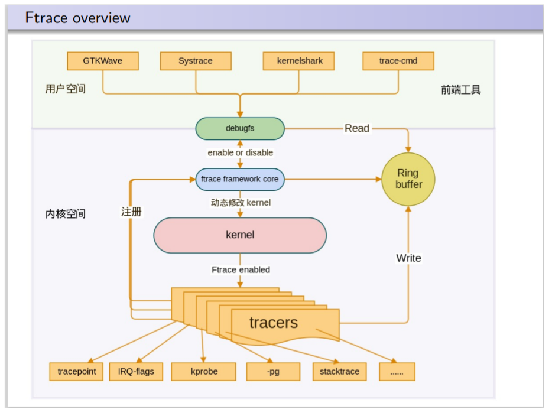
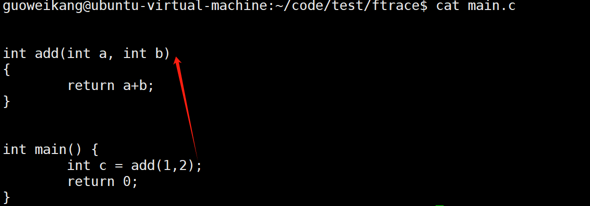
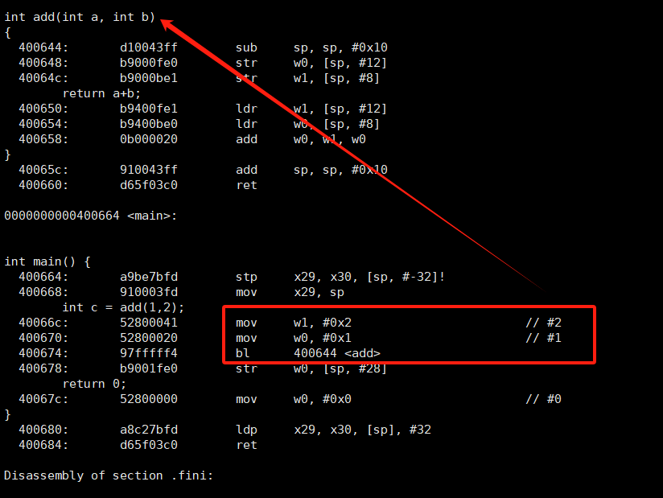
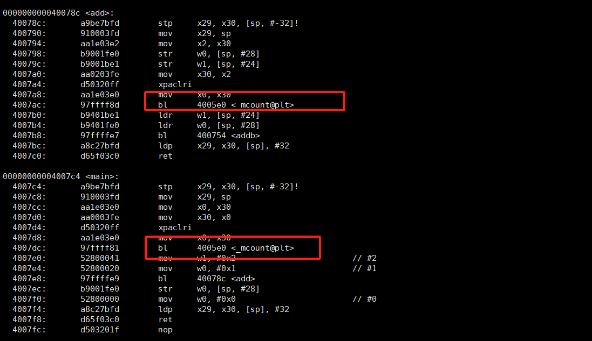
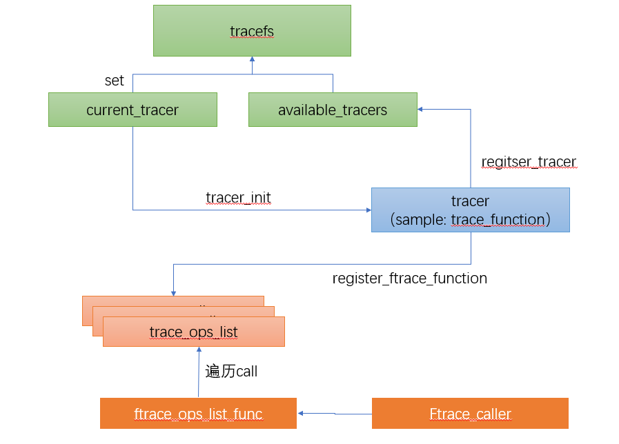

## Ftrace

Linux 自`2.6.28`版本引入ftrace 功能

`Ftrace` 狭义上是指`Linux kernel Function Trace` ,但是实际上`linux` 已经更加完善和丰富了语义，通过对`trace func`功能集成完善，现在可以用于实现 **性能分析** **调度分析**等

Ftrace 是一种内部跟踪器，旨在帮助系统开发人员和设计人员了解内核内部的情况，可用于调试或分析用户空间以外的延迟和性能问题。

虽然 ftrace 通常被认为是函数跟踪器，但它实际上是多个不同跟踪工具的框架。 有延迟跟踪，可检查中断禁用和启用之间发生的情况，以及抢占和从任务唤醒到任务实际调度的时间。

ftrace 最常用的一种使用形式为`events tracing` ，再内核中，再各个模块有几百个静态事件的点，可以通过`tracefs` 使能使用

### 使用者视角

本小节，主要作为一个使用者, 学习如何利用`trace`功能进行内核开发定位，在 **开发者视角**章节中，探讨更多ftrace的实现细节

#### 术语

|        | 解释                                                        | 其他                       |
| ------ | --------------------------------------------------------- | ------------------------ |
| tracer | Linux 对 `trace`进行了分类，有支持`函数调用关系`的tracer, 有`调度调优`的tracer等等 | 可以再Kconfig中 选择编译哪些tracer |
| events | 内核事件，参考`events.txt`                                       |                          |



#### 内核配置

`Kconfig -> Tracers -> ` 根据需要 开启不同的`tracer`和功能

#### trace 文件系统

`trace fs`是一个非常重要的模块，使用者几乎都必须要通过`trace fs` 和 `ftrace`子系统进行交互(包括： 使能、配置、过滤、结果输出) 

Linux 内核通过 `tracefs` 文件系统，用来支持 `trace`功能的配置以及`trace`结果查询 挂载目录为 `/sys/kernel/tracing`

可以通过修改`/etc/fstab`

```shell
 tracefs /sys/kernel/tracing tracefs defaults 0 0`
```

或者 手动挂载

```shell
 mount -t tracefs nodev /sys/kernel/tracing
```

另外，`debugfs`系统中也集成了tracefs的自动挂载点，当debugfs 文件系统挂载后，`tracefs`默认挂载在 `/sys/kernel/debug/tracing`

接下来tracefs内容做一些简单说明,

| 文件名                      | 功能说明                                                                                                              | 其他                                                                                                                                                                                                                           |
| ------------------------ | ----------------------------------------------------------------------------------------------------------------- | ---------------------------------------------------------------------------------------------------------------------------------------------------------------------------------------------------------------------------- |
| available_tracers        | 记录当前随内核编译并且注册到系统的 `tracer`                                                                                        | 在代码搜索`cs f c register_tracer` 可以看到有哪些`tracer`注册                                                                                                                                                                              |
| current_tracer           | 设置内核当前使用的`tracer`                                                                                                 | echo "xxx" > current_tracer 可以修改当前tracer，`nop`是个特殊的`tracer`，表示设置空`tracer`                                                                                                                                                    |
| tracing_on               | 1 ：使能`current_tracer`；2 关闭`tracer`                                                                                | 控制tracer输出，并不会关闭tracer，因此`tracer`带来的系统调用开销还是存在的，要想关闭`tracer`，设置`current_tracer` 为`nop`                                                                                                                                       |
| trace                    | trace日志输出，文件打开读时，tracing动作这期间会停止                                                                                  | `trace`输出格式在不同`tracer`工作模式下 输出格式可能不同，具体输出格式在后续功能模块解释                                                                                                                                                                         |
| trace_pipe               | `流`日志， 日志可以被消费，消费完后会阻塞，此文件不会阻塞`tracing`事件                                                                         | 和`trace`最大不同之处示工作模式，原理上，此文件在trace阶段可以动态读取，实现动态分析，而`trace`是对过去阶段行为的`解释`                                                                                                                                                       |
| trace_options            | 通过该文件，用户可以控制在输出文件中显示的数据量。 还有一些选项可以修改`tracer`或`event`的工作方式（堆栈跟踪、时间戳等）                                              | 比如`noxxx`表示 关闭某一列内容                                                                                                                                                                                                          |
| options                  | 目录，包含options，可以单独设置                                                                                               |                                                                                                                                                                                                                              |
| tracing_max_latency      | 某些tracer会记录最大延时，比如中断关闭的最大时延，这些值需要被记录在此文件中，单位 `ms`                                                                 | 之所以没有在trace记录，该指标更像是一个`全局静态变量`, 在有新的值超过该值时 才需要被更新                                                                                                                                                                            |
| tracing_thresh           | 性能分析的tracer可能会用到，这是一个阈值(ms)，超过这个值的会被trace                                                                         | 要禁用延迟跟踪，可以将该文件的值设置为 0 ；否则表示开启延迟跟踪，当延迟超过该设置的值，延迟`tracer`才会记录行为                                                                                                                                                                |
| buffer_size_kb           | 用于设置或查看每个 CPU 的跟踪缓冲区大小。它控制着内核为每个 CPU 分配的内存缓冲区大小，这些缓冲区用于存储跟踪数据。                                                    | percpu 也有一份显示`per_cpu/cpu0/buffer_size_kb`；你可以通过向该文件写入一个数值来调整每个 CPU 的缓冲区大小。例如，设置每个 CPU 的缓冲区大小为 1024 KB：`echo 1024 > /sys/kernel/debug/tracing/buffer_size_kb`;在使用 `ftrace` 跟踪系统性能时，适当调整缓冲区大小可以帮助你捕获更多的数据，避免因缓冲区不足而丢失重要的跟踪信息。 |
| buffer_total_size_kb     | total of buffer_size_kb                                                                                           |                                                                                                                                                                                                                              |
| free_buffer              | 作为缓冲区释放的判断条件，当文件被关闭时(随打开进程退出一起)，缓冲区被自动释放                                                                          | 可以和 `disable_on_free` 选项配合使用 ， 如果`disable_on_free `选项也被设置为开启状态，那么在释放缓冲区的同时，`tracing`也会被自动停止                                                                                                                                  |
| tracing_cpumask          | 配置`tracing` 过滤的CPU 掩码                                                                                             | 指定`CPU`会被trace                                                                                                                                                                                                               |
| set_ftrace_filter        | 通过将 函数名 写入该文件，可以选择性跟踪某些函数                                                                                         | 结合`ftrace`功能实现原理，在动态追踪时，如果设置了过滤条件，则只会替换特定函数的 `mcount` trace实现，这样 系统开销可以降到极低，可以通过查看`available_filter_functions` 哪些函数支持trace                                                                                                   |
| set_ftrace_notrace       | 同上 但是是黑名单                                                                                                         | 同时存在与 黑白名单 ，按照黑名单处理                                                                                                                                                                                                          |
| set_ftrace_pid           | pid 白名单                                                                                                           | 如果 开启了 `function-fork`的 选项，则fork pid 也会被加入白名单                                                                                                                                                                                |
| set_event_pid            | event 白名单                                                                                                         |                                                                                                                                                                                                                              |
| set_graph_function       | graph func白名单                                                                                                     |                                                                                                                                                                                                                              |
| set_graph_notrace        | graph func黑名单                                                                                                     |                                                                                                                                                                                                                              |
| dyn_ftrace_total_info    |                                                                                                                   |                                                                                                                                                                                                                              |
| enabled_functions        | 主要用于调试 ftrace 功能，同时也可以帮助检查哪些函数已经绑定了回调（callback）。它展示了所有绑定了回调的函数以及每个函数绑定的回调数量。                                      | 这个文件可以帮助开发者调试回调函数的绑定情况以及查看每个函数的回调细节。                                                                                                                                                                                         |
| function_profile_enabled | 使能 trace 信息统计                                                                                                     | 使能后，可以在 trace_stats/function<cpu> ( function0, function1, etc). 查看所有追踪的函数在各个CPU上的统计信息(时间、次数)                                                                                                                                 |
| trace_stats              | trace 统计信息目录                                                                                                      | 可以用于性能调优(时间)和系统监控(次数)                                                                                                                                                                                                        |
| kprobe_events            | Enable dynamic trace points. See kprobetrace.txt.                                                                 | 在kprobe 章节单独讲解                                                                                                                                                                                                               |
| kprobe_profile           |                                                                                                                   |                                                                                                                                                                                                                              |
| max_graph_depth          | 用于 `function graph` tracer的追踪深度配置                                                                                 | 与函数图示跟踪器一起使用。 这是追踪函数的最大深度。 将其值设为 1 时，将只显示从用户空间调用的第一个内核函数。                                                                                                                                                                    |
| printk_formats           |                                                                                                                   | 适用于读取原始格式文件的工具。 如果环形缓冲区中的事件引用了字符串，缓冲区中记录的只是指向字符串的指针，而不是字符串本身。 这样，工具就无法知道该字符串是什么。该文件显示字符串和字符串的地址，允许工具将指针映射到字符串的内容                                                                                                             |
| saved_cmdlines           |                                                                                                                   |                                                                                                                                                                                                                              |
| saved_cmdlines_size      |                                                                                                                   |                                                                                                                                                                                                                              |
| saved_tgids              |                                                                                                                   |                                                                                                                                                                                                                              |
| snapshot                 | 这将显示 "快照 "缓冲区，并允许用户对当前运行的跟踪进行快照。                                                                                  | 更多详情，请参阅下文 "快照 "部分。                                                                                                                                                                                                          |
| stack_max_size:          | 激活堆栈跟踪器后，将显示遇到的最大堆栈大小。                                                                                            | 请参阅下面的 "堆栈跟踪 "部分。                                                                                                                                                                                                            |
| stack_trace              |                                                                                                                   | 这将显示激活堆栈跟踪器时遇到的最大堆栈的堆栈回溯跟踪。 请参阅下文 "堆栈跟踪 "部分。                                                                                                                                                                                 |
| stack_trace_filter       | 这与 "set_ftrace_filter "类似，但它限制了堆栈跟踪器将检查的函数。                                                                       |                                                                                                                                                                                                                              |
| trace_clock              | 每当一个事件被记录到环形缓冲区时，都会添加一个 "时间戳"。 时间戳来自指定的时钟。 默认情况下，ftrace 使用 `本地 时钟`。 该时钟非常快，而且严格按 CPU 设置，但在某些系统上，它与其他 CPU 的时钟可能不一致 | 被选择的时钟通过`[]`表示<br>支持的时钟类型有：<br> `local`:   CPU 本地时钟 可能不同CPU之间不相同 <br>`global`:   全局时钟 不同CPU之间相同, 慢一点 <br>`counter`:  这根本不是时钟，而是一个原子计数器。 它逐个计数，但与所有 CPU 同步。 如果需要准确了解不同 CPU 上事件发生的先后顺序，这一点非常有用 <br>                            |
| trace_marker             | 这是一个非常有用的文件，用于将用户空间与内核中发生的事件同步。 写入该文件的字符串将被写入ftrace 缓冲区。                                                          | 典型的比如andriod 利用了 该文件，实现了 `perfeto` 功能                                                                                                                                                                                        |
| trace_marker_raw         | 这与上面的 trace_marker 类似，但用于向其写入二进制数据，                                                                               | 可以使用工具解析 trace_pipe_raw 中的数据。                                                                                                                                                                                                |
| uprobe_events            | Add dynamic tracepoints in programs.                                                                              | See uprobetracer.txt                                                                                                                                                                                                         |
| uprobe_profile           | Uprobe statistics.                                                                                                | See uprobetrace.txt                                                                                                                                                                                                          |
| instances                | 这是一种创建多个跟踪缓冲区的方法，不同的事件可以记录在不同的缓冲区中。                                                                               | See "Instances" section below.                                                                                                                                                                                               |
| events                   | 这是跟踪事件目录。 它包含已编译到内核中的事件跟踪点（也称为静态跟踪点）。 它显示了存在哪些事件跟踪点，以及它们是如何按系统分组的。 不同级别的 "启用 "文件可以在写入 "1 "时启用跟踪点。                 | See events.txt for more information.                                                                                                                                                                                         |
| set_event                | 通过在该文件中呼应事件，将启用该事件。                                                                                               | See events.txt for more information.                                                                                                                                                                                         |
| available_events         |                                                                                                                   | 可在trace中启用的事件列表。                                                                                                                                                                                                             |
| hwlat_detector           | 硬件延迟检测器的目录。                                                                                                       |                                                                                                                                                                                                                              |
| per_cpu                  |                                                                                                                   | 这是一个包含 per_cpu 跟踪信息的目录。                                                                                                                                                                                                      |
| per_cpu/cpu0/stats:      | 这将显示有关环形缓冲区的某些统计信息                                                                                                |                                                                                                                                                                                                                              |

#### Tracer 介绍

下表统一的介绍了内核已有的一些`tracer `每一种`tracer`都有其专业和特殊的使用背景

我们将尽可能在后续章节给出使用方法和说明

| tracer name    | 功能说明                                                                                      | 其他                                                                                         |
| -------------- | ----------------------------------------------------------------------------------------- | ------------------------------------------------------------------------------------------ |
| function       | 最基础的函数 trace                                                                              | 如果不设置过滤 默认所有可以trace的函数都会被trace                                                             |
| function_graph | 和`function` tracer 类似，只是函数跟踪器在函数进入时进行探测，而函数图跟踪器则在函数进入和退出时都进行探测。 然后，它就能绘制出类似于 C 代码源的函数调用图。 |                                                                                            |
| blk            | 块跟踪器。 blktrace 用户应用程序使用的跟踪器。                                                              |                                                                                            |
| hwlat          | 硬件延迟跟踪器用于检测硬件是否产生任何延迟。                                                                    | See "Hardware Latency Detector" section     below.                                         |
| irqsoff        | 跟踪禁用中断的区域，并保存最大延迟最长的跟踪。                                                                   | 参见 `tracing_max_latency` 记录新的最大值时，它将取代旧的跟踪。 配合 `latency-format` options使用， 选择跟踪器时会自动启用该选项。 |
| preemptoff     | 与 irqsoff 类似，但会跟踪和记录禁用抢占的时间。                                                              |                                                                                            |
| preemptirqsoff | 与 irqsoff 和 preemptoff 类似，但会跟踪和记录禁用 irq 和/或抢占的最长时间。                                       |                                                                                            |
| wakeup         | 跟踪并记录最高优先级任务被唤醒后获得调度所需的最大延迟时间。                                                            | 按照普通开发人员的预期跟踪所有任务。                                                                         |
| wakeup_rt      | 跟踪并记录仅 RT 任务（如的 `wakeup`）所需的最大延迟。 这对那些对 RT 任务的唤醒时序感兴趣的人很有用。                               |                                                                                            |
| wakeup_dl      | 跟踪并记录 SCHED_DEADLINE 任务被唤醒所需的最大延迟时间（与 "wakeup "和 "wakeup_rt "一样）。                         |                                                                                            |
| mmiotrace      | 用于跟踪二进制模块的特殊跟踪器，可跟踪模块对硬件的所有调用。 它还会跟踪模块从 I/O 中写入和读取的所有内容。                                  |                                                                                            |
| branch         | 在跟踪内核中的`likely/unlikely`调用时，可以配置该跟踪器。 它将跟踪可能和不可能的分支何时被命中，以及预测是否正确。                        |                                                                                            |
| nop            | 一个特殊的`tracer`                                                                             | 如果要移除所有`tracer` 只需要    `echo "nop" into
 current_tracer.`                                  |


#### Trace 文件输出格式

在启用不同`tracer` 和设置不同的`trace options`，输出格式可能不完全相同，下面是一个典型的 `function tracer`的输出，这里我们先使能一个函数的trace

```bash
/sys/kernel/tracing # echo "do_nanosleep" > set_ftrace_filter
/sys/kernel/tracing # echo "function" > current_tracer
/sys/kernel/tracing # sleep 1 
/sys/kernel/tracing # cat trace
```

```vim
# tracer: function
#
# entries-in-buffer/entries-written: 15/15   #P:2
#
#                                _-----=> irqs-off/BH-disabled
#                               / _----=> need-resched
#                              | / _---=> hardirq/softirq
#                              || / _--=> preempt-depth
#                              ||| / _-=> migrate-disable
#                              |||| /     delay
#           TASK-PID     CPU#  |||||  TIMESTAMP  FUNCTION
#              | |         |   |||||     |         |
              sh-1       [000] ...1.   782.971505: do_nanosleep <-hrtimer_nanosleep

```

  对`trace`文件内容解释 ：

- `tracer` 声明当前trace 展示的 `tracer` 是 `function`

-  entries-in-buffer/entries-writt:  显示缓冲区中的事件数和已写入条目的总数。 其中的差值就是由于缓冲区溢出而丢失的条目数（15- 15 = 0个丢失的事件）

- P：2 表示2个CPU 核心被追踪

- 剩下内容 都有title 做出了说明，比如当前函数调用时的 中断开启状态 


### 开发者视角

#### pg 编译选项

ftrace 的实现原理还是非常简单的，这里以`arm架构`为例，就是在调用某个函数之前，先调用有关函数的`tracer func` ，如何实现？

先看一段最简单的代码, 主要是希望表达`main -> add` 这个调用关系



交叉编译反汇编可以得到很明确看到  main -> add` 这个调用关系



我们增加编译选项 `-pg`： 

```
-pg Generate extra code to write profile information suitable for the analysis program prof (for -p) or gprof (for -pg). You must use this option when compiling
the source files you want data about, and you must also use it when linking.
You can use the function attribute no_instrument_function to suppress profiling of individual functions when compiling with these options. See Section 6.33.1 [Common Function Attributes], page 600.
```

再看一下反汇编，可以观察到在每次发生函数调用地方之前，都会调用一个`__mcount` 函数(架构不同 可能命名不一样)



在用户态，`mcount` 主要是glibc 提供的`[glibc/sysdeps/arm/arm-mcount.S at master · lattera/glibc · GitHub](https://github.com/lattera/glibc/blob/master/sysdeps/arm/arm-mcount.S)`

mcount  函数可以通过栈回溯知道 整个调用链；并且可以进一步根据

不同函数需要trace的内容，记录trace 信息 

#### patchable-function-entry

考虑到性能，一般不会在所有函数调用的地方都调用`__mcount`，只要对应体系架构支持，Linux 默认 `__mcount` 其实都是空实现

Linux `arm64` 架构下 在开启动态没有使用`-pg` ，而是会直接使用

`-fpatchable-function-entry`

```
-fpatchable-function-entry=N[,M]
Generate N NOPs right at the beginning of each function, with the function
entry point before the Mth NOP. If M is omitted, it defaults to 0 so the function entry points to the address just at the first NOP. The NOP instructions
reserve extra space which can be used to patch in any desired instrumentation at run time, provided that the code segment is writable. The amount of
space is controllable indirectly via the number of NOPs; the NOP instruction
used corresponds to the instruction emitted by the internal GCC back-end interface gen_nop. This behavior is target-specific and may also depend on the
architecture variant and/or other compilation options.
For run-time identification, the starting addresses of these areas, which correspond to their respective function entries minus M, are additionally collected
in the __patchable_function_entries section of the resulting binary.
Note that the value of __attribute__ ((patchable_function_entry
(N,M))) takes precedence over command-line option -fpatchable-functionentry=N,M. This can be used to increase the area size or to remove it
completely on a single function. If N=0, no pad location is recorded.
The NOP instructions are inserted at—and maybe before, depending on M—
the function entry address, even before the prologue. On PowerPC with the
ELFv2 ABI, for a function with dual entry points, the local entry point is this
function entry address.
The maximum value of N and M is 65535. On PowerPC with the ELFv2 ABI,
for a function with dual entry points, the supported values for M are 0, 2, 6
and 14.
```

-fpatchable-function-entry=N[,M] 是一个 GCC 编译选项，用于在函数的开头预留空间以便在运行时进行插桩或修改。以下是这个选项的详细功能：

- 插入 NOP 指令： 这个选项指示编译器在每个函数的开头插入 N 条 NOP（No Operation）指令。NOP 是占位符指令，不影响程序执行，但会占用空间。这些空间可以在运行时插入自定义指令，前提是代码段可写。

- 函数入口点： 函数的入口点设置在第 M 个 NOP 之前。如果没有指定 M，则默认值为 0，这意味着入口点设置在 NOP 指令的最开始。这使得开发者可以精确控制函数开始执行的位置。

- 用途： 通过使用 NOP 预留空间，开发者可以在运行时对代码进行修改或插桩。这对于调试、性能分析或添加自定义插桩非常有用，而无需重新编译整个代码。

- __patchable_function_entries 段： 可修改区域的起始地址（函数入口减去 M）会被收集到生成的二进制文件中的一个特殊段，名为 __patchable_function_entries。这使得运行时系统或工具可以识别和利用这些可修改的位置。

- 属性优先级： 如果函数具有 **attribute**((patchable_function_entry(N,M))) 属性，它会优先于命令行选项 -fpatchable-function-entry=N,M。这允许对单个函数进行精细的控制，可以应用或禁用可修改的函数入口。

- PowerPC 上的双入口点： 在使用 ELFv2 ABI 的 PowerPC 架构上，对于具有双入口点的函数，入口点指的是本地入口点，并且 M 的支持值仅限于 0、2、6 和 14。

- 限制： N 和 M 的最大值为 65535。这限制了可以插入的 NOP 指令的数量以及函数入口点的位置。

这个选项特别适用于需要在编译后对函数进行修改或插桩的场景，使开发者可以在不重新编译源代码的情况下，在函数入口点插入自定义行为。

最后所有插桩的信息会存储在 段`__start_mcount_loc - __end_mcount_loc` 段中

```c
  #define MCOUNT_REC()    . = ALIGN(8);                           \
                          __start_mcount_loc = .;                 \
                          KEEP(*(__mcount_loc))                   \
                          KEEP_PATCHABLE                          \
                          __stop_mcount_loc = .;                  \
                          FTRACE_STUB_HACK                        \
                          ftrace_ops_list_func = arch_ftrace_ops_list_func;
  #else
  # ifdef CONFIG_FUNCTION_TRACER
  #  define MCOUNT_REC()  FTRACE_STUB_HACK                        \
                          ftrace_ops_list_func = arch_ftrace_ops_list_func;
  # else
  #  define MCOUNT_REC()
  # endif
  #endif
```

查看二进制插桩信息

```bash
$ aarch64-linux-gnu-objdump -h  ./build_qemu/kernel/groups.o    |grep __patchable_function_entries
4 __patchable_function_entries 00000060  0000000000000000  0000000000000000  000008a0  2**3
```

完成上述工作，我们可以得到以下内容： 

- 代码已经预留了可以存放插桩代码的空间

- 代码保存了 可以插桩的代码位置信息

基于这些信息，则可以实现动态插桩，在运行过程中，提供希望插桩

的位置和函数，内核找到对应位置，完成代码替换

#### 架构设计

tracers 代表不同的事件，事件可以有很多种类型，可以按需打开

我们在用一个图说明 模块间关系



### 功能讲解

#### 基础配置

通过`make ...  menuconfig ` 在内核的`kernel hacking-> Tracers->` 这部分有很多选项，我们在具体功能里面在对配置项(特性) 做解释

#### 注册流程分析

#### sysctl

`ftrace` 模块在`sysctl`  模块注册了 `kernel.ftrace_enabled` 可以支持上层用户关闭和开启  `ftrace` 功能, `sysctl` 机制不再这里讨论，我们主要看 `ftrace_enable_sysctl` 的动作 

```c
  static struct ctl_table ftrace_sysctls[] = {
          {
                  .procname       = "ftrace_enabled",
                  .data           = &ftrace_enabled,
                  .maxlen         = sizeof(int),  
                  .mode           = 0644,         
                  .proc_handler   = ftrace_enable_sysctl,
          },                   
          {}
  };

  static int __init ftrace_sysctl_init(void) 
  { 
          register_sysctl_init("kernel", ftrace_sysctls);
          return 0;            
  } 
  late_initcall(ftrace_sysctl_init);
```

#### tracefs

#### Function Tracer

函数追踪： 首先 需要在Kconfig 中开启`Function tracer kernel hacking-> Tracers-> FUNCTION_TRACER`

如何开启： 

```shell
# sysctl kernel.ftrace_enabled=1
# echo function > current_tracer
# echo 1 > tracing_on
# usleep 1
# echo 0 > tracing_on
# cat trace
# tracer: function
```
