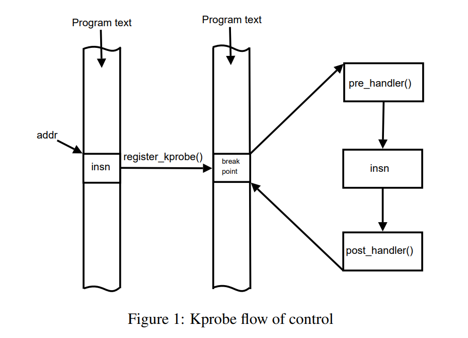
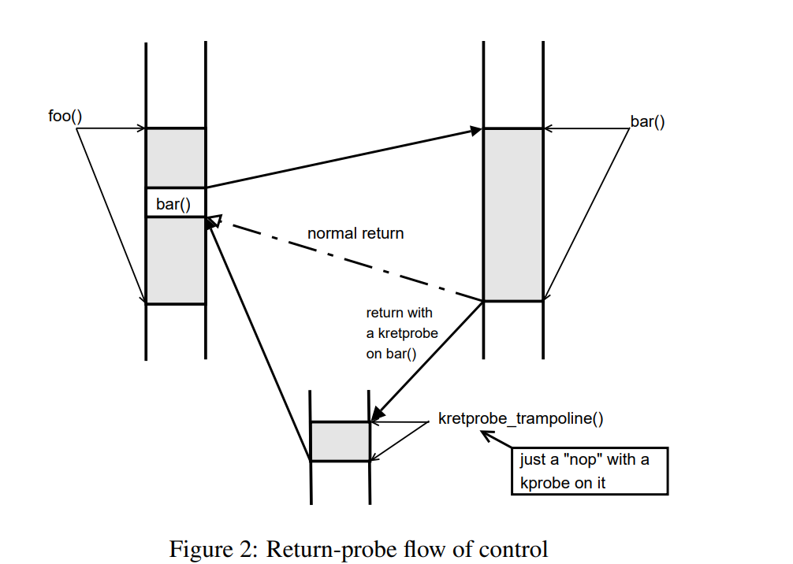
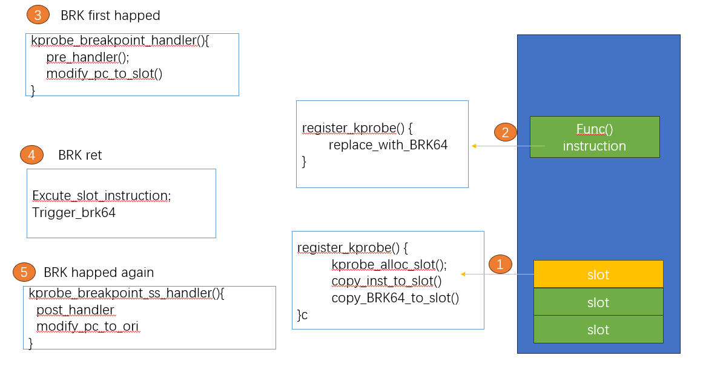

## Kprobe

从本章节开始，我们开始介绍`kprobe`

### 介绍

我们用了几节，讲了关于`dyn ftrace`的大部分核心细节。

本节，我们会介绍另外一个探测实现技术 `kprobe`. 不同于`ftrace` 只可以给函数的开始和结束增加探测点，`kprobe`允许在内核的任何(除黑名单之外的)代码段增加探测点

接下来的四个小节将解释不同类型的探测器是如何工作的，以及跳转优化是如何进行的。 为了更好地使用 `Kprobes`，这些小节还解释了一些您需要了解的内容，例如 `pre_handler `和 `post_handler` 之间的区别，以及如何使用` kretprobe` 的 `maxactive` 和` nmissed` 字段。

#### 如何工作的

注册` kprobe `时，`Kprobes `会复制探测指令，并用断点指令（如 i386 和 x86_64 上的 `int3`）替换探测指令的第一个字节。

当 CPU 遇到断点指令时，会发生`trap`，CPU 的寄存器被保存，控制权通过 `notifier_call_chain `机制传递给 `Kprobes`,然后会执行与 `kprobe` 关联的 `pre_handler`，将 `kprobe` 结构的地址和保存的寄存器地址传递给处理程序。

接下来，`Kprobes `会单步执行被探测指令的副本。 (在原处单步执行实际指令会更简单，但这样` Kprobes `就必须暂时删除断点指令。 这将打开一个小的时间窗口，让另一个 CPU 直接越过探测点）。

指令单步执行后，`Kprobes` 会执行与` kprobe` 相关的 `post_handler`（如果有）。 然后继续执行探测点后面的指令。



#### 修改执行路径

由于` kprobes` 可以探测运行中的内核代码，因此可以更改寄存器集，包括指令指针。 这种操作需要最大程度的小心，如保留堆栈框架、恢复执行路径等。 由于它是在运行的内核上进行的，需要对计算机体系结构和并发计算有深入的了解，因此很容易出错。

如果在` pre_handler` 中更改了指令指针（并设置了其他相关寄存器），则必须返回` !0` 以便` kprobes` 停止单步操作并返回给定地址。 这也意味着不应再调用 `post_handler`。

请注意，在某些使用 `TOC`（目录表）进行函数调用的体系结构中，这一操作可能比较困难，因为您必须在模块中为函数设置一个新的` TOC`，并在返回后恢复旧的 `TOC`。

#### kretprobe

由于我们前面已经介绍过了`fprobe`的退出实现原理，`kretprobe`行为类似

调用 `register_kretprobe() `时，`Kprobes `会在函数入口处建立一个 `kprobe`。 当被探测的函数被调用且该探测被命中时，`Kprobes `会保存一份返回地址的副本，并用一个 `trampoline `的地址替换返回地址。 `trampoline`是一段任意代码，通常只是一条 nop 指令。 启动时，`Kprobes` 会在 `trampoline` 上注册一个 `kprobe`。

当被探测函数执行其返回指令时，控制权会传递到`trampoline`，该探测被触发。` Kprobes` 的`trampoline`处理程序会调用与 `kretprobe` 相关联的用户指定返回处理程序，然后将保存的指令指针设置为保存的返回地址，从陷阱返回后，执行将在该地址继续。



### Kprobe API

参考`samples/kprobe.c`

#### struct kprobe

首先需要准备一个``

设置`kprobe.symbol_name` 为打断点的位置  如果知道地址 也可以直接设置`kprobe.addr` ,两个里面只可以选择一个方法；

另外，也可以指定函数内的偏移`kprobe.offset`(`kprobe`是针对`IP/PC`的)

```c
   static char symbol[KSYM_NAME_LEN] = "kernel_clone";
   static struct kprobe kp = {  
          .symbol_name    = symbol,       
  };
```

接下来可以指定`post_handler` 和`pre_handler` 

```c
  /* kprobe pre_handler: called just before the probed instruction is executed */
  static int __kprobes handler_pre(struct kprobe *p, struct pt_regs *regs)
  {
      #ifdef CONFIG_ARM64          
          pr_info("<%s> p->addr = 0x%p, pc = 0x%lx, pstate = 0x%lx\n",
                  p->symbol_name, p->addr, (long)regs->pc, (long)regs->pstate);
      #endif
  }

   /* kprobe post_handler: called after the probed instruction is executed */
  static void __kprobes handler_post(struct kprobe *p, struct pt_regs *regs,
                                  unsigned long flags)
  {
   #ifdef CONFIG_ARM64
          pr_info("<%s> p->addr = 0x%p, pstate = 0x%lx\n",
                  p->symbol_name, p->addr, (long)regs->pstate);
    #endif
 }
```

初始化结构体 填充回调函数

```c
          kp.pre_handler = handler_pre;
          kp.post_handler = handler_post;
```

#### （un）register_kprobe

注册kprobe

```c
  static int __init kprobe_init(void)
  {
          int ret;
          kp.pre_handler = handler_pre;
          kp.post_handler = handler_post;
          ret = register_kprobe(&kp);
          if (ret < 0) {
                  pr_err("register_kprobe failed, returned %d\n", ret);
                  return ret;
          }
          pr_info("Planted kprobe at %p\n", kp.addr);
          return 0;
  }
```

### enable(disable)__kprobe

和注册类似，不同在于不会申请和销毁`kprobe`相关资源 只是取消回调

### Kretprobe API

`kretprobe`的概念和`fprobe`非常类似，具体使用方法参考`sample/kreprobe_example.c`

```c
  static struct kretprobe my_kretprobe = {
          .handler                = ret_handler,
          .entry_handler          = entry_handler,
          .data_size              = sizeof(struct my_data),
          /* Probe up to 20 instances concurrently. */
          .maxactive              = 20,
  };
```

### kprobe 实现

在介绍里面，我们大概说明了一下`kprobe`的实现机制，本章节主要尝试理解代码设计和实现

#### struct kprobe

列举核心 字段

```c
struct kprobe {
    ...
   kprobe_opcode_t *addr;  
   /* Allow user to indicate symbol name of the probe point */
   const char *symbol_name;
   /* Offset into the symbol */    
   unsigned int offset; 
    ...
}
```

#### register kprobe

对核心代码进行解释梳理

```c
register_kprobe(kp)
    // 利用`kallsyms_lookup_name`获得符号地址信息、以及是否位于`func start`
   -> addr = _kprobe_addr(p->addr, p->symbol_name, p->offset, &on_func_entry)
    //检查函数地址是否有效 是否在黑名单中
   -> check_kprobe_address_safe()
    // 复制原有指令 并准备单步执行环境
   -> prepare_kprobe()
    // 检查地址是否已经注册了probe，如果注册过，只需要聚合probes 不需要再修改代码
   -> if old_p:  ret = register_aggr_kprobe(old_p, p);
   // 插入`kprobe`到全局`hash table`
   -> hlist_add_head_rcu(&p->hlist,
              &kprobe_table[hash_ptr(p->addr, KPROBE_HASH_BITS)]);
   // 替换原有指令为断点指令
   -> arm_kprobe(p)
```

#### 中断处理

这里以arm64的处理流程举例

```c
kprobe_breakpoint_handler 
  ->  addr = instruction_pointer(regs): 获得当前中断指令地址
  ->  get_kprobe(addr): 从全局hashtable 获取kprobe
  -> if (!p->pre_handler || !p->pre_handler(p, regs))： 执行pre_handler
  -> setup_singlestep(p, regs, kcb, 0); 执行单步指令
    -> 使用XOL： 
     -> instruction_pointer_set(regs, slot); 设置返回地址为：单步执行环境
    -> 不使用XOL： 
     -> arch_simulate_insn(p, regs);
        ->  p->ainsn.api.handler((u32)p->opcode, (long)p->addr, regs);
        ->  post_kprobe_handler(p, kcb, regs); ： 执行post 
```

这里说明一下 什么是单步执行环境，哪些指令允许 单步执行,哪些指令不可以，不可以的话怎么做？ 

#### 单步执行

ARM64 支持单步执行，其实就是再代码段预留了一些插槽 



并不是所有代码都可以完全执行单步执行的，比如相对跳转指令(思考为什么?)
