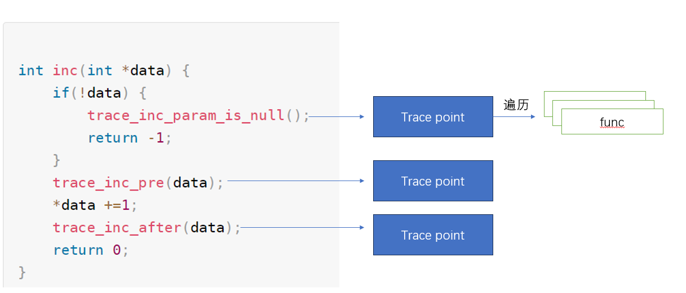

## Tracepoints

上一个小节，我们介绍了`dyn ftrace`的实现细节 以及 使用方法，本小节 我们依然从 使用者 和 设计者的角度来学些内核的另外一个跟踪机制 `tracepoints`

参考资料： 

- [Using the Linux Kernel Tracepoints &mdash; The Linux Kernel documentation](https://kernel.org/doc/html/v6.1/trace/tracepoints.html)

- [Using the TRACE_EVENT() macro (Part 1) [LWN.net]](https://lwn.net/Articles/379903/)

- [Using the TRACE_EVENT() macro (Part 2) [LWN.net]](https://lwn.net/Articles/381064/)

- [Using the TRACE_EVENT() macro (Part 3) [LWN.net]](https://lwn.net/Articles/383362/)

### 介绍

#### 复习

我们已经介绍了`dyn ftrace` `fprobe` 以及 `kprobe` , 回顾一下都分别实现和没有实现哪些功能，才能更好理解 `tracepoints`的应用场景

**dyn trace**

- 编译期间 函数起始位置预留 打桩函数 位置

- 内核统一管理了 所有可以 加入打桩函数的   位置信息(`dyn trace`)

- 内核统一管理了 所有打桩函数 `trace_ops`

- 通过 `func filter` 可以只给特定的 `dyn trace`   注入 打桩函数 

- 内核提供了一些 打桩函数 `function（graph） tracer ` `stack tracer`  和用户配置文件(`tracefs/set_ftrace_filter`等 )

- 支持用户自己实现`打桩函数`

- 动态`ftrace ` 支持动态设置， 关闭状态下 开销几乎为0 

`dyn trace`的局限性：

- 插入位置在编译时确定 ，一般只能是函数开始

- 每次增加打桩函数，都需要额外实现`tracefs`文件用于支持过滤设置 

- 插桩的函数支持范围很大，是优点也是缺点

- 由于上述2个原因，如果希望只针对某些函数或者子系统 定制回调 `trace` 代价比较大，一般只有在一些全局比较通用的`trace`时会用到，比如 `stack tracer` 和函数调用追踪

**Fprobe**

- 配合`rethook`实现的fprobe 额外支持`func exit handler`

**Kprobe** 

- 支持针对`汇编指令地址`颗粒的trace 

- `prehandler` 和 `post handler`通常都通过中断异常实现

**kretprobe** 

- 功能和`fprobe`几乎相同 

#### 局限性

回到我们在一开始`tracing`中描述的原始需求：

- 可以在内核代码的任意位置中插入`probe func`
  
  - `fprobe`支持函数进入退出的跟踪
  
  - `kretprobe` 支持函数进入和退出的跟踪
  
  - `kret`支持在任意的位置打断点

- `probe func`可以获得当前上下文内容(函数、参数、变量)
  
  - 以`pt_regs` 形式获得上下文，但是无法识别上下文变量和参数

- `probe func`可以动态的`enable/disable` 
  
  - `ftrace`支持针对 `PID`和 `func name`的 黑白名单设置
  
  - `kretprobe` `kprobe`都是针对特定位置的`trace`，机制自身不提供其他过滤能力，支持`unregister`

其他共性：

- 除了一些已经实现好的`ftrace tracer`，希望使用`fprobe``kprobe`都需要自己编写代码，实现对应的`hanlder` 并完成注册

- 除了一些已经实现好的`ftrace tracer`，用户自己新增的`probe`，需要自己注册`tracefs`管理(`filter`、`enable/disable`)

接下来我们要介绍的`trace`机制要解决我们这些场景需求： 

- 有没有一些公共的机制，可以统一实现
  
  - `tracefs`的注册和管理(`filter`、`enable/disable`)

- 百分之80的场景，`trace`的需求就是打印上下文
  
  - 可以统一提供 标准化的trace日志功能

### Tracepoint

`tracepoints`是`EventTrace`机制实现的基础，主要特点为：

- 通过在代码中静态增加`probe func`

- 允许高效的动态关闭



本身功能实现上并不复杂，就是一个简单的 编译期间就注入的`probe func`  

#### 核心结构:  tracepoint 定义

```c
  struct tracepoint {
          const char *name;               /* Tracepoint name */
          struct static_key key;
          struct static_call_key *static_call_key;
          void *static_call_tramp;
          void *iterator;
          void *probestub;
          int (*regfunc)(void);
          void (*unregfunc)(void);
          struct tracepoint_func __rcu *funcs;
  };
```

这里我们关注`funcs` 他是一个数组， 每个 `tracepoint` 允许注册多个回调函数

#### Static Key

既然`probe func` 是在编译期间就已经编译到执行代码段的，那如何实现动态启用呢？

[官方介绍](https://www.kernel.org/doc/Documentation/static-keys.txt)

动机需求： 频繁的`if else` 语句会造成一些性能损失, 比如  `likely/unlikely`  专门为此实现了优化, 可以参考，  [c - How do the likely/unlikely macros in the Linux kernel work and what is their benefit? - Stack Overflow](https://stackoverflow.com/questions/109710/how-do-the-likely-unlikely-macros-in-the-linux-kernel-work-and-what-is-their-ben) ，核心就是通过修改编译后的汇编执行顺序(使用 `jne` or  `je`?)，让可能性更高的分支 可以被CPU 利用提前预加载 加载(一旦进入意外情况，需要刷新流水线)； 但是`trace func`动态开启和关闭 并不是一个固定的 可能性事件，但是一旦开启以后，行为就像是 `likely` 否则就像是 `unlikely` ，不能单纯的使用`linkey unlikely`机制优化

如何实现？ 当条件成立的时候，把代码跳转到为`true`的分支，否则跳转到 `false`的分支，依赖于条件当时的情况

细节参考[jump label](https://blog.csdn.net/dog250/article/details/106715700) 

```c
  struct static_key {
          atomic_t enabled;
  /*
   * Note:
   *   To make anonymous unions work with old compilers, the static 
   *   initialization of them requires brackets. This creates a dependency
   *   on the order of the struct with the initializers. If any fields
   *   are added, STATIC_KEY_INIT_TRUE and STATIC_KEY_INIT_FALSE may need
   *   to be modified.
   *              
   * bit 0 => 1 if key is initially true
   *          0 if initially false
   * bit 1 => 1 if points to struct static_key_mod
   *          0 if points to struct jump_entry
   */
          union {
                  unsigned long type;
                  struct jump_entry *entries;
                  struct static_key_mod *next;
          };
  };

 struct jump_entry {
          s32 code;
          s32 target;
          long key;       // key may be far away from the core kernel under KASLR
  };

    static inline struct jump_entry *static_key_entries(struct static_key *key)
  {
          WARN_ON_ONCE(key->type & JUMP_TYPE_LINKED);
          return (struct jump_entry *)(key->type & ~JUMP_TYPE_MASK);
  }
```

几个非常重要的接口:

- `static_key_false/static_key_true`: 编译期间，会把当前代码段 封装为 entry 然后塞进到`jump_table`, 对于初始值为 TRUE的，使用`if static_key_true` 作为`key = true`的判断，否则 使用`if static_key_false`作为`key = true`的判断

- `enable_jump_label`: 当在使能  `staticl key`时候，遍历 `jump_table` 实现代码修改替换

更多 内容参考[static key](https://www.kernel.org/doc/Documentation/static-keys.txt)

#### 使用声明宏定义: tracepoint

首先 需要定义 `tracepoint` ，定义需要单独头文件定义，路径一般为 `include/trace/events/subsys.h`  一般内容格式为 ： 

```c
#undef TRACE_SYSTEM
#define TRACE_SYSTEM subsys

#if !defined(_TRACE_SUBSYS_H) || defined(TRACE_HEADER_MULTI_READ)
#define _TRACE_SUBSYS_H

#include <linux/tracepoint.h>

DECLARE_TRACE(subsys_eventname,
        TP_PROTO(int firstarg, struct task_struct *p),
        TP_ARGS(firstarg, p));

DECLARE_TRACE(subsys_eventname2,
        TP_PROTO(int firstarg, struct task_struct *p),
        TP_ARGS(firstarg, p));

#endif /* _TRACE_SUBSYS_H */

/* This part must be outside protection */
#include <trace/define_trace.h>
```

可以看到，不像传统的头文件 以下面的格式开始

```c
#ifdef __SUBSYS_H
#define __SUBSYS_H
```

原因在于除了正常的`头文件自包含`之外， 还需要解决 不同`subsys` 头文件互相引用的问题,下面两行用于声明在一个新的 `subsys`定义之中

- `subsys`: 会对应 `/sys/kernel/tracing/events/subsys` 用来把同一个子系统的`tracepoints`进行归类管理

- `#include <linux/tracepoint.h>` ：这个很重要，该头文件中的内容 关乎  `tracepoints` 相关宏的定义

- `TRACE_HEADER_MULTI_READ`:允许头文件重复包含， 关于头文件重复包含的逻辑，我们在宏展开时会介绍

##### DECLARE_TRACE

```c
 #define DECLARE_TRACE(name, proto, args)                                \
          __DECLARE_TRACE(name, PARAMS(proto), PARAMS(args),              \
                          cpu_online(raw_smp_processor_id()),             \
                          PARAMS(void *__data, proto))    


  #define __DECLARE_TRACE(name, proto, args, cond, data_proto)            \
          extern int __traceiter_##name(data_proto);                      \
          DECLARE_STATIC_CALL(tp_func_##name, __traceiter_##name);        \
          extern struct tracepoint __tracepoint_##name;                   \
          static inline void trace_##name(proto)                          \
          {                                                               \
                  if (static_key_false(&__tracepoint_##name.key))         \
                          __DO_TRACE(name,                                \
                                  TP_ARGS(args),                          \
                                  TP_CONDITION(cond), 0);                 \
                  if (IS_ENABLED(CONFIG_LOCKDEP) && (cond)) {             \
                          WARN_ON_ONCE(!rcu_is_watching());               \
                  }                                                       \
          }                                                               \
          __DECLARE_TRACE_RCU(name, PARAMS(proto), PARAMS(args),          \
                              PARAMS(cond))    
           static inline int                                               \
          register_trace_##name(void (*probe)(data_proto), void *data)    \
          {                                                               \
                  return tracepoint_probe_register(&__tracepoint_##name,  \
                                                  (void *)probe, data);   \
          }                                                               \
          static inline int                                               \
          register_trace_prio_##name(void (*probe)(data_proto), void *data,\
                                     int prio)                            \
          {                                                               \
                  return tracepoint_probe_register_prio(&__tracepoint_##name, \
                                                (void *)probe, data, prio); \
          }                                                               \
          static inline int                                               \
          unregister_trace_##name(void (*probe)(data_proto), void *data)  \
          {                                                               \
                  return tracepoint_probe_unregister(&__tracepoint_##name,\
                                                  (void *)probe, data);   \
          }                                                          static inline void                                              \
          check_trace_callback_type_##name(void (*cb)(data_proto))        \
          {                                                               \
          }                                                               \
          static inline bool                                              \
          trace_##name##_enabled(void)                                    \
          {                                                               \
                  return static_key_false(&__tracepoint_##name.key);      \
          }
```

- 声明了 一个函数指针:   `int __traceiter_##name(data_proto)`

- 声明了一个结构体: `struct tracepoint __tracepoint_##name`

- 定义一个函数: `staic inline void trace__##name(proto)` 入参等于 `proto`

- 定义了几个注册函数: `unregister/register_trace_(prio)_##name`

最重要的在于 定义了 `trace_##name` 函数，他就是我们所说的 `tracepoints` 回调函数总的入口 ，但是它里面使用到了 结构体`*_tracepoint*##name`，此使我们其实并没有声明出此结构体，因此 如果希望使用 还需要 额外的定义

#### DEFINE_TRACE

在我们需要使用 `trace_##name`函数的源文件 添加如下代码

```c
#include <trace/events/subsys.h> //我们之前自己定义的头文件

#define CREATE_TRACE_POINTS  // 非常重要
DEFINE_TRACE(subsys_eventname);

void somefct(void)
{
        ...
        trace_subsys_eventname(arg, task); //在希望trace的地方调用函数
        ...
}
```

```c
  #define DEFINE_TRACE(name, proto, args)         \
          DEFINE_TRACE_FN(name, NULL, NULL, PARAMS(proto), PARAMS(args))
  ; 
   #define DEFINE_TRACE_FN(_name, _reg, _unreg, proto, args)               \
          static const char __tpstrtab_##_name[]                          \
          __section("__tracepoints_strings") = #_name;                    \
          extern struct static_call_key STATIC_CALL_KEY(tp_func_##_name); \
          int __traceiter_##_name(void *__data, proto);                   \
          void __probestub_##_name(void *__data, proto);                  \
          struct tracepoint __tracepoint_##_name  __used                  \
          __section("__tracepoints") = {                                  \
                  .name = __tpstrtab_##_name,                             \
                  .key = STATIC_KEY_INIT_FALSE,                           \
                  .static_call_key = &STATIC_CALL_KEY(tp_func_##_name),   \
                  .static_call_tramp = STATIC_CALL_TRAMP_ADDR(tp_func_##_name), \
                  .iterator = &__traceiter_##_name,                       \
                  .probestub = &__probestub_##_name,                      \
                  .regfunc = _reg,                                        \
                  .unregfunc = _unreg,                                    \
                  .funcs = NULL };                                        \
          __TRACEPOINT_ENTRY(_name);                                      \  
          int __traceiter_##_name(void *__data, proto)                    \
          {                                                               \
                  struct tracepoint_func *it_func_ptr;                    \
                  void *it_func;                                          \
                                                                          \
                  it_func_ptr =                                           \
                          rcu_dereference_raw((&__tracepoint_##_name)->funcs); \
                  if (it_func_ptr) {                                      \
                          do {                                            \
                                  it_func = READ_ONCE((it_func_ptr)->func); \
                                  __data = (it_func_ptr)->data;           \
                                  ((void(*)(void *, proto))(it_func))(__data, args); \
                          } while ((++it_func_ptr)->func);                \
                  }                                                       \
                  return 0;                                               \
          }                                                               \
          void __probestub_##_name(void *__data, proto)                   \
          {                                                               \
          }                                                               \
          DEFINE_STATIC_CALL(tp_func_##_name, __traceiter_##_name);
```

- 真正定义了 `tracepoint` ： `struct tracepoint *_tracepoint*##_name` 

- 完成了 `tracepoint`初始化：
  
  - `name = *_tpstrtab##_name`,
  
  - `static_key key  = false`
  
  - `static_call_key = SCK_tp_func_##name`
  
  - `static_call_tramp = SCT_tp_func_##name`
  
  - `iterator  = _traceiter_##name`
  
  - `reg = NULL`
  
  - `unreg = NULL`
  
  - `funcs = NULL`

- 定义了 `__traceiter_##_name` 函数的实现

- 定义了 `struct static_call_key SCK_tp_func_##name` 
  
  - `func = _traceiter##_name`
  
  - `type =1`

#### 使用 trace_##_name

现在，我们声明了`tracepoints` 并且也在源文件中定义了 `tracepoints `,如果源文件中 调用 `trace_##name` 到底发生了什么 ？ 我们继续深入一下 该函数的实现

首先，该函数的定义是在 `DECLARE_TRACE`中 定义的 

```c
static inline void trace_##name(proto)                          \
{                                                               \
    if (static_key_false(&__tracepoint_##name.key))         \
         DO_TRACE(name,                                \
                   TP_ARGS(args),                          \
                   TP_CONDITION(cond), 0);                 \
    if (IS_ENABLED(CONFIG_LOCKDEP) && (cond)) {             \
                    WARN_ON_ONCE(!rcu_is_watching());               \
     }                                                       \
}  
```

很明显，首先需要判断 `*_tracepoint*##name.key` 

```c
#define __DO_TRACE_CALL(name, args)     __traceiter_##name(NULL, args)然后会根据平台 x86 遍历 `funcs` 执行 `tp_func_##name` 或者 执行 `_traceiter_##name(NULL, args)`，回顾他的定义，可以看到 就是遍历 `funcs` 执行回调函数
```

#### tracepoint_probe_register[_prio]

上一个小节，`tracepoints` 一开始没有注册任何`probe` 回调函数， `trace__##name`函数实际上什么都不会作，必须要给`tracepoints`注册`probe`函数才可以 

```c
void register_trace_prio_##name(void (*probe)(data_proto), void *data)
```

允许`probe` 函数 除了`tracepoints`规定的`proto`参数外，额外带一个`void *data`私有参数，注册流程就很简单了，主要就是更新 `tracepoints`中的`funcs`

```c
tracepoint_probe_register_prio(struct tracepoint *tp, void *probe, void *data, int prio)
 -> tracepoint_add_func(tp, tp_func, prio) 
  ->  tp->regfunc()
  ->  func_add() : 更新 tp->funcs
  ->  tracepoint_update_call(tp, tp_funcs): 更新回调函数
```

**注意：这里也有一个优化，如果tracepoints 只有1个probe，不需要遍历func，直接执行该函数即可，否则设置为iterator**

#### 总结

本章节，我们讲了`tracepoint`定义以及用到的核心优化机制`static key`  

- 在`if else` branch miss 严重的场景，我们可以通过利用`likely/unlikely`利用流水线缓冲实现更优先的指令预载，在`if条件`更加稳定的场景（比如动态开关），可以使用`static key`机制 
