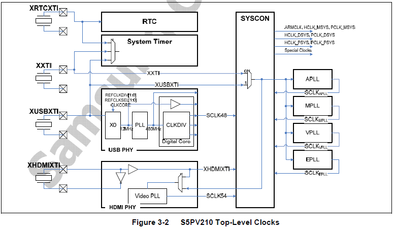
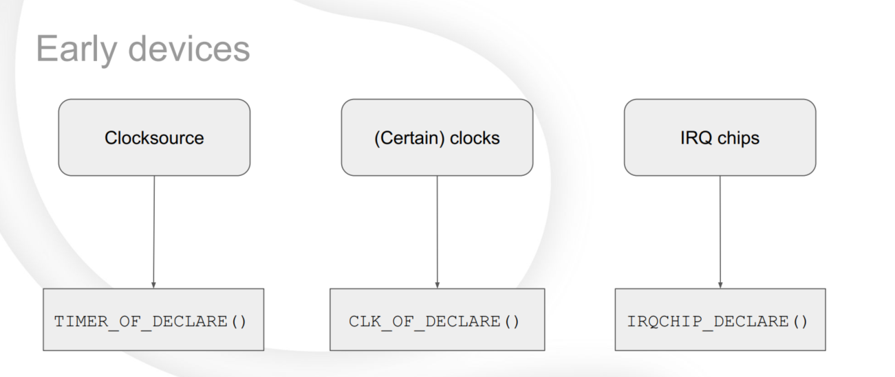

## 时钟

### 前提知识

关于本内容范围澄清：

向下，我们会介绍一些基本的硬件原理，但是不会深入到具体某个设备驱动开发，也就是说在驱动层面，只要求能做到大致看懂代码实现的什么功能，但是不会考虑实现细节；

重点研究Linux 在clk 子系统的抽象和实现，认为这部分属于操作系统和驱动子系统的核心关键代码部分，会介绍一些核心代码实现

#### 概念区分

区分Linux中的时钟和时钟源概念 

- 时钟源： 泛指系统中用于提供系统时钟(tick)的硬件，比如不同体系架构下提供的timer， arm的generic timer 和 percpu timer，和系统时钟、调度等依靠timer驱动的功能息息相关

- 时钟：这里的时钟 我们一般用于指 时钟信号的控制，比如在一个SOC内部有很多器件，譬如CPU、串口、DRAM控制器，GPIO等内部外设，这些东西要彼此协调工作，需要一个同步的时钟系统来指挥， 我们常说的 CPU 主频 是 1Ghz 指的就是这个时钟频率
  
  我们在这章节主要涉及的是 **时钟** 这个概念

#### 硬件设计

SOC时钟一般可以有三种方式获得

- 外部直接输入时钟信号，SOC有一个引脚用来输入外部时钟信号，用的很少

- 外部晶振+内部时钟发生器产生时钟，大部分低频单片机这么工作

- 外部晶振+内部时钟发生器+内部PLL产生高频时钟+内部分频器分频得到各种频率的时钟

!!! Note

       

    问：为什么不用外部高频晶振产生高频率信号直接给cpu？
    答：主要是因为芯片外部电路不适宜使用高频率，因为传到辐射比较难控制：高频率的晶振太贵了。
    问: 为什么要内部先高频，然后再分频？
    答：主要因为SOC内部有很多部件都需要时钟，而且各自需要的时钟频率不同，没法统一供应，
    因此设计思路是PLL后先得到一个最高的频率(1GHZ、1.2GHZ），然后各个外设都有自己的分频器再分频得到自己想要的频率。

一个典型硬件 `s5pv210` 的硬件时钟电路



#### PLL(扩展知识)


### Linux的CLK 驱动框架

#### early-driver 特殊性

 linux 的驱动子系统，一般都是通过 把初始化注册函数 放到  `init_1/2/3/4` 类似这样的代码段中，然后再系统初始化`main` 中遍历调用`driver` 注册的函数接口

`CLK`   区别于其他驱动，他属于最基础的硬件 和他类似 还有 `timer` `irq` 都属于系统早期需要加载的驱动 



因此 我们再`drivers/clk/xxx` 某个具体驱动模块中，并没有找到类似传统`platform_driver_init` 的这样接口，而是`CLK_OF_DECLARE` 这样的初始化声明

#### 整体框架

下图我们按照 角色、核心数据结构 分为了三层

- clk consumer:  CLK 消费者，主要就是外部驱动如何调用clk 

- CCF ： clk 公共框架

- clk provider： 每个clk 的具体驱动实现


#### clk-get（consumer API）

本小节，我们尝试通过clk-get接口 讲清楚CLK的注册和获取

```c
  struct clk *clk_get(struct device *dev, const char *con_id)
  { 
          const char *dev_id = dev ? dev_name(dev) : NULL;
          struct clk_hw *hw;   
  
          if (dev && dev->of_node) {  
                  // 方法1  OF DTS获取  
                  hw = of_clk_get_hw(dev->of_node, 0, con_id);
                  if (!IS_ERR(hw) || PTR_ERR(hw) == -EPROBE_DEFER)
                          return clk_hw_create_clk(dev, hw, dev_id, con_id);
          }                    
          // 方法2 sys获取  
          return __clk_get_sys(dev, dev_id, con_id);//  
  } 
  EXPORT_SYMBOL(clk_get); 
```

`clk_get` 属于`CCF` 提供给外部驱动的接口，具体实现其实依赖了两个机制，一个是 利用设备树列表信息获取clk，一个是从系统clk维护列表中获取；


#### of clk

我们先看第一个 设备树的clk信息维护,下面是一个 裁剪后的`i2c`的设备树描述，我们关注其中的`clocks` 字段描述,  可以看到 是可以通过 某个具体的驱动设备树(这里指I2C)描述 找到对应的`clocks` （这里指`clkc`）以及`clocks`的参数(这里指`LSP0_PCLK`) 

```
     i2c0: i2c@20000000 {
                          #address-cells = <1>;           
                          #size-cells = <1>;              
                          compatible = "snps,designware-i2c";
                          clock-frequency = <100000>;     
                          i2c-sda-hold-time-ns = <300>;   
                          i2c-sda-falling-time-ns = <300>;
                          i2c-scl-falling-time-ns = <300>;
                          clocks= <&clkc LSP0_PCLK>,      
                                  <&clkc LSP0_WCLK>;              
                          clock-names = "LSP0_PCLK", "LSP0_WCLK";
     };  
```

`clkc` 实际上就是就是我们的clocks 时钟树的设备树描述信息
