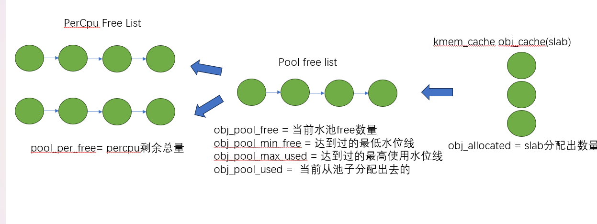

# 内核调试基础

## gdb 

gdb作为日常问题定位中不可缺少的一个工具，可以说和日常开发息息相关，本节想通过两部分对gdb介绍

 - gdb的工作原理: 理论学习，并不对gdb的代码过多探索
 - gdb常用命令: 根据实际工作场景不断补充


### 两种调试界面

我们都知道，内存中的执行程序，都是由二进制的指令和数据构成的，gdb可以把二进制指令翻译成为汇编，这并没有什么难度
但是对于更多开发人员，他们更关注自己的代码，而不是汇编，但是仅仅通过指令得到目标代码，是不现实的，为了完成这个目标，必须要
在编译的时候，通过建立代码和程序的关系，一般通过gcc -g 选项完成该工作

 - 基于目标语言(C)的调试：依赖源文件、依赖目标程序的调试信息(通过编译增加-g选项）
 - 基于汇编的调试：不依赖高级语言

### 常用调试命令

#### 控制窗口显示 

 - gdb  -tui: 以窗口模式打开gdb ，配合layout 命令使用
 - layout asm/src: 窗口 显示汇编/源文件

#### 控制程序
 - r ：restart 
 - s : 进入函数

#### 断点
 - break/b： 
 - delete

#### 寄存器
 - p/x $rax

#### 内存
 - x/{n}{f}{u} addr 
 - n 表示要打印的数量
 - f 打印格式，支持d（decimal 十进制） x 十六进制  a 八进制
 - u 每个打印单元长度: b(byte) h(2byte) w(4 byte) g(8 byte)

#### 历史命令查看
tui模式下 查看上一条 下一条命令
 - ctrl+p previous
 - ctrl+n next
 - ctrl+b back
 - ctrl+f forward

### QEMU GDB调试内核

#### 代码准备
```
$ make -p ~/code/
$ cd  ~/code/
$ git clone https://mirrors.tuna.tsinghua.edu.cn/git/linux.git
$ git remote add linux-next https://mirrors.tuna.tsinghua.edu.cn/git/linux-next.git
切换到next tree
$ git fetch  linux-next 
$ git fetch --tags linux-next
$ git tag -l "next-*" | tail
$ git checkout -b {my_local_branch} next-(latest)
```

#### 代码编译

[内核配置编译](https://www.kernel.org/doc/html/next/dev-tools/gdb-kernel-debugging.html)  需要关闭 `CONFIG_RANDOMIZE_BASE` 打开`CONFIG_GDB_SCRIPTS` 

```
$ make ARCH=x86_64 x86_64_defconfig (配置内核)
$ make ARCH=x86_64 menuconfig 
$ make -j8
$ qemu-system-x86_64  -kernel arch/x86/boot/bzImage -hda /dev/zero -append "root=/dev/zero console=ttyS0" -serial stdio -display none
```

由于此时还没有提供根目录，内核在启动 执行到挂载根目录就会panic 

#### 代码调试

现在可以增加`gdb选项` 调试内核了

```
$ qemu-system-x86_64 -s -S -no-kvm -kernel arch/x86/boot/bzImage -hda /dev/zero -append "root=/dev/zero console=ttyS0 nokaslr" -serial stdio -display none
```

这里我们启动内核增加了一个 nokaslr选项，关于kaslr的介绍请看 https://lwn.net/Articles/569635/, 如果有机会，我们在内核安全章节可能会学习介绍他
	
这里我们增加了 `-s -S` 选项，该选项会让GDB 卡住，直到gdb client 连接

修改~/.gdbinit 设置自动加载内核提供的gdb 脚本
 
```
add-auto-load-safe-path /home/test/code/linux/scripts/gdb/vmlinux-gdb.py
```

下面命令是在gdb里面执行的

```
$ 在另外一个窗口执行
$ cd  /home/test/linux/
$ gdb ./vmlinux
$ target remote localhost:1234
$ lx-symbols
$ break start_kernel 
$ layout src
```
现在可以单步调试了 [其他命令参考](https://www.kernel.org/doc/html/next/dev-tools/gdb-kernel-debugging.html)

#### 跨平台
```
$ gdb-multiarch vmlinux   
$ set architecture aarch64
$ target remote localhost:1234
$ lx-symbols
$ break start_kernel
$ layout src
```
	
	
#### 根目录制作

```
$ cd  ~/code
$ git clone git://git.buildroot.net/buildroot
$ make menuconfig （Target Options -> Target Architecture →x86_64; Filesystem images → ext2/3/4 root file system ）
$ make -j8
$ qemu-img convert -f raw -O qcow2 output/images/rootfs.ext2 output/images/rootfs.qcow2
```
现在已经拥有

- 内核image: arch/x86/boot/bzImage
- rootfs： buildroot/output/images/rootfs.ext2


```
$ qemu-system-x86_64 -s -kernel arch/x86/boot/bzImage \
	-boot c -m 2049M -hda ../buildroot/output/images/rootfs.ext2 \
	-append "root=/dev/sda rw console=ttyS0,115200 acpi=off nokaslr" \
	-serial stdio -display none
```

## 内核参数

内核支持的参数[文档说明](https://www.kernel.org/doc/html/v4.14/admin-guide/kernel-parameters.html)

也可以在系统启动之后 通过 `cat /proc/cmdline` 查看

## 日志系统

### 日志等级

内核内部定义了如下的日志等级 数字越小，表示等级越高

```
/* integer equivalents of KERN_<LEVEL> */
#define LOGLEVEL_SCHED          -2      /* Deferred messages from sched code
										* are set to this special level */
#define LOGLEVEL_DEFAULT        -1      /* default (or last) loglevel */
#define LOGLEVEL_EMERG          0       /* system is unusable */
#define LOGLEVEL_ALERT          1       /* action must be taken immediately */
#define LOGLEVEL_CRIT           2       /* critical conditions */
#define LOGLEVEL_ERR            3       /* error conditions */
#define LOGLEVEL_WARNING        4       /* warning conditions */
#define LOGLEVEL_NOTICE         5       /* normal but significant condition */
#define LOGLEVEL_INFO           6       /* informational */
#define LOGLEVEL_DEBUG          7       /* debug-level messages */
```

内核提供了两种日志打印方式: 
 - 内核缓冲区 
 - 控制台窗口,因为打印到窗口必须要频繁的触发类似于串口驱动，存在性能问题 

更多关于内核缓冲区说明[参考](https://access.redhat.com/documentation/zh-cn/red_hat_enterprise_linux/8/html/managing_monitoring_and_updating_the_kernel/getting-started-with-kernel-logging_managing-monitoring-and-updating-the-kernel#what-is-the-kernel-ring-buffer_getting-started-with-kernel-logging)


printk子系统 提供了四个维度的日志等级配置: 

 -  console_loglevel：控制台日志级别,优先级高于该值的消息将被打印至 **控制台**
 -  default_message_loglevel：缺省的消息日志级别,如果打印没有指定级别，则默认使用此级别 
 -  minimum_console_loglevel: 最低的控制台日志级别，用户可以配置的最高级别 一般位
 -  default_console_loglevel: 缺省的控制台日志级别，如果打印没有指定级别，则默认使用此级别作为判断是否打印到 **控制台**的根据


```
int console_printk[4] = {
		CONSOLE_LOGLEVEL_DEFAULT,       /* console_loglevel */
		MESSAGE_LOGLEVEL_DEFAULT,       /* default_message_loglevel */
		CONSOLE_LOGLEVEL_MIN,           /* minimum_console_loglevel */
		CONSOLE_LOGLEVEL_DEFAULT,       /* default_console_loglevel */
};
```

### 日志等级配置

在用户态 
 - 通过`dmesg`调整控制台输出级别 `dmesg -n <loglevel>` 该修改只是修改控制台的日志级别
 - 通过`boot`参数来修改 `loglevel=<level>`  `log_buf_len` 动态调整日志缓冲区大小
 - 通过sysctl 或者 `/proc/sys/kernel/printk` 设置日志等级 

### 内核接口
 `pr_info/debug/notice` 


### 关于debug
内核关于`debug等级`日志有特殊处理，`console_loglevel`可以控制控制台的日志，但是不意味日志会被丢掉，日志会被保存在内核环形缓冲区，
依然可以通过dmesg查看 ,但是debug日志，必须要以显示的方式打开，才会被打印 

```
#if defined(CONFIG_DYNAMIC_DEBUG) || \
    (defined(CONFIG_DYNAMIC_DEBUG_CORE) && defined(DYNAMIC_DEBUG_MODULE))
#define pr_debug(fmt, ...)                      \
		dynamic_pr_debug(fmt, ##__VA_ARGS__)
#elif defined(DEBUG)
#define pr_debug(fmt, ...) \
		printk(KERN_DEBUG pr_fmt(fmt), ##__VA_ARGS__)
#else
#define pr_debug(fmt, ...) \
		no_printk(KERN_DEBUG pr_fmt(fmt), ##__VA_ARGS__)
#endif
```

在没有支持 DYNAMIC_DEBUG之前，日过想要开启debug日志，必须在编译源文件的时候，增加 cflags += -DDEBUG，否则debug日志不会开启 
但是这种方式对于调试并不太方便，因此内核增加了 DYNAMIC_DEBUG能力，具体使用方法参考:
[DYNAMIC_DEBUG能力](https://www.kernel.org/doc/html/latest/admin-guide/dynamic-debug-howto.html)

 
### 日志限速
限制日志打印频率，日志只能在指定时间内 打印不超过设定上线的日志条数，主要用于防范日志刷屏和攻击 
典型场景: 在某个函数，确实需要打印错误日志，但是该函数可能通过某种攻击手段 导致该函数在短时间内 不断重入，导致日志爆炸 


#### 内核接口
在需要限速的日志地方 使用接口 printk_ratelimited

```
#define mfc_err_limited(fmt, args...)                   \
    do {                                            \
            printk_ratelimited(KERN_ERR "%s:%d: " fmt,      \
                   __func__, __LINE__, ##args);     \
        } while (0)
```
#### 限速参数设置
通过`sysctl` 或者 ` /proc/sys/kernel/printk_ratelimit` 设置时间间隔 `/proc/sys/kernel/printk_ratelimit_burst` 设置该时间间隔内日志上限   


### 其他功能

支持用户态写入kmesg

内核允许用户态通过 `/dev/kmsg` 向内核缓冲区写入日志，该选项可以通过 `/proc/sys/kernel/printk_devkmsg` 打开 关闭 或者 限速

打印延迟 `/proc/sys/kernel/printk_delay` 设置日志延迟，对日志进行降速处理

## debugobjects

### 模块设计

源码位于: `lib/debugobjects.c`
核心数据结构：维护`debug obj`，	`trace obj` 统一从`slab`分配，每个`CPU`维护一个
`PERCPU`列表(不需要持有`pool lock`) ，`pool lock`负责维护`OBJ`的整体分配
 


### 如何使用


#### 功能开启关闭
 
 - 通过CONFIG_DEBUG_OBJECTS 可以开启对象生命周期监控模块编译 
 - kernel 通过 命令行参数: `debug_objects` 或者`no_debug_objects` 可以动态选择开启关闭

动态关闭会有一些性能损失，编译关闭，可以通过编译器优化 把空函数直接删除，动态关闭，依然会有一次跳转和判断


#### 状态查看

通过 `/sys/kernel/debug/debug_objects/stats` 可以查看对象统计状态, 

#### 对外API
`debug_object_init`: 在对象初始化函数调用，该函数会检查对象是否可以初始化

 - 处于活动状态: 会被认为是错误初始化，额外提供了fixup机制，如果提供了fixup_init函数，调用者应该保证fixup_init 应该修正这个错误: 
   比如把活动对象停用，以防止破坏子系统
 - 处于已经销毁状态: 会被认为是错误初始化, 不提供fixup 仅仅是打印
 - 未被跟踪: 会新分配一个跟踪对象器，并设置状态: `ODEBUG_STATE_INIT`, 同时检查该对象是否在堆栈上，
   如果在堆栈，会打印告警，堆栈上的对象，应该使用 `debug_object_init_on_stack`，见下一节
 
`debug_object_init_on_stack`: 堆栈上的对象在初始化之前调用，该函数会见检查对象是否可以初始化

 - 活动状态或者是已销毁: 会被认为是错误初始化，额外提供了fixup机制，如果提供了fixup_init函数，调用者应该保证fixup_init 应该修正这个错误:
   比如把活动对象停用，以防止破坏子系统

堆栈上的对象，必须在该对象的生命周期(代码块) 退出之前， 调用`debug_object_free()` 从跟踪器删除堆栈上的对象，否则会导致跟踪错误


`debug_object_activate` :调用真实对象的激活函数时 需要调用此函数 