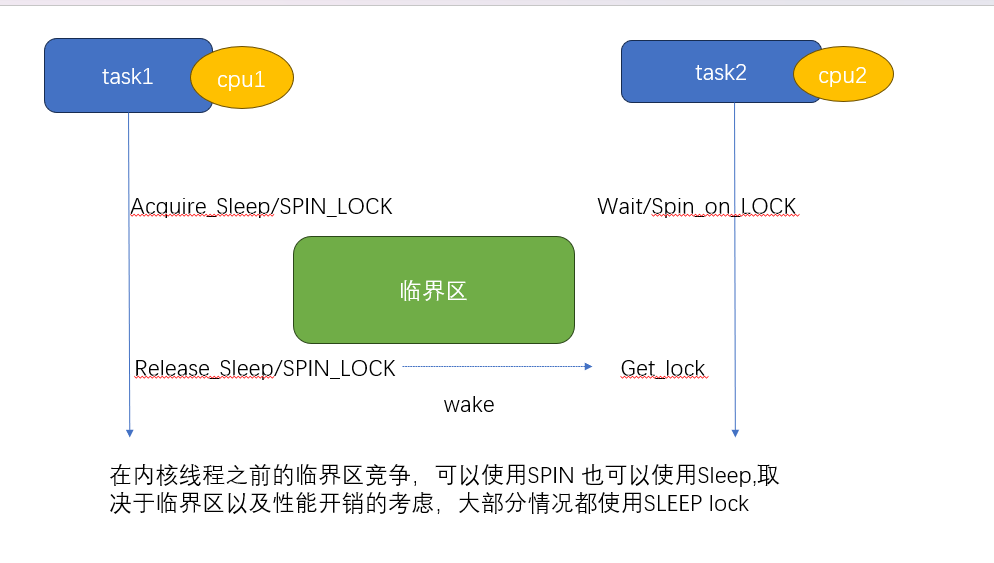

# 同步原语

## READ/WRITE_ONCE

READ/WRITE ONCE 不是锁，甚至不是原语（不提供内存屏障），只是用来保证本次内存读写是 **即时 不被编译器优化的**

- 即时: 多CPU访问内存，会因为cache 有不同步的可能，READ/WRITE_ONCE 避免了由于cache引入的数据滞后问题
- 不被编译器优化的: 编译器会保证当前指令不会被优化 折叠 ，并且整字节访问内存

作为linux最基础的同步原语，主要用来解决共享内存的读写访问，很多同学看到这里，肯定会问 难道不应该是用锁吗? 

但是实现锁本身也需要原子操作: 判断是否上锁、下锁；以及哪怕不存在数据竞争，一个线程因为可以随时被调度打断，因此需要
对数据完成一次读写操作；这里有一个 [例子](https://lkml.org/lkml/2015/10/5/400)

[更多请参考](https://github.com/google/kernel-sanitizers/blob/master/other/READ_WRITE_ONCE.md)

### 使用场景

 - 用于在单个CPU上，进程和中断的通信控制（percpu flag）
 - 用于实现atomic或者锁原语，和内存屏障结合使用，保证编译器不进行优化、折叠，访问是预期行为

## 锁

掌握本节内容，需要提前清楚以下几个概念: 

  - 抢占内核:现在都假设是处于抢占式内核,不在讨论非抢占内核
  - 中断
  - 临界区
  - SMP: 现在都假设我们是在SMP模型下讨论，不在讨论单核场景

无论如何，让我们回到锁的本质，就是为了解决临界区问题 
先从几个大的方面尝试 区分一下睡眠锁、spin锁 本地spin锁

### 睡眠锁性能讨论

睡眠锁性能的影响:  如果使用睡眠锁，假设A(CPU1)已经持锁，内核支持抢占的前提下，该任务在访问临界区中间，可以随时被其他任务抢占 
  
  - 如果此时B抢占了A(CPU1)，同时B(CPU1)尝试去拿锁，B会陷入睡眠，让出CPU1，A(CPU1)继续执行
  - 如果此时C抢占了A(CPU1)，同时B(CPU2)尝试去拿锁，B会陷入睡眠, 让出CPU2, A依然处于被抢占的状态，此时AB都得不到执行
  
上面只是列出了睡眠锁常见的几个场景，我们可以看到，睡眠锁其实都是通过调度(sleep/wakeup)解决任务之前临界区的竞争，那么必然就会引入调度的开销
如果我们的临界区非常短,从调度开销角度考虑，在访问这个临界区中间，我们其实并不希望 该任务能够被调度出去,同时等锁的任务，我们也希望他能够珍惜
这次调度机会，不要再次发生调度，综上考虑，只需要在持锁和等锁的实现上，临时关闭调度抢占即可，这就是最初的自旋锁(spin_lock)

实际上，为了最小化调度损失，睡眠锁也提供很多机制去消减调度开销，比如支持任务优先级传递的RT_mutex

SPIN锁性能的影响: 如果使用SPIN自旋锁，一个前提一定是为了降低由于睡眠锁带来的调度开销，在SPIN锁的临界区内，一定不可以发生调度的动作

临界区只发生在普通内核线程之前，可以使用睡眠锁，也可以使用SPIN锁，取决于临界区内所作的工作，
如果不涉及到调度和阻塞，并且临界区很短 可以使用SPIN 

 
### 中断的讨论

我们上面从性能的影响讨论了睡眠锁 和 自旋锁，再从上下文场景来考虑竞争的约束

 - 在抢占式内核中，内核线程上下文的任意时机(在不显示关闭抢占)的情况下 都能够被其他任务抢占
 - 在抢占式内核中，内核线程上下文的任意时机(在不显示关闭中断)的情况下 都能够被中断打断抢占
 - 在中断上下文，可以被更高级别的中断打断(中断嵌套 有时候和架构有关，我们这里都考虑允许嵌套)，中断期间不允许发生调度
 
这里主要增加了关于中断的描述， 临界区发生在内核线程以及中断之间,我们看一下会发生什么，由于中断的约束，
中断上下文不允许使用睡眠锁，只是使用SPIN可能导致 第二种情况，如果中断发生在spin锁范围内，那么可能会出现死锁，
必须结合SPIN + 关闭本地中断 防止出现情况2

下面是一个更加复杂的情况，如果临界区内 持锁IRQ2，在任务释放 IRQ2的状态种，会再次开启中断，如果中断此时进来，会形成死锁
因此又出现了 irqsave/irqrestore，用来在释放锁的时候，不改变之前中断关闭的状态，从而保证临界区访问正常

思考:
    
	如果临界区2 总是被临界区1访问，是否需要 IRQsave？如果是这种情况，关中断其实也不需要,只需要使用spin_lock即可
	但是一旦临界区可能被单独访问，我的意思是指，代码在写的时候，自己本身并不清楚之前是否已经关闭中断，
	那么我就无法判断使用 spin_lock(如果已经关闭中断了，用这个是最简单的，但是如果中断没有被关闭，无法起到保护作用) 
	或者使用 spin_lock_irq(如果没有关闭中断，用这个也没有问题，如果已经关闭中断，会引入误打开中断)
	所以 只能使用 spin_lock_irqsave 来同时满足 可能是开中断/可能是关中断 的情况
	但是一旦上面两个情况可以确定下来，那么就用最简单的即可，可以减少锁自身引入的性能问题
	

### PERCPU&LOCAL_LOCK讨论

随着SMP架构的流行，服务器场景下，多核(甚至达到128) 已经是一个普遍场景，在对临界区的保护上面，不能单纯依靠原始的锁来保护，因为竞争已经愈发激烈，
顺应潮流，拆锁变成一个趋势，基于SMP架构，通过把变量访问控制在CPU粒度，自然而然把一个临界区(冲突域) 裂变为 多个临界区
PerCPU的变量 并不意味着不需要并发保护，试想一下，如果A 正在访问位CPU1的资源，此时A发生调度，被调度CPU2，再次访问，依然访问CPU1资源，就失去了percpu的语义

PERCPU变量的访问要求: 在访问变量期间，该任务只应该在当前CPU上运行, 期间不应该发生调度，默认PERCPU 不会发生 SMP竞争

让我们对比以下 local_lock 和 SPIN_lock

 - local_lock只需要保证 任务不会被抢占到其他CPU，SMP需要保证多核的竞争访问
 - local_lock 和SPIN一样，也需要增加对于中断访问竞争的支持
 - local_lock 不存在等锁一说，一旦该任务在当前CPU执行，隐含有已经是当前CPU 变量的持有者
 - percpu的临界区访问，如果已经被 SPIN 锁包裹，不需要在关抢占(已经关闭)

### 锁嵌套规则讨论

 - 相同类型的锁，只要在满足正确锁序的情况下，可以任意嵌套：这里的相同类型是指 睡眠锁可以嵌套睡眠锁，spin锁可以嵌套spin锁，local_lock 锁可以嵌套local_lock锁，
 - 睡眠所不能被 local lock 和 SPIN锁嵌套: 很好理解，后面两种锁都必须要 关闭调度抢占，期间是不能发生调度的
 - local lock 和 SPIN锁嵌套 可以被睡眠锁嵌套
 - spin锁可以被任何锁嵌套

上面几个规则应该都很好理解,在我们继续下一个小节之前 先总结一下 使用什么锁需要考量的方面，下面考量的都是临界区的行为

+--------+----------+-----------+----------+----------+-------------------+--------------------------------------------------------------+
|中断访问|中断已关闭| 抢占已关闭|临界区调度|访问perCPU|可选择的锁         |场景说明                                                      |
+========+==========+===========+==========+==========+===================+==============================================================+
|  否    |     否   |   否      |  否      | 否       |spinlock/sleep_lock|普通临界区访问                                                |
+--------+----------+-----------+----------+----------+-------------------+--------------------------------------------------------------+
|  否    |     否   |   否      |  否      | 是       |local_lock         |普通percpu访问                                                |
+--------+----------+-----------+----------+----------+-------------------+--------------------------------------------------------------+
|  否    |     否   |   否      |  是      | 否       |sleep_lock         |临界区内嵌套访问sleep锁或者可以调度(reschdule)                |
+--------+----------+-----------+----------+----------+-------------------+--------------------------------------------------------------+
|  否    |     否   |   否      |  是      | 是       | sleep_lock        |临界区阻塞且访问PERCPU,必须先获取sleeplock，在使用local_lock  |
+--------+----------+-----------+----------+----------+-------------------+--------------------------------------------------------------+
|  否    |     否   |   是      |  否      | 否       | NoNEED            |普通临界区访问,已经关闭抢占，可以不需要在上锁                 |
+--------+----------+-----------+----------+----------+-------------------+--------------------------------------------------------------+
|  否    |     否   |   是      |  否      | 是       | NoNEED            |明确访问perCPU之前已经关抢占，可以不需要再次关抢占上锁        |
+--------+----------+-----------+----------+----------+-------------------+--------------------------------------------------------------+
|  否    |     否   |   是      |  是      | 否       | NA                |如果临界区嵌套sleep或者触发调度，外部不能关抢占，必须先释放   |
+--------+----------+-----------+----------+----------+-------------------+--------------------------------------------------------------+
|  否    |     否   |   是      |  是      | 是       | NA                |如果临界区嵌套sleep或者触发调度，外部不能关抢占，必须先释放   |
+--------+----------+-----------+----------+----------+-------------------+--------------------------------------------------------------+
|  否    |     是   |   否      |  否      | 否       | Noneed            |普通临界区访问,已经关中断，可以不需要在上锁                   |
+--------+----------+-----------+----------+----------+-------------------+--------------------------------------------------------------+
|  否    |     是   |   否      |  否      | 是       | Noneed            |明确访问perCPU之前已经关抢占，可以不需要再次关抢占上锁        |
+--------+----------+-----------+----------+----------+-------------------+--------------------------------------------------------------+
|  否    |     是   |   否      |  是      | 否       | NA                |如果临界区嵌套sleep或者触发调度，外部不能关中断，必须先释放   |
+--------+----------+-----------+----------+----------+-------------------+--------------------------------------------------------------+
|  否    |     是   |   否      |  是      | 是       | NA                |如果临界区嵌套sleep或者触发调度，外部不能关中断，必须先释放   |
+--------+----------+-----------+----------+----------+-------------------+--------------------------------------------------------------+
|  否    |     是   |   是      |  否      | 否       | NA                |普通临界区访问,已经关闭抢占，可以不需要在上锁                 |
+--------+----------+-----------+----------+----------+-------------------+--------------------------------------------------------------+
|  否    |     是   |   是      |  否      | 是       | NA                |明确访问perCPU之前已经关抢占，可以不需要再次关抢占上锁        |
+--------+----------+-----------+----------+----------+-------------------+--------------------------------------------------------------+

好吧 上图我只是先整理了一部分，大致想要说明的是，在使用锁之前，一定要考虑清楚临界区内外 可能会有哪些情况，
对于明确的使用场景，往往可以省略掉一些锁的使用，以及可以帮助我们发现 不必要的错误:比如关中断 然后又阻塞

## PREEMPT_RT讨论

从之前SPIN_LOCK的性能讨论，我们已经知道，在不考虑中断的情况下， SPIN_LOCK是通过关闭任务调度抢占 换来的性能，
linux很多子系统为了获得这种SMP下的性能，大量使用了spinlock，这就带来了另外一个问题: 系统抢占能力就会变差
Linux 通过改变了各个锁原语的实现，在尽可能保证原有锁的语义下，提高了linux的抢占能力

:区分关闭抢占和禁止迁移:   在之前的介绍，我们一直说，通过关闭抢占不会发生调度，达到任务可以在临界区访问期间独占CPU，事实情况是 我们真的需要吗？比如percpu的访问，我们可能只是希望在当前任务访过程中，不希望改变运行任务所在的CPU,不等于 在当前CPU执行期间，不能被其他任务抢占，可以通过某种实现，让此任务在访问临界区的时候，不会被调度到其他CPU即可，这就是PREEMPT_RT主要实现的能力，尽可能在当前语义下，允许抢占

下面我们简单讨论一下， PREEMPT_RT 是如何在满足不关闭抢占，却依然能够实现之前关闭抢占的预期行为，我们回顾一下，哪些锁的实现之前是关闭抢占的

 - 修改中断响应例程，从中断上下文改为 中断内核线程处理 ： 这样中断就变成了普通的内核调度任务，不在需要区分普通任务和中断的临界区访问，也不需要专门通过关闭中断来保护临界区
 - 修改spinlock 和 local_lock实现，从关抢占锁 变成可抢占式锁

让我们总结一下 

 - local lock 和 spinlock 现在都是可抢占式锁，从自旋锁变成了睡眠锁
 - locallock_irq 和 spinlock_irq 都失去了关中断的能力(确切说，不再需要关中断)

详细内容参考: https://tinylab.org/lwn-146861/

PREEMPT_RT的引入对于在编写使用锁的代码提出了新的挑战,我们的代码能否同时在两个版本的kernel中运行?

:举个例子：

在NON-PREEMPT_RT的kernel中，保护中断上下文需要使用 spin_lock_irq，但是在PREEMPT_RT的kernel中，中断一旦成为中断例程，spin_lock_irq行为就变成了普通的spin_lock 那么到底应该怎么写？这种情况 使用spin_lock_irq就可以了，默认在 NON-PREEMPT_RT 中， spin_lock_irq 会映射为普通的 spin_lock 

关于这部分代码依然还有很多需要考量的地方，如果涉及到 spin 以及local lock，一定要同时考虑在两种kernel下，你的代码是否
都能够胜任

