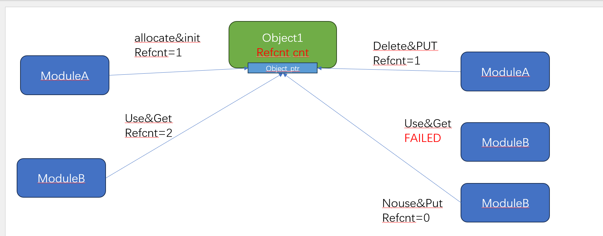

## 引用计数

```json
"node" {
    "label": "refcount",
    "categories": ["foundation"],
    "info": "refcount",
    "depends": []
}
```

首先必须要先解释一下引用计数：`refcnt`, 这是编程模型常用的一个概念，引用计数主要使用在这个场景之下:

A模块管理着一个内部对象(object), 该对象的申请肯定是A模块去管理的，更加具体一点，比如创建一个线程，
同时会创建出一个 线程对象(`thread_object`), 那么 线程退出销毁 通常我们会认为 该线程对象应该被释放；

但是往往线程退出的时候，线程不一定能够被释放，比如当线程退出的时候，用户正在更新线程的name，也就是说线程退出的时候，可能同步并发还有其他人在使用，很多人到这个时候，就会说，同步应该用锁啊。我们在思考一下，

这个场景并不是说我有竞争，只是说我还在使用这个资源，其他人不能释放，否则会访问非法，用锁的代价是不是太大了一些？

总结一下，引用计数是用来表示 资源(对象) 是否有人在使用，保证资源不会被在有人使用的情况下被释放，保证资源是 **可访问的**(不等于是有效的)， 资源释放的动作需要当引用计数减为0之后，才能释放

引用计数的使用一般需要配合一个外部锁保护状态(比如资源正在释放的时候，保证此时该资源不能够在被其他人申请到)



上图是引用计数的常规使用方法:

- 当资源内存申请成功，引用计数第一次初始化为1
- 如果有人使用该资源(资源指针的有效由模块内部保证), 对引用计数加1
- 不使用该资源的时候，通过减少引用计数，如果引用计数为0触发释放动作

这里仍然需要强调一下：引用计数只对内存有效性负责(防止 `use after free`),不对资源内容有效性做解释

### refcount

#### refcount_t

最底层的结构体，就是一个原子变量计数

```c
typedef struct refcount_struct {
    atomic_t refs;       
} refcount_t; 
```

#### REFCOUNT_INIT

静态初始化宏

```c
#define REFCOUNT_INIT(n)        { .refs = ATOMIC_INIT(n), }
```

#### refcount_set(read)

基本的读写接口

```c
  static inline void refcount_set(refcount_t *r, int n)
  {
          atomic_set(&r->refs, n);
  }
  static inline unsigned int refcount_read(const refcount_t *r)
  {
          return atomic_read(&r->refs);
  }
```

#### refcount_dec_and_test

```c
static bool refcount_dec_and_test(refcount_t *r)
```

引用计数递减1 ，并且检查是否需要释放内存(引用计数递减之前是否为1) 

- 如果dec之前`==1`，返回true

- 如果dec之前 `<0` 或者 减完之后 `<0` 发生了溢出，可能发生`UAF`（递减之前内存可能已经释放）

#### refcnt_dec_not_one

在`refcnt != 1`的时候才`dec`,否则什么都不做

```c
bool refcount_dec_not_one(refcount_t *r);
```

一般配合数据结构一起使用，见 **带锁API*

#### refcount_inc

```c
 static inline void refcount_inc(refcount_t *r)
```

引用计数递增1 ，并且检查是否有溢出

- 原来的值 `old>0`,但是`old + i < 0`  说明发生了溢出 可能发生内存泄漏

- 原来的值 `old == 0`, 申请的内存可能已经释放, 可能发生`UAF`

#### 饱和设计原则

 不同于简单的原子变量的操作(读写)，引用计数提供了额外的机制，用于降低溢出问题引入的更加严重的问题

如果我们要保证不会出现溢出，我们应该怎么做？

```c
r = REFCOUNT_INIT(1)

task1: 
int old =  atomic_fetch_add(r); // old  shoud always > 0
// 可能发生了什么？
if old == 0 {
    // old = 0, 内存可能已经释放 , 继续使用内存，可能发生 UA
}

if old < 0  || old + i < 0  {
   // 隐含以下几种情况 
   // 原来的值 old < 0，
   // 原来的值 old>0,但是old + i < 0; 说明发生了溢出 可能发生内存泄漏
}

task2:
int old =  atomic_fetch_sub(r);
// should always >=1
if old <= 1 {
    // 由于没有达到释放条件(==1)，可能会造成内存泄漏 
}
```

直接`panic`,还是打印告警？ 再生产环境，我们通常都是打印 日志即可，显而易见，仅仅通过打印日志，根本无法阻止问题，我们看一个这个场景： 

```c
refcont i = 1;
if refcount_dec_and_test(i) {
    free(mem)
}
```

考虑边界条件，就算是出问题了，但是 如果`refcont`反复再 临界区横跳，可能会进一步加剧问题(资源不断的申请 释放)，所以提出了饱和策略，他可以适当降低问题的进一步扩大；

当发生溢出时，把refcont 设置在一个距离溢出边界比较远，并且无效的值

已经知道，有符号数和无符号数的最大值

```
0 ----------------- 0x7fff_ffff -------------- 0xffff_ffff
                          <--------bad value! ------->
```

超过有符号数之后的值，我们都认为是无效的(**refcnt < 0** )

所以，当发生溢出时， 不断调整refcnt 为 下面的值

```c
REFCOUNT_SATURATED = INT_MIN / 2
```

这样，我们该引用计数关联的内存 不太可能出现被频繁释放和申请的情况，可以一直把 问题第一现场 和内存固定

#### 带有锁的API

```c
  extern __must_check bool refcount_dec_and_mutex_lock(refcount_t *r, struct mutex *lock) __cond_acquires(lock);
  extern __must_check bool refcount_dec_and_lock(refcount_t *r, spinlock_t *lock) __cond_acquires(lock);
  extern __must_check bool refcount_dec_and_lock_irqsave(refcount_t *r,
                                                         spinlock_t *lock,
                                                         unsigned long *flags) __cond_acquires(lock);
```

为什么需要这些API ？下面代码我给出了引用计数常用的场景

```c
module A:
struct Ojbect {
    refcont_t ref;
    int obj_val; 
}
static mutex  list_lock;
static object_list = *head;

void free_obj(struct Object *obj) {
    list_remove(obj);
    free(obj);
}

struct Object *find_obj() {
     //遍历  list 找到一个特定条件的obj
}

struct  Object  *alloc_obj(struct Object *obj) {
     struct object *obj = malloc();
     refcount_set(obj->ref, 1);
     list_add(obj)
}

struct  Object *get_special_object() {
    mutex_lock(&list_lock);
    obj = find_obj();
    if obj == null {
        obj = alloc_obj();
    }
    mutex_unlock(lock);
    return obj;
}

int put_object(struct Object *obj) {
    if refcnt_dec_not_one(&obj->ref) 
    //递减前，值不为1，计数减一 直接返回
        return 0;
    // need remove  object
    mutex_lock(&list_lock);
    // 递减后 值不为0，直接返回(可能中间有人又已经get)
    if !refcount_dec_and_test(&obj->ref) {
          mutex_unlock(lock);
          return 0;
    }
    // 递减后，值为0，持锁释放资源 
    free_obj(obj);
}
```

这个示例希望说明这几个问题： 

- `refcnt` 用来表示资源是否仍然被使用，以及何时应该释放资源

- 资源的**增删改查**等行为，一般都需要额外的保护

- `refcnt`用来表示资源指针被几个地方使用，保证在使用期间，该内存是有效不会被释放

因此，如果要对资源进行`增删改查` 则必须要保证 原子操作本身是有锁保护的，考虑下面情况,如果不上锁

```c
if refcount_dec_and_test(r) {
      //虽然上一句说明当前引用计数已经减为0;但是在这里，资源还有可能被引用
      mutex_lock();
      // 此使资源释放，会有可能造成UAF
      delete_obj()
      mutex_unlock();
}
```
