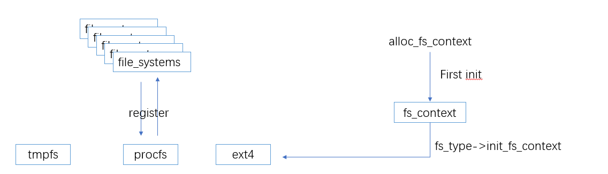
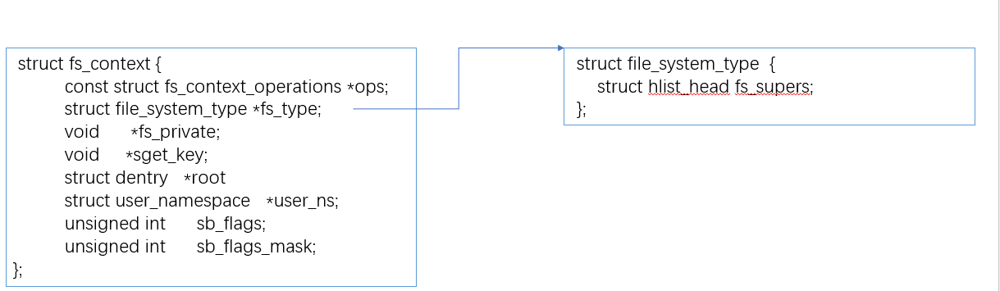

## fs context

```json
"node" {
    "label": "fs_context",
    "categories": ["fs"],
    "info": "fs context",
    "depends": [
        "fs_type",
        "fc_log"
    ]
}
```

### 介绍

`fs context` 主要用于`mount`一个文件系统时，保存`mount`阶段的上下文.   挂载完成之后就可以释放掉，因此他是一个临时过程性的结构体，通过此上下文，完成各个文件系统 `mount`配置



因此 `fs_context` 一定归属于某个文件系统



### 设计实现

#### struct fs_context

此结构体主要内容都是 `mount`阶段可能需要用到的配置，具体每个字段的使用和功能，我们在`vfs mount` 章节涉及到在详细解释

```c
  struct fs_context {
          const struct fs_context_operations *ops;
          struct mutex            uapi_mutex;     /* Userspace access mutex */
          struct file_system_type *fs_type;
          void                    *fs_private;    /* The filesystem's context */
          void                    *sget_key;
          struct dentry           *root;          /* The root and superblock */
          struct user_namespace   *user_ns;       /* The user namespace for this mount */
          struct net              *net_ns;        /* The network namespace for this mount */
          const struct cred       *cred;          /* The mounter's credentials */
          struct p_log            log;            /* Logging buffer */
          const char              *source;        /* The source name (eg. dev path) */
          void                    *security;      /* LSM options */
          void                    *s_fs_info;     /* Proposed s_fs_info */
          unsigned int            sb_flags;       /* Proposed superblock flags (SB_*) */
          unsigned int            sb_flags_mask;  /* Superblock flags that were changed */
          unsigned int            s_iflags;       /* OR'd with sb->s_iflags */
          enum fs_context_purpose purpose:8;
          enum fs_context_phase   phase:8;        /* The phase the context is in */
          bool                    need_free:1;    /* Need to call ops->free() */
          bool                    global:1;       /* Goes into &init_user_ns */
          bool                    oldapi:1;       /* Coming from mount(2) */
          bool                    exclusive:1;    /* create new superblock, reject existing one */
  }; 
```

文件系统有关的字段有： 

- fs_type: 指向`fs_context` 属于的文件系统

- fs_private： 保存文件系统 `mount`过程的私有数据

- ops：  指向各个文件系统 对`fs_context`的操作

- root:  文件系统的根目录，通过`ops->get_tree` 需要完成根目录的初始化

上述字段 应该由 各个文件系统 完成初始化

`fs_context_operations` 由各文件系统提供，抽象出了 不同文件系统 对于`fs_context` 的操作

```c
  struct fs_context_operations {
          //用于释放 fs_context 中文件系统的私有数据 
          void (*free)(struct fs_context *fc);
          int (*dup)(struct fs_context *fc, struct fs_context *src_fc);
          // 文件系统完成 mount 单个参数配置
          int (*parse_param)(struct fs_context *fc, struct fs_parameter *param);
          // 文件系统用于mount参数配置
          int (*parse_monolithic)(struct fs_context *fc, void *data);
          // 由各个文件系统负责完成 fc->root的初始化
          int (*get_tree)(struct fs_context *fc);
          // remount 重新配置fs context 
          int (*reconfigure)(struct fs_context *fc);
  };
```

#### alloc_fs_context

alloc_fs_context负责完成最基本的`fs_context`内存申请和初始化，并会尝试调用对应` fs_type -> init_fs_context`进行再次初始化

```c
struct fs_context *alloc_fs_context(
    struct file_system_type *fs_type,
    struct dentry *reference,
    unsigned int sb_flags,
    unsigned int sb_flags_mask,
    enum fs_context_purpose purpose)
```

由 `alloc_fs_context`负责基本初始化的字段有

```c
  struct fs_context {
     purpose;
     sb_flags;    
     sb_flags_mask = 0 ; 
     fs_type = fs_type;
     cred = current->cred;    
     net_ns = get_net(current->nsproxy->net_ns);      
     log.prefix = fs_type->name;            
     mutex_init(uapi_mutex);
     need_free = true;
  }
```

其中 根据不同的 `purpose` 在不同情况有细微差别 。比如在`remount` 流程中，会直接复用原有根目录

```c
FS_CONTEXT_FOR_MOUNT
fc->user_ns = get_user_ns(fc->cred->user_ns);

FS_CONTEXT_FOR_SUBMOUNT
fc->user_ns = get_user_ns(reference->d_sb->s_user_ns);

atomic_inc(&reference->d_sb->s_active);
fc->user_ns = get_user_ns(reference->d_sb->s_user_ns);
fc->root = dget(reference);
```

#### API: fs_context_for_mount

为文件系统`第一次` 创建 `fs_context` 上下文

```c
struct fs_context *fs_context_for_mount(struct file_system_type *fs_type,
                                          unsigned int sb_flags)
  {
     return alloc_fs_context(fs_type, NULL, sb_flags, 0,
          FS_CONTEXT_FOR_MOUNT);
}
```

 主要体现： 

- purpose =  FS_CONTEXT_FOR_MOUNT；

- sb_flags =  sb_flags；

- sb_flags_mask = 0

- user_ns= get_user_ns(fc->cred->user_ns);

#### API: fs_context_for_submount

申请一个新的`fc_context`用于`submount`

 体现在 `user_ns`从父进程继承：

- purpose =  FS_CONTEXT_FOR_SUBMOUNT ；

- sb_flags = 0  思考 why?

- sb_flags_mask = 0 思考 why ？

- user_ns= get_user_ns(reference->d_sb->s_user_ns);

#### API: fs_context_for_reconfigure

```c
  struct fs_context *fs_context_for_reconfigure(struct dentry *dentry,
                                          unsigned int sb_flags,
                                          unsigned int sb_flags_mask)
  {
          return alloc_fs_context(dentry->d_sb->s_type, dentry, sb_flags,
                                  sb_flags_mask, FS_CONTEXT_FOR_RECONFIGURE);
  }               
```

申请一个`fc_context`用于`remount`

 从已有的`dentry` 进程继承：

- purpose = FS_CONTEXT_FOR_RECONF ；

- user_ns= get_user_ns(reference->d_sb->s_user_ns);

- fc->root = dget(reference);

- atomic_inc(&reference->d_sb->s_active);

#### API: put_fs_context

`fs_context`资源释放，检查并释放`fs_context`包含涉及到的资源

```c
  void put_fs_context(struct fs_context *fc)
  {
          struct super_block *sb;
          // dentry root put 
          if (fc->root) {
                  sb = fc->root->d_sb;
                  dput(fc->root);
                  fc->root = NULL;
                  deactivate_super(sb);
          }
          // 回调各个文件系统的资源清理
          if (fc->need_free && fc->ops && fc->ops->free)
                  fc->ops->free(fc);
          // 安全相关参数的释放
          security_free_mnt_opts(&fc->security);
          // 其他相关资源引用释放
          put_net(fc->net_ns);
          put_user_ns(fc->user_ns);
          put_cred(fc->cred);
          put_fc_log(fc);
          put_filesystem(fc->fs_type);
          // 内存释放
          kfree(fc->source);
          kfree(fc);
  }
```

### 其他子系统

#### fc_log

`fc_log` 是`fs_context` 在mount 阶段提供的日志缓冲机制 ,参考`fc_log` 章节 

#### fs_parser

`fs_parser` 是`fs_context` 在mount 阶段提供的日志缓冲机制 ,参考`fc_log` 章节
