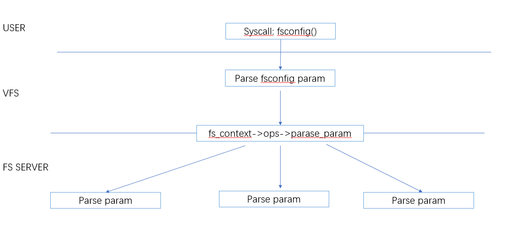

## FS  parser

```json
"node" {
    "label": "fs_parser",
    "categories": ["fs"],
    "info": "FileSystem config param parser",
    "depends": [
        "fc_log",
        "fs_context"
    ]
}
```

### 介绍

本小节围绕  文件系统是如何对外部提供  `mount` 配置能力的

`FS`通过一套统一的机制`fs param`，为所有文件系统服务提供了 挂载配置能力

本小节是`vfs  mount  config`的第一个小节，讲解最底部的`fs server` 实现`parse param` 的细节



### Parser Param

任何类似的参数解析模块设置，总是绕不开三个核心步骤：

- 参数的定义。比如`static int enableflag`，一般可以定义为：`keyname = enableflag`, `value = int（0，1）`

- 传入参数的格式，可以是简单的字符串`enableflag=1` 也可以是 结构体

- 传入参数和参数定义的匹配 、设置

#### struct  fs_parameter_spec

此结构体用于定义 文件系统的参数

```c
  struct fs_parameter_spec {
      const char              *name;  
      fs_param_type           *type;  /* The desired parameter type */
      u8                      opt;    /* Option number (returned by fs_parse()) */
      unsigned short          flags;
      #define fs_param_neg_with_no    0x0002  /* "noxxx" is negative param */
      #define fs_param_can_be_empty   0x0004  /* "xxx=" is allowed */
      #define fs_param_deprecated     0x0008  /* The param is deprecated */
       const void              *data;
  };
```

- name： 显而易见是参数名称

- type:  `name`匹配后用于解析参数value的回调函数

- opt:  参数匹配成功的返回值，一般会用一个`enum` ,具体见`fs parse`实现

- flags: 参数额外标记

- data: 用于给参数解析提供额外的信息

#### struct fs_parameter

此结构体抽象定义 不同类型传入参数的实现

```c
   /*
   * Type of parameter value.
   */
  enum fs_value_type {
          fs_value_is_undefined,
          fs_value_is_flag,               /* Value not given a value */
          fs_value_is_string,             /* Value is a string */
          fs_value_is_blob,               /* Value is a binary blob */
          fs_value_is_filename,           /* Value is a filename* + dirfd */
          fs_value_is_file,               /* Value is a file* */
  };
 /*
   * Configuration parameter.
   */     
  struct fs_parameter {
          const char              *key;           /* Parameter name */
          enum fs_value_type      type;         /* The type of value here */
          union {
                  char            *string;
                  void            *blob;
                  struct filename *name;
                  struct file     *file;
          };      
          size_t  size;
          int     dirfd; 
  }; 
```

#### struct  fs_parse_result

```c
  /*
   * Result of parse.
   */
  struct fs_parse_result {
     bool                    negated;        /* T if param was "noxxx" */
     union {
       bool            boolean;        /* For spec_bool */
       int             int_32;         /* For spec_s32/spec_enum */
       unsigned int    uint_32;        /* For spec_u32{,_octal,_hex}/spec_enum */
       u64             uint_64;        /* For spec_u64 */
       kuid_t          uid;
       kgid_t          gid;
     };      
  };      
```

此结构体用于`fs_parse`的结果保存 

- negated/boolean : 类型为`flag`的值，`true/false` 表示`flag`是否设置

#### fs_lookup_key

`fs_lookup_key]()`的实现 主要在于 遍历`parameter_spec` ,找到 可以和`param` match的 `spec`

```c
struct fs_parameter_spec *fs_lookup_key(
   const struct fs_parameter_spec *desc,
   struct fs_parameter *param, bool *negated)
  {
          const struct fs_parameter_spec *p, *other = NULL;
          const char *name = param->key;
          bool want_flag = param->type == fs_value_is_flag;

          *negated = false;
          for (p = desc; p->name; p++) {
                  if (strcmp(p->name, name) != 0)
                          continue;     
                  if (likely(is_flag(p) == want_flag))
                          return p;
                  other = p;
          }
          if (want_flag) {
                  if (name[0] == 'n' && name[1] == 'o' && name[2]) {
                          for (p = desc; p->name; p++) {
                                  if (strcmp(p->name, name + 2) != 0)
                                          continue;
                                  if (!(p->flags & fs_param_neg_with_no))
                                          continue;
                                  *negated = true;
                                  return p;
                          }
                  }
          }
          return other;
  }
```

- 入参 desc :  待遍历的`spec`

- 入参 param ： 被解析的输入参数

- negated : 参数是否为`noxxxx`并且 `spec`    `disable`

`param.key == spec.name` 的情况:

- `param->type`value is flag ，`spec->type = NULL` 成功
- `param->type` value isn't flag， `spec->type != NULL` 成功
- `flag` 不匹配, 也会返回

如果`param->type = value_is_flag`  ,二次判断`param->key`是否以`noxxxx`开头，依然会匹配`param.key == spec.name` 的情况 :

- 额外判断 `spec->flags`是否设置 `fs_param_neg_with_no` ,如果设置 匹配成功,返回

#### __fs_parse

```c
  int __fs_parse(struct p_log *log,
               const struct fs_parameter_spec *desc,
               struct fs_parameter *param,
               struct fs_parse_result *result)
```

入参： 

- desc： `param` 匹配的`spec`数组

- param: 需要解析的入参

- result: 解析结果

返回值：

- -ENOPARAM/-EINVAL  不存在参数/参数类型匹配不正确

- OPT：返回匹配成功的`spec->opt`

#### 预置类型宏

系统内置实现了多种`fs_parameter_spec->type`的定义 

```c
 fs_param_type fs_param_is_bool, fs_param_is_u32, fs_param_is_s32, fs_param_is_u64,
          fs_param_is_enum, fs_param_is_string, fs_param_is_blob, fs_param_is_blockdev,
          fs_param_is_path, fs_param_is_fd, fs_param_is_uid, fs_param_is_gid;
```

 主要用于为下面的宏提供type 回调实现

```c
 #define fsparam_bool(NAME, OPT) __fsparam(fs_param_is_bool, NAME, OPT, 0, NULL)
 ...
 #define fsparam_enum(NAME, OPT, array)  __fsparam(fs_param_is_enum, NAME, OPT, 0, array) 
```

`param` 和  `spec->type`处理的对应关系

| fs_parameter_spec.type                                                                    | fs_parameter.type                          | fs_parameter.value                                                                                             | fs_parse_result                  |
| ----------------------------------------------------------------------------------------- | ------------------------------------------ | -------------------------------------------------------------------------------------------------------------- | -------------------------------- |
| fs_param_is_bool: 解析param.string 到  result                                                | fs_value_is_string                         | param.string <br>“0”： false <br>“1”: true <br> “false”: false <br>“true”: true <br>“yes”: true <br>“no”: false | result.boolean                   |
| fs_param_is_u32 <br>fs_parameter_spec.data 表示进制(0,8,16);<br>解析param.string 到  result      | fs_value_is_string                         | param.string <br>“123“ 十进制<br>"0x" 十六机制<br>”0xxx“ 8 进制                                                         | result.uint32                    |
| fs_param_is_s32:解析param.string 到  result                                                  | fs_value_is_string                         | param.string<br>“-123“ 有符号数 <br>                                                                               | result.int32                     |
| fs_param_is_u64:解析param.string 到  result                                                  | fs_value_is_string                         | param.string <br>“123“  <br>                                                                                   | result.uint64                    |
| fs_param_is_enum<br>fs_parameter_spec.data 存储字符串和  enum的对应关系 <br>解析param.string 到  result | fs_value_is_string                         | param.string <br>“never“：  SHMEM_HUGE_NEVER <br><br>“always“：  SHMEM_HUGE_ALWAYS<b                             | result.uint32                    |
| fs_param_is_string: 仅判断 `param.type`一致性                                                   | fs_value_is_string                         | param.string <br>                                                                                              | NA                               |
| fs_param_is_blob: 仅判断 `param.type`一致性                                                     | fs_value_is_blob                           | param.blob                                                                                                     | NA                               |
| fs_param_is_blockdev: 什么都不做                                                               | fs_value_is_string<br>fs_value_is_filename | param.string<br>param.name                                                                                     | NA                               |
| fs_param_is_path：什么都不做                                                                    | 不限制                                        | 不限制                                                                                                            | NA                               |
| fs_param_is_fd：解析param.string 到  result<br>解析param.dirfd 到  result                        | fs_value_is_string <br>fs_value_is_file    | param.string<br>param.dirfd/param.file                                                                         | result.uint32                    |
| fs_param_is_uid:解析 param.string 到  result                                                 | fs_value_is_string                         | param.string <br>“123“ 十进制<br>                                                                                 | result.uid                       |
| fs_param_is_gid：解析 param.string 到  result                                                 | fs_value_is_string                         | param.string <br>“123“ 十进制<br>                                                                                 | result.gid                       |
| fs_param_is_file_or_string: param.string 不处理， param.is_file 解析 param.dirfd 到  result      | fs_value_is_string <br>fs_value_is_file    | param.string<br> param.dirfd/param.file                                                                        | fs_value_is_file: result.uint_32 |
| NULL                                                                                      | NA                                         | 没有值的参数                                                                                                         | result.boolean<br>result.negated |

### 使用介绍

通过上一小节的介绍，我们了解了 `param` 以及 spec，以及  `fs_parse` 是如何解释他们俩的具体关系的,本节给出一个具体的使用说明 

我们随机挑选一个文件系统看他是如何使用的

#### 定义参数

首先需要定义文件系统支持的配置参数

```c
    enum ovl_opt {
          Opt_lowerdir,
          Opt_lowerdir_add,
          Opt_datadir_add,
          Opt_upperdir,   
          Opt_workdir,    
          Opt_default_permissions,
          Opt_redirect_dir,
          Opt_index,
          Opt_uuid, 
          Opt_nfs_export,
          Opt_userxattr,
          Opt_xino,
          Opt_metacopy,
          Opt_verity,
          Opt_volatile,
  };   

  const struct fs_parameter_spec ovl_parameter_spec[] = {
          fsparam_string_empty("lowerdir",    Opt_lowerdir),
          fsparam_string("lowerdir+",         Opt_lowerdir_add),
          fsparam_string("datadir+",          Opt_datadir_add),
          fsparam_string("upperdir",          Opt_upperdir),
          fsparam_string("workdir",           Opt_workdir),
          fsparam_flag("default_permissions", Opt_default_permissions),
          fsparam_enum("redirect_dir",        Opt_redirect_dir, ovl_parameter_redirect_dir),
          fsparam_enum("index",               Opt_index, ovl_parameter_bool),
          fsparam_enum("uuid",                Opt_uuid, ovl_parameter_uuid),
          fsparam_enum("nfs_export",          Opt_nfs_export, ovl_parameter_bool),
          fsparam_flag("userxattr",           Opt_userxattr),
          fsparam_enum("xino",                Opt_xino, ovl_parameter_xino),
          fsparam_enum("metacopy",            Opt_metacopy, ovl_parameter_bool),
          fsparam_enum("verity",              Opt_verity, ovl_parameter_verity),
          fsparam_flag("volatile",            Opt_volatile),
          {}
  };
```

#### 参数解析

一下文件系统需要定义的参数解析的实现 

```c
static int ovl_parse_param(struct fs_context *fc, struct fs_parameter *param)
  {
          int err = 0;
          struct fs_parse_result result;
          struct ovl_fs *ofs = fc->s_fs_info;
          struct ovl_config *config = &ofs->config;
          struct ovl_fs_context *ctx = fc->fs_private;
          int opt;

              opt = fs_parse(fc, ovl_parameter_spec, param, &result);
          if (opt < 0)
                  return opt;

          switch (opt) {
          case Opt_lowerdir:
                  err = ovl_parse_param_lowerdir(param->string, fc);
                  break;
          case Opt_lowerdir_add:
          case Opt_datadir_add:
          case Opt_upperdir:
          case Opt_workdir:
                  err = ovl_parse_layer(fc, param->string, opt);
                  break;
          //省略部分代码
          case Opt_userxattr:
                  config->userxattr = true;
                  break;
          default:
                  pr_err("unrecognized mount option \"%s\" or missing value\n",
                         param->key);
                  return -EINVAL;
          }
          return err;
  }
```

各个文件系统的实现思路都是类似的，但是具体配置内容由各个文件系统自行根据需要实现

统一的流程如下： 

- 首先通过`fs_parse` 对参数进行解析

- 根据解析结果，针对不同参数执行不同的处理 

#### 回掉函数注册

如果文件系统提供了参数设置的能力，需要把上一个小节实现的参数解析函数 注册在`fs_context_options` 上，具体注册位于`fs_context_init`实现中 ，这一部分可以具体参考`fs context`的实现

#### procfs 参数读取

`supoer block`  中提供了一个回调函数 `super_operations->show_options()` 各个文件系统可以通过实现此回调函数，从而可以实现通过 读取`/proc/mounts/xxx`  显示当前文件系统配置
