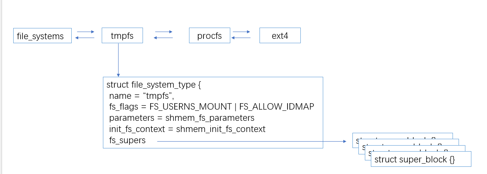

## File system type

```json
"node" {
    "label": "fs_type",
    "categories": ["fs"],
    "info": "FileSystem type",
    "depends": [
        "fs_context",
        "super_block"
    ]
}
```

### 介绍

文件系统是fs的核心，代表不同 `fs`的具体实现



### 用户态

#### proc show

可以通过以下命令查看当前系统支持 已经注册的`filesystems`

```shell
# cat /proc/filesystems
```

```shell
root@localhost:~# cat /proc/filesystems 
nodev    sysfs
nodev    tmpfs
nodev    bdev
nodev    proc
nodev    cgroup
nodev    cgroup2
nodev    cpuset
nodev    devtmpfs
nodev    configfs
nodev    debugfs
nodev    tracefs
nodev    securityfs
nodev    sockfs
nodev    bpf
nodev    pipefs
nodev    ramfs
nodev    hugetlbfs
nodev    rpc_pipefs
nodev    devpts
    ext3
    ext4
    ext2
    squashfs
    vfat
nodev    nfs
nodev    nfs4
nodev    autofs
nodev    9p
nodev    efivarfs
nodev    mqueue
nodev    pstore
```

### 内核实现

#### struct file_system_type

内核抽象所有的文件系统类为 ： `struct file_syste_type`

```c
struct file_system_type {
          const char *name;
          int fs_flags;
  #define FS_REQUIRES_DEV         1 
  #define FS_BINARY_MOUNTDATA     2
  #define FS_HAS_SUBTYPE          4
  #define FS_USERNS_MOUNT         8       /* Can be mounted by userns root */
  #define FS_DISALLOW_NOTIFY_PERM 16      /* Disable fanotify permission events */
  #define FS_ALLOW_IDMAP         32      /* FS has been updated to handle vfs idmappings. */
  #define FS_RENAME_DOES_D_MOVE   32768   /* FS will handle d_move() during rename() internally. */
          int (*init_fs_context)(struct fs_context *);
          const struct fs_parameter_spec *parameters;
          struct dentry *(*mount) (struct file_system_type *, int,
                         const char *, void *);
          void (*kill_sb) (struct super_block *);
          struct module *owner;
          struct file_system_type * next;
          struct hlist_head fs_supers;

          struct lock_class_key s_lock_key;
          struct lock_class_key s_umount_key;
          struct lock_class_key s_vfs_rename_key;
          struct lock_class_key s_writers_key[SB_FREEZE_LEVELS];

          struct lock_class_key i_lock_key;

          struct lock_class_key i_lock_key;
          struct lock_class_key i_mutex_key;
          struct lock_class_key invalidate_lock_key;
          struct lock_class_key i_mutex_dir_key;
  };
```

涉及到的比较重要的字段为：

- name: fs 的 `type name`

- next: `node 节点`

- owner: `fs` 所属的`module`

- fs_flags: 标识文件系统的 具备的特质
  
  - FS_REQUIRES_DEV : 标识文件系统是否具有有真实设备驱动的文件系统，比如`procfs`ramfs 不属于此类型
  - FS_BINARY_MOUNTDATA ： 文件系统挂载 使用 二进制格式 极少使用(`btrfs` `coda`， `nfs`)
  - FS_HAS_SUBTYPE :支持子类型文件系统 极少使用(`fuse fs`)
  - FS_USERNS_MOUNT ： 文件系统不支持在用户命名空间权限下挂载 大部分情况支持
  - FS_DISALLOW_NOTIFY_PERM:  文件系统不支持 监控事件
  - FS_ALLOW_IDMAP： 文件系统是否支持 ID 挂载映射 (相同的文件系统 被挂载到不同的用户，典型的使用场景有容器，不同容器的  root 0 用户，对应到host 实际上属于不同的用户，但是相对于容器 他希望看到的是 当前的root用户)
  - FS_RENAME_DOES_D_MOVE：文件系统是否支持重命名 如果不支持，将会使用 `move` 替换 `rename`，大多数网络文件系统需要

- fs_supers : 当前文件系统上 已经挂载的所有文件系统实例(`super_block`)

- init_fs_context : 各个文件系统对于`mount  context`的个性化需求

就结构体而言`fs_type` 主要关联的对象有`fs context` `super block` 但是实际上，有关`inode` `file`的具体操作 也应该是由 文件系统提供

#### file_systems

FS 全局维护一个静态的链表，维护系统当前已经注册的所有文件系统的类型

`linux/fs/filesystems.c`

```c
 static struct file_system_type *file_systems;
```

#### API: (un)register_filesystem

注册和取消注册接口

```c
  int register_filesystem(struct file_system_type * fs)
  int unregister_filesystem(struct file_system_type * fs)
```

功能比较简单，遍历`file_systems` 链表，然后挂载或者取下 `fs->name` 完全相同的节点

#### API ：get_fs_type

```c
  struct file_system_type *get_fs_type(const char *name)
```

利用`type name` 查找并获取具体 `fs`和引用计数

比如可以通过`get_fs_type("proc")`获取 `proc`的 `filesystem type`

#### procfs 注册

```c
  static int __init proc_filesystems_init(void)
  {       
          proc_create_single("filesystems", 0, NULL, filesystems_proc_show);
          return 0;
  }
```
