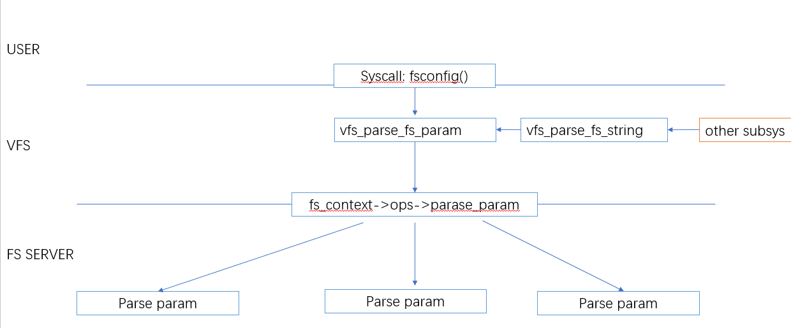

## vfs mount  config

```json
"node" {
    "label": "vfs config",
    "categories": ["fs"],
    "info": "filesystem config",
    "depends": [ 
       "fs_parser",
       "fs_context"
    ]
}
```

### 介绍



回顾 `fs parser` 一节，我们已经知道了 `fs server` 是如何定义`param spec` 以及如何解析 `param` ，本节主要围绕上层是如何实现或者是如何调用对应 文件系统的`param_parse`的

### API 介绍

#### API：  vfs_parse_fs_param

```c
int vfs_parse_fs_param(struct fs_context *fc, struct fs_parameter *param)
```

此接口最为重要，是`VFS` 这一层对外提供的核心接口 ,我们讨论过 各个文件系统 可以定义自己的`param` ，实际上，在`vfs` 这一侧，还有一些`comman param` 是被认为所有文件系统都应该具备的，因此会被放在公共解析函数处理 

```c
int vfs_parse_fs_param(struct fs_context *fc, struct fs_parameter *param)
  {
         //是否为 `super block 参数`
          ret = vfs_parse_sb_flag(fc, param->key);
         //是否属于文件系统安全参数
          ret = security_fs_context_parse_param(fc, param);
          // 是否属于 各个文件系统自己的参数
          if (fc->ops->parse_param) {
                  ret = fc->ops->parse_param(fc, param);
                  if (ret != -ENOPARAM)
                          return ret;
          }
          // 处理 `source` 参数
          ret = vfs_parse_fs_param_source(fc, param);
          return invalf(fc, "%s: Unknown parameter '%s'",
                        fc->fs_type->name, param->key);
  }
```

##### 

##### common flag: super block flag

文件系统的第一类公共配置  `vfs_parse_sb_flag` , 主要作用在于设置 文件系统的`fs_context->sb_flags`(可以参考 `fs_context` )

- sb_flags:建议的 super block 标志

- sb_flags_mask：被修改过的  Superblock flags

具体各个`flag` 的功能 参考`super block`

| key        |     | sb_flags         | sb_flags_mask  |     |
| ---------- | --- | ---------------- | -------------- | --- |
| dirsync    |     | SB_DIRSYNC       | SB_DIRSYNC     |     |
| lazytime   |     | SB_LAZYTIME      | SB_LAZYTIME    |     |
| mand       |     | SB_MANDLOCK      | SB_MANDLOCK    |     |
| ro         |     | SB_RDONLY        | SB_RDONLY      |     |
| sync       |     | SB_SYNCHRONOUS   | SB_SYNCHRONOUS |     |
|            |     |                  |                |     |
| async      |     | ~ SB_SYNCHRONOUS | SB_SYNCHRONOUS |     |
| nolazytime |     | ~SB_LAZYTIME     | SB_LAZYTIME    |     |
| nomand     |     | ~SB_MANDLOCK     | SB_MANDLOCK    |     |
| rw         |     | ~SB_RDONLY       | SB_RDONLY      |     |
|            |     |                  |                |     |

##### common param  : source

有一个公共的参数 `source` 也会被单独处理 ,  设置 `fs_context->source`

```c
  int vfs_parse_fs_param_source(struct fs_context *fc, struct fs_parameter *param)
  {
          if (strcmp(param->key, "source") != 0)
                  return -ENOPARAM;

          if (param->type != fs_value_is_string)
                  return invalf(fc, "Non-string source");

          if (fc->source)
                  return invalf(fc, "Multiple sources");

          fc->source = param->string;
          param->string = NULL;
          return 0;
  }
```

#### vfs_parse_fs_string

此接口入参为`string key 和 value`  负责封装一个`string param` 并完成参数设置

```c
 int vfs_parse_fs_string(struct fs_context *fc, const char *key,
                          const char *value, size_t v_size)
  {
          int ret;

          struct fs_parameter param = {
                  .key    = key,
                  .type   = fs_value_is_flag,
                  .size   = v_size,
          };
          if (value) {
                  param.string = kmemdup_nul(value, v_size, GFP_KERNEL);
                  param.type = fs_value_is_string;
          }
          ret = vfs_parse_fs_param(fc, &param);
          kfree(param.string);
          return ret;
  }
```

### syscall fsconfig

本小节在介绍一下 用户态 参数配置接口 ，系统调用接口 `fsconfig`

参考 [syscall manu](https://github.com/brauner/man-pages-md/blob/main/fsconfig.md)
