# ARM处理器支持

上一个小节，我们已经介绍了关于中断的一些实际需求场景和背景，也介绍了一些关于中断的术语和概念；

不同处理器中断设计基本符合我们上一个小节的内容，但是实际实现上都会又比较大的不同；

本小节，我们以ARM64芯片架构为例,探讨一下ARM64位的芯片和异常有关的部分的讨论

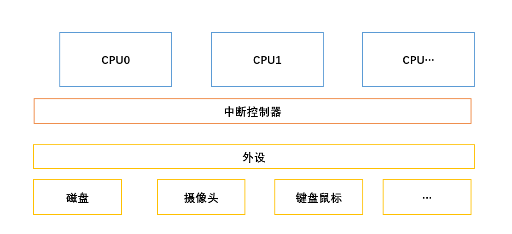

注意,本节这里目前只探讨单处理器的处理，下一个小节 我们探讨多处理器的模型 

## 特权和异常级别

有必要先了解ARM的特权和异常级别的基本概念

依然还是先抛出实际问题，现代软件按照抽象层次，目前有几种形式存在 

第一种, 单片机系统，只有一个程序(任务)运行在一个资源有限的MCU上，该任务可以访问所有硬件资源，任务不需要调度

第二种, 小型实时系统，可以运行多个任务在一个资源相对丰富的SOC上, 多个任务都可以访问所有硬件资源,任务采用绝对优先级调度

第三种, 通用系统,可以运行非常多个任务在一个资源相对丰富的SOC或者大型设备上, 任务根据功能被分为内核和用户态任务，用户态程序不可以
直接访问硬件资源,一般情况下，通过共享时间片的方式调度

第四种，虚拟化系统，虚拟化可以同时运行不同的系统(包括通用系统，实时系统、单片机系统)，任务根据功能被分为虚拟化任务、系统任务

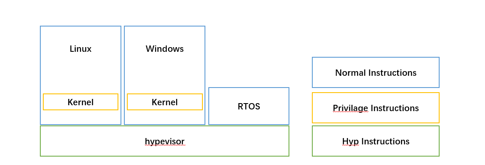

基于现代软件的分层，每个层级对系统和处理器资源的访问权限各不相同。操作系统内核和用户应用程序之间的分割就是一个例子。

操作系统需要执行一些我们不希望用户应用程序执行的操作。内核需要高度访问系统资源，而用户应用程序则需要有限的配置系统的能力。
**权限**决定了软件实体可以查看和控制哪些处理器资源。

AArch64 体系结构通过实施不同的权限级别实现了这种分割。

虽然划分了权限，但是不同层级的应用，要能够互相调用(CPU在同一时间下，只能够位于一个权限下)，当用户态程序调用一个类似`write_file()` 
的接口，为了能够成功把内容写入到硬件中(这里是磁盘)，AARCH64需要支持能够发生特权级的切换,这种切换在体系中称之为**中断(异常)的发生**

因此,只有当处理器发生异常或从异常中返回时，当前权限级别才会发生变化。因此，在 Arm 体系结构中，这些权限级别被称为**异常级别**

### 异常级别

AArch64 中特权的名称是 `Exception Level`，通常缩写为 `EL`。异常级别是有编号的，通常缩写为 `EL<x>`，其中 `<x> `
是 `0 `到 `3` 之间的数字。权限级别越高，数字越大。例如，最低权限级别称为 `EL0`。

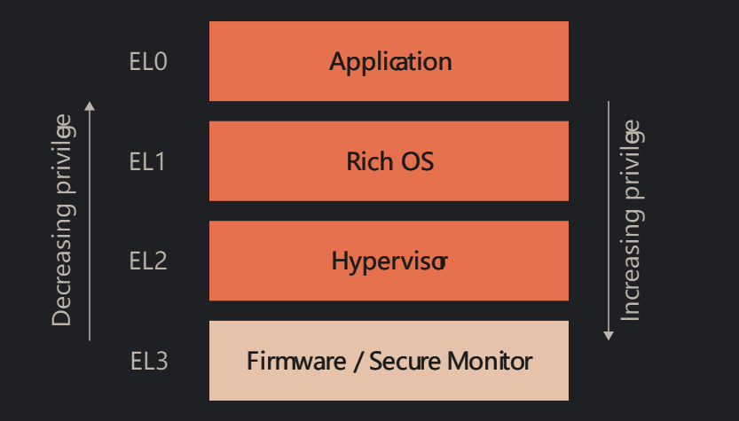

体系架构并未规定哪些软件使用哪个异常级别。常见的使用模式是在 `EL0` 运行应用程序代码，
在 `EL1` 运行丰富的操作系统（OS），如 Linux。虚拟化可使用 `EL2`，固件和安全网关代码使用 `EL3`。

异常级别可以在以下的情况发生切换: 

 - 触发一个异常(可以从低级别 进入 高级别)
 - 从异常处理程序返回到异常处理的地方(异常的返回)
 - 重启
 - 进入 Debug 模式
 
- 异常触发特权级的切换，只能从低特权级到高(或者相同)特权级切换 
- 异常返回只能从高特权级返回到低(或者相同)特权级，不能返回到更高的特权级
 
### 异常级别的资源访问
我们已经知道，不同特权级是为了：控制在不同资源下，程序可以访问的资源，处理器架构规定了: 能够被特权级控制访问的资源有: 

 - 内存系统
 - 处理器资源(包括寄存器、指令集等)

上面两种资源都会受当前程序运行的特权级限制

#### 内存访问控制
我们已经在内存子系统学习过有关MMU的内容，MMU除了可以控制虚拟内存到物理内存的映射之外，同时也支持配置内存的访问权限，ARM支持
有关内存的读写权限，以及特权级的访问控制

特权访问控制分为:  
 - 允许非特权访问和不允许非特权访问
 - 如果是特权访问，支持特权级别的进一步设置和检查
 
因此当处理器在 EL0 执行内存访问时，会根据非特权访问权限进行检查。但是在EL1、EL2 和 EL3 进行的内存访问则根据特权访问权限进行检查。

内存特权访问控制的设置，是在 MMU 的转换表进行编程的，因此必须考虑对转换表进行编程所需的权限。
MMU 配置存储在系统寄存器中，访问这些寄存器的能力也受当前例外级别的控制(处理器资源)

#### 寄存器访问控制
这样的描述可以在[网上](https://armv8-doc.readthedocs.io/en/latest/04.html#id6)  随处找到 
[还有这里](https://winddoing.github.io/post/7190.html)

我们可以把寄存器从功能上分为两类: 

 - 用于系统控制或状态报告的寄存器： 这些寄存器用于管理系统的各种状态和控制信息。
  它们可能包括处理器状态寄存器（PSR，Processor Status Register）、控制寄存器（Control Registers）、
  定时器和中断控制寄存器等，用于管理系统级别的状态和控制。
  
 - 用于指令处理的寄存器： 这些寄存器主要用于指令执行和数据处理。
   例如，通用寄存器（General-Purpose Registers）用于存储计算和数据操作过程中的临时值，包括累加器、数据寄存器等。

在不同特权模式下，处理器可能拥有自己级别的寄存器(根据需要)，举个例子: `VBAR_EL1` 和我们熟悉的`TTBR0_EL1`，可以看到这些寄存器一般
都会有一个`ELX`的后缀，代表该寄存器是在该特权级下的寄存器 

访问控制：低特权级无法访问高特权级的寄存器，高特权级可以根据需要访问低特权级的寄存器(情况比较少)

大部分的**系统寄存器**都不允许在`EL0`非特权级下访问 ,除了个别寄存器，因此可能不会看到 `xxxx_EL0`这样的寄存器

下表是我们在中断和异常的讨论学习中 会使用到的寄存器；需要加强记忆

#### 异常处理使用到的寄存器

| Register Name                      | Description                                                                                     |
|-----------------------------------|-------------------------------------------------------------------------------------------------|
| Exception Link Register (ELR_ELx) | 保留触发异常指令的 PC地址(svc)                                 |
| Exception Syndrome Register (ESR_ELx) | 异常触发的调用者可以用来存储有关异常的更多信息,比如异常原因、系统调用号                                    |
| Fault Address Register (FAR_ELx)  | 专门用于缺页异常，存储导致缺页异常的内存地址                                                              |
| Hypervisor Configuration Register (HCR_ELx) | 控制虚拟化设置 以及 EL2的异常捕获((更多细节稍后介绍)                           |
| Secure Configuration Register (SCR_ELx) | 控制安全状态设置以及  EL3的异常捕获(更多细节稍后介绍)                                         |
| System Control Register (SCTLR_ELx) |控制标准内存、系统设施，并提供已实现功能的状态信息  |
| Saved Program Status Register (SPSR_ELx) | 当进入**ELX**异常级别时  用于存储处理器发生异常之前的状态，                  |
| Vector Base Address Register (VBAR_ELx) |  当进入**ELX**异常级别时  保存异常基地址          |

## Excution and Security States
上一小节 我们简单介绍了 特权级的有关概念(why？ how? what?)  本小节和我们讲的异常处理可能关系不大 仅作为补充

### 执行状态

我们当然知道，**arm32**和**arm64** 属于两个不同的指令集，无论是寄存器或者指令上都不相同，但是就像在一台windows 64 bit机器上面，
我们可以安装**32bit** 也可以安装 **64bit**的程序，芯片架构一般都在更高级别的架构上 保留了对于低级别架构的兼容性

因此在 **64位**的机器上，需要做出这种区分.当然arm对于这种兼容也做出了约束 

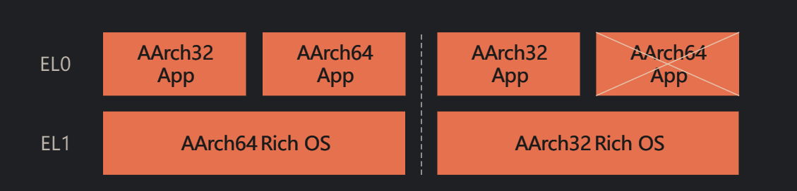

简而言之，就是: 
 - 当从较低的异常级别移动到较高的级别时，执行状态可以保持不变或更改为 AArch64。
 - 当从较高的异常级别移动到较低的级别时，执行状态可以保持不变或更改为 AArch32。

将这两个规则放在一起意味着 **64位**层可以托管 **32** 位层，但反之则不然。 

例如，64 位操作系统内核可以托管 **64 位**和** 32 位**应用程序，而 **32 位**操作系统内核只能托管 **32 位**应用程序。

该原则同样适用于虚拟化

### 安全状态

正如我们上一个小节观察到的，特权等级和执行状态属于架构的两个维度的描述,安全状态则是第三个维度的描述  

安全状态的来源：处于安全的诉求(在计算机世界主要是对于内存的访问、应用的隔离诉求) ，arm支持两种安全状态: 

 - secure state: 在这个模式下，CPU可以访问 **非安全** 以及 **安全**的寄存器以及物理内存
 - None secure state: 在这个模式下，CPU只允许访问 **非安全** 的寄存器以及物理内存

安全状态定义了可以访问哪些已实现的异常级别、当前可以访问哪些内存区域以及如何在系统内存总线上表示这些访问。 
如果处于Non-secure状态，则PE只能访问Non-secure物理地址空间。 在安全状态下，PE 可以访问安全和非安全物理地址空间。

下图是一个andriod 典型框架 操作系统（如安卓系统）运行在普通世界，
而支付或 DRM 系统运行在安全世界。我们需要对安全世界的系统有更高的信任度，
因此需要将它们分开，以保护支付详情和密钥等信息。拥有两种安全状态就能实现这种分离。

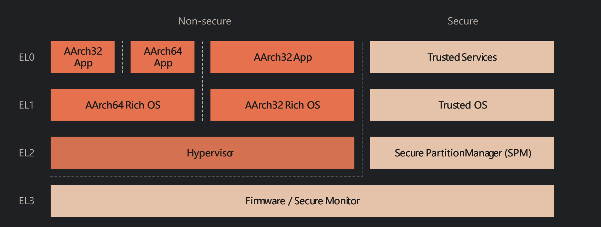

更多关于arm安全状态的说明参考: [TrustZone](https://developer.arm.com/documentation/102418/latest/)

安全状态的切换: 

如果实施了 TrustZone，那么处理器可以处于安全状态或非安全状态。这由 **SCR_EL3.NS** 位选择。

您可能已经注意到，EL3 处于 **安全状态**。EL3 是权限最高的异常级别，EL3 的安全状态是固定的。EL3 可以访问所有寄存器。

必须要在EL3 才可以切换 **SCR_EL3.NS**

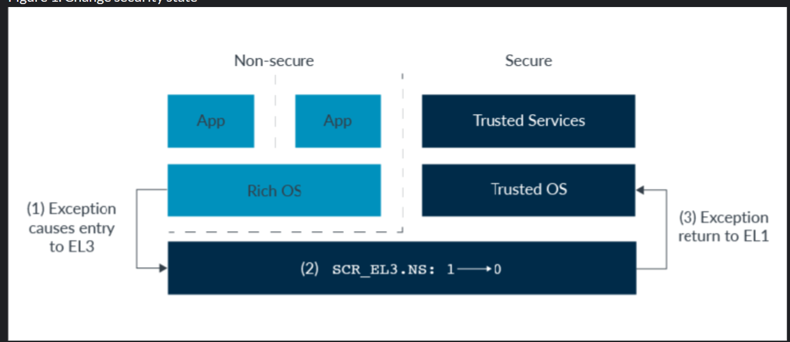

### 总结

| 特权级别                      | 执行状态                | 安全状态  |    应用类型               | 
|-----------------------------------|-----------------------------------|-------------|---------------|
| EL0      | ARM32(64)        | NS | 32（64）位上层普通应用  |
| EL0      | ARM32(64)        | Secure | 32（64）位上层安全应用  |
| EL1      | ARM64            | NS | 64位普通内核  |
| EL1      | ARM64            | Secure | 64位安全内核  |
| EL2      | ARM64            | NS | 64位虚拟化管理器 |
| EL2      | ARM64            | Secure | 64位安全虚拟化管理器 |
| EL3      | ARM64            | Secure | 64位安全监视器 |

虽然ARM实现了 EL2 EL3；但是是否使用该特权级别，取决于应用行为，但是无论如何，一个正常的操作系统 一定是要实现EL1的OS，至于EL0是否使用
也取决于OS实现机制，比如一个实时内核，可能只用到了EL1，类似Linux,一定会使用到EL0

## 异常

正如我们之前所讲，处于计算机世界中特定问题的需要，需要用到异常，而且我们通过本章的介绍，也已经知道了
有关于异常等级的一些概念

异常被广泛在如下场景中使用: 
 
  - 模拟外设
  - 虚拟内存管理
  - 捕获软件错误
  - 捕获硬件错误
  - 调试
  - 特权级别切换
  - 捕获中断事件
  - 安全状态之间切换

当出现异常时，处理器不是转到当前代码中的下一条指令，而是停止当前的执行，并分支到一段代码来处理请求。
这段代码被称为异常处理程序。一旦事件得到处理，执行程序就可以返回到原来的程序。每种异常类型都有自己的异常处理程序。
这在异常处理中有所说明。

无论哪种异常，无论是异步或者是同步异常，本质上都会产生上图的行为，打断正在执行的程序，处理异常，然后返回

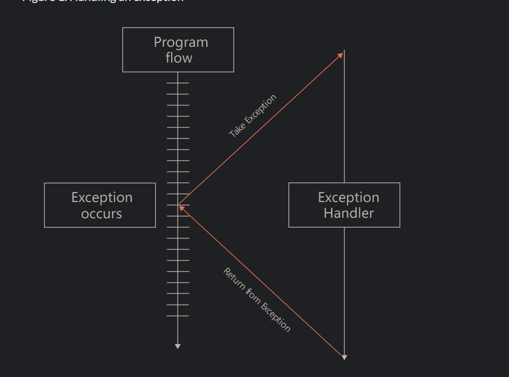

### 同步异常

有关同步异常，我们在第一个章节已经介绍过一些基本背景和概念

同步异常是由当前正在执行的指令引起或与之相关的异常。同步异常与当前处理器执行流同步，因为它们直接与当前正在执行的指令相关。
例如，同步异常可能由尝试写入MMU定义的只读位置的指令触发的错误。

我们对以下不同类型同步异常的原因进行一些更深入的讨论：

 - 无效指令和陷阱异常
 - 内存访问
 - 引发异常的指令
 - 调试异常

#### 无效指令和陷阱异常
尝试执行无效指令可能会导致同步异常。导致无效指令的原因有很多， 

 - 执行了 未定义 `UNDEFINED`的指令 
 - 执行了不允许在当前异常级别下执行的指令  
 - 执行了已被禁用的指令。

任何尝试执行处理器不识别的指令都会生成`UNDEFINED`异常。

ARM还允许控制程序（如`OS`或`Hypervisor`）设置陷阱以拦截较低异常级别的操作。当执行某个操作（例如读取特定寄存器）时，陷阱会触发异常。

例如，`EL1`处的操作系统内核可能会禁用在`EL0`处使用浮点指令，以在应用程序之间进行上下文切换时节省时间（这称为延迟上下文切换；
如果在上下文切换之前未使用`SIMD`或浮点（FP）单元，可以减少推送到堆栈的寄存器数量)。但是一旦应用程序使用了浮点指令，
可以通过使用陷阱异常来处理。陷阱触发，可以临时为用户打开浮点功能

虚拟化中使用陷阱比较频繁，参考[ARM虚拟化支持](https://developer.arm.com/documentation/102142/latest/)

#### 内存访问
内存访问也可能导致同步异常。这可能是 MMU 执行检查的结果，也可能是内存系统返回的错误。

例如，当启用 MMU 时，所有由加载和存储指令引起的内存访问都会受到检查。如果试图从非特权代码访问特权地址，
或试图写入只读地址，则 MMU 会阻止访问并触发内存管理单元（MMU）故障。由于 MMU 产生的错误是同步的，因此异常会在继续访问内存之前发生。

内存访问错误将在 [AArch64 内存管理指南](https://developer.arm.com/documentation/101811/latest/) 中详细讨论。

内存访问也会产生异步异常，本指南后面的 SError 部分将对此进行介绍。

在 AArch64 中，同步中止会导致同步异常。异步中止会导致 `SError`中断异常。

#### 异常触发指令

有些指令会故意导致异常的产生和发生。这些指令用于实现系统调用接口，允许权限较低的软件请求权限较高的软件提供服务。
这些指令有时被称为**系统调用**，通常用于基于软件的应用程序接口。

Arm 架构包含异常生成指令 `SVC`、`HVC` 和 `SMC`。这些指令的唯一目的是产生异常，使 `处理器`能够在异常级别之间移动：

 - The Supervisor Call (SVC) instruction enables a user program at EL0 to request an OS service at EL1
 - The Hypervisor Call (HVC) instruction, available if the Virtualization Extensions are implemented, enables the OS to request 
   hypervisor services at EL2
 - The Secure Monitor Call (SMC) instruction, available if the Security Extensions are implemented, 
    enables the Normal world to request Secure world services from firmware at EL3
 
当 PE 在 EL0 级执行时，它不能直接调用 `EL2` 级的`hypevisor`或` EL3` 级的安全监控程序，
因为这只能在 EL1 及更高一级执行。EL0 的应用程序必须使用 `SVC` 调用内核，并由内核执行调用更高例外级别的操作。

假设已执行了相应的异常级别，操作系统内核（`EL1`）可执行`HVC` 指令调用 `EL2` 的`hypevisor`，或使用` SMC `指令调用 EL3 的安全监控程序。
同样，从 `EL2` 开始，PE 可使用` SMC` 指令调用 `EL3` 安全监控程序。如下图所示：

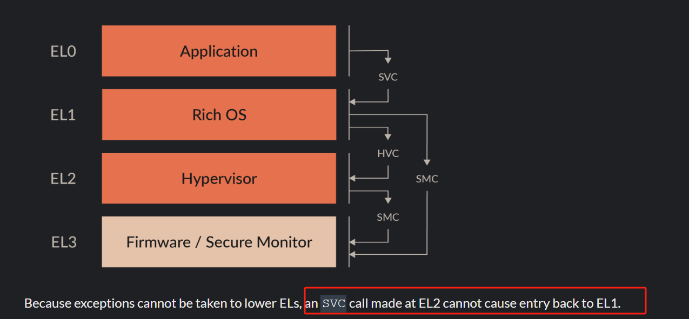

正如前面关于无效指令和陷阱异常所讨论的，**Hypvisor**会向 EL1 呈现系统的模拟视图。 
在这种情况下，**Gust OS** 将无法使用**SMC**直接调用设备固件。 
相反，通过设置管理程序配置寄存器中的 HCR_EL2.TSC 位，此类调用将被**捕获**到 EL2。

#### Debug异常
调试异常是路由到托管调试器的异常级别的同步异常。 然后，调试器代码的执行方式与异常处理程序代码非常相似。

有许多同步的特定调试异常，包括：

 - 断点指令异常
 - 断点异常 
 - 观察点异常 
 - 向量捕获异常
 - 软件步骤异常
 
有关调试异常及其处理方式的更多信息，请参阅 [AArch64 自托管调试指南](https://developer.arm.com/documentation/102120/latest/)

### 异步异常

某些类型的异常是外部生成的，因此与当前指令流不同步。

异步异常不直接与当前执行的指令相关，并且通常是来自处理器外部的系统事件。 这可能是软件需要响应的系统事件，
例如计时器的活动或屏幕的触摸。 我们不知道它们什么时候会发生。

根据定义，如果异常不是同步的，那么它就是异步的。 异步异常也称为中断。

在发生异步异常时，程序流将被中断并传递给代码来专门处理此外部请求。无法准确保证异步异常何时发生，AArch64 架构仅要求异步异常在有限时间内发生。

**物理中断**：

物理中断是响应来自 PE 外部（通常由外设）的信号而生成的中断。 系统不是通过CPU不断轮询外部信号，
而是通过生成中断来通知CPU必须发生某些事情。

例如，系统可能使用通用异步接收器/发送器 (UART) 接口与外界通信。 当UART接收数据时，它需要一种机制
来告诉处理器新数据已经到达并准备好进行处理。 UART 可以使用的一种机制是生成中断以向处理器发出信号。

复杂的系统可以有许多具有不同优先级的中断源，包括**嵌套中断处理**的能力，其中较高优先级的中断可以中断较低优先级的中断。 
内核响应此类事件的速度可能是系统设计中的一个关键问题，称为中断延迟（实时性）。

接下来我们将了解不同类型的物理中断。

#### SError
系统错误 (SError) 是内存系统为响应意外事件而生成的异常类型。 我们预计不会发生这些事件，但需要知道它们是否已经发生。 
这些是异步报告的，因为触发事件的指令可能已经被停用。

SError 的一个典型示例是之前提到的外部异步中止。 SError 中断的示例包括：

 - 已通过所有 MMU 检查但随后在内存总线上遇到错误的内存访问
 - 对某些 RAM（例如内置缓存中的 RAM）进行奇偶校验或纠错码 (ECC) 检查
 - 由将脏数据从高速缓存行写回到外部存储器而触发的中止

SError 被视为一个单独的异步异常类，因为您通常会对这些情况有单独的处理程序。 SError 的生成是由实现定义的。

#### IRQ and FIQ
Arm 架构有两种异步异常类型：IRQ 和 FIQ，旨在用于支持外设中断的处理。 它们用于发出外部事件信号，例如计时器关闭，并不代表系统错误。 
它们是与处理器指令流异步的预期事件。

IRQ 和 FIQ 具有独立的路由控制，通常用于实现安全和非安全中断，
如 Arm 通用[中断控制器 v3 和 v4 指南](https://developer.arm.com/documentation/198123/latest/) 中所述。 
如何使用这两种异常类型是由实现定义的。

在旧版本的 Arm 架构中，FIQ 被用作更高优先级的快速中断。 这与 AArch64 不同，其中 FIQ 与 IRQ 具有相同的优先级。

在几乎所有情况下，中断控制器都与系统中的 AArch64 处理器配对，用于整理、确定优先级和处理所有中断。 
所有 Arm 实现都使用 Arm 通用中断控制器 (GIC) 架构来管理 IRQ 和 FIQ。 GIC 执行中断管理、优先级划分和路由任务，
为每个物理中断类型提供单个信号到内核中。 有关 GIC 架构的更多信息，请参阅 Arm 通用中断控制器 v3 和 v4 指南）

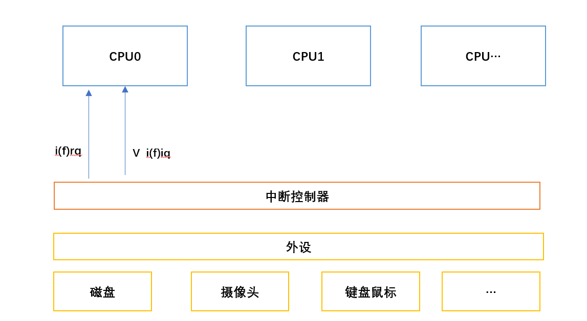

#### Virtual interrupts
使用虚拟化的系统对中断处理有更复杂的需求。 一些中断可以由`hypevisor`处理，一些中断可以在虚拟机内处理。 
VM看到的中断是虚拟中断。 虚拟中断可以由连接到中断控制器的设备在外部生成，也可以由软件生成。 
因此需要额外的机制来支持这一点，因此在 AArch64 中明确支持虚拟中断。

 - vSError，虚拟系统错误
 - vIRQ，虚拟IRQ
 - vFIQ，虚拟 FIQ

虚拟中断按中断类型进行控制。 这些虚拟中断的功能与物理中断相同，但它们只能向 `EL1` 发送信号。

虚拟中断可以从 `EL2`上的管理程序生成，也可以通过使用中断控制器生成。 虚拟机管理程序必须在虚拟机管理程序配置寄存器 (`HCR_EL2`) 
中设置相应的路由位。 例如，要启用`vIRQ` 信号，虚拟机管理程序必须设置 `HCR_EL2.IMO`。 
此设置将物理 `IRQ` 异常路由到 `EL2`，并启用向 `EL1` 发送虚拟异常信号。

HCR_EL2 中有 3 个位控制虚拟中断的生成：

 - VSE： 设置该位会注册一个 vSError。
 - VI: 设置该位会注册一个 vIRQ。
 - VF:  设置该位会注册 vFIQ。
 
设置这些位之一相当于中断控制器向 `vCPU` 发出中断信号。 此方法的含义是管理程序需要模拟 `VM` 中中断控制器的操作。 
当用于频繁操作时，这可能会导致大量开销，因此建议使用中断控制器。

GICv2 及更高版本通过提供物理 CPU 接口和虚拟 CPU 接口来支持物理和虚拟中断的信号发送。 有关中断控制器的更多信息，
请参阅 Arm 通用中断控制器 v3 和 v4。 Armv8.4-A 中添加了对 Secure 状态虚拟化的支持，并且需要启用并支持 Secure EL2。

[AArch64 虚拟化指南](https://developer.arm.com/documentation/102142/latest/) 中进一步讨论了虚拟中断。

#### 屏蔽

物理和虚拟**异步异常**都可以被暂时屏蔽。 这意味着异步异常可以保持挂起状态，直到它们被取消屏蔽并且异常被处理。 
这对于处理嵌套异常特别有用。

**同步异常无法被屏蔽**,这是因为同步异常是由指令的执行直接引起的，因此如果它们随后悬而未决或被忽略，则会阻止执行。

2021 年扩展 Armv8.8-A 和 Armv9.3-A 添加了**不可屏蔽中断 (NMI)**支持。 当支持并启用时，
Armv8.8-A 和 Armv9.3-A 扩展引入了不可屏蔽中断（NMI）支持。当支持并启用了 NMI 时，它提供了一个称为**超级优先级（Superpriority）**的特殊能力。

超级优先级的能力允许将一个中断呈现给处理器，其优先级高于普通中断。这意味着即使没有超级优先级的中断被屏蔽或禁用，
具有超级优先级的中断仍然可以被处理器接受。具有超级优先级的 NMI 可以绕过通常的中断屏蔽或阻止机制，
确保立即处理关键事件或中断，即使系统处于不服务普通中断的状态下也可以处理。
这种能力特别适用于处理需要立即处理且不能延迟或忽视的关键系统事件。

本指南后面的路由和中断控制器将进一步介绍屏蔽。 异常屏蔽和不可屏蔽中断 (NMI) 部分更深入地讨论了屏蔽和 NMI 功能。

Linux中的硬件看门狗使用到了NMI特性 想象一下如果一个驱动中断中屏蔽了中断，而且他还发生了死锁，会出现什么情况？

## 异常捕获

我们已经讨论了很多关于异常(同步 以及异步)的基本概念，本节主要通过一些实际的例子，说明异常的处理过程

在 AArch64 的特定术语中，当谈论处理异常时使用了以下术语：

 - 当处理器核心（PE）响应异常时，我们称之为“taking an exception”（异常被捕获）。
 - 在触发异常之前，处理器核心的状态称为“the state the exception is taken from”（触发异常前状态）。
 - 在触发异常之后，处理器核心的状态称为“the state the exception is taken to”（触发异常后的状态）。
 
因此，当异常被识别时，处理器所处的状态被称为异常产生时的状态。异常发生后，PE 立即处于的状态是异常被带入的状态。

例如，异常可以从 AArch32 EL0(异常发生前状态) 处理到 AArch64 EL1(异常发生后的状态)。

### 异常处理

发生异常时，处理器会将 PE 的**当前状态**与**异常返回地址**一起保存，然后进入**特定模式**处理异常。

当前状态的快照来自 PSTATE，将在 "保存处理器当前状态 "一节中进一步讨论。
该快照被写入保存程序状态寄存器（`SPSR`），返回地址被写入异常链接寄存器（`ELR`）。
对于同步异常和 SErrors，还会更新另一个寄存器--异常综合寄存器（`ESR`）。这将记录异常的原因。

当一个异常被传递到正在使用 AArch64 状态的异常级别（`ELx`）时，会发生以下所有情况：

 - 在异常被触发之前，PSTATE 寄存器的内容被写入 `SPSR_ELx` 寄存器。
 - 首选的异常返回地址被写入 `ELR_ELx `寄存器。

另外：

 - 对于**同步异常**和**SError中断**，异常的原因被写入 **ESR_ELx** 寄存器。
 - 对于与地址有关的**同步异常**，例如**MMU故障**，触发异常的**虚拟地址**被写入 `Fault Address Register`，`FAR_ELx` 寄存器。
 - 对于任何给定的异常，异常处理都从一个固定的内存地址开始，这个地址被称为异常向量。

当发生异常时，处理单元（`PE/CPU`）会跳转到**向量表**(后面介绍)中的一个位置进行处理。

异常向量表（`vector table`）中包含了针对不同异常类型的处理程序或指令，允许系统在发生异常时准确地执行相应的处理操作。

AArch64 中的`vector table`与许多其他处理器架构不同，它包含的是指令而不是地址。
每个条目最多包含 `32` 条指令，足以执行基本的**堆栈动作** 和调用特定的异常处理代码。

`vector table`位置通常配置为包含处理程序代码，以执行通用操作，并根据异常类型分支到进一步的异常处理代码。
该代码限制为 `32 个字`。异常处理程序包含处理请求操作的代码，并能从异常状态返回。

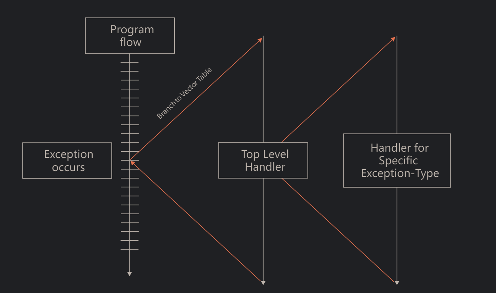

每个异常类型都针对一个异常级别 (`EL`)，异常级别将针对该级别进行处理。 
因此，触发异常可以路由到不同的 `EL`。 这一点尤其重要，因为获得特权的唯一方法是`异常`。 失去或减少特权的唯一方法是执行异常返回。

这意味出现例外情况时，`EL `可以保持不变或增加。在异常返回时，`EL` 可以保持不变或减少。

值得注意的是，发生异常或执行异常返回并不一定需要更改 `EL`。 异常的目标可能与当前 `EL` 相同。 
目标 `EL` 可以根据异常类型隐式定义，也可以通过**系统寄存器**中的配置位来定义

**注意:** AARCH64 异常发生可以让处理器从`EL0`到更高级别，但是异常永远不会在`EL0`平级处理

#### 状态保存恢复
AArch64 有一个称为 `PSTATE` 的处理器状态概念，`SPSR_ELX` 中存储的就是这些信息。PSTATE 包含当前异常级别和算术逻辑单元 (ALU) 标志等内容。
在 AArch64 中，这些信息包括：
 
 - Condition flags
 - Execution state controls
 - Exception mask bits
 - Access control bits
 - Timing control bits
 - Speculation control bits

例如，再`PSTATE`中的异常屏蔽标志位(`DAIF`) 

 - D  Debug exception mask bit
 - A  SError asynchronous exception mask bit, for example, asynchronous external abort
 - I  IRQ asynchronous exception mask bit
 - F  FIQ asynchronous exception mask bit

当异常发生时，上面的状态需要被保存，然后再异常返回时，再进行状态恢复，对应的状态会保存在发生异常时的特权等级的`SPSR_ELX` 寄存器中 

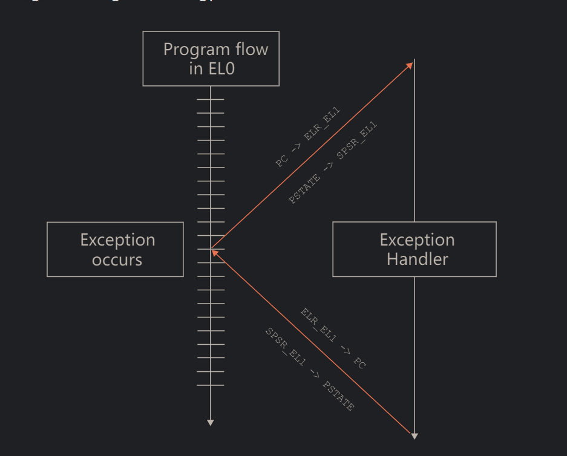

#### 中断路由
当异常发生，首先要决策，需要去往哪一个特权级别

每个异常类型都有一个目标异常级别，该级别根据下面两个情况判断：

 - 根据异常类型隐式含义
 - 由系统寄存器中的配置位定义
 
异常的目标要么由体系结构固定，要么由软件使用路由控制进行配置。 然而，`EL0` 永远不会有例外。

**同步异常**根据与异常生成指令 `SVC`、`HVC` 和 `SMC` 相关的规则进行路由。 
实施后，其他类别的异常可以路由到 `EL2`（虚拟机管理程序）或 `EL3`（安全监视器）。 

`IRQ`、`FIQ` 和 `SError` 的路由是独立设置的。 例如，实现可以将所有 `IRQ` 路由到 `EL1`，如下图所示：

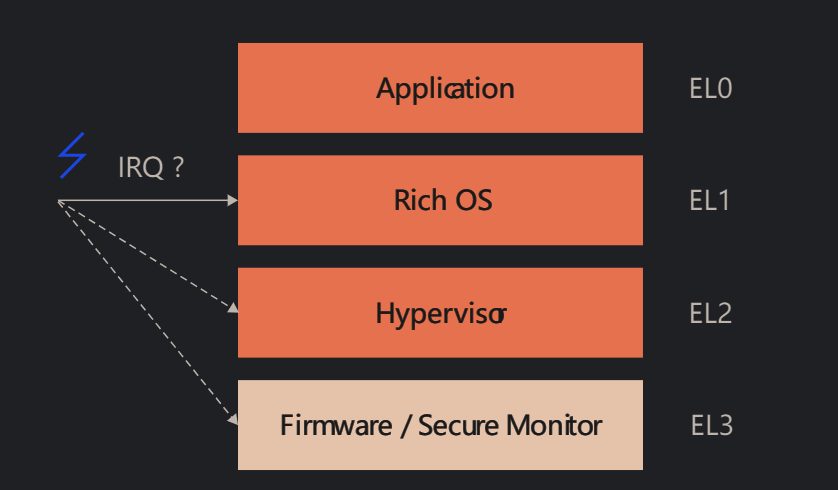

使用安全配置寄存器 `SCR_EL3` 和管理程序配置寄存器 `HCR_EL2` 来配置路由。 
`SCR_EL3` 寄存器指定哪些异常被路由到 `EL3`，而 `HCR_EL2` 寄存器类似地指定哪些异常被路由到 EL2。

这些允许将不同的中断类型路由到不同的异常级别。 例如，`IRQ` 可能由`EL1`上的操作系统处理，而 `SErrors` 通常由 `EL3` 上运行的固件处理。

每个控制寄存器中有单独的位，允许对 `IRQ`、`FIQ` 和 `SError` 中断进行单独控制。 此外，使用 `SCR_EL3` 进行的路由配置会覆盖使用
`HCR_EL2` 进行的路由配置（如果两者发生冲突）。 这些寄存器中的路由位在复位时具有未知值，因此必须由软件初始化它们。

Arm 通用中断控制器 (`GIC`) 架构（请参阅相关指南）通常用于执行中断管理、优先级划分和路由任务。 这可以减少与虚拟化相关的开销。

异常不能进入未实现的异常级别。 对未实现的异常级别的调用是未定义的。 类似地，
当 `EL2` 对于给定的安全状态被禁用或未实现时，尝试返回到 `EL2` 会导致异常返回 (`ERET`) 上生成错误。

前面在屏蔽部分提到过，可以暂时屏蔽**异步异常**并使其处于挂起状态，直到异常被取消屏蔽并捕获。 
路由也会影响屏蔽，因为屏蔽的能力取决于当前和目标的异常级别。

路由到较高异常级别的异常无法被较低 `EL` 屏蔽。 例如，如果中断在`EL1`中被屏蔽，并且中断被路由到`EL2`，则 `EL1`屏蔽将不会影响`EL2`操作。
但请注意，当 `PE` 执行最后一次从 `EL2` 退出时，`EL2` 中断可能已被屏蔽，这仍然可能导致中断在进入 `EL2` 时被屏蔽。

路由到当前异常级别的异常可以被当前级别屏蔽。 路由到较低异常级别的异常则始终被屏蔽。 
异常将被挂起直到 `PE` 更改为等于或低于路由到的异常级别。 这符合这样的规则：你永远不会因为异常处理而失去特权。

## 总结 
本节主要用于快速查找

### 异常状态保存 

|  异常类型                   | 需要保存的状态                | 保存的位置  |   
|-----------------------------------|-----------------------------------|-------------|
| 所有     | 异常发生前的`PC` 地址   | ELR_ELX  |
| 所有     | 异常发生前的程序状态 `PSTATE`        | SPSR_ELX  |
| 同步异常/Serrror     | 异常原因(甚至包括)        | SPSR_ELX  |

