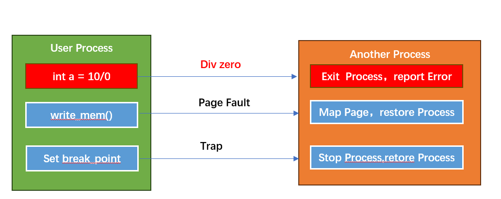
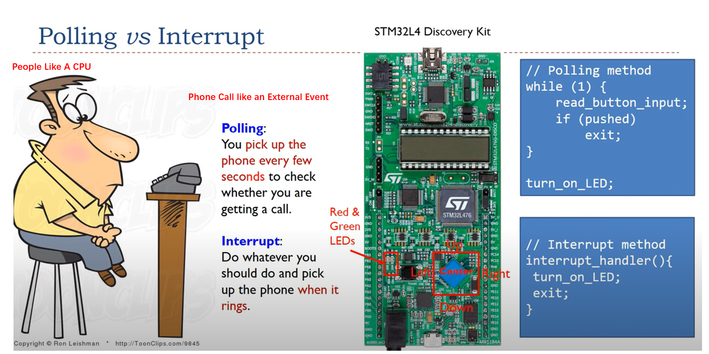

# 介绍

本章节正式开始介绍中断和异常，虽然大部分情况下，linux使用中断都是通过非常简单的接口使用 但是对于底层的理解也非常重要

## 前言(概念)
在计算机程序设计中，需要先遇到问题，在提出设计思路，进而产生出一些概念和术语，最终形成某种事实

### 术语对齐

我们统一把中断和异常都称之为异常；异常分为 **异步异常**(中断 serror等) 和  **同步异常**

### 同步异常

实践中的问题: 
 - 程序运行过程中，如果检测到了致命异常或者执行了非法指令 怎么办？
 - 现代处理器架构普遍支持安全级别(EL0,EL1,EL2)，限制不同安全级别下，可以执行的指令的集合不同，通常权限越高，可以执行的指令越多（
 一般也叫特权指令），不同安全级别应该如何切换? 
 - 程序开发中，需要能够支持调试,比如断点,让程序暂停在某个指令，然后可以执行其他指令(bt,show),怎么样可以做到这一点？
 - 当程序发生可以恢复的错误(缺页异常)，需要经过修复后(内存映射) 可以恢复程序，该怎么实现？

问题相似点: 
 - 都是在应用程序中主动触发
 - 都需要跳到另外1个代码段执行
 - 执行完代码段，需要重新返回应用程序或者程序退出

解决方案: 任何程序最终都是汇编，最终都体现在CPU(核心芯片)的指令执行;  因此芯片提供了方案,该方案叫做`异常`
通过特定的指令和寄存器，CPU可以进入异常处理程序的代码，并且在异常处理完成后，恢复现场，可以重新返回开始的位置

异常处理的特点： 
 - 从之前的问题中，可以看到，这类问题都是同步触发的
 - 异常是CPU通过某些指令主动产生的，不需要外部设备参与

### 异步异常(中断)
实践中的问题: 
 - 如何处理外部事件，比如键盘的输入，鼠标的移动，屏幕的点击等等等

问题需求: 
 - 采用轮询监听外部事件的方案，该方案会导致CPU会白白浪费太多计算资源在等待；
 - 应该有一种机制,能够让外部事件到来时，CPU可以异步感知事件的到来，同时可以临时从当前任务切换到外部事件的处理，处理完成之后
   在回到原先的任务

解决方案: 芯片提供了方案,该方案叫做`中断`，中断允许CPU当前任务被临时打断,在任务打断之后，允许在回到任务

### 区别

 - 触发源：异常是程序发出的，中断是外部设备触发
 - 触发时机: 异常是程序同步触发，异常时外部设备触发，是异步触发
 - 上下文: 异常需要处理的任务都和触发异常的进程有关，因此异常的上下文应该是当前进程(能够访问进程数据)；
           中断需要处理的是外部任务，不需要访问当前进程上下文，中断有自己的上下文

### 中断嵌套、优先级、屏蔽
实践中的问题: 当在处理中断和异常时，如果又触发了新的异常会怎么办？
 - 在处理`page fault`异常中，异常处理代码中又触发了`page fault` ，怎么办？ 
 - 在处理某个异步中断，比如用户按下了重启键，代码开始重启，此时用户又不断按下重启键，怎么办？
 - 方向盘在转动的同时(此时系统正在控制转向)，突然踩下刹车,此时怎么办？

解决方案: 
 - 中断嵌套，允许中断在处理一个中断时候，被另外一个中断打断，更高级的嵌套支持优先级判断，只允许比自己优先级
高的中断打断当前中断；
 - 虽然中断嵌套解决了一些问题，但也会引入新的问题，比如中断嵌套的数据访问并发问题，因此也需要支持中断屏蔽

中断从可屏蔽性上，又被分为:

 - 可屏蔽中断（`maskable`）: 可以屏蔽的中断
 - 不可屏蔽中断（`unmaskable`）: 不可以屏蔽的中断

本小节 主要介绍了一些背景和术语，我们接下来，会分别对ARM64芯片架构 以及 Linux内核 做进一步的说明