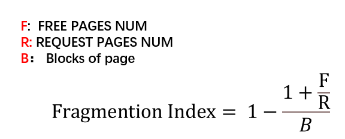

# 内存碎片整理

### 背景

### 背景

[参考](https://lwn.net/Articles/368869/)

当系统运行时，页面往往会分散在不同用户之间，
当需要时很难找到物理上连续的页面组。为了尽可能避免高阶（多页面）内存分配的需要，
内核已经做了大量工作，因此大多数内核功能都不会受到页面碎片的影响。
但在某些情况下，仍然需要进行高阶分配；需要进行此类分配的代码可能会在碎片化系统上失效

另外值得注意的是，从某种程度上说，这个问题实际上越来越严重。
现代处理器已不局限于`4K 页`，它们可以在进程的部分地址空间中使用更大的页（"巨页"）
，使用超大页面可以带来真正的性能优势，这主要是由于处理器的转换查找缓冲区所承受的压力
减小了。但是，使用超大页面要求系统能够找到物理上连续的内存区域，
这些区域不仅要足够大，而且要正确对齐。对于已经运行了一段时间的系统来说，寻找这样的空间是一个相当大的挑战。

### 基本算法原理

[参卡](https://medium.com/@huynhquangthao/linux-large-memory-allocation-history-570730b09c95)

### 内存碎片化指数

当申请高阶内存，失败的原因可能是确实内存不足（把所有的分散的空闲页表加起来也不够用户的内存），也可能是由于内存碎片

因此，当发生内存不足的情况，应该是先通过内存碎片整理 还是 直接回收内存，这里需要做一个决策， 内存碎片化指数用来评估 碎片和内存使用量的比值

因子范围为`0000- 1.000` 计算公式为



当因子越大，表示碎片化原因占比越大 

### migrate type

内存规整通过对物理内存页进行`移动 重排`，形成更加规整的内存，为了提高内存规整模块设计简洁性，又在zone的基础上

对内存按照`迁移类型`进行分类

当前内核对内存迁移做了以下分类, 不同的迁移类型会被分为不同的组 以下是当前的分组类型

```
enum migratetype {
         MIGRATE_UNMOVABLE,
         MIGRATE_MOVABLE,
         MIGRATE_RECLAIMABLE,
         MIGRATE_PCPTYPES,       /* the number of types on the pcp lists */
         MIGRATE_HIGHATOMIC = MIGRATE_PCPTYPES,
 #ifdef CONFIG_CMA
         /*
          * MIGRATE_CMA migration type is designed to mimic the way
          * ZONE_MOVABLE works.  Only movable pages can be allocated
          * from MIGRATE_CMA pageblocks and page allocator never
          * implicitly change migration type of MIGRATE_CMA pageblock.
          *
          * The way to use it is to change migratetype of a range of
          * pageblocks to MIGRATE_CMA which can be done by
          * __free_pageblock_cma() function.
          */
         MIGRATE_CMA,
 #endif
 #ifdef CONFIG_MEMORY_ISOLATION
         MIGRATE_ISOLATE,        /* can't allocate from here */
 #endif
         MIGRATE_TYPES
 };
```

#### kcompactd

是一个后台规整任务，默认情况下，会定时`500ms`拉起来一次，主动扫描当前内存的健康程度；决定是否主动规整内存；
该任务也可以被动唤醒

扫描内存的核心被一个主要由一个`打分`的函数实现;每次扫描可以得到一个`0-100`的碎片化分数，然后对比用户设置的分数阈值 
决定是否执行内存规整(用户如果设置的分数越高，说明只有当碎皮化很高的时候才会执行规整；则内存规整约不积极)

#### 代码实现

代码位于`kernel/mm/compaction.c`  

[代码梳理参考](https://www.cnblogs.com/arnoldlu/p/8335532.html#alloc_pages_direct_compact)
