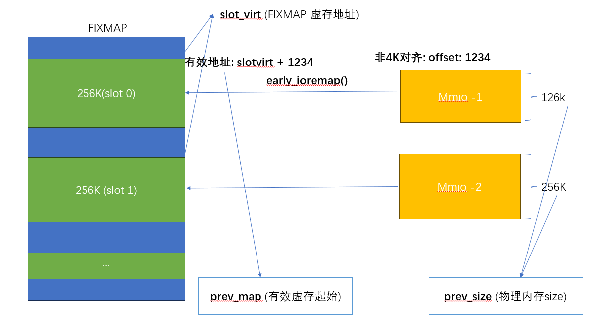

## early_ioremap

```json
"node" {
    "label": "early_ioremap",
    "categories": ["mem"],
    "info": "kernel early io remap",
    "depends": [
        "obsolate param",
        "fixmap"
    ]
}
```

### 介绍

在`fixmap` 临时映射区域，有一段虚拟内存是预留给 `early_ioremap`  早期的`mmio`设备内存访问使用的，此时`ioremap`子系统还未初始化

### 设计实现

#### 大小范围

从`FIX_BTMAP_BEGIN` - `FIX_BTMAP_END`，在4k页表配置下，会预留 `7`个槽位，其中每个槽位内存大小`256k` ，内存范围大小`7 * 256K`

```c
  #define NR_FIX_BTMAPS           (SZ_256K / PAGE_SIZE)
  #define FIX_BTMAPS_SLOTS        7
  #define TOTAL_FIX_BTMAPS        (NR_FIX_BTMAPS * FIX_BTMAPS_SLOTS)

   FIX_BTMAP_END = __end_of_permanent_fixed_addresses,
   FIX_BTMAP_BEGIN = FIX_BTMAP_END + TOTAL_FIX_BTMAPS - 1,
```

#### 核心数据结构

此模块维护了 3个全局变量

```c
  static void __iomem *prev_map[FIX_BTMAPS_SLOTS] __initdata;
  static unsigned long prev_size[FIX_BTMAPS_SLOTS] __initdata;
  static unsigned long slot_virt[FIX_BTMAPS_SLOTS] __initdata;
```

数组中每个元素分别对应每个槽位的如下内容：

- prev_map[i]: 对应第`i`个槽位当前真实映射的 可访问的物理内存的虚拟内存起始位置

- prev_size[i]: 对应第`i`个槽位当前真实映射的 物理内存的大小

- slot_virt[i]: 对应第`i`个槽位的虚拟内存起始地址



#### 核心API

##### early_ioremap

```c
early_ioremap(resource_size_t phys_addr, unsigned long size, pgprot_t prot)
```

此接口尝试找到未使用的`slot`,并以`FIXMAP_PAGE_IO`标志 完成物理内存和虚拟内存的映射,返回设备虚拟内存

##### early_iounmap

```c
  void __init early_iounmap(void __iomem *addr, unsigned long size)
```

解除内存映射

##### early_memremap/unmap

以`normal`权限映射/解映射内存

##### early_memremap_prot

```c
void * early_memremap_prot(resource_size_t phys_addr, unsigned long size,         
                      unsigned long prot_val)   
```

支持自定义`PAGE FLAGS`映射内存

#### config

`bootconfig` 开启`early_ioremap_debug` 可以打印相关日志
