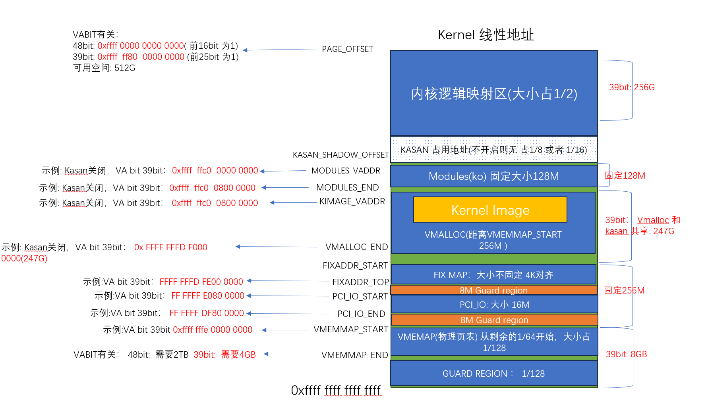
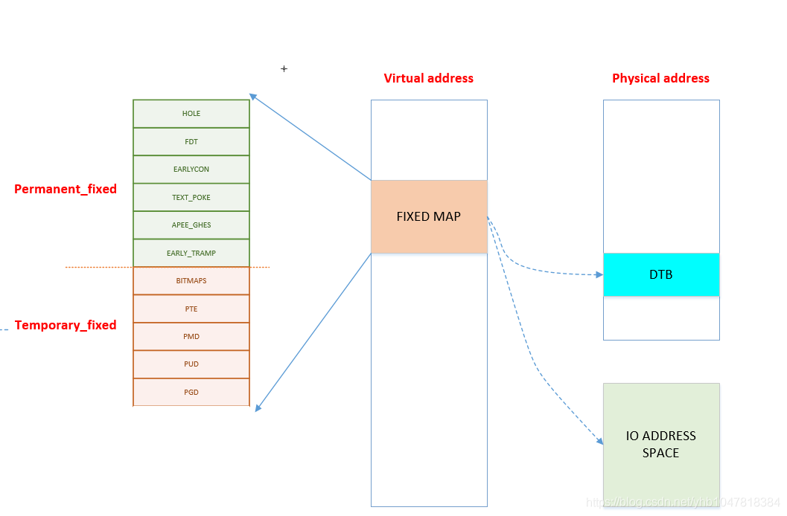

## fixmap

```json
"node" {
    "label": "fixmap",
    "categories": ["mem"],
    "info": "kernel fix map",
    "depends": [
        "obsolate param"
    ]
}
```

### 介绍

#### 虚拟内存

这里先让我们回顾一下 `arm64`内核线性地址的划分:



其中有一段`FIXMAP` 的虚拟内存空间，内核会使用这段虚拟内存 做一些前期初始化工作，关于`fixmap`的地址描述在:`/arch/arm64/include/asm/fixmap.h`

内核对于该地址空间的描述: 这段注释解释了在内核中定义的一组特殊虚拟地址，这些地址在编译时是常量，
但在启动过程中才会与物理地址关联。这些特殊虚拟地址通常用于处理内核启动和底层硬件初始化等任务

我们通过图示展示一下 fixmap 内存区域主要功能

### 设计实现

#### 内存区域说明



`fixmap` 被分为两块区域，**永久映射区** 和 **临时映射区**

- 永久映射区： 意味着这段虚拟内存和物理内存映射关系一旦确认轻易不会发生变化

- 临时映射区：代表这个虚拟内存地址映射的物理内存不是固定的，非常典型的为 `FIX_PTE/PUD/PMD` 用于：实现内存映射时，如果涉及到需要申请新的页表， 需要先申请页表的物理内存`page`，为了完成页表设置初始化，需要临时把页表映射在某段虚拟内存上才可以访问，因此`FIX_PTE/xxx`主要代表 临时申请的动态页表虚存，在访问使用完后，必须要解除映射关系，解除后对应虚拟内存不再有意义

#### 内存区域大小

关键代码: 定义了FIXMAP的大小 以及常用函数

```
__end_of_permanent_fixed_addresses // 是 enum fixed_addresses 的结束索引
//fixed_addresses 每增加一个功能，FIXMAP占用的虚拟内存就增加4K
#define FIXADDR_SIZE    (__end_of_permanent_fixed_addresses << PAGE_SHIFT) 
#define FIXADDR_START   (FIXADDR_TOP - FIXADDR_SIZE)


```

#### fixmap 页表

`fixmap`中的内存区域， 在早期被内核使用，虚拟内存使用的页表内存是静态分配 

**这里可能回合上面的临时映射区混淆，澄清一下，fixmap虚拟内存地址访问当然需要页表提供映射，临时映射区的页表映射是指通过fixmap虚拟内存访问其他页表，和fixmap自身的页表无关**

```c
//linux-stable/arch/arm64/mm/fixmap.c

static pte_t bm_pte[NR_BM_PTE_TABLES][PTRS_PER_PTE] __page_aligned_bss;
static pmd_t bm_pmd[PTRS_PER_PMD] __page_aligned_bss __maybe_unused;
static pud_t bm_pud[PTRS_PER_PUD] __page_aligned_bss __maybe_unused;
```

这里只需要提供 `2 3 4`级页表即可，一级页表在内核地址映射的时候已经确定了下来`swapper_pg_dir`

#### 页表初始化

```c
setup_arch 
 -> early_fixmap_init() 
```

其中,`early_fixmap_init` 会填充 `init_mm.pgd -> bm_pud -> bm_pmd -> bm_pte` 对应的页表项，一旦初始化完成之后，则所有`fixmap`覆盖的虚存都保证了有对应页表(此时页表内容为空，没有对应的物理内存映射)

#### 核心API

##### fix_to_virt

下面这两个接口用于在`FIX_ENUM` 和 虚拟内存之间转换

```c
unsigned long fix_to_virt(const unsigned int idx)
unsigned long virt_to_fix(const unsigned long vaddr)
```

##### set_fixmap_(nocache/io)

以不同内存权限映射物理内存`PAGE_KERNEL`  

```c
 set_fixmap(idx, phys) 
```

- idx: `fixmap`虚拟内存下标

- phys： 该虚拟内存需要映射的物理内存

- nocache： 以` normal - noncache` 映射

- io: 以 `DEVICE_nGnRE `映射 

由于`fixmap`页表已经是填充好的，直接找到`pte` 表项修改对应页表项即可 

##### set_fixmap_offset(nocache/io)

功能和`set_fixmap` 类似，但是会返回映射后的虚存

### fdt

在`fixmap`内存区域内，还有一段非常重要的内存`FIX_FDT` , 此段内存用于映射设备树，

之所以说他重要，是因为对于内存管理，设备拥有多少物理内存这一信息，在`arm64`嵌入式环境下，一般都是在设备树里面描述，如果要得到这些信息，必须要先解决设备树的访问,关于更多设备树的内容，请阅读 驱动章节。

##### API： fixmap_remap_fdt

此函数实现对`fdt` 的内存映射 ，核心逻辑解释

```c
fixmap_remap_fdt(phys_addr_t dt_phys, int *size, pgprot_t prot)
{
    // 获得对应的FIXMAP虚存地址
    const u64 dt_virt_base = __fix_to_virt(FIX_FDT);
    // 检查8 byte 对齐
    // 得到要映射的对齐的物理地址
    dt_phys_base = round_down(dt_phys, PAGE_SIZE);
    // 得到偏移的 真实虚拟内存
    dt_virt = (void *)dt_virt_base + offset;
    //先映射 1 页
    create_mapping_noalloc(dt_phys_base, dt_virt_base, PAGE_SIZE, prot);
   // 获取实际fdt大小 再次映射
   *size = fdt_totalsize(dt_virt);

   if (offset + *size > PAGE_SIZE) {
        create_mapping_noalloc(dt_phys_base, dt_virt_base,
             offset + *size, prot);
   }
}
```

初始化时机

```c
setup_arch
 -> early_fixmap_init() 
   // 在 fixmap初始化之后才可以使用
 -> setup_machine_fdt(__fdt_pointer);
   -> fixmap_remap_fdt(dt_phys, &fdt_size, PAGE_KERNEL) // 页表填充 FDT，是段映射，只填充到 bm_pmd这一层 
```

`setup_machine_fdt` 会完成`fdt` 虚拟内存初始化，并会扫描设备内存，放在`memblock`中，这部分会在`memblock`中解释
