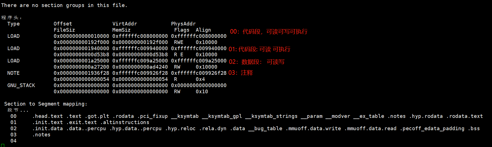
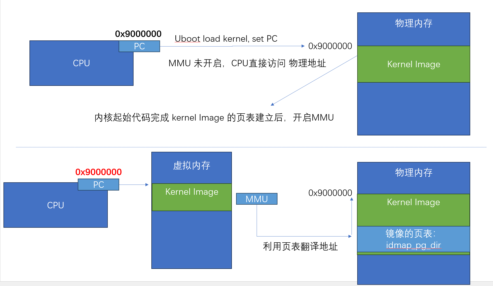

## 内存初始化

```json
"node" {
    "label": "kernel_map",
    "categories": ["mem"],
    "info": "kernel mem map init",
    "depends": []
}
```

我们已经介绍过了一些基础知识，本节介绍内核启动阶段内存管理的相关内容

### 前置基础

#### 汇编指令

`adrp`指令: `ADRP  Xd,label`利用当前`PC` 和`label`的相对地址，计算label 内存地址的4KB基址 

```
    //如果PC 当前指令地址为 0x1000 0000 ; data 相对 0x1000 0000 的偏移是 0x1234，
    //可以得到data的地址为0x1000 1234，他的内存基址就是 0x1000 1000
    // X0的值就为  0x1000 1000
    ADRP  X0, data；
```

#### 内核布局描述

内核的地址分布描述定义在:  `arch/arm64/include/asm/memory.h` 
假设当前配置: 4K页(`CONFIG_PAGE_SHIFT=12`) VA地址是48BIT(`256TB`)

```
    /* 
     * STRUCT_PAGE_MAX_SHIFT 定义了一个 管理页表结构(struct page)的大小
     * PAGE_SHIT 是页表大小位移(比如 4K是12 16K是14 64K是16)
     * VMEMMAP_SHIFT 是用于计算线性地址大小的除数
     * 举例: 为了管理4GB大小的线性地址，需要使用 4GB/4KB = 1024 个页表, 每个页表大小如果占1B, 需要 1024 * 1B 的内存 
     * 因此页表所占内存计算公式为 : 需要映射的内存大小/页大小*页表内存 =   需要映射的内存大小/ (页大小 - 页表内存) 
    */

    #define VMEMMAP_SHIFT   (PAGE_SHIFT - STRUCT_PAGE_MAX_SHIFT) // 目前是: 12（4KB） - 6(64B) = 6
    // 计算管理128TB(0xffff800000000000 - 0xffff000000000000) 的线性内存 页表条目需要使用的内存大小    
    #define VMEMMAP_SIZE    ((_PAGE_END(VA_BITS_MIN) - PAGE_OFFSET) >> VMEMMAP_SHIFT) // 目前是 128TB/4KB*64B=2TB  

    #define VA_BITS                 (CONFIG_ARM64_VA_BITS)                           
    #define _PAGE_OFFSET(va)        (-(UL(1) << (va)))      //内核地址起始地址  0xffff000000000000                        
    #define PAGE_OFFSET             (_PAGE_OFFSET(VA_BITS)) //内核地址起始地址  0xffff 0000 0000 0000                            
    #define KIMAGE_VADDR            (MODULES_END)   //kernel image的VA地址 位于modules 结束 0xffff800007ffffff                                     
    #define MODULES_END             (MODULES_VADDR + MODULES_VSIZE)   //modules结束地址 0xffff800007ffffff                   
    #define MODULES_VADDR           (_PAGE_END(VA_BITS_MIN))  //modules起始地址 0xffff800000000000                                 
    #define MODULES_VSIZE           (SZ_128M)  //modules大小 128M                                       
    #define VMEMMAP_START           (-(UL(1) << (VA_BITS - VMEMMAP_SHIFT))) // fffffc0000000000        
    #define VMEMMAP_END             (VMEMMAP_START + VMEMMAP_SIZE) // 2TB大小: fffffdffffffffff                 
    #define PCI_IO_END              (VMEMMAP_START - SZ_8M)                          
    #define PCI_IO_START            (PCI_IO_END - PCI_IO_SIZE)                       
    #define FIXADDR_TOP             (VMEMMAP_START - SZ_32M) 

    #define _PAGE_END(va)           (-(UL(1) << ((va) - 1)))
```

下图以VA 39BIT 和 4K页做演示


下图以VA48 BIT 和 4K页做演示


内核内存管理的一部分工作，就是负责管理不同区域的内存的分配、释放

### 一阶段:内核镜像1:l映射

内核镜像我们简单也可以理解为是一个二进制的文件，`arch/arm64/kernel/vmlinux.lds.S`主要定义了代码段的布局情况,
SECTIONS 描述了段的定义也可以直接通过 `readelf -d  vmlinux` 获取内核链接后的文件 查看布局情况



当uboot 加载完成内核，并且跳转到内核起始位置的时候，此时MMU处于未打开的状态，因此此时CPU在执行内核代码是直接访问的物理内存;
这段代码执行期间，严格意义上来说不能够访问类似于**全局变量**、**函数**等会涉及到虚拟内存地址的代码，只应该通过相对跳转访问

内存初始化会分几个阶段，第一阶段，使能mmu，为了保证`MMU`使能后内存还能被正确解析，需要先把内核的镜像代码建立 `VA` 到`PA`的映射



为什么是**线性1:1**映射？因为PC在刚开启MMU的时候, PC的地址依然是原先物理内存地址 因此需要先建立虚存1:1的映射

#### 线性映射的页表准备

初始化阶段 只有静态页表可以使用  页表预留 `init_idmap_pg_dir`

```c
    //arch/arm64/kernel/vmlinux.lds.S
    init_idmap_pg_dir = .;
    . += INIT_IDMAP_DIR_SIZE;
    init_idmap_pg_end = .;
```

`INIT_IDMAP_DIR_SIZE` 需要的大小

```c
#define INIT_IDMAP_DIR_PAGES    (EARLY_PAGES(INIT_IDMAP_PGTABLE_LEVELS, KIMAGE_VADDR, _end, 1))
#define INIT_IDMAP_DIR_SIZE   INIT_IDMAP_DIR_PAGES
```

第一次线性映射，使用了4级页表映射，编译阶段根据内核镜像大小静态计算出需要的 内存页数量`INIT_IDMAP_DIR_PAGES` 

```c
// 下面代码用于计算 虚拟内存需要多少的内存
#define EARLY_ENTRIES(vstart, vend, shift, add)  
((((vend) - 1) >> (shift)) - ((vstart) >> (shift)) + 1 + add)

#define EARLY_PGDS(vstart, vend, add) (EARLY_ENTRIES(vstart, vend, PGDIR_SHIFT, add)) 
#define EARLY_PAGES(vstart, vend, add) ( 1 /* PGDIR page */ \
 + EARLY_PGDS((vstart), (vend), add) /* each PGDIR needs a next level page table */ \
 + EARLY_PUDS((vstart), (vend), add) /* each PUD needs a next level page table */ \
 + EARLY_PMDS((vstart), (vend), add)) /* each PMD needs a next level page table */
 #define INIT_DIR_SIZE (PAGE_SIZE * EARLY_PAGES(KIMAGE_VADDR, _end, EARLY_KASLR))
 /* the initial ID map may need two extra pages if it needs to be extended */
 #if VA_BITS < 48
 #define INIT_IDMAP_DIR_SIZE ((INIT_IDMAP_DIR_PAGES + 2) * PAGE_SIZE)
 #else  
 #define INIT_IDMAP_DIR_SIZE (INIT_IDMAP_DIR_PAGES * PAGE_SIZE)
 #endif

#define INIT_IDMAP_DIR_PAGES EARLY_PAGES(KIMAGE_VADDR, _end + MAX_FDT_SIZE + SWAPPER_BLOCK_SIZE, 1)
```

感兴趣可以研究一下

#### 映射关键函数： map_range

此函数用于内存页表映射，特点： 

- 此函数在填充页表时不会动态申请页表

- 认为提供的静态页表内存是连续数组，总是假设下一级页表位于前一个页表下标之后

- 会尽可能使用`段映射` 

- 场景假设会阐述上述设计理念

```c
/**
   * map_range - Map a contiguous range of physical pages into virtual memory
   *
   * @pte:                Address of physical pointer to array of pages to
   *                      allocate page tables from
   * @start:              Virtual address of the start of the range
   * @end:                Virtual address of the end of the range (exclusive)
   * @pa:                 Physical address of the start of the range
   * @prot:               Access permissions of the range
   * @level:              Translation level for the mapping
   * @tbl:                The level @level page table to create the mappings in
   * @may_use_cont:       Whether the use of the contiguous attribute is allowed
   * @va_offset:          Offset between a physical page and its current mapping
   *                      in the VA space
   */     
  void __init map_range(u64 *pte, u64 start, u64 end, u64 pa, pgprot_t prot,
                        int level, pte_t *tbl, bool may_use_cont, u64 va_offset)
```

下面是一个用户态映射的模拟代码，感兴趣可以研究一下

场景1： 假设虚存地址范围是`0x0` - `0x200000` (2MB)  

Q： 使用3级页表段映射(entry=2MB)，3张内存页表，每级页表只需要填充1个entry

场景2： 假设虚存地址范围是`0x0` - `0x300000` (3MB)

Q： 前2MB内存同场景1，后1MB额外使用1张4级内存页表，3级页表额外需要填充1个entry指向4级页表。4级页表需要填充256个entry(4k*256)

场景3： 假设虚存地址范围是`0x100000` - `0x300000` (2MB)

Q：3级页表需要填充2个entry指向两个4级页表。前1MB使用1张4级内存页表，4级页表需要填充256个entry(4k*256)；后1MB同样使用后一个4级页表

```c
#include <stdint.h>
#include <stdio.h>

typedef unsigned long u64;
typedef u64 pteval_t;
 typedef u64 pmdval_t;
 typedef u64 pudval_t;
 typedef u64 p4dval_t;
 typedef u64 pgdval_t;

typedef struct { pgdval_t pgd; } pgd_t;
typedef struct { pteval_t pte; } pte_t;
typedef struct { pteval_t pgprot; } pgprot_t;


#define PAGE_SHIFT 12
#define PAGE_SIZE  (u64)(1 << PAGE_SHIFT)

#define U64_MAX         ((u64)~0ULL)
#define PAGE_MASK       (~((1 << PAGE_SHIFT) - 1))
#define PTRS_PER_PTE    512

/* align addr on a size boundary - adjust address up/down if needed */
#define _ALIGN_UP(addr, size)   (((addr)+((size)-1))&(~((typeof(addr))(size)-1)))
#define _ALIGN_DOWN(addr, size) ((addr)&(~((typeof(addr))(size)-1)))

/* align addr on a size boundary - adjust address up if needed */
#define _ALIGN(addr,size)     _ALIGN_UP(addr,size)

#define PAGE_ALIGN(addr)        _ALIGN(addr, PAGE_SIZE)

#define __pte(x) ((pte_t) { (x) } )

#define pte_none(pte)           (!(pte).pte)

#define min(a, b) ((a) < (b) ? (a) : (b))

void  map_range(u64 *pte, u64 start, u64 end, u64 pa,
                        int level, pte_t *tbl)
  {
          int lshift = (3 - level) * (PAGE_SHIFT - 3);
          u64 lmask = (PAGE_SIZE << lshift) - 1;
          start   &= PAGE_MASK;
          pa      &= PAGE_MASK;
          int tbl_index =  (start >> (lshift + PAGE_SHIFT)) % PTRS_PER_PTE;
      printf("start map va: %lx  to pa %lx  size: %lx\n", start, pa, end-start);
      printf("tbl-ori: %p  index is %d  tbl-now: %p  \n",tbl, tbl_index,tbl+tbl_index);
          /* Advance tbl to the entry that covers start */
          tbl += (start >> (lshift + PAGE_SHIFT)) % PTRS_PER_PTE;

          while (start < end) {
                u64 next = min((start | lmask) + 1, PAGE_ALIGN(end));
          printf("start : %lx  next: %lx pa %lx \n",start, next, pa);
          printf("need next map: %lx \n",(start| next| pa) &lmask);
                  if (level < 3 && (start | next | pa) & lmask) {
              printf("enter next map \n");
                          /*
                           * This chunk needs a finer grained mapping. Create a
                           * table mapping if necessary and recurse.
                           */
                          if (!((*tbl).pte)) {
                                  *tbl = __pte(*pte);
                                  *pte += PTRS_PER_PTE * sizeof(pte_t);
                          }
                          map_range(pte, start, next, pa, level + 1,
                                    (pte_t *)((*tbl).pte));
                  } else {
                   printf("direct set tlb\n");
                          /* Put down a block or page mapping */
                          *tbl = __pte(pa);
                  }
                  pa += next - start;
                  start = next;
                  tbl++;
          }
 }

int  create_init_idmap(pgd_t *pg_dir)
{
        u64 ptep = (u64)pg_dir + PAGE_SIZE;
        map_range(&ptep, 0x100000, 0x300000, 0x0,
                  0, (pte_t *)pg_dir);

        return ptep;
}


static pgd_t page_mem[512][512][512] __attribute__((aligned(4096)));
int main(){
    create_init_idmap(page_mem);
}
```

#### 映射实现

```c
  asmlinkage u64 __init create_init_idmap(pgd_t *pg_dir, pteval_t clrmask)
  {
          u64 ptep = (u64)pg_dir + PAGE_SIZE;
          pgprot_t text_prot = PAGE_KERNEL_ROX;
          pgprot_t data_prot = PAGE_KERNEL;

          pgprot_val(text_prot) &= ~clrmask;
          pgprot_val(data_prot) &= ~clrmask;

          map_range(&ptep, (u64)_stext, (u64)__initdata_begin, (u64)_stext,
                    text_prot, IDMAP_ROOT_LEVEL, (pte_t *)pg_dir, false, 0);
          map_range(&ptep, (u64)__initdata_begin, (u64)_end, (u64)__initdata_begin,
                    data_prot, IDMAP_ROOT_LEVEL, (pte_t *)pg_dir, false, 0);

          return ptep;
  }
```

线性映射阶段 主要映射了两个段的内存，

- _stext - init_data_begin : 只读可执行权限映射

- init_data_begin - end: 可读写权限

映射关系： 虚拟内存完全等于物理地址 1：1映射

调用位于`arch/arm64/kernel/head.S`

```
     SYM_CODE_START(primary_entry)
          bl      record_mmu_state
          bl      preserve_boot_args

          adrp    x1, early_init_stack
          mov     sp, x1
          mov     x29, xzr
          adrp    x0, init_idmap_pg_dir
          mov     x1, xzr
          bl      __pi_create_init_idmap          
```

#### MMU开启

映射建立完成后就要准备开启MMU，代码依然位于 head.S 

```
    SYM_FUNC_START_LOCAL(__primary_switch)
        adrp    x1, reserved_pg_dir
        adrp    x2, init_idmap_pg_dir  //加载tTBR 基址为 init_idmap_pg_dir
        bl      __enable_mmu
```

### 内核非线性映射

在开启MMU之后，内核可以正常访问物理地址(此时虚存地址和物理地址相同)，但是还不意味着可以访问内核镜像的链接地址`0xffffffxxxxxxx(KIMAGE_VADDR)`这类地址 因此需要第二次映射，映射内核地址到实际的链接地址


#### 页表准备

此时使用新的页表`init_pg_dir`

```c
. = ALIGN(PAGE_SIZE);
init_pg_dir = .;
. += INIT_DIR_SIZE;
init_pg_end = .;
```

页表大小和上一个小节的`IDMAP_DIR_SIZE`类似

```c
 #define INIT_DIR_SIZE (PAGE_SIZE * (EARLY_PAGES(SWAPPER_PGTABLE_LEVELS, KIMAGE_VADDR, _end, EXTRA_PAGE) \
                                      + EARLY_SEGMENT_EXTRA_PAGES))
```

#### 映射建立

```c
//arch/arm64/kernel/pi/map_kernel.c
static void map_kernel(u64 kaslr_offset, u64 va_offset, int root_level)
  // 映射各个内核内存段
 -> map_segment 
  // 设置ttbr_el1
 ->idmap_cpu_replace_ttbr1(init_pg_dir);
```

最终我们的MMU 基址被设置为： `init_pg_dir`
