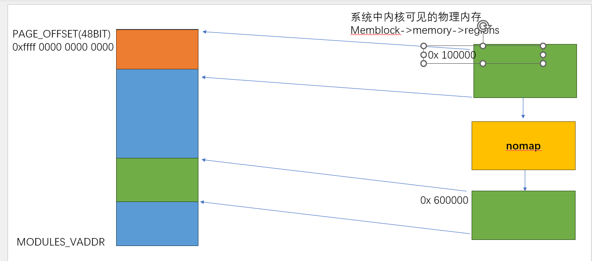

## 线性内存映射区

```json
"node" {
    "label": "kernel_line_map",
    "categories": ["mem"],
    "info": "kernel line mem map",
    "depends": [
         "memblock"
    ]
}
```

### 介绍

#### 回顾

目前为止，我们学习了：

- 内核启动时： 内核镜像虚拟内存的映射和访问
- `fixmap` 虚拟内存区域内存映的映射和访问，以及该虚拟内存的用途(`early_ioremap/fdt/pte`等)
- `memblock` ：早期的内存分配机制实现，以及内存管理器初始内存的初始化过程

再次思考一下，要想使用内存需要实现什么功能？ 

- 一个管理内存的机制： 现在我们通过 `memblock` 中的`memory` 和`reserved`region 记录可用或者已经分配的物理内存

- CPU不能直接访问物理内存，还必须要给物理内存映射一个虚拟内存才可以访问,目前我们还没有实现

而在`MMU`开启场景下，要想访问任何物理内存，都必须要先把该物理内存找一个合适的虚拟内存映射上之后才可以访问，但是虚拟内存和物理内存的映射关系 必须要使用到`PT[X]`页表，因此必须又要能够给页表分配物理内存才可以，因此虚拟内存的页表映射机制依赖`memblock`，而在`memblock`初始化之前，只能使用静态页表，现在我们有了`memblock` 我们终于有了可以使用的内存分配器实现动态内存分配了

### 设计实现

#### 线性地址范围

之前，我们介绍过 `arm64`位下的虚拟内存的布局，而且其中的内核镜像区域和 `fixmap`区域我们也已经学习过，今天我们学习另外一个虚拟内存区域，线性映射区


线性地址位于内核地址的顶半部，根据`VA_BITS`配置不同，总的来说，线性虚拟内存地址从`PAGE_OFFSET` 开始，占据内核虚拟内存地址的一半大小

#### 映射关系

下图是一个示例



为什么这段虚拟内存地址我叫他线性映射，是因为不像我们之前接触的 `fixmap`中的区域，我举个例子说明这其中的区别,在学习`fixmap`的时候 他的特点是： 

- `fixmap`虚拟内存地址 在确定内存配置下 是确定的

- 物理内存是不确定，`FIXMAP_FDT`的特指一个固定的虚拟内存地址范围，但是他映射的物理内存是不确定的，这种映射关系取决于 `fdt`加载时的物理地址

但是线性映射则不一样

- 线性地址 虚拟内存地址范围 在确定内存配置下 是确定的

- 在固定的设备上，物理内存时确定的，物理内存和虚拟内存映射关系是确定的，这种关系可以被固定为：  
  
  - `PHY_TO_VIRT_OFFSET` = `PHYS_ADDR - PHYS_START` | `PAGE_OFFSET`
  
  - `VIRT_TO_PHYS_OFFSET` = `VIRT_ADDR - PAGE_OFFSET` + `PHYS_START`

内核提供两个接口用于实现 地址之间转化

```c
#define virt_to_phys(addr)       \
       (((addr) - PAGE_OFFSET) + PHYS_OFFSET)

#define phys_to_virt(addr)       \
       (((addr) - PHYS_OFFSET)| PAGE_OFFSET)
```

总结： 物理地址和虚拟内存的差异 

- 虚拟内存有一个内存地址前缀`0xffff` 

- 物理内存从`MEM_START`开始被认为是 虚拟内存的`0`地址

- 标记为`nomap`的内存不会被映射

#### 映射建立

上面小节我们简单介绍了 线性虚拟内存，我们可以通过这种线性映射，快速得到一个物理内存的虚拟内存（或者反向）;  但是 虚拟内存和物理内存的映射必须要先建立页表映射，这个映射是再哪里建立的呢？这就是本节主要内容

##### paging_init

`arm64`在`memblock` 完成初始化之后，会执行`paging_init`

```c
start_kernel()
 -> setup_arch()
 -> setup_machine_fdt()
 -> arm64_memblock_init()
 -> paginnt_init()
   -> map_mem(swapper_pg_dir);
   -> memblock_allow_resize()
   -> create_idmap();
   -> declare_kernel_vmas();
```

此函数内容不多，我们主要看 `map_mem` ,此函数逻辑也很简单，就是遍历`memblock`所有内核的可见内存区域，然后以线性映射的方式 映射内核内存

```c
static void __init map_mem(pgd_t *pgdp) {
    /* map all the memory banks */
    for_each_mem_range(i, &start, &end) {
                  if (start >= end)
                          break;
                  /*
                   * The linear map must allow allocation tags reading/writing
                   * if MTE is present. Otherwise, it has the same attributes as
                   * PAGE_KERNEL.
                   */
                  __map_memblock(pgdp, start, end, pgprot_tagged(PAGE_KERNEL),
                                 flags);
          }

}
```

至此，我们现在可以通过线性地址访问物理内存了
