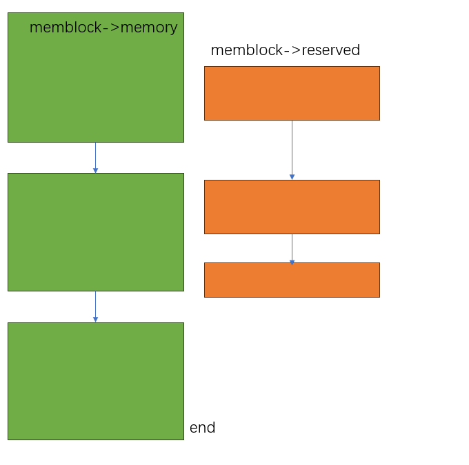

## memblock管理器

```json
"node" {
    "label": "memblock",
    "categories": ["mem"],
    "info": "memblock manage",
    "depends": [
        "obsolate param",
        "fixmap"
  ]
}
```

### 介绍

[官方文档](https://docs.kernel.org/core-api/boot-time-mm.html)

在之前的内存映射过程中，我们看到我们都是使用的静态内存，在系统boot启动阶段，由于此时内核内存子系统还没有初始化，因此无法使用动态内存申请 

但是内存子系统的初始化实际上也要依赖内存的动态分配，因此`linux` 提供了一个更加早期的内存管理系统`memblock`,`memblock`是使用静态内存管理内存的，因此他本身不依赖其他内存管理模块

### 设计实现

#### core struct

##### memblock_flags

```c
 enum memblock_flags {
          MEMBLOCK_NONE           = 0x0,  /* No special request */
          MEMBLOCK_HOTPLUG        = 0x1,  /* hotpluggable region */
          MEMBLOCK_MIRROR         = 0x2,  /* mirrored region */
          MEMBLOCK_NOMAP          = 0x4,  /* don't add to kernel direct mapping */
          MEMBLOCK_DRIVER_MANAGED = 0x8,  /* always detected via a driver */
          MEMBLOCK_RSRV_NOINIT    = 0x10, /* don't initialize struct pages */
  };
```

##### memblock_region

描述形容一段物理内存

```c
  struct memblock_region {
          phys_addr_t base;
          phys_addr_t size;
          enum memblock_flags flags;
  #ifdef CONFIG_NUMA
          int nid;
  #endif
  };
```

##### memblock type

聚合相同类型的 `memblock_region` ，其实现在只有两类： 

- `reserved` : 当前物理内存已经被使用的内存区域

- `memory`： 内核可以看到的内存区域

```c
  struct memblock_type {          
          unsigned long cnt;      
          unsigned long max;
          phys_addr_t total_size; 
          struct memblock_region *regions;
          char *name;
  };
```

##### memblock

```c
  struct memblock {               
          bool bottom_up;  /* is bottom up direction? */
          phys_addr_t current_limit;
          struct memblock_type memory;
          struct memblock_type reserved;
  };
```

在上面已经解释过了，持有 2个`memblock_type`

- bottom_up： 决定内存申请方向

#### core data

内核静态初始化定义了一个`memblock`，内部包含了两个大小固定的静态数组存储`memblock-region` 

```c
  struct memblock memblock __initdata_memblock = {
          .memory.regions         = memblock_memory_init_regions,
          .memory.max             = INIT_MEMBLOCK_MEMORY_REGIONS,
          .memory.name            = "memory",

          .reserved.regions       = memblock_reserved_init_regions,
          .reserved.max           = INIT_MEMBLOCK_RESERVED_REGIONS,
          .reserved.name          = "reserved",

          .bottom_up              = false,
          .current_limit          = MEMBLOCK_ALLOC_ANYWHERE,
  };
```


!!! note

    reserved： 内存表示已经申请或者被使用的内存，
    memory：不是用来表示可以使用的内存，而是表示内核可以看到的内存

#### 核心API

##### memblock_add

```c
  int memblock_add(phys_addr_t base, phys_addr_t size)
```

功能 ： 添加一段新的物理内存到`memblock->memory`  ，并会尝试自动合并

区间插入逻辑核心实现：

```c
for_each_region: 
   case1： 插入区间位于当前区间左边
      找到了可以插入的位置，插入
   case2: 插入区间位于当前区间右边
      继续到下一个区间  
   case3: 插入区间和当前区间左侧有交集 
      检查区间属性是否一致 并尝试合并
   case4: 插入区间和当前区间右侧有交集
       检查区间属性是否一致 并尝试合并
```

##### memblock_remove

```c
 int memblock_remove(phys_addr_t base, phys_addr_t size)核心API:
```

从在`meblock->memmoy`内核可见内存区域 移动走一段内存

##### memblock_reserve

```c
memblock_reserve(phys_addr_t base, phys_addr_t size)
```

 在`reserver` 区域增加一段内存，标记该内存已经被使用

##### memblock_free

```c
memblock_free(void *ptr, size_t size)
```

从`reserver`区域移除一段内存，表示该内存不再被使用

##### memblock_phys_alloc

```c
phys_addr_t memblock_phys_alloc(phys_addr_t size, phys_addr_t align)
```

从可用区域申请一段对齐的物理内存，申请成功后 会被添加到`reserved` 区域

##### memblock_phys_free

释放内存，实际上只需要从`reserved`区域移除

##### memblock_mark_(hotplug/mirror/nomap(base, size);

设置内存`flag`

##### memblock_start(end)_of_DRAM

获得当前系统物理内存区域的 起始/结束 位置.实际实现非常简单,读取`memblock->memory.regions`的头尾

#### 相关配置

##### bootconfig

通过`bootconfig` 设置`memblock=debug` 可以开启日志打印，查看内存申请和释放过程

##### Kconfig

**CONFIG_ARCH_KEEP_MEMBLOCK**

 启动后是否保留`memblock`，一般关闭，可以在调试的时候开启，开启后可以在 `/debugfs/memblock`  查看 `memory/reserved` 字段

#### 关于region扩容

`memblock` 初始`region` 大小现在是`128`，一旦内存区域节点数量不够使用，支持重新申请更大的数组扩容(`resize`) `resize`提供两种方法：

- `slab` 内存分配器初始化之后，使用`slab` 内存分配

- 使用`memblock` 内存分配

`memblock`内存分配得到的是物理地址，必须要保证该内存是已经映射过的，关于内存的映射，我们在下一节会讲到

#### 关于数据竞争

通过 观察`memblock`的代码，看到 数据结构管理是没有任何锁保护的，因此要注意使用时机

#### 内存初始化

内存基本初始化包括两个部分 

- 根据硬件实际的物理内存初始化内核内存可见区域

- 标记内核已经使用的内存 (设备树、内核镜像等)

以`arm64`架构为例

```c
start_kernel()
 -> setup_arch()
 -> setup_machine_fdt()
   -> fixmap_remap_fdt() //fdt 内存映射
   -> memblock_reserve(dt_phys, size); // 标记设备树内存已经被占用
   ->early_init_dt_scan() 
    -> early_init_dt_add_memory_arch()
      -> memblock_add(base, size); // 添加内核可见内存到memblock
   ->arm64_memblock_init()
```

一旦`memblock` 初始内存都初始化之后，此时其他模块可以通过`memblock`分配物理内存了

`arm64_memblock_init` 实现会完成体系架构有关的内存，大概如下： 

- 裁剪超过架构可以访问的最大范围(`PA_BITS`)

- `memstart_addr`: 初始化记录当前设备可访问物理内存的起始地址，再下一小节关于线性地址映射 会用到

- 裁剪超过 `线性映射` 内存范围的物理内存

- 标记`initrd` 内存为 `reserved`

- 标记 内核镜像地址为`reserved`

- 标记设备树中主动被标记为`reserved`的内存

最终初始化完成之后，`memblock` 可以得到一个类似这样的结构，记录当前系统的内存和已经使用的内存 


