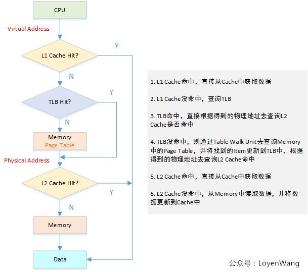
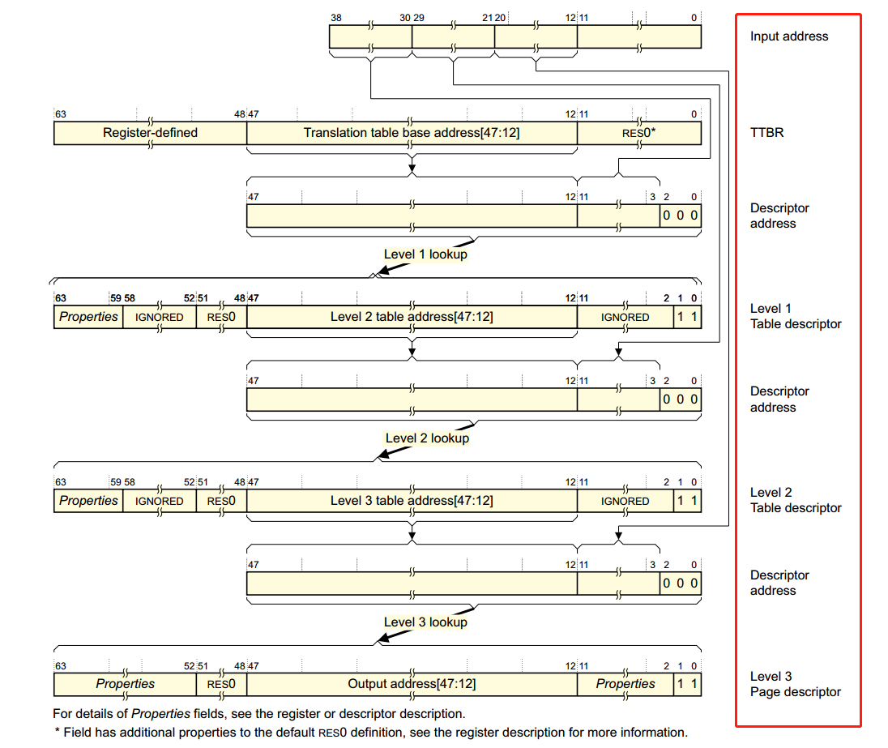
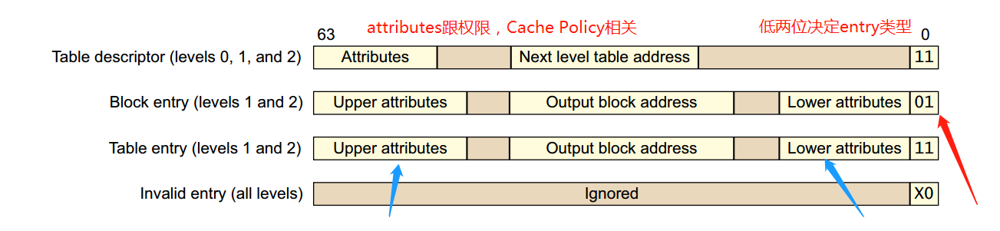
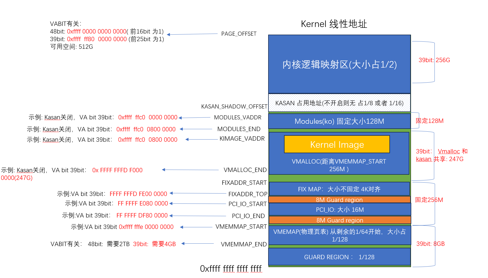

# 内存子系统简介

## 前言

### 基础要求
前提至少学习过 X86/ARM/RISC-V 一门体系架构

### 什么是内存

我的个人看法: 在计算机体系架构中，ALU计算单元必须需要存储参与工作，用来作为 数据输入、输出 保存(简单点就是数据需要存放)
正常来说，能够直接被CPU **寻址** 访问到的存储单元，都可以叫做内存，而其物理、电子形态、大小则是会随着基础科学发展而不断演进

DDRAM 工作方式的一个[小科普](https://www.youtube.com/watch?v=fpnE6UAfbtU&list=PL8dPuuaLjXtNlUrzyH5r6jN9ulIgZBpdo&index=7)，DDRAM 目前应该是主流 内存形态的一种


### 什么是内存管理

下图是一个非常简单的场景, CPU指令执行，需要加载指令代码，在执行函数，需要用到栈, 因此需要根据某种规定，对内存进行功能划分，比如哪段内存是用来存放代码的，
哪段内存又是用来作为程序的栈等


上面我们只是描述了一个非常简单的场景，只是想表达，内存管理功能之一是保证内存被合理的分配使用，
当然还有许多其他工作需要完成，接下来会一一展开

## 虚拟内存
本章主要是对内存管理的基础概念和技术做一个介绍，为后面更深入的讨论做好基础

我们先假设一下，如果没有虚拟内存，应用是如何工作的


上图是假设有两个应用同时运行的情况，我标注了一些可能发生的情况 

1. 如果进程都是直接访问物理内存，意味着进程可以访问任意的物理内存，则可能发生内存踩踏， 当然这种情况可以通过一些约束限制
2. 物理内存可能是不连续的，如果一个进程分配比较多的连续内存，内存不足，则该进程无法被加载，当然也可以通过交换进程(把没有在调度的进程放到磁盘)
3. 假设我们在给每个进程分配物理内存，是按照连续内存分配(难道不应该吗)，则交换进程的代价过于庞大
4. 编译器在编译用户态应用，应该怎么给变量、函数分配地址。

总之，出于用户态进程对于**空间隔离** 的需求，虚拟内存技术孕育而生

- 屏蔽掉物理内存的存在, 让不同进程 以为是自己在独享一段内存
- 屏蔽掉物理内存的大小、分布；让不通进程以为自己有很大的内存，并且内存是连续的

### 虚拟内存地址翻译

这里简单介绍一下目前主流的虚拟内存翻译技术:MMU 


知识点: 

 - CPU在执行指令，指令访问的地址是虚拟地址，但是实际上，该虚拟地址会经过MMU硬件+映射表查找，最终访问物理内存地址
 - MMU的配置以及页表的维护 是内存管理模块完成的


### 页表

页表就是一个用于存放物理内存信息的 数组结构


 - 页表存放在物理内存中，MMU使用指定的寄存器存储 页表基址
 - 利用要访问的虚拟内存的信息，获得页表中索引 
 - 利用索引得到的 页表条目(entry) 获得实际的物理内存
 - 访问实际的物理内存 

### 页表大小

页表大小一般指每一个 页表条目所能代表的 物理内存范围 


上图很好的解释了为什么需要页表大小 


### 多级页表

- 如果页表条目太大，内存会浪费
- 但是如果页表条目太小，会占用过多内存 


多级页表，第一级页表表示范围更大

###  ARM64架构下的MMU

MMU对内存的处理，一般都会和架构相关，我们选择ARM64架构下MMU作为一个介绍

下图是一个MMU寻址的流水线图


下图是一个MMU实际寻址的过程 



上面我们大致介绍了寻址流程，命中的情况暂且不考虑，我们主要看一下，虚拟内存是如何访问物理内存的

###  ARM64支持

虚拟地址到物理地址的映射通过查表的机制来实现，ARMv8中，Kernel Space的页表基地址存放在TTBR1_EL1寄存器中，
User Space页表基地址存放在TTBR0_EL0寄存器中，其中内核地址空间的高位为全1，
`0xFFFF0000_00000000 ~ 0xFFFFFFFF_FFFFFFFF`
用户地址空间的高位为全0`0x00000000_00000000 ~ 0x0000FFFF_FFFFFFFF`


 

64位虚拟地址中，并不是所有位都用上，除了高16位用于区分内核空间和用户空间外，有效位的配置可以是：36, 39, 42, 47。


页面大小支持3种页面大小：4KB, 16KB, 64KB

页表支持至少两级页表，至多四级页表，Level 0 ~ Level 3

ARM会根据实际使用的VA大小，以及选择的页面大小，来决定应该使用几级页表 
页表映射层级: 支持2-4级，

 - 16K页表，36VA 2级页表
 - 64K页表，42VA 2级页表
 - 64K页表，48/52VA 3级页表
 - 4K页表，39VA 3级页表
 - 不是64K页表，也不是48VA，默认都是4级页表


### 寻址介绍

第一种情况: 虚拟内存范围39BIT，也就是512GB的内存范围，并且使用4KB页表，默认使用3级页表 



下图我们是我们自己的一个分解 


下图是页表内容的描述




### Linux对页表的定义

由于不同页表的描述 在ARM下有规定，因此，linux把各级页表分别命名: PGD PUD(3级页表没有)  PMD PTE


代码路径：

 - `arch/arm64/include/asm/pgtable-types.h`：定义`pgd_t, pud_t, pmd_t, pte_t`等类型；
 - `arch/arm64/include/asm/pgtable-prot.h`：针对页表中`entry`中的权限内容设置；
 - `arch/arm64/include/asm/pgtable-hwdef.h`：主要包括虚拟地址中`PGD/PMD/PUD`等的划分，
   这个与虚拟地址的有效位及分页大小有关，此外还包括硬件页表的定义， TCR寄存器中的设置等；
 - `arch/arm64/include/asm/pgtable.h`：页表设置相关；

在ARM中，与页表相关的寄存器有：`TCR_EL1, TTBRx_EL1`

关键代码：
```

	/* 
	 * 计算不同 页表映射的entry表示的大小位移，比如:
     * 假设当前是4级页表 ( 0<=n <= 3)
     * PTE SHIFT：4K = (12 - 3) * 1 + 3 = 12    	 
	 * PMD SHIFT: 2M = (12 - 3) * 2 + 3 = 21   
	 * PUD SHIFT: 1G = (12 - 3) * 3 + 3 = 30 
	 * PGD SHIFT：512G = (12 - 3) * 4 + 3 = 39 
	 * 假设当前是3级页表 ( 0<=n <= 3)
     * PTE SHIFT：4K = (12 - 3) * 1 + 3 = 12    	 
	 * PMD SHIFT: 2M = (12 - 3) * 2 + 3 = 21   
	 * PGD SHIFT：1G = (12 - 3) * 3 + 3 = 30 
	*/
	#define ARM64_HW_PGTABLE_LEVEL_SHIFT(n) ((PAGE_SHIFT - 3) * (4 - (n)) + 3)

	#define PMD_SHIFT               ARM64_HW_PGTABLE_LEVEL_SHIFT(2)  //如上21
	#define PMD_SIZE                (_AC(1, UL) << PMD_SHIFT) // 2M
	
	// 注意: 三级页表 没有PUD 
	#define PUD_SHIFT               ARM64_HW_PGTABLE_LEVEL_SHIFT(1) //如上30
	#define PUD_SIZE                (_AC(1, UL) << PUD_SHIFT) // 1G
	
	// 注意: 三四级页表下 PGD 含义不同，三级页表，PGD = PUD 
	#define PGDIR_SHIFT             ARM64_HW_PGTABLE_LEVEL_SHIFT(4 - CONFIG_PGTABLE_LEVELS)
	#define PGDIR_SIZE              (_AC(1, UL) << PGDIR_SHIFT)
	
```
	
## 虚拟内存空间整体分布

### 空间布局整体介绍
虽然不同进程的虚拟内存是隔离的，但是实际上隔离的主要是用户态，内核态依然是共享的
下图分别是32位 64位下用户态和内核态的内存分布



 
arm64的内存布局在linux文档中有比较详细的描述 [内存布局](https://www.kernel.org/doc/Documentation/arm64/memory.rst)

文档中基本上可以知道 arm64架构下: 
 - 内核态地址范围从 0xffff000000000000 到0xffffffffffffffff (前16bit都是1)
 - 用户态地址范围从 0x0000000000000000 到0x0000ffffffffffff (前16bit都是0)
 - 有一段空洞范围地址不使用(前16bit) 也就是一共只使用了2个48bit的地址范围(256TB)，一共是512TB
 - 内核态256TB的内存又根据功能划分了不同的地址范围


### 虚拟内存的访问

不通用户态访问进程访问各自的用户态虚拟内存


知识点:
   - 不通进程的虚拟内存，就算虚拟内存是相同的，但是实际上访问的不通的物理内存
   - 内存管理模块会管理这种关系，硬件会通过某种机制自动完成地址翻译(后面讲)

下图是不同用户态访问内核地址空间


知识点: 
 - 只有在内核态才能访问内核的地址
 - 用户态程序进入内核态之后，访问的是同一套内核地址