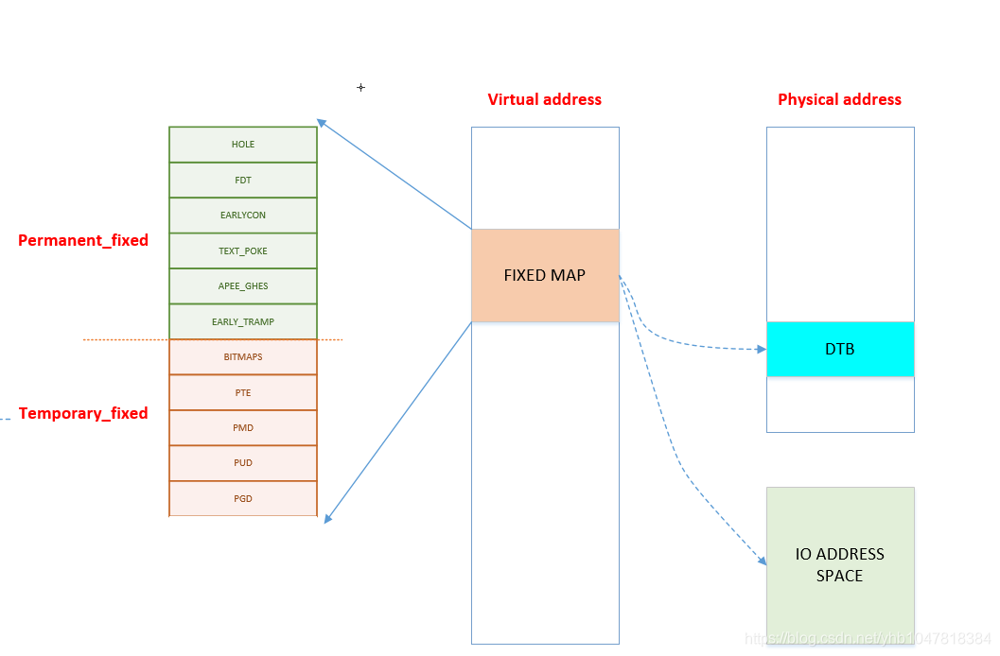

# 内存初始化

我们已经介绍过了一些基础知识，本节介绍内核启动阶段内存管理的相关内容


## 前置基础


### 汇编指令

adrp 指令: ADRP  Xd, label; 利用当前PC 和label的相对地址，计算label 内存地址的4KB基址 

```
	
	//如果PC 当前指令地址为 0x1000 0000 ; data 相对 0x1000 0000 的偏移是 0x1234，
	//可以得到data的地址为0x1000 1234，他的内存基址就是 0x1000 1000
	// X0的值就为  0x1000 1000
	ADRP  X0, data；
```

### 内核布局描述

内核的地址分布描述定义在:  `arch/arm64/include/asm/memory.h` 
假设当前配置: 4K页(`CONFIG_PAGE_SHIFT=12`) VA地址是48BIT(`256TB`)
```
	/* 
	 * STRUCT_PAGE_MAX_SHIFT 定义了一个 管理页表结构(struct page)的大小
	 * PAGE_SHIT 是页表大小位移(比如 4K是12 16K是14 64K是16)
	 * VMEMMAP_SHIFT 是用于计算线性地址大小的除数
	 * 举例: 为了管理4GB大小的线性地址，需要使用 4GB/4KB = 1024 个页表, 每个页表大小如果占1B, 需要 1024 * 1B 的内存 
	 * 因此页表所占内存计算公式为 : 需要映射的内存大小/页大小*页表内存 =   需要映射的内存大小/ (页大小 - 页表内存) 
	*/
	
	#define VMEMMAP_SHIFT   (PAGE_SHIFT - STRUCT_PAGE_MAX_SHIFT) // 目前是: 12（4KB） - 6(64B) = 6
	// 计算管理128TB(0xffff800000000000 - 0xffff000000000000) 的线性内存 页表条目需要使用的内存大小	
	#define VMEMMAP_SIZE    ((_PAGE_END(VA_BITS_MIN) - PAGE_OFFSET) >> VMEMMAP_SHIFT) // 目前是 128TB/4KB*64B=2TB  
	
	#define VA_BITS                 (CONFIG_ARM64_VA_BITS)                           
	#define _PAGE_OFFSET(va)        (-(UL(1) << (va)))      //内核地址起始地址  0xffff000000000000                        
	#define PAGE_OFFSET             (_PAGE_OFFSET(VA_BITS)) //内核地址起始地址  0xffff 0000 0000 0000                            
	#define KIMAGE_VADDR            (MODULES_END)   //kernel image的VA地址 位于modules 结束 0xffff800007ffffff                                     
	#define MODULES_END             (MODULES_VADDR + MODULES_VSIZE)   //modules结束地址 0xffff800007ffffff                   
	#define MODULES_VADDR           (_PAGE_END(VA_BITS_MIN))  //modules起始地址 0xffff800000000000                                 
	#define MODULES_VSIZE           (SZ_128M)  //modules大小 128M                                       
	#define VMEMMAP_START           (-(UL(1) << (VA_BITS - VMEMMAP_SHIFT))) // fffffc0000000000        
	#define VMEMMAP_END             (VMEMMAP_START + VMEMMAP_SIZE) // 2TB大小: fffffdffffffffff                 
	#define PCI_IO_END              (VMEMMAP_START - SZ_8M)                          
	#define PCI_IO_START            (PCI_IO_END - PCI_IO_SIZE)                       
	#define FIXADDR_TOP             (VMEMMAP_START - SZ_32M) 
	
	#define _PAGE_END(va)           (-(UL(1) << ((va) - 1)))
```

下图以VA 39BIT 和 4K页做演示


 
下图以VA48 BIT 和 4K页做演示


 
内核内存管理的一部分工作，就是负责管理不同区域的内存的分配、释放

接下来我们将先按照 内核启动顺序 剖析内核内存初始化过程  


## 启动阶段内存初始化

### 内核镜像
内核镜像我们简单也可以理解为是一个二进制的文件，`arch/arm64/kernel/vmlinux.lds.S`主要定义了代码段的布局情况,
SECTIONS 描述了段的定义也可以直接通过 `readelf -d  vmlinux` 获取内核链接后的文件 查看布局情况


###  一阶段:镜像1:l映射

当uboot 加载完成内核，并且跳转到内核起始位置的时候，此时MMU处于未打开的状态，
因此此时CPU在执行内核代码是直接访问的物理内存;
这段代码执行期间，严格意义上来说不能够访问类似于**全局变量**、**函数**等会涉及到 虚拟内存地址的代码

内存初始化会分几个阶段，第一阶段，使能mmu，为了MMU使能后能够正常工作，需要先把 内核的镜像代码建立 VA 到PA的映射


为什么是线性映射？因为PC在刚开启MMU的时候 PC的地址依然是物理内存地址 因此需要先建立1:1的映射


###  线性映射的页表准备
映射表位置及大小: `arch/arm64/kernel/vmlinux.lds.S`


```
	
	init_idmap_pg_dir = .;
    . += INIT_IDMAP_DIR_SIZE;
    init_idmap_pg_end = .;
	
	// 下面代码用于计算 虚拟内存需要多少的内存
	
	#define EARLY_ENTRIES(vstart, vend, shift, add) \
        ((((vend) - 1) >> (shift)) - ((vstart) >> (shift)) + 1 + add)

	#define EARLY_PGDS(vstart, vend, add) (EARLY_ENTRIES(vstart, vend, PGDIR_SHIFT, add))

	#define EARLY_PAGES(vstart, vend, add) ( 1                      /* PGDIR page */                                \
                        + EARLY_PGDS((vstart), (vend), add)     /* each PGDIR needs a next level page table */  \
                        + EARLY_PUDS((vstart), (vend), add)     /* each PUD needs a next level page table */    \
                        + EARLY_PMDS((vstart), (vend), add))    /* each PMD needs a next level page table */
						
	#define INIT_DIR_SIZE (PAGE_SIZE * EARLY_PAGES(KIMAGE_VADDR, _end, EARLY_KASLR))
     
	/* the initial ID map may need two extra pages if it needs to be extended */
	#if VA_BITS < 48
	#define INIT_IDMAP_DIR_SIZE     ((INIT_IDMAP_DIR_PAGES + 2) * PAGE_SIZE)
	#else   
	#define INIT_IDMAP_DIR_SIZE     (INIT_IDMAP_DIR_PAGES * PAGE_SIZE)
	#endif  
	#define INIT_IDMAP_DIR_PAGES    EARLY_PAGES(KIMAGE_VADDR, _end + MAX_FDT_SIZE + SWAPPER_BLOCK_SIZE, 1)
```

下图演示了 EARLY_PAGES 的计算公式 


 
如果映射1M，需要考虑0的情况，因此代码中都做了+1处理 


### 线性映射建立


内核关键代码: `arch/arm64/kernel/head.S`是内核一开始启动的代码


此外，宏的实现也考虑了一些额外的级别和特定的位移量（extra_shift），以根据不同的条件填充页表。

```
	__HEAD                                                                   
	/*                                                                       
	* DO NOT MODIFY. Image header expected by Linux boot-loaders.           
	*/                                                                      
	efi_signature_nop                       // special NOP to identity as PE/COFF executable
	b       primary_entry                   // 跳转到内核入口
	.quad   0                               // Image load offset from start of RAM, little-endian
	le64sym _kernel_size_le                 // Effective size of kernel image, little-endian
	le64sym _kernel_flags_le                // Informative flags, little-endian
	.quad   0                               // reserved                      
	.quad   0                               // reserved                      
	.quad   0                               // reserved                      
	.ascii  ARM64_IMAGE_MAGIC               // Magic number                  
	.long   .Lpe_header_offset              // Offset to the PE header.      
	
	
	SYM_CODE_START(primary_entry)
     bl      preserve_boot_args
     bl      init_kernel_el                  // w0=cpu_boot_mode
     mov     x20, x0
     bl      create_idmap                    //建立内核代码内存映射 

```

```
          
    adrp    x0, init_idmap_pg_dir  // x0 = init_idmap_pg_dir 物理内存基址                                         
    adrp    x3, _text             // x3 =  内核镜像的起始地址的物理内存基址                                       
    adrp    x6, _end + MAX_FDT_SIZE + SWAPPER_BLOCK_SIZE  // x6 = 内核镜像结束的物理内存地址                
    mov     x7, SWAPPER_RX_MMUFLAGS  

    map_memory x0, x1, x3, x6, x7, x3, IDMAP_PGD_ORDER, x10, x11, x12, x13, x14, EXTRA_SHIFT
```

关键函数说明: `.macro map_memory, tbl, rtbl, vstart, vend, flags, phys, order, istart, iend, tmp, count, sv, extra_shift`
参数列表：
- tbl：页表的位置。
- rtbl：第一个级别的页表项应使用的虚拟地址。
- vstart：映射范围的起始虚拟地址。
- vend：映射范围的结束虚拟地址（实际映射的范围是vstart到vend - 1）。
- flags：用于映射最后级别页表项的标志。
- phys：与vstart对应的物理地址，假定物理内存是连续的。
- order：一个值，表示页表的级别，即#imm（立即数）的2的对数，它表示PGD表中的条目数。
- istart, iend, tmp, count, sv, extra_shift：这些是临时寄存器和标志，用于在宏内部进行计算和存储中间值。

map_memory 给定的参数映射虚拟地址到物理地址，计算页表级别，并填充页表的不同级别。根据宏的调用情况，它可能涉及多个级别的页表。

### MMU开启


映射建立完成后就要准备开启MMU，代码依然位于 head.S 

```
	SYM_FUNC_START_LOCAL(__primary_switch)
        adrp    x1, reserved_pg_dir
        adrp    x2, init_idmap_pg_dir  //加载tTBR 基址为 init_idmap_pg_dir
        bl      __enable_mmu
	#ifdef CONFIG_RELOCATABLE
        adrp    x23, KERNEL_START
        and     x23, x23, MIN_KIMG_ALIGN - 1
	#ifdef CONFIG_RANDOMIZE_BASE
        mov     x0, x22
        adrp    x1, init_pg_end
        mov     sp, x1
        mov     x29, xzr
        bl      __pi_kaslr_early_init
        and     x24, x0, #SZ_2M - 1             // capture memstart offset seed
        bic     x0, x0, #SZ_2M - 1
        orr     x23, x23, x0                    // record kernel offset
	#endif
	#endif
        bl      clear_page_tables
        bl      create_kernel_mapping   
```

### 非线性二次映射 


下图演示了 二次映射的主要工作


```
	
	
	SYM_FUNC_START_LOCAL(create_kernel_mapping)
			adrp    x0, init_pg_dir
			mov_q   x5, KIMAGE_VADDR                // compile time __va(_text)
	#ifdef CONFIG_RELOCATABLE
			add     x5, x5, x23                     // add KASLR displacement
	#endif  
			adrp    x6, _end                        // runtime __pa(_end)
			adrp    x3, _text                       // runtime __pa(_text)
			sub     x6, x6, x3                      // _end - _text
			add     x6, x6, x5                      // runtime __va(_end)
			mov     x7, SWAPPER_RW_MMUFLAGS
			
			map_memory x0, x1, x5, x6, x7, x3, (VA_BITS - PGDIR_SHIFT), x10, x11, x12, x13, x14
```

上述动作 完成了第二阶段的映射  紧接着又通过绝对跳转 跳转到了 `__primary_switched` 

```
ldr     x8, =__primary_switched 
adrp    x0, KERNEL_START                // __pa(KERNEL_START)           
br      x8             
SYM_FUNC_END(__primary_switch) 

bl      finalise_el2                    // Prefer VHE if possible
ldp     x29, x30, [sp], #16
bl      start_kernel                    // 正式进入内核
ASM_BUG()
 ```

## 初级内存管理

回顾上一节，我们讲过了 内核的镜像是如何被加载到内存，以及内核镜像自己又是如何建立页表，开启MMU，然后又重新建立映射的，
上述过程会涉及到两个页表: `idmap_pg_dir` 以及 `init_pg_dir` 

但是无论如何, 之前的动作 主要目的是为了后续 代码能够在虚拟内存的地址范围内执行

本节我们继续探讨物理内存是怎么管理的

### 设备树内存映射
为了管理物理内存，首先要知道有多大的物理内存，以及物理内存在CPU的物理地址范围，换言之，我们需要知道真实硬件的信息，
那就不得不先把设备树解析出来，关于更多设备树的内容，请阅读 驱动章节 

这里先让我们回顾一下 内核线性地址的划分: 


 
可以找到一个FIXMAP 的虚拟内存空间，内核会使用这段虚拟内存 做一些前期初始化工作，关于fixmap的地址描述在:
`/arch/arm64/include/asm/fixmap.h`

内核对于该地址空间的描述: 这段注释解释了在内核中定义的一组特殊虚拟地址，这些地址在编译时是常量，
但在启动过程中才会与物理地址关联。这些特殊虚拟地址通常用于处理内核启动和底层硬件初始化等任务。


我们通过图示展示一下 fixmap 内存区域主要功能 


 
关键代码: 定义了FIXMAP的大小  以及常用函数

```
	
__end_of_permanent_fixed_addresses // 是 enum fixed_addresses 的结束索引
//fixed_addresses 每增加一个功能，FIXMAP占用的虚拟内存就增加4K
#define FIXADDR_SIZE    (__end_of_permanent_fixed_addresses << PAGE_SHIFT) 
#define FIXADDR_START   (FIXADDR_TOP - FIXADDR_SIZE)

#define __fix_to_virt(x)        (FIXADDR_TOP - ((x) << PAGE_SHIFT))  // 从FIX功能区 ENMU 得到该 内容所在 VA地址 
#define __virt_to_fix(x)        ((FIXADDR_TOP - ((x)&PAGE_MASK)) >> PAGE_SHIFT) // 从VA地址，得到该地址 的FIX功能区 ENUM
	
```

FDT其实一共占了4M的内存，实际上FDT的大小不能超过2M，这样作的目的是处于对齐的考虑


接下来让我们具体看一下 FDT设备树的内存映射过程

```
	
__primary_switched
   - early_fdt_map(fdt_phys) 
     - early_fixmap_init()  // 初始化 init_pg_dir -> bm_pud -> bm_pmd->bm_pte 的页表
	 - fixmap_remap_fdt(dt_phys, &fdt_size, PAGE_KERNEL) // 页表填充 FDT，是段映射，只填充到 bm_pmd这一层 

```
这里我们在复习和学习一下 页表建立和内存映射: 
 - 首先，要先准备好 页表的物理内存 (PGD 1页 PMD(按需 至少1页) PTE(按需 至少一页) ) 
 - 然后，要知道要映射的 VA地址, 知道VA以后，可以知道要填充 哪条 PGD/PUD/PMD ENTRY
 - 最后，需要知道给VA 分配对应的物理地址，就可以填充PTE

我们用一个图示说明这个过程:


那么FDT的页表物理内存 是如何得到的， 页表初始化代码位置在early_fdt_map  

 - PGD: 会存在 init_mm.pgd 指针 
 - PMD PUD PTE 放在三个静态数组中,bm_pud,bm_pmd,bm_pte 这里回顾一下之前FDT的对齐，因为FDT是2M对齐并且占用物理内存也是2M，因此是通过段映射的方式 映射的 
 - 利用  __pxd_populate 填充 pgd entry -> pmd,   pmd entry -> pte 
 

设备树认证完以后，fdt此时就可以正常访问了,arm其实对设备树进行了两次映射 

```
//第一次
__primary_switched
   - early_fdt_map(fdt_phys) 
     - early_fixmap_init()  // 页表准备
	 - fixmap_remap_fdt(dt_phys, &fdt_size, PAGE_KERNEL) // 页表填充

//第二次 
start_kernel 
 - setup_arch
   - early_fixmap_init 
   - setup_machine_fdt
    - fixmap_remap_fdt
	
```
经过调查 两次映射 是由于 kasan的某个问题:  commit id  1191b6256e50a07e7d8ce36eb970708e42a4be1a

fdt的第一次访问: 在完成fdt的内存映射以及校验和检查， 可以在 setup_machine_fdt 中打印fdt 的 model 

```
[    0.000000] Machine model: BST A1000B FAD-B //黑芝麻
[    0.000000] Machine model: Machine model: linux,dummy-virt // qemu 
```
注意: 这里纠正一下，后面发现，其实FDT再映射的时候，是按照section mapping 映射的，并不会
使用到PTE页表，bm_pte 是为后面的其他虚拟内存映射准备的

```
	
	//再 alloc_init_pud(pmd) 都会看到下面类似的代码 
	//会根据映射的物理地址和大小，判断是否能够 huge map
	//如果可以 就不会进入下一级映射
	
     /*                                                               
      * For 4K granule only, attempt to put down a 1GB block          
     */                                                              
      if (pud_sect_supported() &&                                      
         ((addr | next | phys) & ~PUD_MASK) == 0 &&                    
          (flags & NO_BLOCK_MAPPINGS) == 0) {                          
              pud_set_huge(pudp, phys, prot);                          
                                                                       
              /*                                                       
               * After the PUD entry has been populated once, we       
               * only allow updates to the permission attributes.      
               */                                                      
              BUG_ON(!pgattr_change_is_safe(pud_val(old_pud),          
                                            READ_ONCE(pud_val(*pudp))));
      } else {                                                         
              alloc_init_cont_pmd(pudp, addr, next, phys, prot,        
                                  pgtable_alloc, flags);               
                                                                       
              BUG_ON(pud_val(old_pud) != 0 &&                          
                     pud_val(old_pud) != READ_ONCE(pud_val(*pudp)));   
      }
```

因为DTB再VA上 是要求2MB对齐的，所以只映射到了PMD这一级

总结: 
 - setup_machine_fdt： 完成FDT的映射，以及扫描FDT设备树节点(内存、串口等信息) 
 - 关于内存: 会把FDT物理内存放在 memblock的保留区，会扫描设备树的可用内存信息 以及 reserver 内存信息

## memblock管理器

[官方文档]( https://docs.kernel.org/core-api/boot-time-mm.html)


这是一个鸡生蛋 蛋生鸡的问题，在系统boot启动阶段，由于此时 内核更高级的内存管理功能还没有初始化，
这个阶段如果想要分配内存，并不能使用类似vmalloc，alloc_pages这种接口，
但是又因为本身内存管理器的初始化也依赖内存分配(那是当然的),因此此时，内核需要一个简单的内存管理器(不依赖内存分配)，
然后前期基于这个简单的内存管理器管理内存，等内核 真正意义上的内存管理器初始化之后 再去切换掉

回顾我们之前 镜像映射、fdt 映射的过程，页表的物理内存都是镜像内的段、或者通过静态变量直接指定的，
就是因为物理内存此时根本没有被管理起来

memblock的核心结构如下图:


memblock的初始化 会默认是给一个控的静态数据结构(memblock.c)


核心API: 

- memblock_add(base,size) : 在memory区域增加 一段内存，该内存段表示内核可见
- memblock_remove(base,size) :从在memory区域 移动走一段内存，该内存段对内核不再可见
- memblock_reserve(base,size) : 在reserver 区域增加一段内存，表示该内存已经被使用
- memblock_free(base,size) : 在reserver区域释放一段内存，表示该内存不再被使用
- memblock_mark_(hotplug/mirror/nomap(base, size);: 标记 mem中的内存
- memblock_phys_alloc(size,align): 申请固定大小size  align对齐的物理内存
- memblock_phys_alloc_range(size, align, start, end): 申请固定大小size  align对齐的物理内存


### 物理内存第一阶段管理

现在已经具有了 memblock 和 fdt，物理内存的初始化 始于 fdt扫描可用内存 : 


 
以及 arm64_memblock_init


setup_machine_fdt 会扫描 memory节点，并把内存插入到 memory中，可以通过给内核传入 
memblock=debug开关打开相关日志 

```
[    0.000000] Booting Linux on physical CPU 0x0000000000 [0x411fd050]
[    0.000000] Linux version 6.1.54-rt15-00057-g9af25a0cf1e8-dirty (guoweikang@ubuntu-virtual-machine) (aarch64-none-linux-gnu-gcc (Arm GNU Toolchain 12.3.Rel1 (Build arm-12.35)) 12.3.1 23
[    0.000000] Machine model: BST A1000B FAD-B
[    0.000000] earlycon: uart8250 at MMIO32 0x0000000020008000 (options '')
[    0.000000] printk: bootconsole [uart8250] enabled
[    0.000000] memblock_remove: [0x0001000000000000-0x0000fffffffffffe] arm64_memblock_init+0x30/0x258
[    0.000000] memblock_remove: [0x00000040 0000 0000-0x0000003ffffffffe] arm64_memblock_init+0x94/0x258
[    0.000000] memblock_reserve: [0x0000000081010000-0x0000000082bdffff] arm64_memblock_init+0x1e8/0x258
[    0.000000] memblock_reserve: [0x0000000018000000-0x00000000180fffff] early_init_fdt_scan_reserved_mem+0x70/0x3c0
[    0.000000] memblock_reserve: [0x00000001ce7ed000-0x00000001ce7fcfff] early_init_fdt_scan_reserved_mem+0x70/0x3c0
[    0.000000] memblock_reserve: [0x00000000b2000000-0x00000000e7ffffff] early_init_fdt_scan_reserved_mem+0x2b8/0x3c0
[    0.000000] memblock_reserve: [0x00000000e8000000-0x00000000e87fffff] early_init_fdt_scan_reserved_mem+0x2b8/0x3c0
[    0.000000] memblock_reserve: [0x00000000e8800000-0x00000000e8ffffff] early_init_fdt_scan_reserved_mem+0x2b8/0x3c0
[    0.000000] Reserved memory: created DMA memory pool at 0x000000008b000000, size 32 MiB
[    0.000000] OF: reserved mem: initialized node bst_atf@8b000000, compatible id shared-dma-pool
[    0.000000] Reserved memory: created DMA memory pool at 0x000000008fec0000, size 0 MiB
[    0.000000] OF: reserved mem: initialized node bst_tee@8fec0000, compatible id shared-dma-pool
[    0.000000] Reserved memory: created DMA memory pool at 0x000000008ff00000, size 1 MiB
[    0.000000] OF: reserved mem: initialized node bstn_cma@8ff00000, compatible id shared-dma-pool
[    0.000000] Reserved memory: created DMA memory pool at 0x000000009a000000, size 32 MiB
[    0.000000] OF: reserved mem: initialized node bst_cv_cma@9a000000, compatible id shared-dma-pool
[    0.000000] Reserved memory: created DMA memory pool at 0x000000009c000000, size 16 MiB
[    0.000000] OF: reserved mem: initialized node vsp@0x9c000000, compatible id shared-dma-pool
[    0.000000] Reserved memory: created DMA memory pool at 0x00000000a1000000, size 16 MiB
[    0.000000] OF: reserved mem: initialized node bst_isp@0xa1000000, compatible id shared-dma-pool
[    0.000000] Reserved memory: created CMA memory pool at 0x00000000b2000000, size 864 MiB
[    0.000000] OF: reserved mem: initialized node coreip_pub_cma@0xb2000000, compatible id shared-dma-pool
[    0.000000] Reserved memory: created CMA memory pool at 0x00000000e8000000, size 8 MiB
[    0.000000] OF: reserved mem: initialized node noc_pmu@0xe8000000, compatible id shared-dma-pool
[    0.000000] Reserved memory: created CMA memory pool at 0x00000000e8800000, size 8 MiB
[    0.000000] OF: reserved mem: initialized node canfd@0xe8800000, compatible id shared-dma-pool
[    0.000000] memblock_phys_alloc_range: 4096 bytes align=0x1000 from=0x0000000000000000 max_addr=0x0000000000000001 early_pgtable_alloc+0x24/0xa8
[    0.000000] memblock_reserve: [0x00000001effff000-0x00000001efffffff] memblock_alloc_range_nid+0xd8/0x16c
[    0.000000] memblock_phys_alloc_range: 4096 bytes align=0x1000 from=0x0000000000000000 max_addr=0x0000000000000001 early_pgtable_alloc+0x24/0xa8
[    0.000000] memblock_reserve: [0x00000001efffe000-0x00000001efffefff] memblock_alloc_range_nid+0xd8/0x16c
[    0.000000] memblock_phys_alloc_range: 4096 bytes align=0x1000 from=0x0000000000000000 max_addr=0x0000000000000001 early_pgtable_alloc+0x24/0xa

[    0.000000] MEMBLOCK configuration:
[    0.000000]  memory size = 0x00000000c8100000 reserved size = 0x0000000044670ba8
[    0.000000]  memory.cnt  = 0x9
[    0.000000]  memory[0x0]     [0x0000000018000000-0x00000000180fffff], 0x0000000000100000 bytes flags: 0x0  
[    0.000000]  memory[0x1]     [0x0000000080000000-0x000000008affffff], 0x000000000b000000 bytes flags: 0x0
[    0.000000]  memory[0x2]     [0x000000008b000000-0x000000008cffffff], 0x0000000002000000 bytes flags: 0x4
[    0.000000]  memory[0x3]     [0x000000008d000000-0x000000008fcfffff], 0x0000000002d00000 bytes flags: 0x0
[    0.000000]  memory[0x4]     [0x000000008fd00000-0x000000008fdfffff], 0x0000000000100000 bytes flags: 0x4
[    0.000000]  memory[0x5]     [0x000000008fe00000-0x000000008febffff], 0x00000000000c0000 bytes flags: 0x0
[    0.000000]  memory[0x6]     [0x000000008fec0000-0x00000000b1ffffff], 0x0000000022140000 bytes flags: 0x4
[    0.000000]  memory[0x7]     [0x00000000b2000000-0x00000000efffffff], 0x000000003e000000 bytes flags: 0x0
[    0.000000]  memory[0x8]     [0x0000000198000000-0x00000001efffffff], 0x0000000058000000 bytes flags: 0x0
[    0.000000]  reserved.cnt  = 0xb
[    0.000000]  reserved[0x0]   [0x0000000018000000-0x00000000180fffff], 0x0000000000100000 bytes flags: 0x0 fdt
[    0.000000]  reserved[0x1]   [0x0000000081010000-0x0000000082bdafff], 0x0000000001bcb000 bytes flags: 0x0 kernel 
[    0.000000]  reserved[0x2]   [0x0000000082bde000-0x0000000082bdffff], 0x0000000000002000 bytes flags: 0x0
[    0.000000]  reserved[0x3]   [0x0000000083000000-0x000000008affffff], 0x0000000008000000 bytes flags: 0x0 CMA 128M 
[    0.000000]  reserved[0x4]   [0x00000000b2000000-0x00000000e8ffffff], 0x0000000037000000 bytes flags: 0x0 CMA 880M  
[    0.000000]  reserved[0x5]   [0x00000001ce7ed000-0x00000001ce7fcfff], 0x0000000000010000 bytes flags: 0x0 fdt
[    0.000000]  reserved[0x6]   [0x00000001ec600000-0x00000001ef9fffff], 0x0000000003400000 bytes flags: 0x0 //页表
[    0.000000]  reserved[0x7]   [0x00000001efa6c000-0x00000001efa6cfff], 0x0000000000001000 bytes flags: 0x0 //页表
[    0.000000]  reserved[0x8]   [0x00000001efa6d400-0x00000001efa6d80f], 0x0000000000000410 bytes flags: 0x0 //页表
[    0.000000]  reserved[0x9]   [0x00000001efa6d840-0x00000001efa7e83f], 0x0000000000011000 bytes flags: 0x0 //page 
[    0.000000]  reserved[0xa]   [0x00000001efa7e868-0x00000001efffffff], 0x0000000000581798 bytes flags: 0x0 //page 
[    0.000000] psci: probing for conduit method from DT.

```
可以看到内核会连续扫面fdt，把在设备树配置的可用内存和保留内存分别加入到memblock中

这里还需要注意，从日志可以看到 arm64_memblock_init 会remove掉一些内存，这些内存一旦被remove
则表示内核不可见，我们接下来对这几个remove 的操作尝试分析一下: 

```	
	/* Remove memory above our supported physical address size */
	/ 这个比较好理解，是把大于CONFIG_PA_BITS(芯片无法访问的内存) 移除掉	
	memblock_remove(1ULL << PHYS_MASK_SHIFT, ULLONG_MAX);  
	*                                                                       
	* Select a suitable value for the base of physical memory.
	* 这段代码需要知道一个前提，那就是物理内存一开始会以线性映射的方式
	* 映射到虚拟内存, 所以对于物理内存无法线性映射的内存进行了移除，稍后
	* 等我们讲完 线性映射之后再回头看这段代码
	/                                          
	//真实物理地址需要向下取整
	memstart_addr = round_down(memblock_start_of_DRAM(),                     
								ARM64_MEMSTART_ALIGN);                        
	//如果物理地址范围大于线性映射大小 告警																		
	if ((memblock_end_of_DRAM() - memstart_addr) > linear_region_size)       
			pr_warn("Memory doesn't fit in the linear mapping, VA_BITS too small\n");
																			
	/*                                                                       
	* Remove the memory that we will not be able to cover with the          
	* linear mapping. Take care not to clip the kernel which may be         
	* high in memory.                                                       
	*/   
	//把超出线性映射地址范围的物理内存移除
	memblock_remove(max_t(u64, memstart_addr + linear_region_size,           
					__pa_symbol(_end)), ULLONG_MAX);   
	if (memstart_addr + linear_region_size < memblock_end_of_DRAM()) {       
			/* ensure that memstart_addr remains sufficiently aligned */     
			memstart_addr = round_up(memblock_end_of_DRAM() - linear_region_size,
									ARM64_MEMSTART_ALIGN);                  
			memblock_remove(0, memstart_addr);                               
	}
```

### 物理内存访问建立

上一小节 我们知道了memblock 暂时管理当前物理内存，当然也支持从memblock中分配物理内存
但是，分配出来物理内存，我们能够直接访问吗？当然不行，必须要建立完 物理内存和虚拟内存的映射
才可以访问，这样也就来到了本节内容： paging_init ,这段代码有必要了解一下 

```
void __init paging_init(void)
{
    pgd_t *pgdp = pgd_set_fixmap(__pa_symbol(swapper_pg_dir)); // 1 为了访问swapper_pg_dir，映射到 FIX_PGD 的VA地址
    extern pgd_t init_idmap_pg_dir[];

    idmap_t0sz = 63UL - __fls(__pa_symbol(_end) | GENMASK(VA_BITS_MIN - 1, 0));

    map_kernel(pgdp); // 重新在 swapper_pg_dir 映射 内核的各个段 以及 重新映射 FDT
    map_mem(pgdp); // 映射所有memblock管理的内存(除了被NOMAP标记的)到 内核线性地址 

    pgd_clear_fixmap(); // 使用完毕， 解除 FIX_PGD 到 swapper_pg_dir映射，释放 FIX_PGD资源 
            
    cpu_replace_ttbr1(lm_alias(swapper_pg_dir), init_idmap_pg_dir); // 替换 页表基址为 swapper_pg_dir
    init_mm.pgd = swapper_pg_dir; // 替换 数据结构的页表基址为 swapper_pg_dir
    
    memblock_phys_free(__pa_symbol(init_pg_dir),
                       __pa_symbol(init_pg_end) - __pa_symbol(init_pg_dir)); // 释放 init_pg_dir 占用物理资源

    memblock_allow_resize();
                          
    create_idmap();       
}  
```


下图基本解释了上述代码的执行过程


无论如何，目前我们基本完成了内核的初级内存管理。下面是总结
 
 - init_pg_dir不再使用  内核全局页表PGD 都存储再swapper_pg_dir 
 - 依然保留了 idmap映射 (TTBR1的替换依赖TTBR0的访问)
 - 系统内存目前都可以通过虚拟内存访问 物理内存 到内核的虚拟地址，是线性映射的关系 
 - 常用的两个地址转换函数: virt_to_phys/phys_to_virt 


