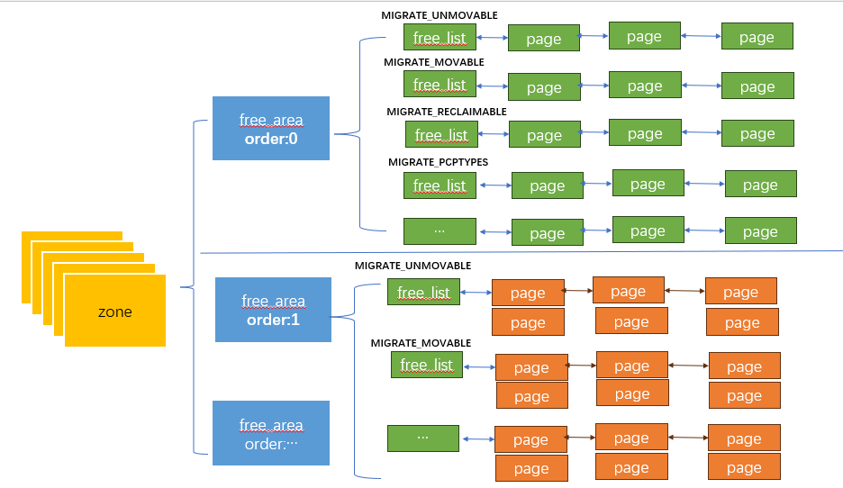
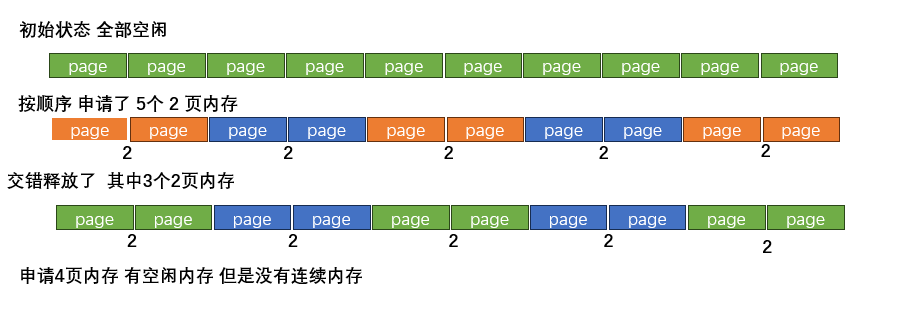
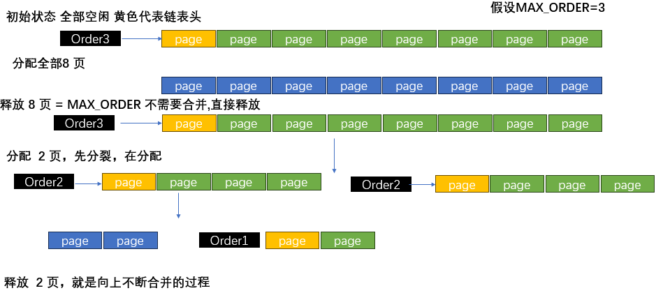

## Buddy

```json
node" {
    "label": "buddy",
    "categories": ["mem"],
    "info": "buddy alloc and free",
    "depends": [
        "zone"
    ]
}
```

### 介绍

#### 回顾

上一个小节 我们介绍了关于内存分区、空闲链表的的一些概念

- 内核首先按照 `node`对内存分区 ，每个`node` 拥有一个`pg_list`

- 内核又把内存按照`zone`进行分区，每个`node`都会有几个`zone`(`DMA` `NORMAL`  `MOVABLE`) 

- 每个`zone` 包含各自拥有的空闲页面  这些页面存放在`free_area`

- 所有的空闲页面按照 页面连续性 ,把`frea_area`以数组的形式分开管理 分为了不同的`struct free_order free_area[order]`  

- 每个`order`中又把内存按照迁移类型分开管理

最终的空闲页管理就变成了下图的格式



`order` 表示每个链表节点所代表的连续`page`的数量

上个小节结束时，我们也讲了`memblock` 会释放他自己所有的`free pages` 给`page_alloc` ，但是我们没有讲细节，本节我们将一起探讨 `buddy`算法实现细节 

#### 需求背景

我们已经知道，内核以`pfn/page`为最小粒度单元管理物理内存，如果我们以最简单的链表的方式管理物理内存，会出现什么问题？ 为了简单说明这个过程 我们假设系统一共有 `10` 个 `page`



通过上图可以看到 ，剩余多大内存 和 能够分配出多大的连续内存 ，并不只是简单的数量关系，在物理物理管理中，如何尽可能保证有连续的物理内存才是更加重要的，为了满足这个需求，`Linux` 做出了很多努力，`buddy` 分配算法就是为了尽可能解决这个问题

### Buddy

#### 算法思想

请参考([3.2.4 Buddy System(伙伴系统) | Linux核心概念详解](https://s3.shizhz.me/linux-mm/3.2-wu-li-nei-cun/3.2.4-buddy-system-huo-ban-xi-tong))

#### order 定义

我们已经知道了， 连续的`page` 是按照`order`划分的，有几个关键的定义在澄清一下 

- `MAX_PAGE_ORDER`: 系统默认支持的允许最大的连续内存。默认`4K` 页 `MAX=10` 也就是最大连续内存大小为`4M`

- `pageblock_order`:  表示相同`migratetype`的最大连续内存， 在大页内存关闭时,等于`MAX_PAGE_ORDER`，开启时等于`2MB`，可以保证再同一个`pageblock_order`下连续内存属于同一个`migrate type`

#### buddy page释放

先讲`page`释放，是因为最一开始的`zone`的`free pages` 都是从`memblock` 释放出来的； 

`page`释放过程中的核心逻辑在于`merging`   而`megering`的核心逻辑在于找到可以合并的`head` 



这个过程核心逻辑在`__free_one_page` 中

```c
static inline void __free_one_page(struct page *page,                      
                  unsigned long pfn,                                         
                  struct zone *zone, unsigned int order,                     
                  int migratetype, fpi_t fpi_flags)                          
  {                                                                          
          unsigned long buddy_pfn = 0;                                       
          unsigned long combined_pfn;                 
          struct page *buddy;         
          bool to_tail;                                                      
          // 更新 `zone state` 中的 free  page 数量
          account_freepages(zone, 1 << order, migratetype);                  
         // 如果释放内存已经是最大了 直接插入到freelist 否则尝试merge                                                                     
          while (order < MAX_PAGE_ORDER) {                                   
                  int buddy_mt = migratetype;                                
                  //找到是否可以合并的 buddy                                                     
                  buddy = find_buddy_page_pfn(page, pfn, order, &buddy_pfn); 
                  if (!buddy)                                                
                          goto done_merging;
                  //如果涉及到 跨  migratetype 需要判断是否支持合并                                             
                  if (unlikely(order >= pageblock_order)) {                                                            
                          buddy_mt = get_pfnblock_migratetype(buddy, buddy_pfn);                                                    
                          if (migratetype != buddy_mt &&                     
                              (!migratetype_is_mergeable(migratetype) ||     
                               !migratetype_is_mergeable(buddy_mt)))         
                                  goto done_merging;                         
                  }                                                          

                  //从原有的free 链表删除 buddy                                     
                  __del_page_from_free_list(buddy, zone, order, buddy_mt);   

                  if (unlikely(buddy_mt != migratetype)) {                   
                          /*                                                 
                           * Match buddy type. This ensures that an          
                           * expand() down the line puts the sub-blocks      
                           * on the right freelists.                         
                           */                                                
                          set_pageblock_migratetype(buddy, migratetype);     
                  }                                                          

                  combined_pfn = buddy_pfn & pfn;                            
                  page = page + (combined_pfn - pfn);                        
                  pfn = combined_pfn;                                        
                  order++;                                                   
          }                                                                  

  done_merging:                                                              
          set_buddy_order(page, order);                                      

          if (fpi_flags & FPI_TO_TAIL)                                       
                  to_tail = true;                                            
          else if (is_shuffle_order(order))                                  
                  to_tail = shuffle_pick_tail();                             
          else                                                               
                  to_tail = buddy_merge_likely(pfn, buddy_pfn, page, order); 

          __add_to_free_list(page, zone, order, migratetype, to_tail);       

          /* Notify page reporting subsystem of freed page */                
          if (!(fpi_flags & FPI_SKIP_REPORT_NOTIFY))                         
                  page_reporting_notify_free(order);                         
  }                                                  
```

#### buddy page 申请

`buddy page`的申请再上一个小节其实我们也已经讲了 最核心的逻辑为如何分裂

核心实现逻辑在`__rmqueue_smallest`

- `expand` ：  不断分裂当前`free page list`  知道剩下指定`low order`的内存，其余内存都返还给`free list`

```c
static inline unsigned int expand(struct zone *zone, struct page *page, 
                                    int low,int high, int migratetype)               
  {                                                                          
          unsigned int size = 1 << high;                                     
          unsigned int nr_added = 0;                                         
          // 通过二分不断分割多余的page数组 释放给free list                                                                   
          while (high > low) {                                               
                  high--;                                                    
                  size >>= 1;                                                                                                                                                                                           
                  __add_to_free_list(&page[size], zone, high, migratetype, false);
                  set_buddy_order(&page[size], high);                        
                  nr_added += size;                                          
          }                                                                                                                     
          return nr_added;                                                   
  } 

  // 从`free list `分配数组
  static __always_inline void page_del_and_expand(struct zone *zone,         
                                                  struct page *page, int low,
                                                  int high, int migratetype) 
  {                                                                          
          int nr_pages = 1 << high;                                                                                               
          __del_page_from_free_list(page, zone, high, migratetype);          
          nr_pages -= expand(zone, page, low, high, migratetype);            
          account_freepages(zone, -nr_pages, migratetype);                   
  }

  // 指定了zone 分配的连续内存大小order 以及指定的 migrate_type
  struct page *__rmqueue_smallest(struct zone *zone, unsigned int order,     
                                  int migratetype)           
  {                                                                          
          unsigned int current_order;                                        
          struct free_area *area;                                            
          struct page *page;                                                 

          // 从小到大遍历 order         
          for (current_order = order; current_order < NR_PAGE_ORDERS;
   ++current_order) {
                  area = &(zone->free_area[current_order]);
                  //是否存在指定类型的 free page 
                  page = get_page_from_free_area(area, migratetype);         
                  if (!page)                                                 
                          continue;                                          
                  //对申请到的内存进行分裂
                  page_del_and_expand(zone, page, order, current_order,      
                                        migratetype);
                  return page;                                               
          }                                                                  

          return NULL;                                                       
  } 
```
