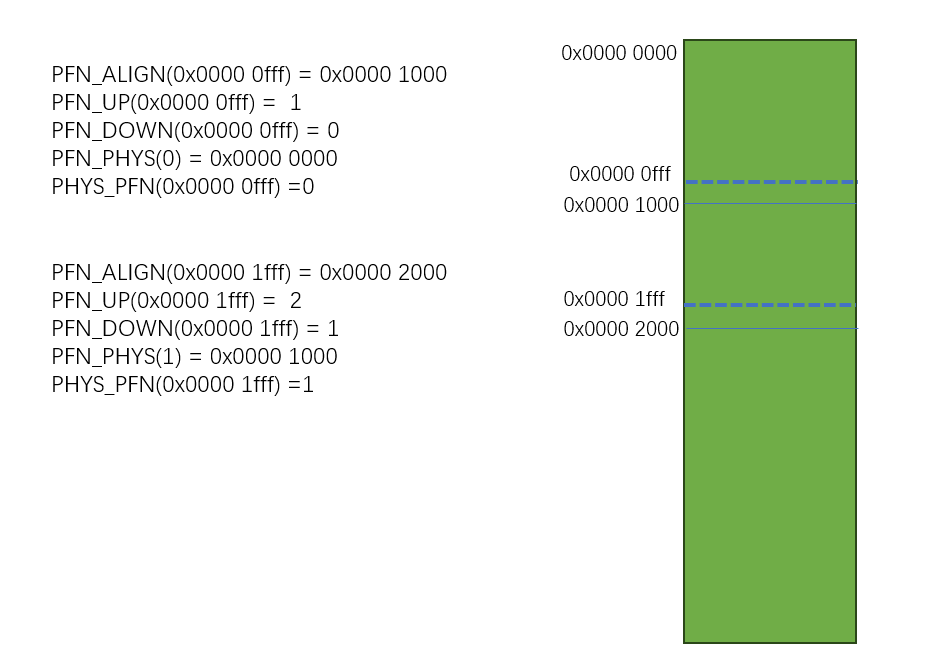

## Page

```json
node" {
    "label": "page",
    "categories": ["mem"],
    "info": "kernel page and pfn",
    "depends": [
           "numa"
    ]
}
```

### 介绍

#### 回顾

在正式进入内核物理内存管理之前，回顾一下内核前期的内存管理，内核早期主要依靠`memblock` 管理内存，`memblock`主要是以`block`为单位管理物理内存，每个`block`代表一块内存区间，区间可以互相独立和合并；

`memblock`的利弊：

- 实现简单，两个`block`数组,`mem`数组表示系统可以使用的内存块,`reserved`表示已经分配内存块，两个数组交叉可以得到`free` 内存块

- 内存块大小没有特别的约束限制

- 管理内存块采用定长数组，数组长度不足的话，需要`resize and copy`

- 内存块的增删改查，都涉及数组遍历以及内存位移，效率很底

- 适用于早期的物理内存管理

#### page 介绍

从本节开始，我们正式学习内核的下一个物理内存管理机制,`SLUB`内存分配器，会分好几个章节进行阐述，本节先介绍 `page`相关的概念

为了管理物理内存，我们知道必须要知道几个基本信息： 

- 物理内存的起始地址

- 物理内存的大小

- 上面两个数据可以得到物理内存的结束地址

这些信息，在`memblock`实现中，主要在`block` 中记录；

##### Page不需要记录内存大小

`page` 就好比`memblock`的内存块,每一个`struct page`就表示 一段已经分配或者没有分配的物理内存，不同点在于，一个`page`描述的物理内存的大小是固定的，比如在`4K`页表配置下，`page`就表示一段`4k`大小的物理内存，由于`page` 大小是固定的，因此在`struct page`中不会像`memblock`一样，还需要额外记录物理内存大小

##### Page 不需要记录内存地址

如果不需要记录内存大小还能理解，为什么连`page`所管理的物理内存地址都不需要记录了呢？这是因为内核主要是通过`PFN`来表示每个`page` 和 物理内存地址的 

`page`所代表的物理内存大小是固定，那是不是可以把从`0x0000 0000` 到 `0xffff ffff` 的物理内存都按照 `4k`固定大小分割呢？


上图右边可以看到，把物理地址按照一个固定大小划分，所有的物理地址都可以有一个唯一的编号，这个编号实际上我们就把他叫做`PFN`，如果我们在有一个`page`数组，这个数组的下标等于`PFN`， 是不是就有了 `Phys Address`    ->    `PFN`   ->  `page` 的关系呢？

如果没有上面的对应关系，假设`page` 需要自己记录所代表的物理内存，那么如果我们为了找到某个物理内存所对应的`page`，我们就需要像`memblock`一样，遍历某个全局队列或数组，这样效率真的是太低了

### PFN

物理页帧号，内核根据`MMU`配置的`页大小`，给每个页编了一个序号，这个页号就叫`页帧编号`

举例说明: ARM32位下，CPU可以访问的物理内存范围 `0x00000000 - 0xffff ffff`，如果按照`4K`页大小，可以得知，
有效物理内存范围内，一共需要(`0xf ffff`)个页帧，编号从(`0-1048575`)

可以看到，`页帧编号`还是非常好理解的,直接和`实际物理地址` 以及 `页的大小` 关联

内核提供的关于页帧的转换公式为:

```c
// 根据当前物理地址 获取下一个页帧的起始地址
#define PFN_ALIGN(x)    (((unsigned long)(x) + (PAGE_SIZE - 1)) & PAGE_MASK)
//根据当前物理地址  获取下一个页帧号
#define PFN_UP(x)       (((x) + PAGE_SIZE-1) >> PAGE_SHIFT)
//根据当前物理地址  获取上一个页帧号
#define PFN_DOWN(x)     ((x) >> PAGE_SHIFT)
//给定页帧，获取他的页帧起始物理地址
#define PFN_PHYS(x)     ((phys_addr_t)(x) << PAGE_SHIFT)
ag-0-1if6fnjvdag-1-1if6fnjvd//给定物理地址，获取他的页帧号
#define PHYS_PFN(x)     ((unsigned long)((x) >> PAGE_SHIFT)) 
```

下面是一个示例:



#### 平坦布局

早期和嵌入式环境下的平坦内存模型，其实就是一个一维的静态数组` struct page mem_map[0xffff]`


从 `PFN` 到 `struct page` 数组的转换就非常简单:

```
#define __pfn_to_page(pfn)      (mem_map + ((pfn) - ARCH_PFN_OFFSET))
#define __page_to_pfn(page)     ((unsigned long)((page) - mem_map) +  ARCH_PFN_OFFSET)
```

`mem_map`数组下标 和 `PFN` **一一对应**

为了符号上面的转换公式，`mem_map`必须满足以下要求:

- `mem_map`数组需要覆盖架构所有内存
- `mem_map`数组必须要是连续的，否则无法**一一对应**

##### 局限性

假设 `struct page`大小 为 `8byte`： 

- 在32位架构下，`mem_map`数组如果要覆盖所有内存，`mem_map` 占用的内存为： `0xffff ffff/4K * 8byte =  8M`

- 在64位架构下，`mem_map`数组如果要覆盖所有内存,自己占用的内存是非常可怕的 ，需要：`0xffff ffff ffff ffff/4K * 8byte = 33,554,431G ` ，很明显不现实

- 真实的设备，`RAM`根本不会占用所有的物理地址，热插拔、NUMA等特性引入，导致内存数组中存在大量`空洞`,会有内存浪费, 覆盖全部物理内存，需要`3TB`内存(根本不现实)

因此，linux内核当前主要使用 第二种内存模型:**稀疏内存模型**

##### 稀疏模型

`NUMA`对不同`numa `节点，提出了内存单独管理的诉求，在加上 `内存热插拔`的出现，这种静态的平坦模型已经无法在胜任了

下图是**稀疏内存模型** 的`page`组织结构:


不像平坦模型，一维数组太占用空间，内核使用了一个和`MMU`多级页表机制非常像的结构

由于`page 数组`在稀疏内存中的不连续性,`pfn`必须要经过多次决策才能找到对应的`page`

1. `pfn` 对应的`ROOT`下标
2. `pfn` 对应的`mem section`下标
3. `pfn` 对应在`mem_map`下标
4. `page of pfn` = `mem_section[x][y].mem_map[z]`

```
/*
* Note: section's mem_map is encoded to reflect its start_pfn.
* section[i].section_mem_map == mem_map's address - start_pfn;
*/
#define __page_to_pfn(pg)                                       \
({      const struct page *__pg = (pg);                         \
        int __sec = page_to_section(__pg);                      \
        (unsigned long)(__pg - __section_mem_map_addr(__nr_to_section(__sec))); \
})

#define __pfn_to_page(pfn)                              \
({      unsigned long __pfn = (pfn);                    \
        struct mem_section *__sec = __pfn_to_section(__pfn);    \
        __section_mem_map_addr(__sec) + __pfn;          \
})
```

### Page 设计实现

由于物理内存都需要`page` 管理，因此`page` 的内存限制非常严格，一旦他的内存增长，回带来百分比的内存增长，因此需要非常小心

#### PAGE FLAGS

在`struct page` 中第一个字段为 `unsigned flags`, `page` 其中`bit`位由高到低，分为了 `link bits` 和普通的`flag bit`

##### LinkBits

`Page->flags`的高位会用于记录其关联的`sparse section` `node` `zone` 等信息，这些信息一旦初始化之后，不会再发生变化

```c
/* Page flags: | [SECTION] | [NODE] | ZONE | [LAST_CPUPID] | ... | FLAGS | */
```

- `SECTION_BIST`: 在`vmemmap`支持平台上 不需要此字段

- `NODES_BITS`： 记录`page`所属的`numa` 节点 ，根据实际配置决定大小

- `ZONE_BITS` : 记录`page`属于的`zone`,根据实际情况决定大小

- `LAST_CPUPID_SHIFT` : 仅在`CONFIG_NUMA_BALANCING` 开启时有效i，记录内存最近被分配给的任务和`CPU ID`, 用于识别内存的`热度`

- `KASAN_TAG_BITS` : 开启`kasan` 支持时，记录`kasan`

上述信息中的`section` `node` `zone` 的信息大部分属于不会变的字段， 会在`free_area_init_node -> __init_single_page` 完成初始化

##### Bit Flags

除了上一个小节的`flags`，剩余bit 全部用作`page flags` ，详细定义在`inlcude/linux/page-flags.h`

内核统一提供`page ->falgs`的访问接口 一般是`set clear test`

```c
__SetPage[Reserved/XXX] 
__ClearPage[Reserved/xxx]
Page[Reserved] // test bit
```

###### PG_reserved

标记`page`物理内存是保留内存，很多模块都可以把内存标记为`Reserved` 

`memblock` 中 的`nomap`的内存 以及`reseved` 被分配的内存 会被标记为`Reserved`  

###### PG_buddy

标记当前`page` 挂载在`buddy free list` 链表上，而且当前`page`是链表头

#### List

##### LRU  list

如果`PAGE`被分配，他会挂在`LRU LIST` 

##### Buddy list

如果`PAGE`被释放，他会挂在`free list`

##### PCP LIST

如果`PAGE`被释放，他也可能挂在`percpu free list`

#### Private

#### Free buddy

当`page` 是`buddy` 的头时，`private`字段存储 `buddy order`信息
