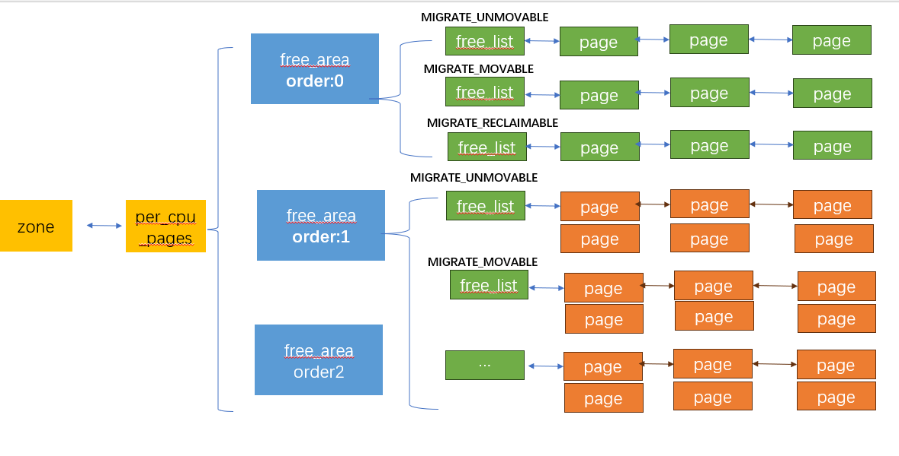

## PCP alloc

```json
node" {
    "label": "pcp page",
    "categories": ["mem"],
    "info": "kernel page alloc from pcp",
    "depends": [
           "buddy",
           "percpu"
    ]
}
```

### 介绍

#### 回顾

上一个小节，我们介绍了最基础的`buddy`分配的算法逻辑，本小节，我们介绍一下`PCP`

`PCP` 


我们已经学习过`zone`的内存空闲链表布局，但是因为内存申请释放是一个非常高频的操作，`zone`的资源访问都需要被`zone->lock`保护，此时资源竞争成为一个性能瓶颈

因此，`kernel`引入了`percpu`资源变量，为每个`zone` 在每个`CPU`上维护一个小型资源池，内存优先从`percpu的资源池`申请。 



#### 核心结构体

```c
  struct per_cpu_pages {                                                     
          spinlock_t lock;        /* Protects lists field */                 
          int count;              /* number of pages in the list */          
          int high;               /* high watermark, emptying needed */      
          int high_min;           /* min high watermark */                   
          int high_max;           /* max high watermark */                   
          int batch;              /* chunk size for buddy add/remove */      
          u8 flags;               /* protected by pcp->lock */               
          u8 alloc_factor;        /* batch scaling factor during allocate */                                                           
          short free_count;       /* consecutive free count */                                                                        
          /* Lists of pages, one per migrate type stored on the pcp-lists */ 
          struct list_head lists[NR_PCP_LISTS];                              
  } ____cacheline_aligned_in_smp;        
```

 这些字段还都是比较简单的：

- `count` : 当前`zone`的 `PCP``池子里空闲的页面数量

- `batch`: 每次从`buddy` 批量申请内存到`CPU`池子的数量，此值是一个相对值，和`zone`的容量大小强相关

- `high_min` :`PCP`允许池子中保留的最小的空闲内存页面数量 
  
  - 系统默认：max(`zone_low_mark`(当前`zone` 的低水位线) / `CPU_NUM`, `batch*4`)
  
  - 用户指定： 用户可以配置`percpu_pagelist_high_fraction`, 设置`CPU`水位线 ，如果指定`10`,表示可以允许使用当前`zone`的内存的十分之一

- `high_max` :`PCP` 允许的池子中保留的最大的空闲内存页面数量，  不能超过`zone`管理内存的八分之一

- `high`: 一个位于`high_max` 和`high_min`的中间动态值，在`PCP`内存释放时，回检查`count` 和`high`,如果空闲数量超过`high`,表示池子中内存过多，应该把内存归还给`zone`，因此`high`的值会受`zone`的内存影响，如果`zone`内存不足，该值会动态下调

#### 流程示例

内存申请

```c
// 初次进行内存申请时， PCP 池子为空
rmqueue_pcplist()
 ->   __rmqueue_pcplist()
     -> nr_pcp_alloc() // 更新 pcp->high,内存充足时 pcp->high 允许一直上浮到最大值
     -> rmqueue_bulk() // 触发从zone 里面申请内存放到池子中 
 // 从池子中获取需要的内存并返回
 -> page = list_first_entry(list, struct page, pcp_list); 
```

内存释放

```c
free_unref_page()
   ->free_unref_page_commit()
     -> list_add(&page->pcp_list, &pcp->lists[pindex]); //内存释放到pcp list
     -> pcp->count += 1 << order; //更新当前内存空闲数量                              
     -> pcp->free_count += (1 << order); //更新free_count为本次释放内存数量
     -> high = nr_pcp_high(pcp, zone, batch, free_high); //获取当前水位线
        //如果当前空闲内存数量超过水位线 回收内存 返回给zone
           ->free_pcppages_bulk()
```

#### 申请条件

并不是所有阶的内存都从`PCP`申请, 一般情况下，只有低阶(`order < 3` )的内存走`PCP池`申请

### 内核接口

#### 初始化：setup_zone_pageset

此接口在`zone`初始化时，完成`zone`的`per_cpu_pages`结构体各项字段初始化

#### nr_pcp_high

`PCP`水位线的作用：当`PCP`内存在释放时，需要检查`池子`中的内存是否需要被`zone`给回收，因此`PCP` 水位线表示需要回收的临界点

当内存充足时，允许动态上调`high` ， 只要满足不超过`high_max` ，则不需要被回收

当内存不足时，允许动态下调`high` ， 只要满足不小于`high_min` ，则不需要被回收

#### rmqueue_pcplist

`pcp`内存申请的核心函数 ，此函数总是在`order < PAGE_ALLOC_COSTLY_ORDER`  的情况下 被 `rmqueue` 调用，因此我们可以说，在连续小内存页面情况下，总是优先从`PCP`内存池申请，以此尽可能减小`zone`的锁竞争 

```c
  static inline                                                              
  struct page *rmqueue(struct zone *preferred_zone,                          
                          struct zone *zone, unsigned int order,             
                          gfp_t gfp_flags, unsigned int alloc_flags,         
                          int migratetype)                                   
  {                                                                          
          struct page *page;                                                 

          if (likely(pcp_allowed_order(order))) {                            
                  page = rmqueue_pcplist(preferred_zone, zone, order,        
                                         migratetype, alloc_flags);          
                  if (likely(page))                                          
                          goto out;                                          
          }                                                                  
```

#### free_unref_page_commit

`PCP`内存释放的底层核心接口
