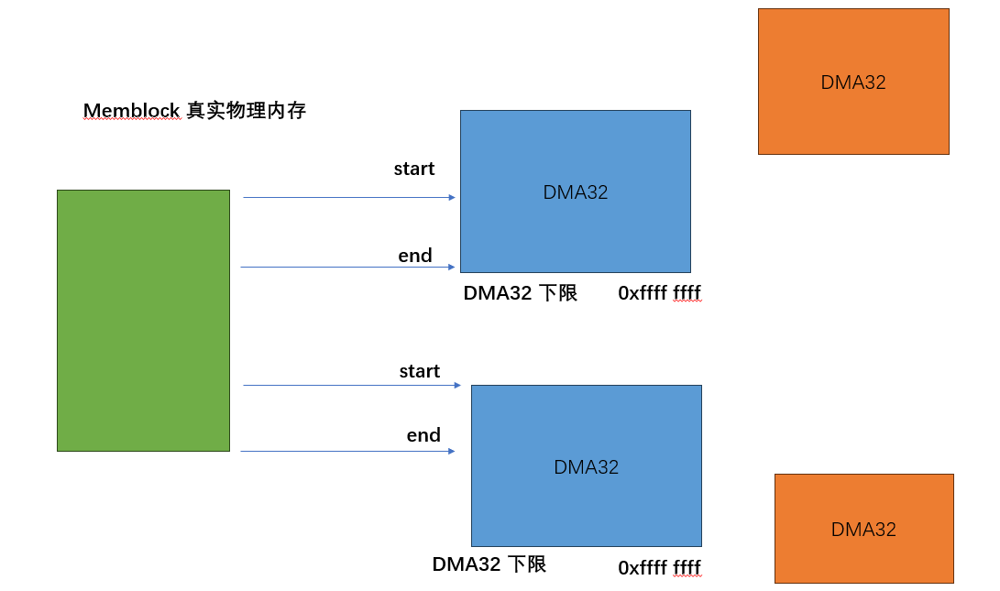
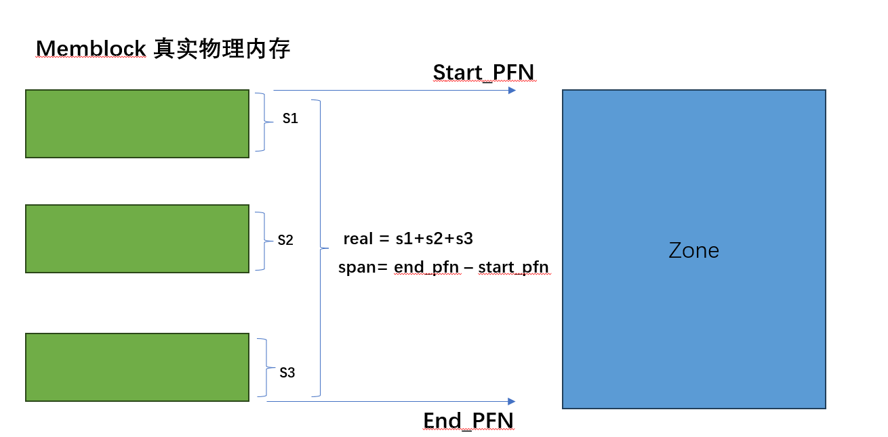

## PAGE LIST

```json
node" {
    "label": "zone",
    "categories": ["mem"],
    "info": "mem zone",
    "depends": [
        "page",
        "memblock",
        "numa"
    ]
}
```

### 介绍

#### 回顾

通过上一个小节关于`sparse page`的介绍以及初始化，此时系统所有的物理内存此时都有对应的`page` 结构体，可以通过`pfn` 访问物理内存以及物理内存的`page`

`sparse page`是一个结构上固定不会变化的内存布局，主要目的是为了建立`pfn`到`page`的映射关系， `section`相关的结构体并不负责管理实际的内存分配和管理

那么内核是如何利用`page`管理物理内存的？ 这就是今天的主题，讲清楚分配和释放`page`的 核心数据结构

### 设计实现

#### NUMA

之前已经介绍过`NUMA`的内存概念，绝大多数非服务器场景都不会涉及，但是我们这里还是假设`NUMA`开启的情况下讨论内存管理，因为关闭的场景只会比开启场景更加简单

`NUMA`场景下，内核会根据`NUMA node` 首先把内存分为不同的`node` ,这里就很简单了，每个`node`都有一个对应的`pglist_data`

```c
struct pglist_data *node_data[MAX_NUMNODES];
```

`arm64` 位下，`node_data` 会在`free_area_init`期间完成内存申请和初始化

```c
setup_arch()
 -> bootmem_init()
   -> zone_sizes_init()
    -> free_area_init()
        //遍历所有可能的node 
     -> for_each_node() 
        // 申请
       -> alloc_offline_node_data(nid); 
         -> node_data[nid] = pgdat;
```

#### struct pglist_data

上一个小节，我们看到了，每个`numa node` 都拥有一个` struct pglist_data` ，结构体`pglist_data` 就是内核管理所有物理内存`page`的核心结构体入口

这个结构体在不同配置下涉及到的内容和字段非常复杂，我们接下来要由浅到深围绕此结构体展开关于内存管理的章节

```c
  typedef struct pglist_data {
          /*
           * node_zones contains just the zones for THIS node. Not all of the
           * zones may be populated, but it is the full list. It is referenced by
           * this node's node_zonelists as well as other node's node_zonelists.
           */
          struct zone node_zones[MAX_NR_ZONES];

          /*
           * node_zonelists contains references to all zones in all nodes.
           * Generally the first zones will be references to this node's
           * node_zones.
           */
          struct zonelist node_zonelists[MAX_ZONELISTS];
          int nr_zones; /* number of populated zones in this node */
          unsigned long node_start_pfn;
          unsigned long node_present_pages; /* total number of physical pages */
          unsigned long node_spanned_pages; /* total size of physical page
                                               range, including holes */
          int node_id;
          wait_queue_head_t kswapd_wait;
          wait_queue_head_t pfmemalloc_wait;

          /* workqueues for throttling reclaim for different reasons. */
          wait_queue_head_t reclaim_wait[NR_VMSCAN_THROTTLE];

          atomic_t nr_writeback_throttled;/* nr of writeback-throttled tasks */
          unsigned long nr_reclaim_start; /* nr pages written while throttled
                                           * when throttling started. */
          struct task_struct *kswapd;     /* Protected by kswapd_lock */
          int kswapd_order;
          enum zone_type kswapd_highest_zoneidx;

          int kswapd_failures;            /* Number of 'reclaimed == 0' runs */
          /*
           * This is a per-node reserve of pages that are not available
           * to userspace allocations.
           */
          unsigned long          totalreserve_pages;

    #ifdef CONFIG_NUMA
          /*
           * node reclaim becomes active if more unmapped pages exist.
           */
          unsigned long           min_unmapped_pages;
          unsigned long           min_slab_pages;
  #endif /* CONFIG_NUMA */

          /* Write-intensive fields used by page reclaim */
          CACHELINE_PADDING(_pad1_);

          /*
           * NOTE: THIS IS UNUSED IF MEMCG IS ENABLED.
           *
           * Use mem_cgroup_lruvec() to look up lruvecs.
           */
          struct lruvec           __lruvec;
          unsigned long           flags;
          CACHELINE_PADDING(_pad2_);
          /* Per-node vmstats */
          struct per_cpu_nodestat __percpu *per_cpu_nodestats;
          atomic_long_t           vm_stat[NR_VM_NODE_STAT_ITEMS];

  #ifdef CONFIG_NUMA
          struct memory_tier __rcu *memtier;
  #endif

  } pg_data_t;
```

#### ZONE

我们之前已经学习过，内核所有的物理地址 都有对应的`PFN`与之一一对应，`PFN`伴随物理内存的连续性而具有某种连续性。因此接下来我们描述物理内存都使用`PFN` 

`linux kernel` 按照物理内存区域的功能以及 某些内存的特殊性，把不同内存进行了分区 

- ZONE_DMA(32)： `DMA`内存区域

- ZONE_HIGHMEM:  `arm64`位不存在，`arm32`位支持

- ZONE_NORMAL: 普通内存区域

- ZONE_MOVABLE： 其实对应`memblock`中被标记为`hotplug`的物理内存区域 表示内存支持热插拔，需要保证如果从此内存区分配的内存最好是可以移动的，不要分配一些特殊不可移动内存，内存下线会尝试迁移这部分物理内存，如果存在不可移动内存，可能会导致内存下线失败

- ZONE_DEVICE： Device memory (pmem, HMM, etc...) hotplug support

我们现在只需要考虑`ZONE_DMA\ZONE_NORMAL`即可，其他内存区域在特殊场景和需求才会使用。

我们可以看到`pg_list` 中第一个就是当前`node`管理内存的`zone`数组 

```c
 struct zone node_zones[MAX_NR_ZONES];
```

`struct zone` 负责管理 每个`zone`的物理内存,当然 `zone`里面的字段也比较复杂  在学习具体功能是在详细介绍

```c
  struct zone {
          /* Read-mostly fields */

          /* zone watermarks, access with *_wmark_pages(zone) macros */
          unsigned long _watermark[NR_WMARK];
          unsigned long watermark_boost;

          unsigned long nr_reserved_highatomic;
          unsigned long nr_free_highatomic;

            /*
           * We don't know if the memory that we're going to allocate will be
           * freeable or/and it will be released eventually, so to avoid totally
           * wasting several GB of ram we must reserve some of the lower zone
           * memory (otherwise we risk to run OOM on the lower zones despite
           * there being tons of freeable ram on the higher zones).  This array is
           * recalculated at runtime if the sysctl_lowmem_reserve_ratio sysctl
           * changes.
           */
          long lowmem_reserve[MAX_NR_ZONES];

  #ifdef CONFIG_NUMA
          int node;
  #endif
          struct pglist_data      *zone_pgdat;
          struct per_cpu_pages    __percpu *per_cpu_pageset;
          struct per_cpu_zonestat __percpu *per_cpu_zonestats;
          /*
           * the high and batch values are copied to individual pagesets for
           * faster access
           */
          int pageset_high_min;
          int pageset_high_max;
          int pageset_batch;

            /* zone_start_pfn == zone_start_paddr >> PAGE_SHIFT */
          unsigned long           zone_start_pfn;

          atomic_long_t           managed_pages;
          unsigned long           spanned_pages;
          unsigned long           present_pages;

  #if defined(CONFIG_MEMORY_HOTPLUG)
          unsigned long           present_early_pages;
  #endif
  #ifdef CONFIG_CMA
          unsigned long           cma_pages;
  #endif

   #ifdef CONFIG_MEMORY_ISOLATION
          /*
           * Number of isolated pageblock. It is used to solve incorrect
           * freepage counting problem due to racy retrieving migratetype
           * of pageblock. Protected by zone->lock.
           */
          unsigned long           nr_isolate_pageblock;
  #endif
```

#### zone 范围初始化

在之前小节中`sparese mem`负责申请初始化 所有物理内存`page`之后 就会进入正式的`page list` 初始化

```c
bootmem_init()
  -> sparse_init()
  -> zone_sizes_init();
```

`arm64`在调用`free_area_init`之前，设置了`DMA(32)`的地址上限，解释一下： 

- ZONE_DMA32:  不允许超过`4G 0xffff ffff` 的范围

- ZONE_DMA： 根据设备树`dma_range` 和 `acpi`的配置取下限 

- ZONE_NORMAL: 不允许超过系统可访问的物理内存

```c
 static void __init zone_sizes_init(void)
  {
          unsigned long max_zone_pfns[MAX_NR_ZONES]  = {0};
          phys_addr_t __maybe_unused dma32_phys_limit =
                  max_zone_phys(DMA_BIT_MASK(32));
  #ifdef CONFIG_ZONE_DMA
          acpi_zone_dma_limit = acpi_iort_dma_get_max_cpu_address();
          dt_zone_dma_limit = of_dma_get_max_cpu_address(NULL);
          zone_dma_limit = min(dt_zone_dma_limit, acpi_zone_dma_limit);
          arm64_dma_phys_limit = max_zone_phys(zone_dma_limit);
          max_zone_pfns[ZONE_DMA] = PFN_DOWN(arm64_dma_phys_limit);
  #endif
  #ifdef CONFIG_ZONE_DMA32
          max_zone_pfns[ZONE_DMA32] = PFN_DOWN(dma32_phys_limit);
          if (!arm64_dma_phys_limit)
                  arm64_dma_phys_limit = dma32_phys_limit;
  #endif
         if (!arm64_dma_phys_limit)
                  arm64_dma_phys_limit = PHYS_MASK + 1;
          max_zone_pfns[ZONE_NORMAL] = max_pfn;
          free_area_init(max_zone_pfns);
  }
```

`free_area_init` 负责完成 `pg_list`所有空闲内存的初始化，首先需要根据`memblock`内存信息，完成各个`ZONE`的 `start_pfn end_pfn`的确认，一般情况下 `ZONE` 的物理约束是确定的，但是实际物理内存不一定会和`ZONE`的范围匹配上，可能会有很多种不同情况，因此`ZONE`的地址范围要根据实际的物理内存情况才能确定



#### pageblock_order

简单介绍一下 `page order` 关于`order`更加详细说明在 `slub`内存分配器会介绍，现在可以简单认为是  内核可以分配的最大连续物理内存，如果`MAX_PAGE_ORDER = 10` 表示最大可以分配`2^10`个 `4K page`,也就是 `2MB` ,在支持大页内存时，会转为大页内存支持最大`order`

#### free_area_init_node

`free_area_init`会遍历所有`node`,然后调用此函数 完成每个`Node pg_list`初始化 

调用时机

```c
bootmem_init()
  -> sparse_init()
  -> zone_sizes_init();
    -> free_area_init()
        // 遍历 pg_list node
      -> for_each_node()
         // 为每一个node pg_list 申请内存
         -> alloc_offline_node_data(nid);
         // 为每一个 node pg_list 初始化
          -> free_area_init_node() 
```

主要实现逻辑 完成`pg_list`一些基础字段初始化，以及每个`node`包含的`zone` 初始化

```c
 static void __init free_area_init_node(int nid)
  {
          pg_data_t *pgdat = NODE_DATA(nid);
          unsigned long start_pfn = 0;
          unsigned long end_pfn = 0;
          get_pfn_range_for_nid(nid, &start_pfn, &end_pfn);

          //基础字段初始化
          pgdat->node_id = nid;
          pgdat->node_start_pfn = start_pfn;
          pgdat->per_cpu_nodestats = NULL;

           pr_info("Initmem setup node %d [mem %#018Lx-%#018Lx]\n", nid,
                          (u64)start_pfn << PAGE_SHIFT,
                          end_pfn ? ((u64)end_pfn << PAGE_SHIFT) - 1 : 0);

          calculate_node_totalpages(pgdat, start_pfn, end_pfn);
          //平坦模型才有用
          alloc_node_mem_map(pgdat);
          // 支持延迟初始化才有用
          pgdat_set_deferred_range(pgdat);
          free_area_init_core(pgdat);
          // LRU_GEN 开启才有用 
          lru_gen_init_pgdat(pgdat);
}
```

##### 统计各个zone node 中的page 数量

逐步分析 首先是  ` calculate_node_totalpages`

```c
static void __init calculate_node_totalpages(struct pglist_data *pgdat,
                                                  unsigned long node_start_pfn,
                                                  unsigned long node_end_pfn)
  {       
          unsigned long realtotalpages = 0, totalpages = 0;
          enum zone_type i;
          //遍历所有的zone 
          for (i = 0; i < MAX_NR_ZONES; i++) {
                  struct zone *zone = pgdat->node_zones + i;
                  unsigned long zone_start_pfn, zone_end_pfn;
                  unsigned long spanned, absent;
                  unsigned long real_size;
                  // 返回一个node中 当前zone的内存 start_pfn end_pfn 
                  //此段内存包括中间无效内存
                  spanned = zone_spanned_pages_in_node(pgdat->node_id, i,
                                                       node_start_pfn,
                                                       node_end_pfn,
                                                       &zone_start_pfn,
                                                       &zone_end_pfn);

                  //  返回有效内存
                  absent = zone_absent_pages_in_node(pgdat->node_id, i,
                                                     zone_start_pfn,
                                               zone_end_pfn);
                 real_size = spanned - absent;

                  if (spanned)
                          zone->zone_start_pfn = zone_start_pfn;
                  else
                          zone->zone_start_pfn = 0;
                  zone->spanned_pages = spanned;
                  zone->present_pages = real_size;
  #if defined(CONFIG_MEMORY_HOTPLUG)
                  zone->present_early_pages = real_size;
  #endif

                  totalpages += spanned;
                  realtotalpages += real_size;
          }

          pgdat->node_spanned_pages = totalpages;
          pgdat->node_present_pages = realtotalpages;
          pr_debug("On node %d totalpages: %lu\n", pgdat->node_id, realtotalpages);
  }
```

关于`present_pages` `spanned_paages`的数量关系下图给出了很好的解释



##### free_area_init_core

上一步 完成了一些基本的数量的初始化  继续完成后续的初始化 ，包括一些基础字段、`zone`里面的各个字段的初始化

```c
static void __init free_area_init_core(struct pglist_data *pgdat)
  {
          enum zone_type j;
          int nid = pgdat->node_id;
          pgdat_init_internals(pgdat);
          pgdat->per_cpu_nodestats = &boot_nodestats;

          for (j = 0; j < MAX_NR_ZONES; j++) {
                  struct zone *zone = pgdat->node_zones + j;
                  unsigned long size = zone->spanned_pages;

                  /*
                   * Initialize zone->managed_pages as 0 , it will be reset
                   * when memblock allocator frees pages into buddy system.
                   */
                  zone_init_internals(zone, j, nid, zone->present_pages);
                  if (!size)
                          continue;

                  setup_usemap(zone);
                  init_currently_empty_zone(zone, zone->zone_start_pfn, size);
          }
  }

// pg_data 基本字段初始化
 static void __meminit pgdat_init_internals(struct pglist_data *pgdat)
  {
          int i;
          // pgdata 如果涉及 hotplug或者推迟初始化相关的字段初始化 
          pgdat_resize_init(pgdat);
          pgdat_kswapd_lock_init(pgdat);
          // 透明大页相关内存初始化
          pgdat_init_split_queue(pgdat);
          pgdat_init_kcompactd(pgdat);
          init_waitqueue_head(&pgdat->kswapd_wait);
          init_waitqueue_head(&pgdat->pfmemalloc_wait);
          for (i = 0; i < NR_VMSCAN_THROTTLE; i++)
                  init_waitqueue_head(&pgdat->reclaim_wait[i]);
          pgdat_page_ext_init(pgdat);
          lruvec_init(&pgdat->__lruvec);
  }
```

至此，有关`node pg_list`以及其中的`zone`的大部分字段我们都已经完成了初始化了 ，但是目前 `zone` 里面还依然没有真正 可以使用的内存资源，我们只是初始化了空的空闲链表

```c
  static void __meminit zone_init_free_lists(struct zone *zone)
  {       
          unsigned int order, t;
          for_each_migratetype_order(order, t) {
                  INIT_LIST_HEAD(&zone->free_area[order].free_list[t]);
                  zone->free_area[order].nr_free = 0;
          }

  #ifdef CONFIG_UNACCEPTED_MEMORY
          INIT_LIST_HEAD(&zone->unaccepted_pages);
  #endif
  }
```
