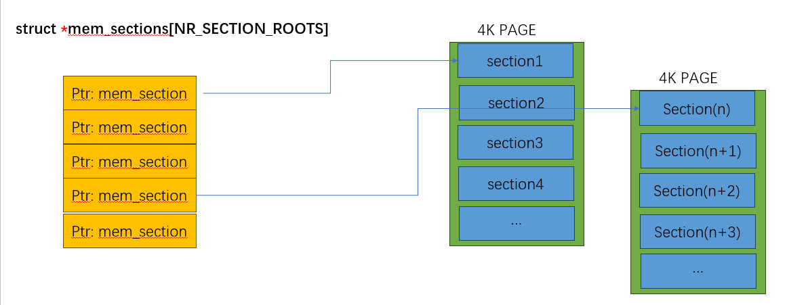

## Sparse mem

```json
node" {
    "label": "sparse",
    "categories": ["mem"],
    "info": "sparse section",
    "depends": [
        "page",
        "memblock"
    ]
}
```

### 介绍

#### 回顾

上一个小节，我们学习了

- 内核物理内存管理  通过`page` 结构体管理

- 所有的物理地址都可以转换为`PFN`

- 内核支持 `PFN` 快速索引到 `page`结构体，建立了物理地址快速索引到`page`的方法 

- 学习了平坦内存模型下`pfn`是作为`page`数组下标索引

- 认识了在复杂场景下，平坦模型的局限性

- 简单介绍了稀疏内存模型

本小节，对稀疏模型进行更加深入的学习 

### 设计实现

#### struct mem_section

```c
struct mem_section {
          /*
           * This is, logically, a pointer to an array of struct
           * pages.  However, it is stored with some other magic.
           * (see sparse.c::sparse_init_one_section())
           *
           * Additionally during early boot we encode node id of
           * the location of the section here to guide allocation.
           * (see sparse.c::memory_present())
           *
           * Making it a UL at least makes someone do a cast
           * before using it wrong.
           */
          unsigned long section_mem_map;
          struct mem_section_usage *usage;
}
```

核心结构体，每一个`mem_section`  管理一段连续内存，比如 `arm64`  `4K`页表 配置下，一个`section`负责管理`128Mb`的内存

```c
 /*
   * Section size must be at least 512MB for 64K base
   * page size config. Otherwise it will be less than
   * MAX_PAGE_ORDER and the build process will fail.
   */
  #ifdef CONFIG_ARM64_64K_PAGES
  #define SECTION_SIZE_BITS 29
  #else
  /*
   * Section size must be at least 128MB for 4K base
   * page size config. Otherwise PMD based huge page
   * entries could not be created for vmemmap mappings.
   * 16K follows 4K for simplicity.
   */
  #define SECTION_SIZE_BITS 27
  #endif /* CONFIG_ARM64_64K_PAGES */
```

那么为了管理物理内存，需要多少个`section`？

```c
  #define SECTIONS_SHIFT  (MAX_PHYSMEM_BITS - SECTION_SIZE_BITS)

 #define NR_MEM_SECTIONS         (1UL << SECTIONS_SHIFT)
```

如果`PA_BITS = 48` ， `SECTION_SIZE_BITS = 27` ,可以计算得到，为了管理全部`48BIT`物理可访问地址，需要`2^(48-21-1)` 个 `section`

如果我们用一个`1维`数组管理 `section`, 为了能够覆盖到所有物理内存，我们需要`struct mem_sections[2^20]` ，如果一个`section` 大小`16byte`,则需要连续的`32MB`内存

#### 多级索引

1维数组的`section`在内存占用上还是不合适的，就和`MMU`多级页表映射类似，通过使用`2级`寻址，降低内存占用大小，下图演示了这个设计思想



内核以`4k`页的作为分割，把`2^21`(`PA=48`)个`sections` 做了分割，假设一个 `section`大小`16byte`,一个`4K`页可以容纳`256`个`section`,则 需要的第一级指针数组 `stuct *memsecionts[]`的数组大小，只需要`2^21/256 = 8192`个，一个指针的大小`8byte`,一维数组占用内存大小`64KB` 

`SECTIONS_PER_ROOT` 计算数组指针指向的`section` 数组大小

```c
#define SECTIONS_PER_ROOT  (PAGE_SIZE / sizeof (struct mem_section))
```

#### section_mem_map

`section_mem_map`是一个`mem_section`中最重要的字段，最主要的作用是保存一个代表`128MB` 物理内存的连续`page`数组指针；考虑到地址对齐，该地址低位可以用来存储一些额外的信息：

再还没有申请page数组内存之前：

- BIT 4 - BIT64:  存储内存属于的的`numa  node id`

- BIT_0/SECTION_MARKED_PRESENT_BIT： 标识此`section`是否需要被使用(有实际的物理内存)

- BIT_1/SECTION_HAS_MEM_MAP： 标识 字段已经申请保存 page 数组内存

- BIT_2/SECTION_IS_ONLINE： 标识内存上线
  
  BIT_3/SECTION_IS_EARLY： 标识 内存不属于 热插拔内存，属于早期内存初始化的`section`

申请page数组内存之后：

- 低比特位保持含义不变

- 存储 编码后的 `struct page`数组指针

关于编码要特别说明一下， 先看一下不编码的结果，也就是 直接存储某个`section` 所拥有的`struct page`数组，在这个假设下计算 某个`pfn`对应的`page` 指针

从`pfn` 可以得到 `section nr`: 一个`section`数组代表`128M`  ，则对应的某个`pfn`的`section nr` 可以快速得到 `section_nr = pfn * 4K / 128M`

接下来我们还需要计算这个`pfn`在`128M page`数组中的下标，计算方法：下标等于  `pfn` 代表的内存除以`128`内存的余数的下标

如果一开始我们认为 `section`中保存的是一个 减去了`section_start_pfn`的值，那我们在计算的时候就不会有这么麻烦，直接使用`page_addr` + `pfn`，`pfn - section_start_pfn` 多出来的值正好就是下标值，简化了下标的计算

当然，这些优化在支持`vmemap`的平台上不再有这么复杂

#### mem_section_usage

```c
  struct mem_section_usage {
          struct rcu_head rcu;
  #ifdef CONFIG_SPARSEMEM_VMEMMAP
          DECLARE_BITMAP(subsection_map, SUBSECTIONS_PER_SECTION);
  #endif
          /* See declaration of similar field in struct zone */
          unsigned long pageblock_flags[0];
  };
```

每一个 `mem_seciton`包含一个`mem_section_usage` 

已经知道`section`负责管理 `128M`的物理内存，在`VEMEMAP`开启之后，增加了`subsection`，每一个`subsection` 代表 `2MB`的内存，因此 1个`section`正好拥有`64`个`subsection` ，我们这里使用 `bit map`   `subesection_map`  每一个`bit`置为，代表该`2MB`内存被使用

API :   `subsection_map` 初始化 ，会根据实际物理内存，重新标记某个`section`中的哪些内存是有效的(`section `128M page 在之前已经全部申请，但是不一定数组中的page都是有效内存)

```c
void __init subsection_map_init(unsigned long pfn, unsigned long nr_pages)
```

#### PFN to page

由于`page 数组`在稀疏内存中的不连续性,`pfn`必须要经过多次决策才能找到对应的`page`

1. `pfn` 对应的`ROOT`下标
2. `pfn` 对应的`mem section`下标
3. `pfn` 对应在`mem_map`下标
4. `page of pfn` = `mem_section[x][y].mem_map[z]`

```
/*
* Note: section's mem_map is encoded to reflect its start_pfn.
* section[i].section_mem_map == mem_map's address - start_pfn;
*/
#define __page_to_pfn(pg)                                       \
({      const struct page *__pg = (pg);                         \
        int __sec = page_to_section(__pg);                      \
        (unsigned long)(__pg - __section_mem_map_addr(__nr_to_section(__sec))); \
})

#define __pfn_to_page(pfn)                              \
({      unsigned long __pfn = (pfn);                    \
        struct mem_section *__sec = __pfn_to_section(__pfn);    \
        __section_mem_map_addr(__sec) + __pfn;          \
})
```

我们看到了`section`数组的计算公式，那么稀疏内存是如何节约内存的？这里的核心在于 **section数组的内存采用了动态按需分配**

我们还是举个例子描述这个过程，假设当前设备的RAM大小为`512MB`,且地址范围正好在`0-512MB` ，在64位架构下,物理地址范围`ARCH_PHYS`

1. 覆盖所有的物理内存需要 `ROOT_SIZE`个ROOT，因此 `mem_sections = malloc(sizeof(void *) * ROOT_SIZE)` 实际不会很大,单位是一个指针
2. 经过确认，`0-512MB`都在`ROOT1`里面，因此 `mem_section[0] = = malloc(PAGE_SIZE)` （分配了4KB）
3. 经过确认, `0-512MB`可以通过`ROOT1`里面的前两个section覆盖, `mem_section[0][0].mem_map = malloc(sizeof(struct Page) * N)` `mem_section[0][1].mem_map = malloc(sizeof(struct Page) * N)`

通过上述过程，可以看到，`page 数组` 通过多级拆分，做到了按需动态分配,当然，这里存在内存浪费的情况，完全可以忍受

- `ROOT`一级数组，基本不会都使用(很像我们之前讲多级页表的第一级页表)
- `ROOT`第二级数组，也不一定都会使用，比如上面例子只使用了前两个
- `page数组`也可能不会全都使用,上面的例子正好是`128M`的倍数，如果RAM大小`64M`，则`section page 数组` 只使用一半

到这里我基本对稀疏内存模型的核心设计做完了阐述,让我们回到 从`PFN`到 `struct page` 的转换,

##### numa: section_to_node_table

内核额外维护了一个全局数组，用来标记每个`section`属于的`node`

```c
static u8 section_to_node_table[NR_MEM_SECTIONS] __cacheline_aligned;
```

#### vmemmap

上一个小节，我们看到由于 `sections`的引入，导致`pfn` 和 `page`的寻址关系不再是简单的一维线性数组，而是成为了多级寻址；

为了解决`PFN`和`page`的互相索引的性能问题 引入了`VMEMAP`的概念

`section`通过分段，按需动态申请内存的方式，解决了 如果要映射全部物理内存范围，`page数组`占用过大物理内存的问题
但是通过把`page数组` 映射到 `VMEMMAP`虚拟内存上，则解决了 `PFN` 到 `page`的索引效率问题

这种线性映射会浪费虚拟内存资源，但是由于 **虚拟内存不需要占用真的物理内存** 并且有足够多的**虚拟内存资源** 可以使用


新的`PFN` 到 `page`的转换关系

```
/* memmap is virtually contiguous.*/
#define __pfn_to_page(pfn)      (vmemmap + (pfn))
#define __page_to_pfn(page)     (unsigned long)((page) - vmemmap)
```

#### section初始化

稀疏内存结构模型初始化主要为`sparse_init`

```c
    - start_kerenl()
     - setup_arch()
      - bootmem_init() 
       - sparse_init()
        //利用memblock信息, 初始化 mem_section 数组，
        //先把需要用到的section内存分配出来
        - memblocks_present()
           // 申请1级数组内存  
           ->  mem_section = memblock_alloc(size, align);
           // 遍历memblock->memory中的所有可见内存
           -> for_each_mem_pfn_range(i, MAX_NUMNODES, &start, &end, &nid)
             // 申请2级数组
             -> memory_present(nid, start, end);
          //申请和初始化 section内部结构
        - sparse_init_nid()
          // page 数组申请
          -> sparse_buffer_init(map_count * section_map_size(), nid);
         //建立 section_mem_map 到 vmemmap的内存映射
        - __populate_section_memmap()
```

#### 总结

初始化完成之后，我们现在完成了

- `sections` 数组的内存申请

- 所有需要的`page` 的内存申请

- 建立了`vmemap` 到 `page`物理内存的映射
