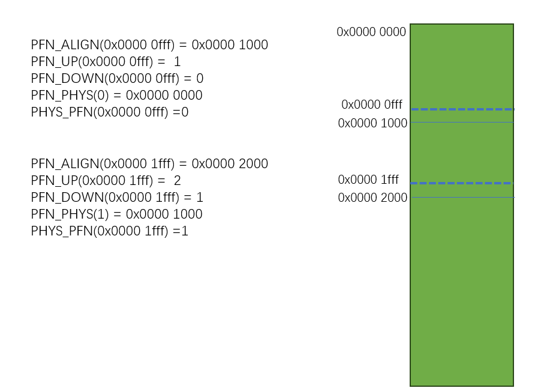
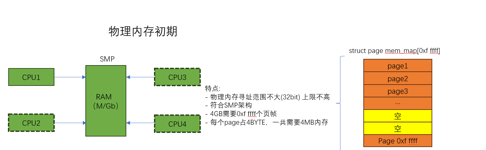
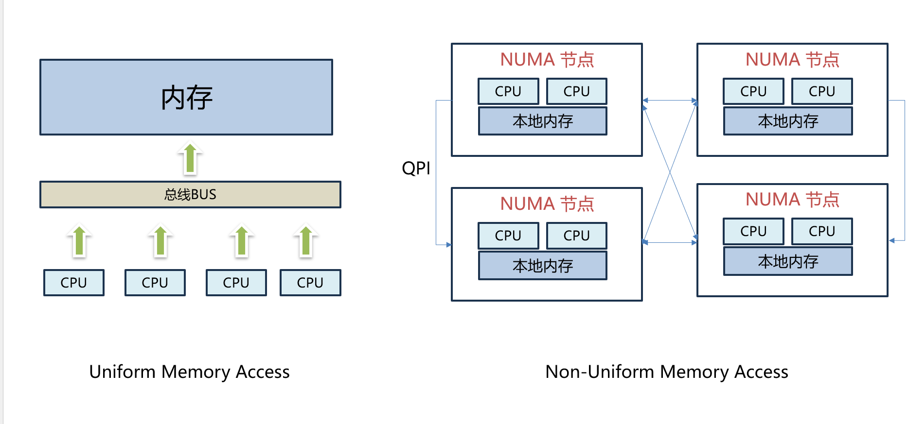
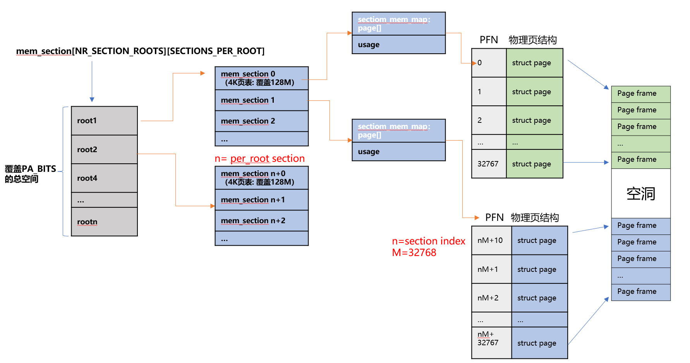
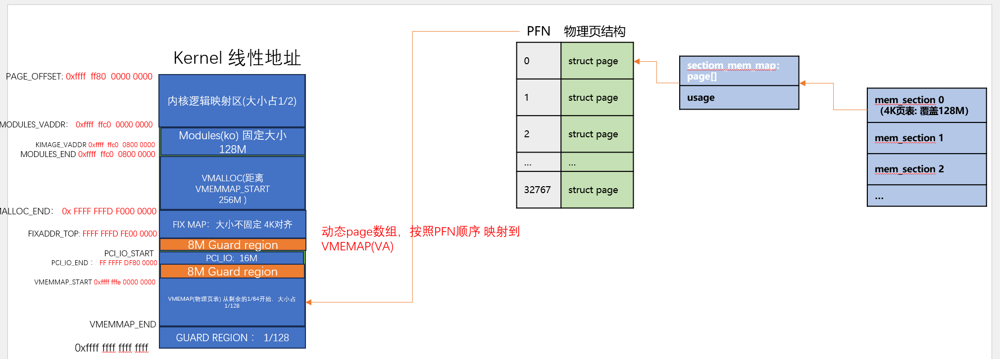
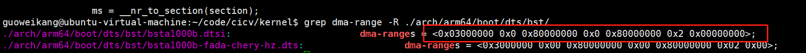
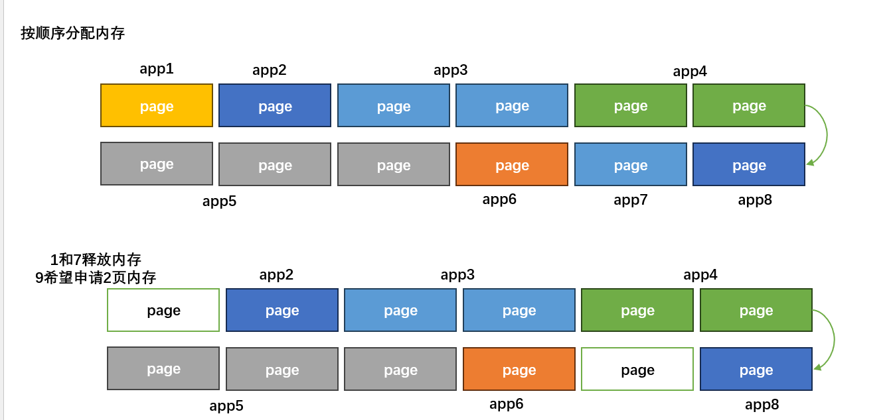
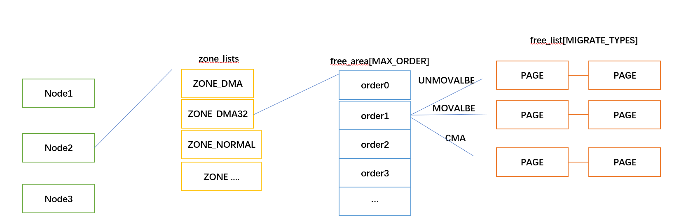

# 物理内存管理

之前 我们已经学习过了，内核启动阶段，通过memblock 以及线性映射，管理起来了系统的物理内存

但是memblock，对于物理内存的管理都是大颗粒的，并且实现比较简单，他的存在主要是为了给后续真正的内存管理提供
一个内存管理基础


## 物理内存页访问

### PFN
物理页帧号，内核根据MMU配置的`页大小`，给每个页编了一个序号，这个页号就叫`页帧编号`

举例说明: ARM32位下，CPU 可以访问的物理内存范围 `0x00000000 - 0xffff ffff`，如果按照4K页大小，可以得知，
有效物理内存范围内，一共需要(0xf ffff)个页帧，编号从(0-1048575)

可以看到，`页帧编号`还是非常好理解的,直接和`实际物理地址` 以及 `页的大小` 关联

内核提供的关于页帧的转换公式有: 

```
// 根据当前物理地址 获取下一个页帧的起始地址
#define PFN_ALIGN(x)    (((unsigned long)(x) + (PAGE_SIZE - 1)) & PAGE_MASK)
//根据当前物理地址  获取下一个页帧号
#define PFN_UP(x)       (((x) + PAGE_SIZE-1) >> PAGE_SHIFT)
//根据当前物理地址  获取上一个页帧号
#define PFN_DOWN(x)     ((x) >> PAGE_SHIFT)
//给定页帧，获取他的页帧起始物理地址
#define PFN_PHYS(x)     ((phys_addr_t)(x) << PAGE_SHIFT)
//给定物理地址，获取他的页帧号
#define PHYS_PFN(x)     ((unsigned long)((x) >> PAGE_SHIFT))    
```

下图展示了上述过程：




### 页帧

物理内存有了`PFN`编号，为了描述每个页，现在还需要一个抽象的结构体，我们把这个抽象的结构体叫`struct page`

对应每个PFN有一个结构体，用以记录该物理内存的: 状态(比如是否被使用、是否被锁、dirty信息等) 

这里只是先简单引入`struct page`的概念 


### 平坦模型
如何能够快速通过`pfn` 找到对应的`struct page` 决定了内存管理的复杂度和性能，为了管理物理内存，
内核在不同时期引入了几种模型，到今天为止，只剩下两个模型在使用

第一种： 早期和嵌入式环境下的平坦内存模型(最简单的一个连续数组)



从 `PFN` 到 `struct page` 数组的转换就非常简单: 

```
#define __pfn_to_page(pfn)      (mem_map + ((pfn) - ARCH_PFN_OFFSET))
#define __page_to_pfn(page)     ((unsigned long)((page) - mem_map) +  ARCH_PFN_OFFSET)
```
`mem_map`数组下标 和 `PFN` **一一对应** 

为了符号上面的转换公式，`mem_map`必须满足以下要求: 
 - `mem_map`数组需要覆盖架构所有内存
 - `mem_map`数组必须要是连续的，否则无法**一一对应**

上述要求直接导致:
 - 在64位架构下，`mem_map`数组如果要覆盖所有内存,自己占用的内存是`非常可怕的`
 - 真实的设备，`RAM`根本不会占用所有的物理地址，数组中存在大量`空洞`
 - NUMA以及内存热插拔的技术出现，平坦内存模型也无法更好适应 
 
因此，linux内核当前主要使用 第二种内存模型:**稀疏内存模型**

### 稀疏模型

在继续稀疏内存模型之前，先介绍一下 NUMA 和 UMP的内存访问模型




NUMA对不同numa 节点，提出了内存单独管理的诉求，在加上 内存热插拔的出现，平坦模型已经无法在胜任了

下图是**稀疏内存模型** 的页帧结构



让我们在描述下 section数组所使用内存的计算过程:


1. 一个`mem_section` 最少代表的连续内存？ `SECTION_SIZE_MEM` = `128Mb` (在我们平台下)
2. 覆盖所有物理内存需要多少个`mem_seciton` ?   `NR_SECTIONS` = `ARCH_PHYS/SECTION_SIZE_MEM`
3. `mem_section` 结构体大小 ? `size_of(struct mem_section)` 
4. 一个 ROOT(隐含`PAGE_SIZE`)可以存放多少个 `mem_section` : 
   `PER_ROOT_NR_SECTIONS` = `PAGE_SIZE/size_of(struct mem_section)`
5. 需要多少个ROOT 可以覆盖所有的物理内存? `ROOT_SIZE`= `NR_SECTIONS/PER_ROOT_NR_SECTIONS`

我们看到了section数组的计算公式，那么稀疏内存是如何节约内存的？这里的核心在于 **section数组的内存采用了动态按需分配**

我们还是举个例子描述这个过程，假设当前设备的RAM大小为`512MB`,且地址范围正好在`0-512MB` ，在64位架构下,物理地址范围`ARCH_PHYS`

1. 覆盖所有的物理内存需要 `ROOT_SIZE`个ROOT，因此 `mem_sections = malloc(sizeof(void *) * ROOT_SIZE)`
   实际不会很大,单位是一个指针
2. 经过确认，`0-512MB`都在`ROOT1`里面，因此 `mem_section[0] = = malloc(PAGE_SIZE)` （分配了4KB）
3. 经过确认, `0-512MB`可以通过`ROOT1`里面的前两个section覆盖,
   `mem_section[0][0].mem_map = malloc(sizeof(struct Page) * N)`
   `mem_section[0][1].mem_map = malloc(sizeof(struct Page) * N)`

通过上述过程，可以看到，`page 数组` 通过多级拆分，做到了按需动态分配,当然，这里存在内存浪费的情况，完全可以忍受
 - `ROOT`一级数组，基本不会都使用(很像我们之前讲多级页表的第一级页表)
 - `ROOT`第二级数组，也不一定都会使用，比如上面例子只使用了前两个 
 - `page数组`也可能不会全都使用,上面的例子正好是`128M`的倍数，如果RAM大小`64M`，则`section page 数组` 只使用一半


到这里我基本对稀疏内存模型的核心设计做完了阐述,让我们回到 从`PFN`到 `struct page` 的转换, 
由于`page 数组`在稀疏内存中的不连续性,`pfn`必须要经过多次决策才能找到对应的`page`

1. `pfn` 对应的`ROOT`下标
2. `pfn` 对应的`mem section`下标
3. `pfn` 对应在`mem_map`下标
4. `page of pfn` = `mem_section[x][y].mem_map[z]`


```
	
/*
* Note: section's mem_map is encoded to reflect its start_pfn.
* section[i].section_mem_map == mem_map's address - start_pfn;
*/
#define __page_to_pfn(pg)                                       \
({      const struct page *__pg = (pg);                         \
		int __sec = page_to_section(__pg);                      \
		(unsigned long)(__pg - __section_mem_map_addr(__nr_to_section(__sec))); \
})

#define __pfn_to_page(pfn)                              \
({      unsigned long __pfn = (pfn);                    \
		struct mem_section *__sec = __pfn_to_section(__pfn);    \
		__section_mem_map_addr(__sec) + __pfn;          \
})
```


### vmemmap

由于在稀疏模型下`PFN`和`page`的互相索引的性能问题，引入了VMEMAP的概念



`section`通过分段，按需动态申请内存的方式，解决了 如果要映射全部物理内存范围，`page数组`占用过大物理内存的问题  
但是通过把`page数组` 重新映射到 `VMEMMAP`虚拟内存上，则解决了 `PFN` 到 `page`的索引效率问题

主要利用了 **虚拟内存不需要占用真的物理内存** 以及由足够的**虚拟内存资源** 可以使用

```
/* memmap is virtually contiguous.  */
#define __pfn_to_page(pfn)      (vmemmap + (pfn))
#define __page_to_pfn(page)     (unsigned long)((page) - vmemmap)
```
 
### 主要代码

稀疏内存结构模型初始化路径为; 

```

	- start_kerenl 
	 - setup_arch
      - bootmem_init 
	   - sparse_init
        - memblocks_present() 利用memblock信息, 初始化 mem_section 数组，先把需要用到的section内存分配出来
		- sparse_init_nid 循环遍历所有numa节点，申请和初始化 section内部结构，比如 section_mem_map 的申请 
		 - __populate_section_memmap 建立 section_mem_map 到 vmemmap的内存映射
```


## 物理内存页的组织
上一节，我们主要围绕`pfn`和`struct page` 的关系进行探讨，本小节我们主要围绕内核是如何组织管理物理内存页的


### Node 
在介绍`NUMA`模型，我们提到过，`NUMA`把不同的内存区域,根据 `CPU`的距离，按照`NODE` 进行了区分，因此，首先
内核根据物理内存的分布，应该把不同的物理内存在软件层面予以抽象，这个抽象就是 `struct pglist_data[NODE_NUM]`

访问不同`NODE`节点的`pglist_data`，通过`NODE_DATA(id)` 访问

```
extern struct pglist_data *node_data[];
#define NODE_DATA(nid)          (node_data[(nid)])
```
 
当然，如果你不支持`NUMA`，而是`UMP`模型，`contig_page_data` 是全局唯一的一个内存区 ，该方法被替换为

```
extern struct pglist_data contig_page_data;
static inline struct pglist_data *NODE_DATA(int nid)
{
        return &contig_page_data;
}
```

### ZONE

理想情况下，内存中的所有`页`从功能上讲都是等价的，都可以用于任何目的，但现实却并非如此，
例如一些DMA处理器只能访问固定范围内的地址空间 [参考](https://en.wikipedia.org/wiki/Direct_memory_access)

因此内核将整个内存地址空间划分成了不同的区，每个区叫着一个 Zone, 每个 Zone 都有自己的用途。

理解DMA的概念: 参考一些资料即可，介绍一下DMA解决什么问题，以及为什么DMA有内存访问的约束

[内核关于DMA 的介绍](https://docs.kernel.org/core-api/dma-api-howto.html)


请查询官网,看一下跟多关于ZONE的描述


### pglist_data  
稀疏内存核心结构体: `struct pglist_data` 记录了每个 NUMA节点的内存布局，

内核以链表形式把所有`页`串联起来，这个结构在内核中抽象为`struct  pglist_data` ，有了之前的基础，现在可以简单看一下
`pglist_data`的内容了 

请查询官网,看一下跟多关于`pglist_data`的描述

[其他参考](https://www.kernel.org/doc/gorman/html/understand/understand005.html)


### 代码参考
内存分区和布局初始化路径为: 

```
- start_kerenl 
 - setup_arch
  - bootmem_init 
   - zone_sizes_init // 根据系统的DMA限制范围(ACPI 设备树信息等) 得到系统的DMA 最大访问范围 
    - free_area_init // free_area_init: 初始化numa节点的内存布局结构 pglist_data 以及 zone data
	   -  start_pfn = PHYS_PFN(memblock_start_of_DRAM()); // 系统真实物理地址的的起始PFN(去掉开头空洞) 
	   -  end_pfn = max(max_zone_pfn[zone], start_pfn); // 获取每个zone的 PFN下限
	   - free_area_init_node //初始化单个numa节点的 pg_data_t 和 zone data
		 - calculate_node_totalpages  // 计算zone的实际大小 初始化numa 和 zone的 pfn范围 和 以及pages数量
		 - free_area_init_core // 标记所有reserved 页帧 设置当前内存队列为空 清空所有内存标志位
		   - pgdat_init_internals 
		     - pgdat_init_split_queue // 初始化 pgdat 的 透明大页相关结构				 
			 - pgdat_init_kcompactd //  初始化内存压缩列表
		   -  pgdat->per_cpu_nodestats = &boot_nodestats; //初始化内存启动阶段的 内存使用情况统计
		   -  memmap_pages = calc_memmap_size(size, freesize); 计算 页帧管理(PAGE)占用的内存 

```

总结: 
`free_area_init_node`: 会遍历所有pglist_data node 下的 所有zone，对一些基本字段完成初始化，
主要计算了 每个zone 的起始 FPN（node_start_pfn） ，以及在每个node有效的页帧数量(node_present_pages)，
会初始化 zone 的有效的页帧数量(present_pages)

`memap_init` 主要调用init_single_page 完成所有page的初始化工作

```
- memmap_init
    -  memmap_init_zone_range
		   - memmap_init_range //初始化 物理页帧
```

### 示例参考

黑芝麻的 DMA range : 



zone的初始化日志 

```
[    0.000000] Zone ranges:
[    0.000000]   DMA      [mem 0x00000000 1800 0000 - 0x0000 0000 ffff ffff]
[    0.000000]   DMA32    empty
[    0.000000]   Normal   [mem 0x00000001 0000 0000 - 0x0000 0001 efff ffff]
[    0.000000] Movable zone start for each node
[    0.000000] Early memory node ranges
[    0.000000]   node   0: [mem 0x0000000018000000-0x00000000180fffff]
[    0.000000]   node   0: [mem 0x0000000080000000-0x000000008affffff]
[    0.000000]   node   0: [mem 0x000000008b000000-0x000000008cffffff]
[    0.000000]   node   0: [mem 0x000000008d000000-0x000000008fcfffff]
[    0.000000]   node   0: [mem 0x000000008fd00000-0x000000008fdfffff]
[    0.000000]   node   0: [mem 0x000000008fe00000-0x000000008febffff]
[    0.000000]   node   0: [mem 0x000000008fec0000-0x00000000b1ffffff]
[    0.000000]   node   0: [mem 0x00000000b2000000-0x00000000efffffff]
[    0.000000]   node   0: [mem 0x0000000198000000-0x00000001efffffff]
[    0.000000] mminit::memmap_init Initialising map node 0 zone 0 pfns 98304（18000000 >> 12） -> 1048576（ffff ffff >> 12） //对应DMA ZONE 
[    0.000000] mminit::memmap_init Initialising map node 0 zone 2 pfns 1048576(100000000 >> 12) -> 2031616（1 efff ffff >> 12） //对应NORMAL ZONE 
[    0.000000] On node 0 totalpages: 819456(3201M  对应所有memblock的mem)
```

## 物理内存分配

### buddy 算法原理
物理内存分配中，永远最令人头痛的就是连续物理内存分配，甚至于Linux内核专门为此研发出了很多特性 
比如大页内存，以及我们上面看到的为`DMA`服务的 `CMA`机制，还有内存重排；

为什么连续内存如此难以对付？如果把内存简单设计为一个数组，就像我们看到的`pfn`数组 



我们此时明明还有内存，但是却无法申请出满足用户要求的内存 

这时有一个可能的方案，把`app2`的内存进行内存交换，可以得到连续的2个内存页，没错，确实是一个方案，而且也是内核的
一个解决方案，但是请想一下，他的性能是有多么的差

因此内核通过对连续内存分配和释放提出了一个伙伴算法，他的原理其实很简单，
[视频链接](https://www.youtube.com/watch?v=1pCC6pPAtio)

[图片解释](https://s3.shizhz.me/linux-mm/3.2-wu-li-nei-cun/3.2.4-buddy-system-huo-ban-xi-tong)


### 内存碎片压缩

再继续进入内存分配之前，让我们先了解以下内存碎片的背景 
虽然buddy在某种程度上，可以缓解一些连续内存的分配压力

#### 背景
[参考](https://lwn.net/Articles/368869/)

简而言之：当系统运行时，页面往往会分散在不同用户之间，
当需要时很难找到物理上连续的页面组。为了尽可能避免高阶（多页面）内存分配的需要，
内核已经做了大量工作，因此大多数内核功能都不会受到页面碎片的影响。
但在某些情况下，仍然需要进行高阶分配；需要进行此类分配的代码可能会在碎片化系统上失效

另外值得注意的是，从某种程度上说，这个问题实际上越来越严重。
现代处理器已不局限于`4K 页`，它们可以在进程的部分地址空间中使用更大的页（"巨页"）
，使用超大页面可以带来真正的性能优势，这主要是由于处理器的转换查找缓冲区所承受的压力
减小了。但是，使用超大页面要求系统能够找到物理上连续的内存区域，
这些区域不仅要足够大，而且要正确对齐。对于已经运行了一段时间的系统来说，
寻找这样的空间是一个相当大的挑战。


#### 算法原理


#### 


### zonelists
首先应该知道，在每个`NUMA node` 下面，都有一个 `node_zonelists`,这其实就是一个数组
```
/*
 * node_zonelists contains references to all zones in all nodes.
 * Generally the first zones will be references to this node's
 * node_zones.
 */
struct zonelist node_zonelists[MAX_ZONELISTS];
```

先说明，为什么需要他，在`NUMA`的情况下，内存节点是有亲和性的，但是总有可能 从亲和的`node` 无法申请出内存，因此
每个`node`又根据和其他`node`的距离，根据`当前node`，进行了排序，作为备用`fallback`内存，一旦自己的`node`内存
无法申请出，从**离自己**最近的node分配

当然，嵌入式场景下，一般不用考虑`NUMA`，只有一个`node` 因此不存在`fallback` 这一说 


### zone
既然在非`NUMA`场景下，只有一个`NODE`,我们也知道 `NODE`下会又不同的`ZONE` ，因此在分配内存时，必须还要确定可以从
哪些`zone` 里面分配内存

```

#define GFP_ZONE_TABLE ( \
        (ZONE_NORMAL << 0 * GFP_ZONES_SHIFT)                                   \
        | (OPT_ZONE_DMA << ___GFP_DMA * GFP_ZONES_SHIFT)                       \
        | (OPT_ZONE_HIGHMEM << ___GFP_HIGHMEM * GFP_ZONES_SHIFT)               \
        | (OPT_ZONE_DMA32 << ___GFP_DMA32 * GFP_ZONES_SHIFT)                   \
        | (ZONE_NORMAL << ___GFP_MOVABLE * GFP_ZONES_SHIFT)                    \
        | (OPT_ZONE_DMA << (___GFP_MOVABLE | ___GFP_DMA) * GFP_ZONES_SHIFT)    \
        | (ZONE_MOVABLE << (___GFP_MOVABLE | ___GFP_HIGHMEM) * GFP_ZONES_SHIFT)\
        | (OPT_ZONE_DMA32 << (___GFP_MOVABLE | ___GFP_DMA32) * GFP_ZONES_SHIFT)\
)
```
`GFP_ZONE_TABLE` 规定了一个table， 规定了不同flags`__GFP_X` 对应的不同的内存区域

```
#define GFP_ZONEMASK    (__GFP_DMA|__GFP_HIGHMEM|__GFP_DMA32|__GFP_MOVABLE)

static inline enum zone_type gfp_zone(gfp_t flags)
{
        enum zone_type z;
        int bit = (__force int) (flags & GFP_ZONEMASK);
        z = (GFP_ZONE_TABLE >> (bit * GFP_ZONES_SHIFT)) &
                                         ((1 << GFP_ZONES_SHIFT) - 1);
        return z;
}
```
上述代码，首先 `GFP_ZONEMASK` 保证了只处理内存区域的为4种标识  然后对`GFP_ZONE_TABLE` 反向运算，可以得到最终可用的zone

举例说明： 

 - 如果用户没有指定zone(0)；则得到 `ZONE_NORMAL`
 - 如果用户指定`___GFP_DMA`；则得到 `OPT_ZONE_DMA`
 - 如果用户指定`___GFP_MOVABLE | ___GFP_DMA32`；则得到 `OPT_ZONE_DMA32`


### migrate 
内核在内存回收中，有一个解决方案叫做，内存迁移，内存迁移通过对物理内存页进行`移动 重排`，形成更加规整的内存

当前内核对内存迁移做了以下分类, 不同的迁移类型会被分为不同的组 以下是当前的分组类型
```
enum migratetype {
         MIGRATE_UNMOVABLE,
         MIGRATE_MOVABLE,
         MIGRATE_RECLAIMABLE,
         MIGRATE_PCPTYPES,       /* the number of types on the pcp lists */
         MIGRATE_HIGHATOMIC = MIGRATE_PCPTYPES,
 #ifdef CONFIG_CMA
         /*
          * MIGRATE_CMA migration type is designed to mimic the way
          * ZONE_MOVABLE works.  Only movable pages can be allocated
          * from MIGRATE_CMA pageblocks and page allocator never
          * implicitly change migration type of MIGRATE_CMA pageblock.
          *
          * The way to use it is to change migratetype of a range of
          * pageblocks to MIGRATE_CMA which can be done by
          * __free_pageblock_cma() function.
          */
         MIGRATE_CMA,
 #endif
 #ifdef CONFIG_MEMORY_ISOLATION
         MIGRATE_ISOLATE,        /* can't allocate from here */
 #endif
         MIGRATE_TYPES
 };

```

GFP 和 分组有个对应关系

```
  #define GFP_MOVABLE_MASK (__GFP_RECLAIMABLE|__GFP_MOVABLE) 
  #define GFP_MOVABLE_SHIFT 3
  
  static inline int gfp_migratetype(const gfp_t gfp_flags)
  {                       
          VM_WARN_ON((gfp_flags & GFP_MOVABLE_MASK) == GFP_MOVABLE_MASK);
          BUILD_BUG_ON((1UL << GFP_MOVABLE_SHIFT) != ___GFP_MOVABLE);
          BUILD_BUG_ON((___GFP_MOVABLE >> GFP_MOVABLE_SHIFT) != MIGRATE_MOVABLE);
          BUILD_BUG_ON((___GFP_RECLAIMABLE >> GFP_MOVABLE_SHIFT) != MIGRATE_RECLAIMABLE);
          BUILD_BUG_ON(((___GFP_MOVABLE | ___GFP_RECLAIMABLE) >>
                        GFP_MOVABLE_SHIFT) != MIGRATE_HIGHATOMIC);
          
          if (unlikely(page_group_by_mobility_disabled))
                  return MIGRATE_UNMOVABLE;
          
          /* Group based on mobility */
          return (__force unsigned long)(gfp_flags & GFP_MOVABLE_MASK) >> GFP_MOVABLE_SHIFT;
  }    
```

从上述代码可以推出
 -  `___GFP_MOVABLE` 对应 `MIGRATE_MOVABLE`
 -  `___GFP_RECLAIMABLE` 对应 `MIGRATE_RECLAIMABLE`
 -  `___GFP_MOVABLE` | `___GFP_RECLAIMABLE` 对应 `MIGRATE_HIGHATOMIC`


### 核心数据结构

有了之前的概念，我们把内核对于 ZONE 和页表的关系画出来 这个图是基础



我们目前还没有解释 order 的含义，不过我们马上就要解释他

### order
如上图,必须要知道，内核分配内存单位是以 `order`为单位  `order`的含义代表 2的幂次方 

 - order0：表示分配1个页
 - order1：表示分配连续2个页
 - order2：表示分配连续4个页，依次类推

是否发现一个问题，内核没有办法分配 3个连续内存页？ 为什么？内核之所以选择这样做，是因为内核使用的内存分配算法决定的

该算法我们在后面小节讲,现在先回到我们的主题，通过核心结构，可以看到，内核把每个`ZONE`的内存，根据连续性，分为了不同链表

如果我们分配`order 2` 的内存页，就会从 对应的`free_list[2]` 中优先寻找是否有可以使用内存，当然，如果没有，则会从`order 3`
的内存中找(拆分为2个`order2`)的链表


### type 
type我们之前已经介绍过了，标识内存页的迁移标志位，如果有可能，我们分析迁移时在详细介绍

### 链表初始化

这个结构的初始化主要分为两部分，第一部分其实我们已经在之前提到过,

```
bootmem_init//还记得我们讲 section初始化吗 他也是在这里初始化的
 - zone_sizes_init //还记得我们讲 DMA初始化吗， 每个zone的大小计算，在这里完成 
  - free_area_init // 内存布局这里完成初始化
   - free_area_init_node //node内存布局这里完成
    - free_area_init_core
       -init_currently_empty_zone //这里会把 free_list 全部初始化为空链表
```

OK 此时，ZONE里面的可用内存 目前都是空，也就是如果有人申请内存，此时是不可能申请到的，那么是谁初始化的空闲链表?


### 链表填充

还记得现在是谁在管理内存吗？ `memblock`,memblock只需要把他管理的内存，除了`reserved`的内存全部释放给buddy就可以了

```
start_kernel 
 - mm_init 
  - mem_init 
    - memblock_free_all 
	 - __free_pages_memory 
	  - memblock_free_pages(pfn_to_page(start), start, order); 
```

需要注意的有，我们在初始化`memmap`的时候，所有的`page`设置的迁移类型都为`MIGRATE_MOVABLE`
因此所有未在memblock标记为`reserved` 的内存 会被释放到 `MOVAABLE`的free_list 


```
 static void __init memmap_init_zone_range(struct zone *zone,
                                            unsigned long start_pfn,
                                            unsigned long end_pfn,
                                            unsigned long *hole_pfn)
  {
          unsigned long zone_start_pfn = zone->zone_start_pfn;
          unsigned long zone_end_pfn = zone_start_pfn + zone->spanned_pages;
          int nid = zone_to_nid(zone), zone_id = zone_idx(zone);
          
          start_pfn = clamp(start_pfn, zone_start_pfn, zone_end_pfn);
          end_pfn = clamp(end_pfn, zone_start_pfn, zone_end_pfn);
                  
          if (start_pfn >= end_pfn)
                  return;
          
          memmap_init_range(end_pfn - start_pfn, nid, zone_id, start_pfn,
                            zone_end_pfn, MEMINIT_EARLY, NULL, MIGRATE_MOVABLE);
  
          if (*hole_pfn < start_pfn)
                  init_unavailable_range(*hole_pfn, start_pfn, zone_id, nid);
  
          *hole_pfn = end_pfn;
  }
  
```

你以为这样就完了吗？不不不 还没有，让我们在看一下黑芝麻的内存
```
[    0.000000] Reserved memory: created DMA memory pool at 0x000000008b000000, size 32 MiB
[    0.000000] OF: reserved mem: initialized node bst_atf@8b000000, compatible id shared-dma-pool
[    0.000000] Reserved memory: created DMA memory pool at 0x000000008fec0000, size 0 MiB
[    0.000000] OF: reserved mem: initialized node bst_tee@8fec0000, compatible id shared-dma-pool
[    0.000000] Reserved memory: created DMA memory pool at 0x000000008ff00000, size 1 MiB
[    0.000000] OF: reserved mem: initialized node bstn_cma@8ff00000, compatible id shared-dma-pool
[    0.000000] Reserved memory: created DMA memory pool at 0x000000009a000000, size 32 MiB
[    0.000000] OF: reserved mem: initialized node bst_cv_cma@9a000000, compatible id shared-dma-pool
[    0.000000] Reserved memory: created DMA memory pool at 0x000000009c000000, size 16 MiB
[    0.000000] OF: reserved mem: initialized node vsp@0x9c000000, compatible id shared-dma-pool
[    0.000000] Reserved memory: created DMA memory pool at 0x00000000a1000000, size 16 MiB
[    0.000000] OF: reserved mem: initialized node bst_isp@0xa1000000, compatible id shared-dma-pool
[    0.000000] Reserved memory: created CMA memory pool at 0x00000000b2000000, size 864 MiB
[    0.000000] OF: reserved mem: initialized node coreip_pub_cma@0xb2000000, compatible id shared-dma-pool
[    0.000000] Reserved memory: created CMA memory pool at 0x00000000e8000000, size 8 MiB
[    0.000000] OF: reserved mem: initialized node noc_pmu@0xe8000000, compatible id shared-dma-pool
[    0.000000] Reserved memory: created CMA memory pool at 0x00000000e8800000, size 8 MiB
[    0.000000] OF: reserved mem: initialized node canfd@0xe8800000, compatible id shared-dma-pool
[    0.000000] Zone ranges:
[    0.000000]   DMA      [mem 0x0000000018000000-0x00000000ffffffff] // DMA ZONE 的范围
[    0.000000]   DMA32    empty
[    0.000000]   Normal   [mem 0x0000000100000000-0x00000001efffffff]  // NORMAL ZONE 的范围
[    0.000000] Movable zone start for each node
[    0.000000] Early memory node ranges
[    0.000000]   node   0: [mem 0x0000000018000000-0x00000000180fffff]
[    0.000000]   node   0: [mem 0x0000000080000000-0x000000008affffff] 
[    0.000000]   node   0: [mem 0x000000008b000000-0x000000008cffffff] 
[    0.000000]   node   0: [mem 0x000000008d000000-0x000000008fcfffff] 
[    0.000000]   node   0: [mem 0x000000008fd00000-0x000000008fdfffff]
[    0.000000]   node   0: [mem 0x000000008fe00000-0x000000008febffff]
[    0.000000]   node   0: [mem 0x000000008fec0000-0x00000000b1ffffff]
[    0.000000]   node   0: [mem 0x00000000b2000000-0x00000000efffffff] //reserved as CMA 

[    0.000000]   node   0: [mem 0x0000000198000000-0x00000001efffffff]
[    0.000000] cma: Reserved 128 MiB at 0x0000000083000000 - 0x000000008b000000  // CMA 预留的内存 reserved as CMA
```

我们可以看到，还有大量`DMA32`区域的内存被标记为`CMA reserved`,这些内存隐含有 `resuable`，因此这部分内存也应该被
释放到freelist使用 他的逻辑如下  

```
 - kernel_init
   - kernel_init_freeable
     - do_basic_setup 
	   - cma_init_reserved_areas
	     -  cma_activate_area  
		  - set_pageblock_migratetype(page, MIGRATE_CMA); //设置迁移类型为CMA 
		  - __free_pages(page, pageblock_order);
```

最终，我们从系统中观察一下是否符合预期: `cat /proc/zoneinfo  |grep cma `

```
Node 0, zone   DMA32 
  pages free     287494
        min      8391
        low      10488
        high     12585
        spanned  950272  = 空洞
        present  459008  = 存在的page数量
        managed  287941  = 被buddy接管的内存数量()
        cma      258048  = 1008Mib  =  864 + 8 + 8 + 128  符合我们的预期
        protection: (0, 0, 1343, 1343)
		start_pfn:           98304  = 起始PFN

Node 0, zone   Normal
  pages free     176546
        min      10040
        low      12550
        high     15060
        spanned  983040
        present  360448
        managed  343886
        cma      0
``` 


### PCP(per cpu pageset)

## DEBUG 

## 性能调优

### 内存碎片整理


