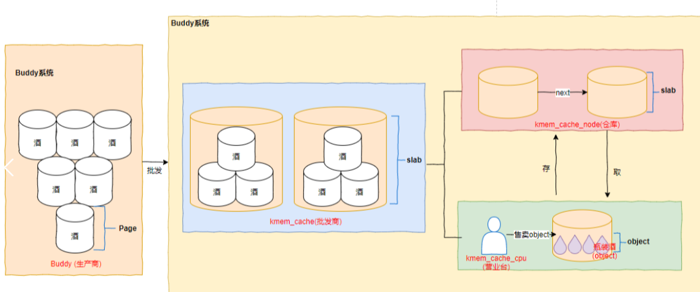

## slab原理

```json
node" {
    "label": "slub-concepts",
    "categories": ["mem"],
    "info": "slub concepts",
    "depends": [

    ]
}
```

### 介绍

#### 回顾和背景介绍

在上一个章节，我们着重学习了`page allocator`的原理和实现，显而易见， `page allocator` 申请的内存最小颗粒也是一个`page` (大部分情况是`4K`)

但是实际情况是，系统任务的需求是按照`page`去使用的吗？ 我们最习惯看到的内存申请可能更像是下面这样

```c
struct Object {
   ...
}


struct Object *ptr = (struct Object *)malloc(sizeof(Object))
```

`malloc`是用户态常用的内存申请接口，传入一个用户期望的内存大小，返回一个内存指针;

同样在内核申请内存也是一样的，假如我们申请一个`10 byte`大小的内存，如果用`page allocator` 很明显是不合适的, 因此需要一个针对非`page` 对齐大小，更小颗粒度的内存分配器；

当然，无论哪种内存分配器，最终都必须要依赖和基于`page allocator` 的页内存分配实现

这里我们用网上一个典型的比喻说明 不同内存分配器之间关系



`page allocator` 是内存生产商，以`page` 为单位对内存进行生产，`slab` 则是批发商，批量从生产商购买内存之后，在分成更小的包装对客户售卖

#### 关于大小

既然`slab allocator` 是针对小颗粒内存申请的，内核建议：对于效于`PAGE`大小的内存使用`slub`分配，超过`page`大小的内存 建议直接使用`page allocator`的接口 ，我们可以认为如果有超过`page`大小的内存申请，你自己就是批发商，不需要再来找`slub`购买

同过查看代码确认，实际`slub`也支持大内存申请，但是实际申请时，其实也是走`page allocator`申请的内存

#### 关于使用

本章节

#### 关于 slab、slob和slub关系

`slab\slob\slub`都是小内存分配器，slab是slob和slub实现的基础，而`slob`和`slub`是针对`slab`在不同场景下的优化版本。在slab引入Linux的很多年内，其都是Linux内核管理对象缓冲区的主流算法。并且由于slab的实现非常复杂，很长一段时间内都少有对它的改动。随着多处理器的发展和`NUMA`架构的广泛应用，`slab`的不足也逐渐显现。`slab`的缓存队列管理复杂，其用于管理的数据结构存储开销大，对`NUMA`支持复杂，`slab`着色机制效果不明显。这些不足让slab很难在两种场景下提供最优的性能：小型嵌入式系统和配备有大量物理内存的大规模并行系统。对于小型嵌入式系统来说，`slab`分配器的代码量和复杂性都太高；对于大规模并行系统，`slab`用于自身管理的数据结构就需要占用很多G字节内存。针对`slab`的不足，内核开发人员`Christoph Lameter`在在内核版本2.6开发期间，引入了新的`Slub`分配器。`Slub`简化了`slab`一些复杂的设计，但保持`slab`的基本设计思想。同时，一种新的针对小型嵌入式系统的分配器`slob`也被引入，为了适应嵌入式系统的特点，`slob`进行了特别的优化，以大幅减少代码量（slob只有大约600行代码）。

#### 关于学习顺序

关于本章节我们将按照从 使用者 (只需要了解掌握`API` ) 管理员(掌握了解`slab`基本原理和分析方法) 最后到内核开发者(介绍一些代码实现) 的顺序进行

统一用`slxb`表示`slab/slub/slob`

我们上一节已经介绍过，`slxb` 的核心理念是作为批发商从`page allocator` 批发内存，然后再拆分成小包装卖给`客户`

### Terms

#### kmem_cache

First,we need to clear ：

- kernel default provide some classifies wholesalers according to different `mem size`, different `mem zone`, and  `reclaimable` , we will see them later. 

- We can even also create a wholesaler ourselves

However, the difference between different wholesalers is that they provide different goods(`mem`) 

Each `kmem_cache` represents a wholesaler of a product.

#### slab

`kmem_cache` will reprents a type of mem object ,and obviously `kmem_cache` should not apply all its memory from `page alloctor` at once, but should apply it in batches according to usage. 

For example, if the  object memory size we sell is `128Byte`, if we apply for one page (`4KB`) each time, then we have `32` memory objects that can be sold, if we apply for two pages, then we have `64 `memory objects that can be sold. 


#### kmem_cache_cpu

Assume user want to buy an object from the wholesalers(`kmem_cache` ) ,   and then `kmem_cache`  might  get a free object from `slub`   , but on SMP machine, if muti task from different cpu  alloc the same mem object,  we must use a lock to protect `slub` or `kmem_cache` .

So `kmee_cache`   would put  a `slab` into  `kmem_cache_cpu`,customer from `kmem_cache_cpu`  to get object.  when `kmem_cache_cpu` is empty, we put a new slab into it.


##### kmem_cache_node

This is not common,  only on a `NUMA` machine we need to consider.


In the NUMA architecture, we need to distinguish the memory from different nodes.

But it doesn't like  diferent  `kmem_cache` , different `kmem_cache` means they sold different  mem objects,  it  doesn't allow from others.  

The same type of  mem object allow alloc  from other nodes( If we don't specify a specific node). 


So each `kmem_cache`  also store node's  `slubs`  in  `kmem_cache_node`


