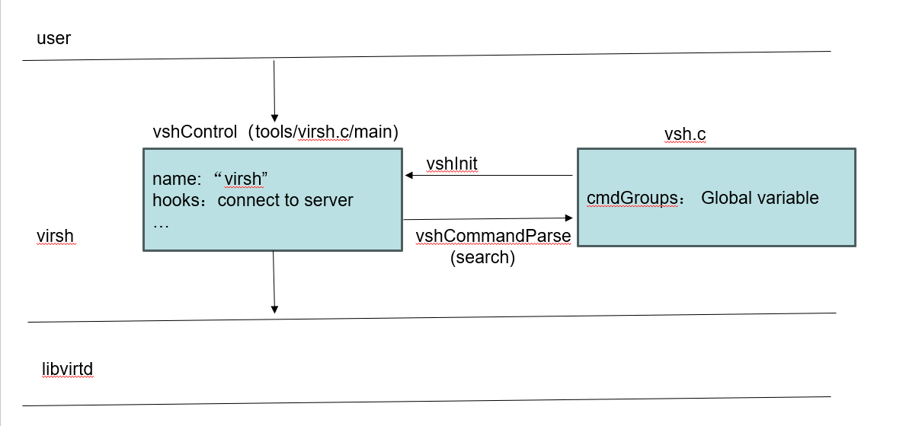
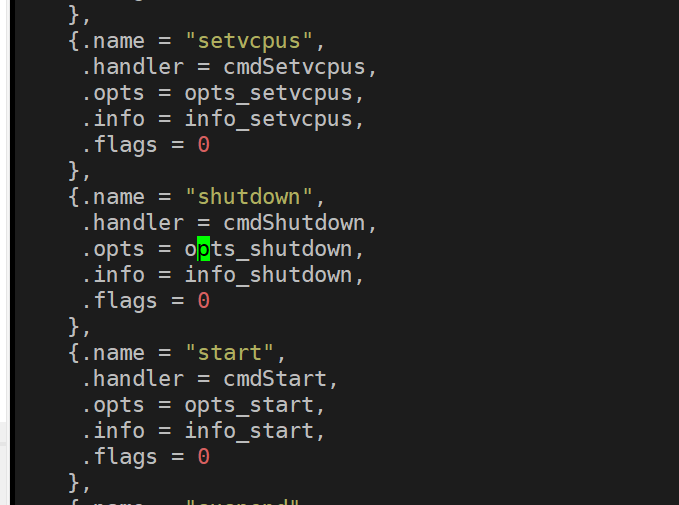
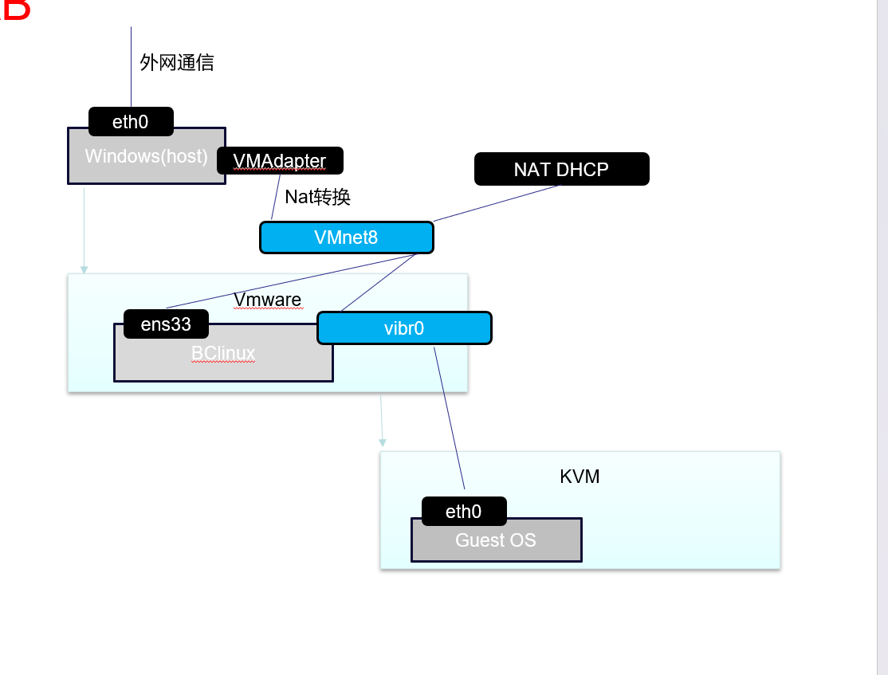

=============
KVM子系统
=============

前言
=====

基本概念
----------

基本术语
^^^^^^^^
 - host： 运行虚拟操作系统的宿主机
 - guest/Virtual Machine/Domain/VM ： 一个虚拟操作系统
 - virt-manager: 负责部署和管理虚拟机的图形化工具
 - virt-install: 负责安装虚拟机的命令行工具

hypervisor
^^^^^^^^^^^^
虚拟机管理程序，顾名思义，就是负责创建、运行、管理虚拟机的程序，一般业界会根据hypervisor运行的环境 以及guset os运行环境，分为type1 type2 

 - type1: hypervisor运行在裸机上，自己是独立的微型的系统，不需要操作系统承载,这样guest os可以直接运行在主机/裸金属 比如: XEN Hyper-V VMware ESXi
 - type2: hypervisor运行操作系统上，因此 guest os 也需要运行在 主机操作系统上,比如 VMware Workstation，VirtualBox

从定义上，我们可以直观感受到，两种虚拟化的不同
 
 - type1的更"直接",就意味性能会更好
 - type2由于隔离了一层操作系统，势必性能就会更差
 - type1的硬件是有限的，Guest OS一旦确定了硬件资源，那可能就只有这么多，同时也限制了GuestOS数量，如果type1 希望处理这种限制，他势必又要对硬件做抽象管理(但是这不就是操作系统干的事情吗)
 - type2由于是host操作系统虚拟化出来的(可以先简单类比为线程)，就实现了硬件资源可以被多路复用: 比如通过调度CPU 可以同时被OS1,OS2使用(性能打折), 但是如果GOS1和GOS2一个是白天运行业务，一个是晚上运行业务，性能打折会更小
 
在云服务厂商中，type2如今被大规模使用

KVM
^^^^^
Kernel-based Virtual Machine (KVM) is a 是 Linux 内核的虚拟化基础设施，可将其转变为hypervisor(虚拟机管理程序)。 它在2007年2月5日发布的内核版本2.6.20中被合并到Linux内核主线中。

:KVM属于type1还是type2: 
  直观可能会认为KVM 是type2，毕竟hypervisor以及Guest OS都是运行在 linux 操作系统上的，但是实际上KVM是介于type1和type2之间，
  KVM属于内核模块，实际运行在内核态,其实可以认为和type1一样，kvm guest 某些能力可以直接基于硬件，但是又因为host 上又在同时运行linux HOST操作系统，主机应用和虚拟机也有资源竞争，所以，这种意义上，内核也属于type2

KVM的优点: 

- 性能和可扩展性：KVM 提供接近本机的性能，这使其成为可扩展的解决方案。
- 成本更低：由于开源，没有供应商锁定，维护虚拟化基础设施很容易。
- 安全：KVM支持selinux等安全特性，使其安全。 注意：不保证任何虚拟机管理程序没有错误
- 支持实时/离线VM迁移：当计划在KVM主机上进行任何维护时，此功能会有所帮助。
- 完全虚拟化：KVM 是一种完全虚拟化技术，而不是半虚拟化技术，因此不需要在来宾操作系统中进行任何修改。
- 开源：KVM 是开源软件，由大型开源开发者社区维护。
- 各种文件系统支持：KVM支持主流Linux内核支持的所有类型的文件系统。
- 资源过度使用：允许您分配比主机上可用资源更多的虚拟化 CPU 和内存。然后，虚拟机仅使用它们需要的资源，从而允许其他虚拟机使用未使用的资源

KVM的缺点： 

 - 受某些处理器类型支持：https://www.linux-kvm.org/page/Processor_support
 - 复杂的网络。

简单实验
^^^^^^^^^^^^
在 :ref:`基于KVM运行虚拟机` 实验指引下，初尝KVM的魅力

技术架构
=========

代码分析
=========

virsh
-------
在定位某个问题，因为需要从源头追踪一下，顺便梳理了一下

virsh 是libvirt 管理虚拟机的shell client工具，实际上严格意义来说不涉及到虚拟化的具体工作，主要作为前端 和 libvird 通信的前端工具 
但是工具又是我们经常需要接触的，一条命令敲下去之后，他后面发生了什么？我们如果需要继续追踪下去，那不得不回到最开始的地方，一步一步探索下去

 

命令解析管理模块
^^^^^^^^^^^^^^^^^^^^
vshControl 是通信交互模块的通道核心，负责前后台建联， cmdGroups则定义了相关命令行的实现

常用工具
=========

问题定位
=========

shutdown无反应
----------------

问题描述
^^^^^^^^^^^^
实验中的  :ref:`启动虚拟机测试` 虚拟机启动以后，通过virsh shutdown 虚拟机无反馈

环境特征: 

 - Vmware虚拟机 中 嵌套KVM二次虚拟化 
 - guest os 是一个最小系统，内核+buildroot
 - KVM host 版本：BClinux8.6 

 
操作步骤: 
 
 - 按照实验 启动内核后，功能正常，然后通过  virsh shutdown 尝试关闭虚拟机，虚拟机没有响应，依然正常工作，没有关闭

问题定位
^^^^^^^^
virsh shutdown定义位于./tools/virsh-domain.c  

可以看到 virsh shutdown 支持4个模式，我们当前是没有传入mode，也尝试了指定mode，发现只有acpi可以执行下去

.. code-block:: c
	:emphasize-lines: 28,30
	:linenos:

	while (tmp && *tmp) {                                                        
        mode = *tmp;                                                             
        if (STREQ(mode, "acpi")) {                                               
            flags |= VIR_DOMAIN_SHUTDOWN_ACPI_POWER_BTN;                         
        } else if (STREQ(mode, "agent")) {                                       
            flags |= VIR_DOMAIN_SHUTDOWN_GUEST_AGENT;                            
        } else if (STREQ(mode, "initctl")) {                                     
            flags |= VIR_DOMAIN_SHUTDOWN_INITCTL;                                
        } else if (STREQ(mode, "signal")) {                                      
            flags |= VIR_DOMAIN_SHUTDOWN_SIGNAL;                                 
        } else if (STREQ(mode, "paravirt")) {                                    
            flags |= VIR_DOMAIN_SHUTDOWN_PARAVIRT;                               
        } else {                                                                 
            vshError(ctl, _("Unknown mode %s value, expecting "                  
                            "'acpi', 'agent', 'initctl', 'signal', "             
                            "or 'paravirt'"), mode);                             
            return false;                                                                                       
        }                                                                        
        tmp++;                                                                   
    }

	if (!(dom = virshCommandOptDomain(ctl, cmd, &name)))                         
        return false;                                                            
                                                                                 
    if (flags)                                                                   
        rv = virDomainShutdownFlags(dom, flags);                                 
    else                                                                         
        rv = virDomainShutdown(dom);                                             
                                                                                 
    if (rv != 0) {                                                               
        vshError(ctl, _("Failed to shutdown domain '%s'"), name);                
        return false;                                                            
    }
	

我们继续跟踪不带flags 的 virDomainShutdown，发现这样一段注释:

.. code-block:: console
	:linenos:

	#Shutdown a domain, the domain object is still usable thereafter, but the domain OS is being stopped. Note that the guest OS may ignore the  request. Additionally, the hypervisor may check and support the domain  'on_poweroff' XML setting resulting in a domain that reboots instead of   shutting down. For guests that react to a shutdown request, the differences    from virDomainDestroy() are that the guests disk storage will be in a stable state rather than having the (virtual) power cord pulled, and  this command returns as soon as the shutdown request is issued rather  than blocking until the guest is no longer running.      
    If the domain is transient and has any snapshot metadata (see virDomainSnapshotNum()), then that metadata will automatically be deleted when the domain quits.  
    Returns 0 in case of success and -1 in case of failure.    

大致意思是说
  - guest os 可能会忽略关机请求
  - 会检查 on_poweroff的XML 状态(virsh dumpxml 获得)，决定是重启还是shutdown 
  - 关机和销毁的区别在于 正常关机，系统会处于稳定态，如果执行销毁可能会导致磁盘损坏
  - 成功返回0，失败返回-1 

结合我们命令行 并没有打印出 上面代码的关机出错提示，可以知道 virDomainShutdown 是执行成功的

.. code-block:: c
	:emphasize-lines: 16
	:linenos:
	
	virDomainShutdown(virDomainPtr domain)                                           
	{                                                                                
		virConnectPtr conn;                                                          
																					
		VIR_DOMAIN_DEBUG(domain);                                                    
																					
		virResetLastError();                                                         
																					
		virCheckDomainReturn(domain, -1);                                            
		conn = domain->conn;                                                         
																					
		virCheckReadOnlyGoto(conn->flags, error);                                    
																					
		if (conn->driver->domainShutdown) {                                          
			int ret;                                                                 
			ret = conn->driver->domainShutdown(domain);                              
			if (ret < 0)                                                             
				goto error;                                                          
			return ret;                                                              
		}                                                                            
																					
		virReportUnsupportedError();                                                 
                                                                                 
		error:                                                                          
		virDispatchError(domain->conn);                                              
		return -1;                                                                   
	}

从上面代码可以看到，真正执行关机的是 16行 con->driver->domainShutdown

实验
=====

.. _基于KVM运行虚拟机:

基于KVM运行虚拟机
------------------

前提准备
^^^^^^^^^^^^
 - 处理器 support Intel Virtualization Technology or AMD-V depending on the brand of the processor.
 
.. note::

	Intel VT can be disabled/enabled in the BIOS settings.Most hardware manufacturer keep it disabled.
 	AMD-V can't be disabled in the BIOS.

Processor's Virtualization Extensions are enabled. 

.. code-block:: console
    :linenos:

	#grep -E 'svm|vmx'/proc/cpuinfo
	
Linux OS with minimum of above kernel version 2.6.20. 

.. code-block:: console
    :linenos:

	# uname -a

安装必要软件
^^^^^^^^^^^^

.. code-block:: console
    :linenos:
	
	$ dnf install -y virt-install qemu-kvm libvirt libvirt-python \
	  libguestfs-tools virt-manager  bridge-utils
	$ systemctl enable libvirtd
	$ systemctl start libvirtd
	$ systemctl status libvirtd
	$ reboot 
	$ systemctl status libvirtd
	$ modinfo kvm_intel
	$ modinfo kvm

网络配置
^^^^^^^^^^^^
libvirtd 使能之后，会创建一个叫 virbr0的device, 

.. code-block:: console
    :linenos:

	$ nmcli  device show  virbr0
	$ brctl list

virtbr0 就是一个虚拟的交换机，由于我的linux已经运行在了虚拟机下面，环境稍微会复杂一点

 
我的给Bclinux原本ens33 是 VMWARE 用于和windows通过Nat转发的，现在我们把ens33 和 virbr0 配置为混杂模式(其实就是virbr替代了ens33)，然后kvm虚拟机也能通过windows 的Nat Dhcp提供网络了

ENS33的配置如下: 

.. code-block:: console
    :linenos:

	TYPE=Ethernet
	PROXY_METHOD=none
	BRIDGE=virbr0
	BROWSER_ONLY=no
	BOOTPROTO=none
	DEFROUTE=yes
	IPV4_FAILURE_FATAL=no
	NAME=ens33
	UUID=3e98f4f9-bd3d-43ce-8830-b567ffe43ab9
	DEVICE=ens33
	ONBOOT=yes

virbr0的配置如下: 

.. code-block:: console
    :linenos:

	TYPE=BRIDGE
	DEVICE=virbr0
	BOOTPROTO=dhcp
	ONBOOT=yes
	NAME=virbr0

.. _启动虚拟机测试:

启动虚拟机测试
^^^^^^^^^^^^^^^^^
我先通过之前kernel测试环境 :ref:`QEMU开发环境准备`  检查一下网络: 

.. code-block:: console
    :linenos:

	$ virt-install --name my_guest_os --import --disk path=/home/guoweikang/code/buildroot/output/images/rootfs.qcow2,format=qcow2 --memory 2048 --vcpus 1 --boot kernel=./arch/x86/boot/bzImage,kernel_args="root=/dev/sda  rw console=ttyS0,115200 acpi=off nokaslr"   --graphics none --serial pty --console pty,target_type=serial --network bridge=virbr0,model=virtio
	$ ifconfig  eth0 up
	$ udhcpc -i eth0 -- 通过dhcp配置 eth0
	
	
虚拟机测试基本管理
^^^^^^^^^^^^^^^^^^^^

.. code-block:: console
    :linenos:
	
	$ virsh list (--all) -- 查看虚拟机 
	$ virsh start/shutdown/reboot  xxx  -- 启动 关闭 重启虚拟机
	$ virsh suspend/resume   xxx  --  挂起和恢复
	$ virsh undefine/destroy   xxx  --  销毁虚拟机
	$ virsh console    xxx  -- 进入虚拟机console 
	$ ctrl ]   -- 退出虚拟机console 
	$ virsh autostart (--disable)   -- 虚拟机和host一起自动开机 
	$ virsh domuuid xxxx  -- 虚拟机uuid

	