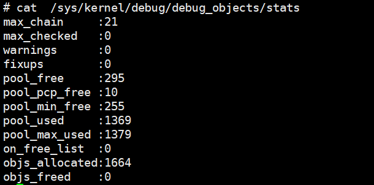

==========
LinuxDFX
==========

.. _debugobjects:

debugobjects
=============

需要具备以下基本知识: 
 
 - 

模块设计
---------

源码位于: *lib/debugobjects.c*
核心数据结构：debug obj的维护，trace obj 统一从slab 分配，每个CPU 维护一个PERCPU列表(不需要持有pool lock) ，pool lock 负责维护OBJ的整体分配
 

状态机:

如何使用
---------

功能开启关闭
^^^^^^^^^^^^^
 
 - 通过CONFIG_DEBUG_OBJECTS 可以开启对象生命周期监控模块编译 
 - kernel 通过 命令行参数:  *debug_objects* *no_debug_objects* 可以动态选择开启关闭

.. note::

    动态关闭会有一些性能损失，编译关闭，可以通过编译器优化 把空函数直接删除，动态关闭，依然会有一次跳转和判断

状态查看
^^^^^^^^

通过 /sys/kernel/debug/debug_objects/stats 可以查看对象统计状态, 参考： ref:`实验debug_objects_stats` 

对外API
^^^^^^^^

:debug_object_init:

在对象初始化函数调用，该函数会见检查对象是否可以初始化

 - 处于活动状态: 会被认为是错误初始化，额外提供了fixup机制，如果提供了fixup_init函数，调用者应该保证fixup_init 应该修正这个错误: 比如把活动对象停用，以防止破坏子系统
 - 处于已经销毁状态: 会被认为是错误初始化, 不提供fixup 仅仅是打印
 - 未被跟踪: 会新分配一个跟踪对象器，并设置状态: ODEBUG_STATE_INIT, 同时检查该对象是否在堆栈上，如果在堆栈，会打印告警，堆栈上的对象，应该使用 debug_object_init_on_stack，见下一节
 
:debug_object_init_on_stack:

堆栈上的对象在初始化之前调用，该函数会见检查对象是否可以初始化

  - 活动状态或者是已销毁: 会被认为是错误初始化，额外提供了fixup机制，如果提供了fixup_init函数，调用者应该保证fixup_init 应该修正这个错误: 比如把活动对象停用，以防止破坏子系统

堆栈上的对象，必须在该对象的生命周期(代码块) 退出之前， 调用debug_object_free() 从跟踪器删除堆栈上的对象，否则会导致跟踪错误

:debug_object_activate:

调用真实对象的激活函数时 需要调用此函数 

 
实验
------

.. _实验debug_objects_stats:

实验1:查看debug_objects_stats
^^^^^^^^^^^^^^^^^^^^^^^^^^^^^^^^^^^^
.. code-block:: console
    :linenos:
	
	$ mount -t debugfs none /sys/kernel/debug (make sure CONFIG_DEBUG_FS is config)
	$ cat /sys/kernel/debug/debug_objects/stats 
	

实验2:动态关闭debug_objects
^^^^^^^^^^^^^^^^^^^^^^^^^^^^^^^^^^^^
.. code-block:: console
    :linenos:
	
	$  virt-install --name my_guest_os --import --disk path=/home/guoweikang/code/buildroot/output/images/rootfs.qcow2,format=qcow2 --memory 2048 --vcpus 1 --boot kernel=./arch/x86/boot/bzImage,kernel_args="root=/dev/sda  rw console=ttyS0,115200 acpi=off nokaslr no_debug_objects"   --graphics none --serial pty --console pty,target_type=serial
	检查： /sys/kernel/debug/debugobjects 消失
	