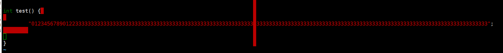

==========
Linux介绍
==========

前一章节粗略介绍了操作系统的功能，解决了哪些痛点,Linux作为操作系统的一个实现，并且是开源社区最活跃项目之一，确实可以作为我们的一个学习对象

本章作为Linux的一个前置介绍，为了保证后续章节的连续性，主要包含: 

 - Linux开发环境
 - Linux开发指导

Linux开发环境
==============
工欲善其事必先利其器

本小节需要掌握: 
    - 搭建内核运行环境
	- 下载编译内核，并安装在运行环境
	- ctags cscope的安装以及使用(自行学习)
	- 利用kernel makefile 规则 自动生成索引 以及手动生成索引

运行内核环境
-------------
.. note::
	建议，自己可以准备一个开发板或者是虚拟机这种实际可以把内核跑起来的环境，我们的实验环节，可能会涉及到对代码的修改验证
	- ARM64:我使用的是一个树莓派4B的开发板+ openeuler的操作系统 用于测试ARM
 	- X86: 我使用的是openeuler的VMware虚拟机环境 用于追踪社区代码
	- QEMU：我是用的是最新的linux next代码 用于追踪主线最新的代码
	当然，如果你有自己的环境，可以不参考我以下环境准备步骤

安装内核开发必要工具
^^^^^^^^^^^^^^^^^^^^^^

.. code-block:: console
    :linenos:

    $ sudo dnf install -y rpm-build openssl-devel bc rsync gcc gcc-c++ flex bison m4 elfutils-libelf-devel

	
	
树莓派编译环境准备
^^^^^^^^^^^^^^^^^^^
我的环境参考openeuler社区版本 22.03 SP1  基于内核版本 5.10

 - 操作系统安装: https://docs.openeuler.org/zh/docs/22.03_LTS_SP1/docs/Installation/%E5%AE%89%E8%A3%85%E5%87%86%E5%A4%87-1.html
 - 树莓派使用指南: https://gitee.com/openeuler/raspberrypi/blob/master/documents/%E6%A0%91%E8%8E%93%E6%B4%BE%E4%BD%BF%E7%94%A8.md
 - 内核交叉编译指南： https://gitee.com/openeuler/raspberrypi/blob/master/documents/%E4%BA%A4%E5%8F%89%E7%BC%96%E8%AF%91%E5%86%85%E6%A0%B8.md

发行版开发环境准备
^^^^^^^^^^^^^^^^^^^^^^
 使用虚拟机的好处在于：不需要考虑交叉编译，内核可以直接安装在虚拟机， 开发环境可以直接作为测试验证环境

  - 操作系统安装: https://ken.io/note/openeuler-virtualmachine-install-by-vmware 

*下载编译内核源码*: 提供了多种内核源码的下载方法：
	
	- 通过rpm下载安装: 好处是内核版本和本机发行版一致，可以直接编译安装，缺点是没有git 信息，参考：https://forum.openeuler.org/t/topic/615
	- 通过开发社区开发: https://ost.51cto.com/posts/15844 
	- 本地基于make安装: https://openanolis.cn/sig/Cloud-Kernel/doc/607587039726485317?preview=

QEMU开发环境准备
^^^^^^^^^^^^^^^^^^

:QEMU环境准备:
我是在虚拟机嵌套虚拟机，需要开启vmware 支持VT，在虚拟机设置->处理器->虚拟化引擎
遇到问题参考: https://blog.csdn.net/qq_46499134/article/details/124231658

.. code-block:: console
    :linenos:
	$ sudo dnf groupinstall "Virtualization Host"
    $ sudo dnf intall qemu-kvm

:代码下载: 

.. code-block:: console
    :linenos:

	$ git clone git://git.kernel.org/pub/scm/linux/kernel/git/torvalds/linux.git
	或者使用国内源
	$ git clone https://mirrors.tuna.tsinghua.edu.cn/git/linux.git
	$ git remote add linux-next https://mirrors.tuna.tsinghua.edu.cn/git/linux-next.git
	切换到next tree
	$ git fetch  linux-next 
	$ git fetch --tags linux-next
	$ git tag -l "next-*" | tail
	$ git checkout -b {my_local_branch} next-(latest)
	关于next tree 在后面会有介绍，如果不想使用next tree ，直接使用主线即可
	
:配置内核是能GDB: 
.. code-block:: console
    :linenos:
	$  make ARCH=x86_64 x86_64_defconfig (配置内核)
	$ make ARCH=x86_64 menuconfig (参考 https://www.kernel.org/doc/html/next/dev-tools/gdb-kernel-debugging.html) 

:编译内核:
    $ make -j8 
	

上面这三个方法 可以任意选择一个

生成代码索引
-------------
专门准备一节介绍linux的代码阅读准备，是因为: 

 - Linux 不同于普通的C项目，他的代码非常庞大，我们需要只引用我们关心的代码
 - Linux 主干代码支持多个架构，我们只需要关心一个特定架构
 - Linux 有自己编码风格 我们需要使用内核编码风格
 - Linux 不使用标准C库，有自己的库，我们不应该索引libc 的头文件
 - .....
 
 本小节会指导完成阅读Linux需要的工具安装，以及索引的使用，无论如何，我假设你已经熟悉这些工具的使用，或者请自己搜索一下这些工具的使用方法 

安装代码索引工具
^^^^^^^^^^^^^^^^

推荐使用 *cscope* 和 *ctags*，安装命令: 

.. code-block:: console
    :linenos:

    $ sudo dnf install -y cscope exuberant-ctags

:扩展:
   
   - *cscope*：主要用于导航代码，例如在函数之间完成切换，能够找到符号的定义以及所有调用
   - *ctags*：Tagbar 插件需要，也可以用来导航，但是没有cscope 好用，只能跳转到函数定义，不能找到所有调用点
   
cscope 常用命令（vim 指令界面使用）： cs find c|d|e|f|g|i|s|t name

+----------+---------------------------------------+
| 命令 | 说明 |
+==========+========================================+
|s   |  查找符号(变量)   |
+----------+---------------------------------------+
| g| 查找定义    |
+-----+---------------------------------------+
|  d |  查找本函数调用函数  |
+----------+---------------------------------------+
|  c |  查找调用者   |
+----------+---------------------------------------+
|  t  |  查找字符串 |
+----------+---------------------------------------+
|  f | 查找文件  |
+----------+---------------------------------------+
|  i | 查找包含本文件的文件 |
+----------+---------------------------------------+

内核脚本生成索引
^^^^^^^^^^^^^^^^
:使用内核脚本创建索引文件: 内核提供了 scripts/tags.sh 脚本用于生成索引文件，但是应该通过make cscope  和 make tags 规则去运行该脚本，下面是一个示例

.. note::

    Please参考内核编译指导，建议先自己编译一遍内核,可以加快后续索引文件生成

.. code-block:: console
    :linenos:

    $ $ make O=. ARCH=x86_64(arm)  COMPILED_SOURCE=1 cscope tags

参数含义: 
  - *O=.* : 很明显了 输出索引文件的存放位置，如果你不希望他在当前目录下，请使用一个绝对路径，如果在kernel 目录下开发，请忽略
  - *ARCH=...*: 选择作为索引的CPU 架构， 会决定选择索引 arch/xxx 目录
  - *SUBARCH=...*： 选择作为索引的子架构，比如board, 如果ARCH=arm SUBARCH=omap2 会选择 arch/arm/mach-omap2/ arch/arm/plat-omap/ 索引
  - *COMPILED_SOURCE=1*： 只索引编译的文件 如果希望索引没有编译的文件 请忽略  
  - *cscope&tags*: rule to make cscope/ctags index 

手动创建索引文件
^^^^^^^^^^^^^^^^
有些时候，也许 *tags.sh* 工作无法达到你的预期，这个时候 可以通过手动索引，下面的步骤参考来自: https://cscope.sourceforge.net/large_projects.html

首先，需要创建一个 *cscope.files* 文件列出你想要索引的文件

比如可以通过以下命令，列出索引文件 以及只列出 arch/arm 以及 OMAP platform 的文件 

.. code-block:: console
    :linenos:

    $find    $dir                                          \
        -path "$dir/arch*"               -prune -o    \
        -path "$dir/tmp*"                -prune -o    \
        -path "$dir/Documentation*"      -prune -o    \
        -path "$dir/scripts*"            -prune -o    \
        -path "$dir/tools*"              -prune -o    \
        -path "$dir/include/config*"     -prune -o    \
        -path "$dir/usr/include*"        -prune -o    \
        -type f                                       \
        -not -name '*.mod.c'                          \
        -name "*.[chsS]" -print > cscope.files
    $find    $dir/arch/arm                                 \
        -path "$dir/arch/arm/mach-*"     -prune -o    \
        -path "$dir/arch/arm/plat-*"     -prune -o    \
        -path "$dir/arch/arm/configs"    -prune -o    \
        -path "$dir/arch/arm/kvm"        -prune -o    \
        -path "$dir/arch/arm/xen"        -prune -o    \
        -type f                                       \
        -not -name '*.mod.c'                          \
        -name "*.[chsS]" -print >> cscope.files
    $find    $dir/arch/arm/mach-omap2/                     \
        $dir/arch/arm/plat-omap/                      \
        -type f                                       \
        -not -name '*.mod.c'                          \
        -name "*.[chsS]" -print >> cscope.files

以下是一个X86架构的示例 

.. code-block:: console
    :linenos:

    $find    $dir                                          \
        -path "$dir/arch*"               -prune -o    \
        -path "$dir/tmp*"                -prune -o    \
        -path "$dir/Documentation*"      -prune -o    \
        -path "$dir/scripts*"            -prune -o    \
        -path "$dir/tools*"              -prune -o    \
        -path "$dir/include/config*"     -prune -o    \
        -path "$dir/usr/include*"        -prune -o    \
        -type f                                       \
        -not -name '*.mod.c'                          \
        -name "*.[chsS]" -print > cscope.files
    $find    $dir/arch/x86                                 \
        -path "$dir/arch/x86/configs"    -prune -o    \
        -path "$dir/arch/x86/kvm"        -prune -o    \
        -path "$dir/arch/x86/lguest"     -prune -o    \
        -path "$dir/arch/x86/xen"        -prune -o    \
        -type f                                       \
        -not -name '*.mod.c'                          \
        -name "*.[chsS]" -print >> cscope.files

和脚本类似，如果你只在kernel下开发，替换 *dir=.*, 如果你在其他目录开发，替换为绝对路径 

接下来根据cscope.files 生成索引 

.. code-block:: console
    :linenos:
	
	$ cscope -b -q -k

接下来根据cscope.files 生成ctag索引数据库

.. code-block:: console
    :linenos:
	
	$ ctags -L cscope.files

现在应该拥有以下文件: 

- cscope.in.out
- cscope.out
- cscope.po.out
- tags

VIM配置
--------

基本配置
^^^^^^^^^^
首先配置80个字符长度限制 因为内核编码要求每行不应该超过80个字符
修改~/.vimrc 增加： 

.. code-block:: console
    :linenos:
	
	" 80 characters line
	set colorcolumn=81
	"execute "set colorcolumn=" . join(range(81,335), ',')
	highlight ColorColumn ctermbg=Black ctermfg=DarkRed

内核编码风格要求 行尾不应该有空白字符 请添加: 

.. code-block:: console
    :linenos:
	
	" Highlight trailing spaces
	" http://vim.wikia.com/wiki/Highlight_unwanted_spaces
	highlight ExtraWhitespace ctermbg=red guibg=red
	match ExtraWhitespace /\s\+$/
	autocmd BufWinEnter * match ExtraWhitespace /\s\+$/
	autocmd InsertEnter * match ExtraWhitespace /\s\+\%#\@<!$/
	autocmd InsertLeave * match ExtraWhitespace /\s\+$/
	autocmd BufWinLeave * call clearmatches()

配置完成之后，下面是一个显示测试

 
vim插件管理
^^^^^^^^^^^^^
推荐使用pathogen作为插件管理: https://github.com/tpope/vim-pathogen  安装参考: 

.. code-block:: console
    :linenos:

	$ mkdir -p ~/.vim/autoload ~/.vim/bundle && \
	$ curl -LSso ~/.vim/autoload/pathogen.vim https://tpo.pe/pathogen.vim
	
修改~/.vimrc 增加： 

.. code-block:: console
    :linenos:
	
	execute pathogen#infect()
	syntax on
	filetype plugin indent on
	
安装kernelsty插件
^^^^^^^^^^^^^^^^^^
后面章节会介绍linux 编码风格，在这里我们先安装遵循内核编码风格的vim 插件

.. code-block:: console
    :linenos:
	
	$cd ~/.vim/bundle &&  git clone git@github.com:vivien/vim-linux-coding-style.git
	
如果只希望对某些目录下代码应用kernel 风格，请在vimrc 中增加: 

.. code-block:: console
    :linenos:
	
	let g:linuxsty_patterns = [ "/usr/src/", "/linux" ]
	
安装NERDTree插件
^^^^^^^^^^^^^^^^^
NERDTree时VIM的文件系统浏览器 使用该插件，用户可以直观地浏览复杂的目录层次结构，快速打开文件进行读取或编辑，并执行基本的文件系统操作。

.. code-block:: console
    :linenos:
	
	$ git clone https://github.com/preservim/nerdtree.git ~/.vim/bundle/nerdtree

配置vimrc：

 - 配置自动开启和自动退出
 - 配置F3 启动和隐藏目录树
 
.. code-block:: console
    :linenos:
	
	" Exit Vim if NERDTree is the only window remaining in the only tab.
	autocmd BufEnter * if tabpagenr('$') == 1 && winnr('$') == 1 && exists('b:NERDTree') && b:NERDTree.isTabTree() | quit | endif
	" Start NERDTree and put the cursor back in the other window.
	autocmd VimEnter * NERDTree | wincmd p
	nnoremap <F3> :NERDTreeMirror<CR>
	nnoremap <F3> :NERDTreeMirror<CR>

基本操作：以下命令都是在NEERDTREE页面操作

+----------+---------------------------------------+
| 命令 | 说明 |
+==========+========================================+
|  ?   |  打开或者隐藏帮助面板   |
+----------+---------------------------------------+
| 上下左右 | 选择文件或者目录    |
+-----+---------------------------------------+
|  回车 |  展开目录/打开文件(退出上个文件)  |
+----------+---------------------------------------+
|  ctrl+w  |  两次 在目录树和文件之前切换   |
+----------+---------------------------------------+
|  t  |  以标签形式打开一个文件  |
+----------+---------------------------------------+
|  gt  | 标签之前切换  |
+----------+---------------------------------------+
|  i/s  | 分割窗口打开 |
+----------+---------------------------------------+

安装tagbar插件
^^^^^^^^^^^^^^^^^
Tagbar 是一个 Vim 插件，它提供了一种简单的方法来浏览当前文件的标签并概述其结构。它通过创建一个侧边栏来显示当前文件的 ctags 生成的标签（按其范围排序）来实现此目的。这意味着，例如 C++ 中的方法显示在定义它们的类下。

.. code-block:: console
    :linenos:
	
	$ git clone git@github.com:preservim/tagbar.git ~/.vim/bundle/tagbar

配置vimrc：

 - 配置F8 启动和隐藏tagbar
 
.. code-block:: console
    :linenos:
	
	nmap <F8> :TagbarToggle<CR>

安装vim airline插件
^^^^^^^^^^^^^^^^^

.. code-block:: console
    :linenos:
	
	$ git clone git@github.com:vim-airline/vim-airline ~/.vim/bundle/vim-airline

补全插件：YCM
^^^^^^^^^^^^^^^^^^^^^
YCM 需要更高版本vim和python 支持 从源码升级： 

.. code-block:: console
    :linenos:
	
	$ git clone https://github.com/vim/vim.git
	$ cd vim/src
	$ ./configure --with-features=huge --enable-python3interp
	$ make
	$ sudo make install

:安装插件:

.. code-block:: console
    :linenos:
	
	$ git clone git@github.com:ycm-core/YouCompleteMe.git ~/.vim/bundle/YouCompleteMe
	$ cd  ~/.vim/bundle/YouCompleteMe 
    $ ./install.py --clangd-completer --verbose

:生成补全:

.. code-block:: console
    :linenos:
	
	$ git clone https://github.com/rdnetto/YCM-Generator.git
	$ cd YCM-Generator
	$ ./config_gen.py kernel_dir

配置vimrc:关闭自动加载提示

.. code-block:: console
    :linenos:
	
	let g:ycm_confirm_extra_conf = 1

VIM风格
^^^^^^^^^^^^
配置vimrc：

.. code-block:: console
    :linenos:
	
	$ set t_Co=256

支持hybrid 风格: https://github.com/w0ng/vim-hybrid

到目前，kernel开发环境我们算是准备完成了

Linux开发指南
==============
本节主要介绍内核开发必须要了解的一些知识

内核版本
----------

本节过后，应该清楚

 - 内核版本号x.y.z的含义，能够描述稳定版本发布，rc版本，稳定版本的维护版本
 - 内核版本号对应的特性&修复补丁开发周期
 - 内核长期版本
 

自1990年Linux内核项目成立，迄今为止，无论是用户还是开发者，已经非常庞大，一两个人开发和一两千人开发，完全是不同的概念，所以社区在内核代码管理运作上不得不投入一些精力维护，一个良好的版本管理是必不可少的

内核按照A.B 每个B版本都是内核的主要版本，主要版本里面又包含了 rc版本和稳定版本，下表列出的是内核每个稳定版本发布的示例

+-----+-------------+
| 版本|发布时间     |
+=====+=============+
| 5.0 | 19.3.3 |
+-----+-------------+
| 5.1 | 19.5.5 |
+-----+-------------+
| 5.2 | 19.7.7 |
+-----+-------------+
| 5.3 | 19.9.15 |
+-----+-------------+
| 5.4 | 19.11.24 |
+-----+-------------+
| 5.5 | 20.1.6 |
+-----+-------------+

每个 5.x 版本都是主要内核版本，具有新功能、内部 API 更改等。一个典型的版本可以包含大约 13,000 个变更集，其中更改了数十万行代码。5.x是Linux内核开发的前沿；内核使用滚动开发模型，不断集成重大更改。

.. note::

   关于5.x 和 6.x，很多人想 5和6是不是有特别大区别，ok,答案是并不会，只是当点后面的数字开始看起来“太大”时，主版本号就会递增。确实没有其他原因。

可以看到，一个5.x版本间隔大约是2-3个月，这两到三个月又分为  

:合并窗口(大约2周):  每个版本的补丁合并遵循相对简单的规则。在每个开发周期开始时，“合并窗口”是打开的，那时，被认为足够稳定（并且被开发社区接受）的代码被合并到主线内核中。新开发周期的大部分变更（以及所有主要变更）将在此期间合并，速度接近每天 1,000 个变更（“补丁”或“变更集”）
（顺便说一句，合并窗口期间集成的更改并不是凭空而来的；它们是提前收集、测试和暂存的。） 。
合并窗口持续大约两周。在此时间结束时，Linus Torvalds 将声明窗口已关闭并释放第一个“rc”内核。例如，对于预定为 5.6 的内核，在合并窗口结束时发生的发布将被称为 5.6-rc1。-rc1 版本是合并新功能的时间已经过去的信号，并且稳定下一个内核的时间已经开始。

:稳定窗口(大约6-10周):  只有解决问题的补丁才应该提交到主线。有时会允许进行更重大的更改，但这种情况很少见；尝试在合并窗口之外合并新功能的开发人员往往会受到不友好的对待。一般来说，如果您错过了给定功能的合并窗口，最好的办法就是等待下一个开发周期。（以前不支持的硬件的驱动程序偶尔会有例外；如果它们不接触内核代码，则它们不会导致回归，并且应该可以随时安全地添加）。

随着修复进入主线，补丁速度会随着时间的推移而减慢。Linus 大约每周发布一次新的 -rc 内核；在内核被认为足够稳定并发布最终版本之前，正常系列将达到 -rc6 和 -rc9 之间的某个值。随后新一轮的版本又开始
下表示内核在两个稳定版本之间发布的窗口版本

+-------------+-------------+
| 发布版本|发布时间     |
+=============+=============+
| 5.3 | 9.15 |
+-------------+-------------+
| 5.4-rc1 | 9.30 |
+-------------+-------------+
| 5.4-rc2 | 10.6 |
+-------------+-------------+
| 5.4-rc3 | 10.13 |
+-------------+-------------+
| 5.4-rc4 | 10.20|
+-------------+-------------+
| 5.4-rc5 | 10.27 |
+-------------+-------------+
| 5.4-rc6 | 11.3 |
+-------------+-------------+
| 5.4-rc7 | 11.10 |
+-------------+-------------+
| 5.4-rc8 | 11.17 |
+-------------+-------------+
| 5.4稳定 | 9.24 |
+-------------+-------------+

.. note::

   很久以前，Linux 使用的系统中第一个点后的奇数表示预发布、开发内核（例如 2.1、2.3、2.5）。这个方案在内核 2.6 发布后被放弃，现在预发布的内核用“-rc”表示。。

稳定版本维护
^^^^^^^^^^^^
内核就算发布完成稳定版本之后，也会对稳定版本进行定期维护，如果patch 满足以下条件，将会考虑合入稳定版本

 - 修复了某个重大错误
 - 在满足上一个条件下，同时patch 已经合入了内核主线 (just cherry-pick)
 
下表示内核在稳定版本之后 稳定维护版本

+-------------+-------------+
| 发布版本|发布时间     |
+=============+=============+
| 5.2稳定 | 7.7 |
+-------------+-------------+
| 5.2.1 | 7.14 |
+-------------+-------------+
| 5.2.2 | 7.21 |
+-------------+-------------+
| ... |  ... |
+-------------+-------------+
| 5.2.21 | 10.11 |
+-------------+-------------+

5.2.21 是 5.2 版本的最终稳定更新。

长期版本
^^^^^^^^^^^^
内核也会偶尔有一些长期版本维护 但是不会很多，完全取决于社区负责人的时间和精力，只有非常重要的错误会合入，长期版本参考：https://www.kernel.org/category/releases.html 

.. note::

   如果你使用的是发行版操作系统，可能他使用的内核版本并不在社区长期版本列表，但是发行商一般也有自己对应版本的长期维护时间，可以通过 *uname -r* 查看你是用的内核版本

Linux补丁合入机制
------------------
通过本节，应该要掌握

 - 补丁信任链机制
 - next tree

信任链
^^^^^^^^
只有一个人可以将补丁合并到主线内核中：Linus Torvalds，但是，例如，在进入 2.6.38 内核的 9,500 多个补丁中，只有 112 个（约 1.3%）是 Linus 本人直接选择的。内核项目早已发展到没有任何一个开发人员能够在无人帮助的情况下检查和选择每个补丁。内核开发人员解决这种增长问题的方法是使用围绕信任链构建系统。

:子系统&子系统maintainer:
内核代码库在逻辑上分为一组子系统：网络、特定体系结构支持、内存管理、视频设备等。大多数子系统都有指定的维护者，即对该子系统内的代码全面负责的开发人员。这些子系统维护者是他们管理的内核部分的看门人（以松散的方式）；他们（通常）会接受补丁并纳入主线内核。

:子系统maintainer的仓库: 子系统维护者以他们自己的方式维护着一个或者几个分支，他们会收集下游补丁，然后合入自己分支，然后在提给linux，或者他的上游

:补丁合入主线：之前我们介绍过了合入窗口，一般当合入窗口开启，最顶层的维护者会要求linux拉取他们仓库中选择用于合并的补丁，通常linux只会关注某些，并无法做到全部检查，但是他选择相信这些顶级维护者

:链式合入: 顶级维护者又会从他的下游收集补丁，以此类推，按照各个层级，依次往上收集补丁，这就是信任链

所以，我们如果有补丁要合入，直接发给linux 很明显是不明智的，应该根据自己所处的链条节点，向上发送

next tree
^^^^^^^^^^^
OK，我们已经指导补丁是通过层层挑选 然后最终进入主线的
 
 - 我应该基于哪个分支开发？
 - 我的代码会不会和别人冲突？

为了解决上面两个问题，现在主要通过next tree分支，该分支可以理解是下一个内核版本的快照,所有即将或者准备合入主线的补丁，都会先进入这个分支

..note::

	下载地址: https://www.kernel.org/pub/linux/kernel/next/
 

内核入门
^^^^^^^^^^^
如果是一个新手，刚进入社区，往往不知道如何下手，我给一个建议，请永远使用最新的next分支，并尝试把他在你的环境上运行起来，由于这个分支特性和代码往往都是新的，可能会有一些问题，尝试去解决这些问题

邮件列表
^^^^^^^^
大量的 Linux 内核开发工作是通过邮件列表完成的。如果不加入至少一个列表，就很难成为社区的一名功能齐全的成员。但 Linux 邮件列表也对开发人员构成了潜在危险，他们面临着被大量电子邮件淹没、违反 Linux 列表上使用的约定或两者兼而有之的风险。

..note::

	  大多数内核邮件列表都在 vger.kernel.org 上运行；主列表可在以下位置找到： http://vger.kernel.org/vger-lists.html
	  不过，其他地方也有一些列表；其中一些位于 redhat.com/mailman/listinfo

关于邮件使用我们将在后续提交补丁在详细说明

代码编写规范
-------------
本节将研究编码过程。我们将首先了解内核开发人员可能出错的多种方式。然后重点将转向正确做事以及有助于实现这一目标的工具。

编码风格
^^^^^^^^
强烈建议遵循内核编码风格，实际上还有很多工具可以帮助我们完成格式化工作，但是请习惯他

..note::

	参考: https://docs.kernel.org/process/coding-style.html#codingstyle

#ifdef使用
^^^^^^^^^^^
#ifdef 建议应该尽可能限制在头文件，条件编译的代码建议限制为函数

锁
^^^^^^^^^^^
任何可以被多个线程同时访问的资源（数据结构、硬件寄存器等）都必须受到锁的保护。编写新代码时应牢记这一要求；事后改造锁定是一项相当困难的任务。内核开发人员应该花时间充分了解可用的锁定原语，以便为工作选择正确的工具。缺乏对并发性关注的代码将很难进入主线。

代码检查工具
-------------------

clang-format使用
^^^^^^^^^^^^^^^^^^
内核已经默认在主线提供了符合linux内核编码的clang-format

:clang-format安装: 

.. code-block:: console
    :linenos:
	
	$ sudo dnf install -y clang-tools-extra

..note::

	 clang-format 详细使用说明 参考: 
	  - https://clang.llvm.org/docs/ClangFormat.html 
	  - https://clang.llvm.org/docs/ClangFormatStyleOptions.html

:检查文件和补丁的编码风格: -i 会直接修改文件，不加-i 只是预览

.. code-block:: console
    :linenos:
	
	$ clang-format -i kernel/*.[ch]

clang-format 对于内核代码风格 缺少一些支持 常见的为: 

.. code-block:: c
    :linenos:
	
	$ clang-format -i kernel/*.[ch]
	
	#define TRACING_MAP_BITS_DEFAULT       11
	#define TRACING_MAP_BITS_MAX           17
	#define TRACING_MAP_BITS_MIN           7
	会被修改为: 
	#define TRACING_MAP_BITS_DEFAULT 11
	#define TRACING_MAP_BITS_MAX 17
	#define TRACING_MAP_BITS_MIN 7

.. code-block:: c
    :linenos:
	
	$ clang-format -i kernel/*.[ch]
	
	static const struct file_operations uprobe_events_ops = {
        .owner          = THIS_MODULE,
        .open           = probes_open,
        .read           = seq_read,
        .llseek         = seq_lseek,
        .release        = seq_release,
        .write          = probes_write,
	};
	会被修改为: 
	static const struct file_operations uprobe_events_ops = {
        .owner = THIS_MODULE,
        .open = probes_open,
        .read = seq_read,
        .llseek = seq_lseek,
        .release = seq_release,
        .write = probes_write,
	};

编译告警的启用
^^^^^^^^^^^^^^^^^^
请注意，并非所有编译器警告都默认启用。使用“make KCFLAGS=-W”构建内核以开启。

FRAME_WARN的使用
^^^^^^^^^^^^^^^^
Linux 内核线程 会分分配 4Kb或者8Kb的栈 通过设置 CONFIG_FRAME_WARN 可以在编译阶段帮助我们发现 函数实现 是否可能超出了栈大小

DEBUG_OBJECTS的使用
^^^^^^^^^^^^^^^^^^^^
DEBUG_OBJECTS 可以用来检查 内核创建的各种对象的生命周期，并在使用出现混乱是 发出告警，如果我们正在写一个模块，并且涉及到对象的管理，可以尝试添加对象调试
更多信息参考 :ref:`debugobjects`

内核提供了几个打开调试功能的配置选项；其中大部分可以在“kernel hacking”子菜单中找到。对于用于开发或测试目的的任何内核，应打开其中几个选项。特别是：
 
 -  获取大于给定数量的堆栈帧的警告。生成的输出可能很详细，但不必担心来自内核其他部分的警告 
 -  将添加代码来跟踪内核创建的各种对象的生命周期，并在事情发生混乱时发出警告。如果您要添加一个创建（并导出）自己的复杂对象的子系统，请考虑添加对对象调试基础结构的支持。
 -

