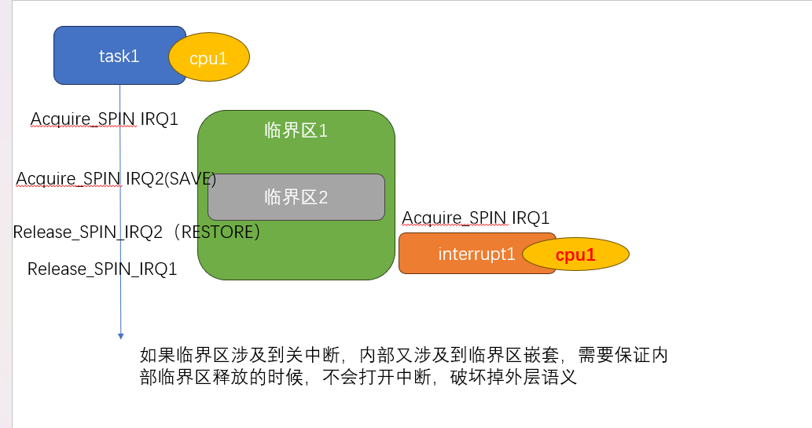

=============
Linux基础机制
=============

本章节不包含子系统介绍，包含linux的基础设施，比如同步原语、打印等

同步原语
=========

READ/WRITE_ONCE
-----------------

READ/WRITE ONCE 不是锁，甚至不是原语，只是用来保证本次内存读写是 *即时* *不被编译器优化的*

  - 即时: 多CPU访问内存，会因为cache 有不同步的可能，READ/WRITE_ONCE 避免了由于cache引入的数据滞后问题
  - 不被编译器优化的: 编译器会保证当前指令不会被优化 折叠 ，并且整字节访问内存, (参考 https://lkml.org/lkml/2015/10/5/400)
  

作为linux最基础的同步原语，主要用来解决共享内存的读写访问，很多同学看到这里，肯定会问 难道不应该是用锁吗? 
锁是用来保护临界区，防止竞争，但是同一个CPU上的同一个线程
这里还有一个例子 https://lkml.org/lkml/2015/10/5/400 ，用来说明为什么需要READ/WRITE_ONCE

更多请参考:https://github.com/google/kernel-sanitizers/blob/master/other/READ_WRITE_ONCE.md

使用场景
^^^^^^^^
 
 - 用于在单个CPU上，进程和中断的通信控制（percpu flag）
 - 用于实现atomic或者锁原语，和内存屏障结合使用，保证编译器不进行优化、折叠，访问是预期行为

锁
----

掌握本节内容，需要提前清楚以下几个概念: 

  - 抢占内核:现在都假设是处于抢占式内核,不在讨论非抢占内核
  - 中断
  - 临界区
  - SMP: 现在都假设我们是在SMP模型下讨论，不在讨论单核场景

无论如何，让我们回到锁的本质，就是为了解决临界区问题 
先从几个大的方面尝试 区分一下睡眠锁、spin锁 本地spin锁

睡眠锁性能讨论
^^^^^^^^^^^^^^^^^
:睡眠锁性能的影响:  如果使用睡眠锁，假设A(CPU1)已经持锁，内核支持抢占的前提下，该任务在访问临界区中间，可以随时被其他任务抢占 
  
  - 如果此时B抢占了A(CPU1)，同时B(CPU1)尝试去拿锁，B会陷入睡眠，让出CPU1，A(CPU1)继续执行
  - 如果此时C抢占了A(CPU1)，同时B(CPU2)尝试去拿锁，B会陷入睡眠, 让出CPU2, A依然处于被抢占的状态，此时AB都得不到执行
  
上面只是列出了睡眠锁常见的几个场景，我们可以看到，睡眠锁其实都是通过调度(sleep/wakeup)解决任务之前临界区的竞争，那么必然就会引入调度的开销
如果我们的临界区非常短,从调度开销角度考虑，在访问这个临界区中间，我们其实并不希望 该任务能够被调度出去,同时等锁的任务，我们也希望他能够珍惜
这次调度机会，不要再次发生调度，综上考虑，只需要在持锁和等锁的实现上，临时关闭调度抢占即可，这就是最初的自旋锁(spin_lock)

实际上，为了最小化调度损失，睡眠锁也提供很多机制去消减调度开销，比如支持任务优先级传递的RT_mutex

:SPIN锁性能的影响: 如果使用SPIN自旋锁，一个前提一定是为了降低由于睡眠锁带来的调度开销，在SPIN锁的临界区内，一定不可以发生调度的动作

临界区只发生在普通内核线程之前，可以使用睡眠锁，也可以使用SPIN锁，取决于临界区内所作的工作，如果不涉及到调度和阻塞，并且临界区很短 可以使用SPIN 

.. image:: ./images/found/1.png
 :width: 400px
 
 
中断的讨论
^^^^^^^^^^
我们上面从性能的影响讨论了睡眠锁 和 自旋锁，再从上下文场景来考虑竞争的约束

 - 在抢占式内核中，内核线程上下文的任意时机(在不显示关闭抢占)的情况下 都能够被其他任务抢占
 - 在抢占式内核中，内核线程上下文的任意时机(在不显示关闭中断)的情况下 都能够被中断打断抢占
 - 在中断上下文，可以被更高级别的中断打断(中断嵌套 有时候和架构有关，我们这里都考虑允许嵌套)，中断期间不允许发生调度
 
这里主要增加了关于中断的描述， 临界区发生在内核线程以及中断之间,我们看一下会发生什么，由于中断的约束，中断上下文不允许使用睡眠锁，
只是使用SPIN可能导致 第二种情况，如果中断发生在spin锁范围内，那么可能会出现死锁，必须结合SPIN + 关闭本地中断 防止出现情况2

 
下面是一个更加复杂的情况，如果临界区内 持锁IRQ2，在任务释放 IRQ2的状态种，会再次开启中断，如果中断此时进来，会形成死锁
因此又出现了 irqsave/irqrestore，用来在释放锁的时候，不改变之前中断关闭的状态，从而保证临界区访问正常

.. note::

    思考，如果临界区2 总是被临界区1访问，是否需要 IRQsave？如果是这种情况，关中断其实也不需要,只需要使用spin_lock即可
	但是一旦临界区可能被单独访问，我的意思是指，代码在写的时候，自己本身并不清楚之前是否已经关闭中断，那么我就无法判断使用
	spin_lock(如果已经关闭中断了，用这个是最简单的，但是如果中断没有被关闭，无法起到保护作用) 
	或者使用 spin_lock_irq(如果没有关闭中断，用这个也没有问题，如果已经关闭中断，会引入误打开中断)
	所以 只能使用 spin_lock_irqsave 来同时满足 可能是开中断/可能是关中断 的情况
	但是一旦上面两个情况可以确定下来，那么就用最简单的即可，可以减少锁自身引入的性能问题
	

PERCPU&LOCAL_LOCK讨论
^^^^^^^^^^^^^^^^^^^^^^^^
随着SMP架构的流行，服务器场景下，多核(甚至达到128) 已经是一个普遍场景，在对临界区的保护上面，不能单纯依靠原始的锁来保护，因为竞争已经愈发激烈，
顺应潮流，拆锁变成一个趋势，基于SMP架构，通过把变量访问控制在CPU粒度，自然而然把一个临界区(冲突域) 裂变为 多个临界区
PerCPU的变量 并不意味着不需要并发保护，试想一下，如果A 正在访问位CPU1的资源，此时A发生调度，被调度CPU2，再次访问，依然访问CPU1资源，就失去了percpu的语义

PERCPU变量的访问要求: 在访问变量期间，该任务只应该在当前CPU上运行, 期间不应该发生调度，默认PERCPU 不会发生 SMP竞争

让我们对比以下 local_lock 和 SPIN_lock

 - local_lock只需要保证 任务不会被抢占到其他CPU，SMP需要保证多核的竞争访问
 - local_lock 和SPIN一样，也需要增加对于中断访问竞争的支持
 - local_lock 不存在等锁一说，一旦该任务在当前CPU执行，隐含有已经是当前CPU 变量的持有者
 - percpu的临界区访问，如果已经被 SPIN 锁包裹，不需要在关抢占(已经关闭)

锁嵌套规则讨论
^^^^^^^^^^^^^^^
 - 相同类型的锁，只要在满足正确锁序的情况下，可以任意嵌套：这里的相同类型是指 睡眠锁可以嵌套睡眠锁，spin锁可以嵌套spin锁，local_lock 锁可以嵌套local_lock锁，
 - 睡眠所不能被 local lock 和 SPIN锁嵌套: 很好理解，后面两种锁都必须要 关闭调度抢占，期间是不能发生调度的
 - local lock 和 SPIN锁嵌套 可以被睡眠锁嵌套
 - spin锁可以被任何锁嵌套

上面几个规则应该都很好理解

PREEMPT_RT讨论
^^^^^^^^^^^^^^^
从之前SPIN_LOCK的性能讨论，我们已经知道，SPIN_LOCK是通过关闭任务调度抢占 换来的性能，如果临界区涉及到的线程数量越多，那么执行busyloop的代价就越高，对应的，系统实时响应能力就会变差，
Linux 通过改变了各个锁原语的实现，在尽可能保证原有锁的语义下，提高了linux的抢占能力

:区分关闭抢占和禁止迁移:   在之前的介绍种，我们一直说，通过关闭抢占不会发生调度，达到任务可以在临界区访问期间 独占CPU，事实情况是 我们真的需要吗？比如percpu的访问，我们只是希望在当前任务访问
过程中，不希望改变运行任务所在的CPU 不等于 在当前CPU执行期间，不能被其他任务抢占，可以通过某种实现，让此任务在访问临界区的时候，不会被调度到其他CPU即可，这就是PREEMPT_RT主要实现的能力，尽可能在当前
语义下，允许抢占

下面我们简单讨论一下， PREEMPT_RT 是如何在满足不关闭抢占，却依然能够实现之前关闭抢占的预期行为，我们回顾一下，哪些锁的实现之前是关闭抢占的

 - spin_lock(irq/irq_save) : 持锁和等锁任务，都需要关闭抢占，满足临界区快速访问的能力，支持关中断，增加中断临界区访问并发控制
 - LOCAL_LOCK(irq/irq_save): 持锁任务，需要关闭抢占，满足临界区快速访问的能力，支持关中断，增加中断临界区访问并发控制

spin的改动: 
 - PREEMPT_RT 替换了spin lock 的实现，不在关闭抢占，使用了RT_mutex 替换spin lock，让我们回到SPIN LOCK的语义，SPIN_lock 一开始只是为了提高访问性能，如果把spinlock替换成为睡眠锁，可能会损失性能，但是
   确给了内核更多抢占调度的机会，如果你的代码只是因为性能选择了spin锁，而不选择睡眠锁，我们可以认为代码是不受影响的 
 - spinirq 不会在关中断了， 失去了关中断的语义，如果依然希望关闭中断 请使用 raw_spin_lock_irq 
 - spin lock 会关闭任务迁移，保证该任务不会被调度到其他CPU 

local_lock的改动: 
 - local lock 从关抢占行为， 变动成为一个 perCPU的 spin_lock

让我们看一下他的影响：必须清楚 任务使用 local_lock 和 spin_lock 希望使用到的是他什么功能，在PREEMPT_RT 场景下，如果允许抢占，是否还能够保证之前的功能

详细内容参考: https://tinylab.org/lwn-146861/

